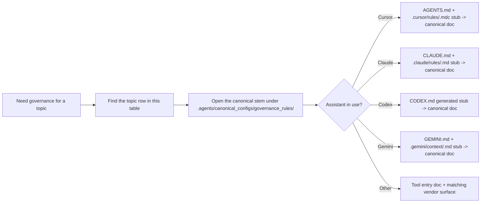

# Governance by Assistant Product - Canonical Rule Map (aiscr-management hub)

**Purpose:** Map policy topics to the canonical shared rule sources under `.agents/canonical_configs/governance_rules/`. Every vendor delivery surface — `.cursor/rules/*.mdc`, `.claude/rules/*.md`, `.gemini/context/*.md`, `.github/instructions/*.instructions.md`, and generated sections in `CODEX.md` — is a routing stub that names the matching `.agents/canonical_configs/governance_rules/<stem>.md` canonical document as the rule body. This file is a lookup table only.

**Related:** Full vendor × asset matrix, official URLs, and vendor alignment live in `agent_tool_feature_matrix.md` and `mandatory_vendor_doc_urls.toml`.

The routing diagram below is a scanning aid only.

## Topic -> Canonical Rule Stem

| Topic | Canonical rule source | Scope |
| --- | --- | --- |
| Planning baseline before non-trivial work | `planning-baseline-upstream.md` | All agents |
| Planning-first execution model and re-plan triggers | `planning-core.md` | All agents |
| Usage-log lifecycle, required fields, close-out prompt | `usage-logging.md` | All agents |
| Model/runtime metadata in usage logs | `model-logging.md` | All agents |
| Agent work-style defaults and pre-presentation self-check Iron Law | `quality-first-execution.md` | All agents |
| Advisory model-setup / config sync reminder | `model-setup-reminder.md` | Advisory |
| Workspace boundary, sibling repos, config protection | `workspace-boundary-safety.md` | All agents |
| Management hub identity and canonical-source reminders | `mgmt-entry.md` | This repo |
| Management durable docs: dynamic sets and counts | `mgmt-doc-dynamic-sets.md` | This repo |
| Management operating basics: ideas, scripts, parity, hygiene | `mgmt-repo-operating-basics.md` | This repo |
| Management hook intents and ownership map | `hook-intents.md` | This repo |
| Ecosystem-wide shared rules (siblings; workflow alignment) | `aiscr-ecosystem-governance.md` | Ecosystem |
| Hub vs sibling workflow routing | `ecosystem-hub-workflow-routing.md` | Ecosystem |
| `port_workspace_safety_config.py` guidance | `port-workspace-safety-config.md` | Port/safety |

**Delivery surfaces:** For any stem above, the canonical body lives at `.agents/canonical_configs/governance_rules/<stem>.md`. Every vendor surface (`.cursor/rules/<stem>.mdc`, `.claude/rules/<stem>.md`, `.gemini/context/<stem>.md`, `.github/instructions/<stem>.instructions.md`, generated `CODEX.md` sections) renders as a routing stub that preserves the stop anchor, topic summary, and canonical-document link; follow that link when the rule text is load-bearing for the task.

**Entry-doc pointers (workspace boundary):** `CLAUDE.md`, `CODEX.md`, and `GEMINI.md` each include a short workspace-boundary pointer back to `AGENTS.md` and the relevant canonical rule when needed.

**Three-tier hub model**

| Tier | Meaning | Examples (this hub) |
| --- | --- | --- |
| **1 - Hub-root entry docs** | Committed at repo root; selected for siblings by direct-bundle policy rather than payload mirrors | `GEMINI.md`, `.pr_agent.toml` |
| **2 - Repo-root vendor trees** | Generated or maintained at the hub root, then selected for siblings by `.agents/sync/repos.toml` and direct-bundle policy | `.gemini/`, `.qodo/` |
| **3 - `AGENT_FOLDERS` assistant roots** | Full profile-based sync (rules, skills, agents, settings, ...) per `sync_policy.py` and `.agents/sync/repos.toml` repo policy | `.cursor`, `.claude`, `.codex` |

**Repo-root and digest vendors - where governance loads**

| Vendor / product | Primary human entry | Rules / config surface | Notes |
| --- | --- | --- | --- |
| Gemini | `GEMINI.md` | `.gemini/` | Tier 1 + tier 2 |
| Qodo Merge | `.pr_agent.toml` | — | Tier 1 only for PR-agent config; `.qodo/` is tier 2 IDE baseline |
| GitHub Copilot | `.github/copilot-instructions.md` | `.github/instructions/*.instructions.md` | Digest-only entry |
| Cursor (incl. BugBot) | `AGENTS.md` | `.cursor/rules/`, `.cursor/BUGBOT.md` | No vendor `CURSOR.md` |

**Drift guard:** This table must list every active canonical governance stem that an entry doc or assistant wrapper is expected to open by topic. After adding, splitting, retiring, or renaming a rule stem, update this table and run the usual governance validation suite.

## Suggested Governance Load Order (Non-Cursor Tools)

1. `AGENTS.md`, `CONTRIBUTING.md`, `.agents/README_en.md`
2. Tool entry doc (`CLAUDE.md`, `CODEX.md`, `GEMINI.md`) and short generated or direct-bundle vendor pointers where applicable
3. Topics in the table above: open the assistant-specific stub for orientation, then load the linked `.agents/canonical_configs/governance_rules/<stem>.md` canonical document when the task touches that rule's details

**Cursor:** primary project context is `AGENTS.md` plus `.cursor/rules/*.mdc`; use `.cursor/README_en.md` for assistant-specific routing. The `.cursor/rules/*.mdc` files are routing stubs on equal footing with every other vendor surface — follow the canonical-document link inside the stub when the rule text is load-bearing.
