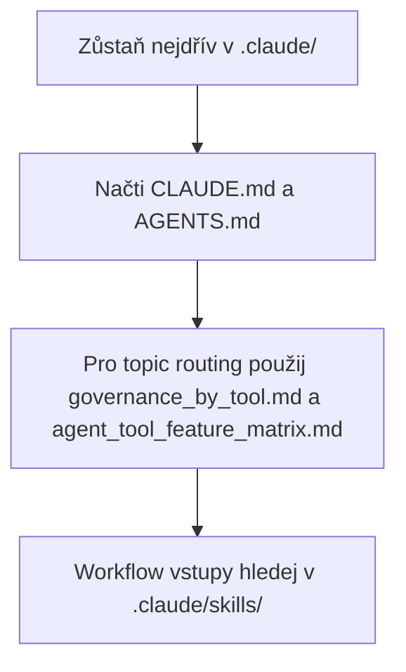

# Konfigurace Claude Code

([English](README_en.md))

```text
Language entry scope: Agents MUST use README_en.md for operational instructions. This README.md is human-facing Czech only; align with the English twin when meaning changes.
```

Tato složka drží lokální vrstvu Claude Code pro aktuální AIS CR repozitář. V committed baseline je zrcadlená pod `.agents/local_configs/<repo>/.claude/`.

<!-- aiscr:stop-anchor -->
Následující load path je podpůrná pomůcka; normativní zůstávají sekce `Entry scope` a `Co načíst nejdřív`.



## Entry scope

- Zůstaň nejdřív v tomto stromu `.claude/` a v jeho přímých odkazech.
- Paralelní vendor stromy `.cursor/`, `.codex/` a `.gemini/` neotvírej jen „pro jistotu“.
- Do jiného vendor stromu přecházej jen při explicitní kontrole parity, generátoru nebo governance údržbě.
- Pro provozní čtení používej anglický protějšek [README_en.md](README_en.md); tento soubor je český primární pár.

## Co načíst nejdřív

- `CLAUDE.md`
- `AGENTS.md`
- `.agents/canonical_configs/references/governance_by_tool.md`
- `.agents/canonical_configs/references/agent_tool_feature_matrix.md`

## Poznámky

- Lokální workflow vstupy jsou v `.claude/skills/`.
- Historický `commands/` povrch drží jen README pointer.
- Per-user výjimky patří do `settings.local.json`.
