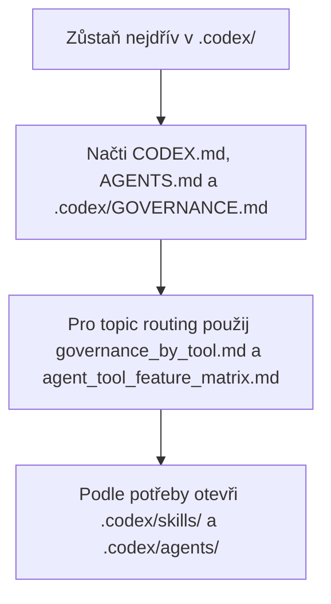

# Konfigurace Codexu

([English](README_en.md))

```text
Language entry scope: Agents MUST use README_en.md for operational instructions. This README.md is human-facing Czech only; align with the English twin when meaning changes.
```

Tato složka je **committed vendor strom Codexu v kořeni management hubu AIS CR**. Je jediným zdrojem pravdy pro aktiva, která obsahuje (rules, skills, agents, config, hooks). Sourozenecké repozitáře získávají vybraná aktiva přes direct-bundle sync řízený `.agents/sync/` politikou pomocí `orchestrate_local_agent_sync.py inspect → dry-run → apply --approve`. Historické rozvržení `.agents/local_configs/<repo>/.codex/` (payload mirror) bylo vyřazeno a nesmí být obnovováno.

<!-- aiscr:stop-anchor -->
Následující load path je podpůrná pomůcka; normativní zůstávají sekce `Entry scope` a `Co načíst nejdřív`.



## Entry scope

- Zůstaň nejdřív v tomto stromu `.codex/` a v jeho přímých pointerech.
- Paralelní vendor stromy `.claude/`, `.cursor/` a `.gemini/` neotvírej jen "pro jistotu".
- Do jiného vendor stromu přecházej jen při explicitní kontrole parity, generátoru nebo governance údržbě.
- Pro provozní čtení používej anglický protějšek [README_en.md](README_en.md); tento soubor je český primární pár.

## Co načíst nejdřív

- `CODEX.md`
- `AGENTS.md`
- `.codex/GOVERNANCE.md`
- `.agents/canonical_configs/references/governance_by_tool.md`
- `.agents/canonical_configs/references/agent_tool_feature_matrix.md`

## Poznámky

- Repo-scoped workflow vstupy jsou v `.codex/skills/`.
- Volitelní Codex subagenti jsou v `.codex/agents/`.
- Runtime nastavení drž v `.codex/config.toml`; plnou governance nenechávej v tomto README.
