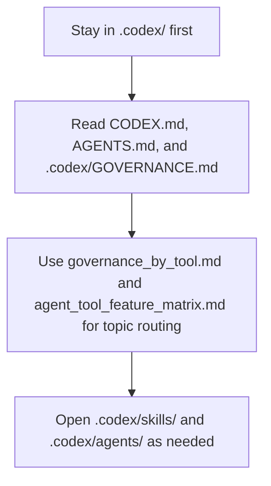

# Codex configuration

([Czech](README.md))

```text
Language entry scope: This README_en.md is the sole operational instruction source for agents. README.md is the Czech human-facing twin; update both together when operational behaviour changes.
```

This directory is the **committed hub-root Codex delivery surface** for the AIS CR management hub. It is the single source of truth for the assets it carries (rules, skills, agents, config, hooks). Sibling repositories receive selected assets through direct-bundle sync resolved from `.agents/sync/` policy via `orchestrate_local_agent_sync.py inspect → dry-run → apply --approve`. The historical `.agents/local_configs/<repo>/.codex/` payload-mirror layout has been retired and must not be recreated.

<!-- aiscr:stop-anchor -->
The load path below remains a supporting aid; the `Entry scope` and `Read First` sections stay normative.



## Entry scope

- Stay in this `.codex/` tree and its direct pointers first.
- Do not open parallel `.claude/`, `.cursor/`, or `.gemini/` trees by default just in case.
- Cross into another vendor tree only for explicit parity checks, generator work, or governance maintenance.
- Use this English counterpart for operational reading; `README.md` remains the Czech primary pair.

## Read First

- `CODEX.md`
- `AGENTS.md`
- `.codex/GOVERNANCE.md`
- `.agents/canonical_configs/references/governance_by_tool.md`
- `.agents/canonical_configs/references/agent_tool_feature_matrix.md`

## Notes

- Repo-scoped workflow entry points live in `.codex/skills/`.
- Optional Codex subagents live in `.codex/agents/`.
- Keep runtime settings in `.codex/config.toml`; do not turn this README into the full governance source.

[Czech version](README.md)
