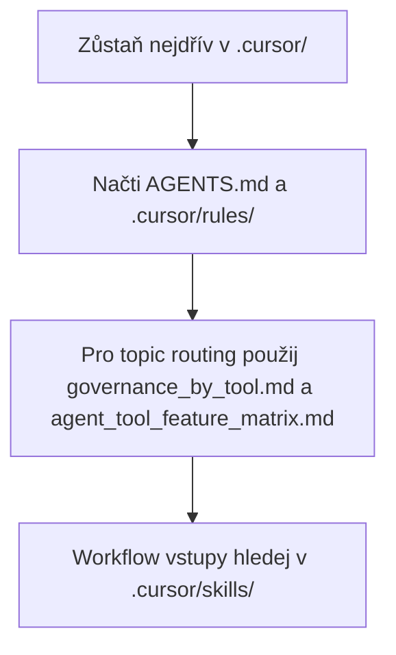

# Konfigurace Cursoru

([English](README_en.md))

```text
Language entry scope: Agents MUST use README_en.md for operational instructions. This README.md is human-facing Czech only; align with the English twin when meaning changes.
```

Tato složka drží lokální vrstvu Cursoru pro aktuální AIS CR repozitář. V committed baseline je zrcadlená pod `.agents/local_configs/<repo>/.cursor/`.

<!-- aiscr:stop-anchor -->
Následující load path je podpůrná pomůcka; normativní zůstávají sekce `Entry scope` a `Co načíst nejdřív`.



## Entry scope

- Zůstaň nejdřív v tomto stromu `.cursor/` a v jeho přímých pointerech.
- Paralelní `.claude/`, `.codex/` a `.gemini/` neotvírej bez důvodu.
- Do jiného vendor stromu přecházej jen při explicitní kontrole parity, generátoru nebo governance údržbě.
- Pro provozní čtení používej anglický protějšek [README_en.md](README_en.md); tento soubor je český primární pár.

## Co načíst nejdřív

- `AGENTS.md`
- `.cursor/rules/`
- `.agents/canonical_configs/references/governance_by_tool.md`
- `.agents/canonical_configs/references/agent_tool_feature_matrix.md`

## Poznámky

- Workflow vstupy jsou v `.cursor/skills/`.
- Dlouhá governance nepatří do tohoto README; drž ji v kanonických pravidlech.
