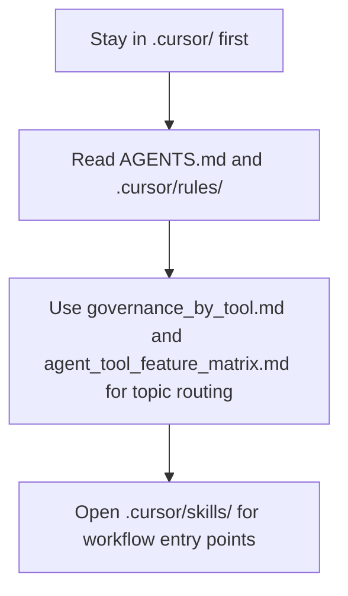

# Cursor configuration

([Czech](README.md))

```text
Language entry scope: This README_en.md is the sole operational instruction source for agents. README.md is the Czech human-facing twin; update both together when operational behaviour changes.
```

This directory holds the local Cursor layer for the current AIS CR repository. In committed baselines it is mirrored under `.agents/local_configs/<repo>/.cursor/`.

<!-- aiscr:stop-anchor -->
The load path below remains a supporting aid; the `Entry scope` and `Read First` sections stay normative.



## Entry scope

- Stay in this `.cursor/` tree and its direct pointers first.
- Do not open parallel `.claude/`, `.codex/`, or `.gemini/` trees without a clear reason.
- Cross into another vendor tree only for explicit parity checks, generator work, or governance maintenance.
- Use this English counterpart for operational reading; `README.md` remains the Czech primary pair.

## Read First

- `AGENTS.md`
- `.cursor/rules/`
- `.agents/canonical_configs/references/governance_by_tool.md`
- `.agents/canonical_configs/references/agent_tool_feature_matrix.md`

## Notes

- Workflow entry points live in `.cursor/skills/`.
- Long-form governance belongs in the canonical rule surfaces, not in this README.

[Czech version](README.md)
