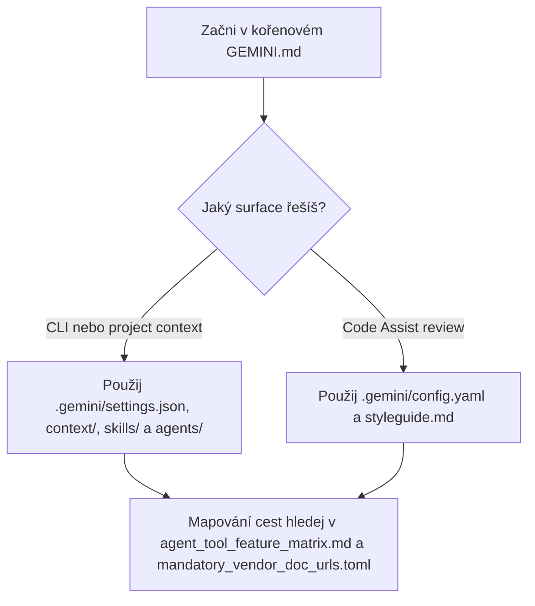

# Kontext Gemini CLI

([English](README_en.md))

```text
Language entry scope: Agents MUST use README_en.md for operational instructions. This README.md is human-facing Czech only; align with the English twin when meaning changes.
```

Následující load path je podpůrná pomůcka; normativní popis toho, kde v tomto hubu leží Gemini surface, zůstává v odstavcích výše.



**`GEMINI.md`** v **kořeni repozitáře** je vstupní dokument pro Gemini (stejná role jako **`AGENTS.md`** / **`CLAUDE.md`**). Je to **hub-root entry doc** (viz **`sync_policy.REPO_ROOT_HUB_ENTRY_DOCS`**).

Adresář **`.gemini/`** drží projektovou konfiguraci CLI a Code Assist (**`settings.json`**, hooky; **`config.yaml`** / **`styleguide.md`** pro PR review Code Assist; volitelně **`skills/`**, vlastní subagenty **`agents/*.md`**). U hubu **aiscr-management** je **`.gemini/`** **committed vendor strom v kořeni repozitáře** a jediný zdroj pravdy pro tato aktiva; **`validate_tool_parity.py`** / **`validate_agent_tool_feature_matrix.py`** kontrolují `hub_committed_path` tam. Sourozenecké repozitáře získávají vybraná aktiva — typicky **`settings.json`**, **`config.yaml`** a **`styleguide.md`** — přes direct-bundle sync řízený `.agents/sync/` politikou pomocí `orchestrate_local_agent_sync.py inspect → dry-run → apply --approve`. Celé stromy **`.gemini/skills/aiscr-*`** jsou **jen na hubu**, pokud není zapnuté **`ecosystem-sibling-workflow-mirror`**. Historické rozvržení `.agents/local_configs/<repo>/.gemini/` (payload mirror) bylo vyřazeno a nesmí být obnovováno.

Oficiální dokumentace: [Gemini CLI](https://geminicli.com/docs/), [Gemini Code Assist](https://developers.google.com/gemini-code-assist/docs/overview). Přehled cest a odkazů: **`agent_tool_feature_matrix.md`**, **`mandatory_vendor_doc_urls.toml`**.
