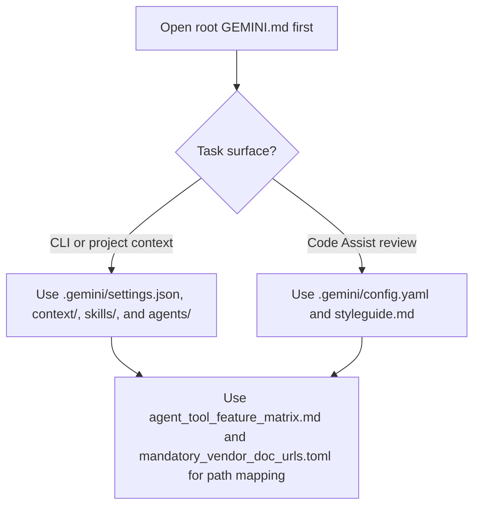

# Gemini CLI context

([Czech](README.md))

```text
Language entry scope: This README_en.md is the sole operational instruction source for agents. README.md is the Czech human-facing twin; update both together when operational behaviour changes.
```

**`GEMINI.md`** at the **repository root** is the Gemini entry document (same role as **`AGENTS.md`** / **`CLAUDE.md`**). It is **not** under **`.agents/local_configs/`** — it is a **hub-root entry doc** (see **`sync_policy.REPO_ROOT_HUB_ENTRY_DOCS`**).

The **`.gemini/`** directory holds Gemini CLI and Code Assist project config (**`settings.json`**, hooks; **`config.yaml`** / **`styleguide.md`** for Code Assist PR review; optional **`skills/`**, custom subagents **`agents/*.md`**). The committed baseline lives under **`.agents/local_configs/<repo>/.gemini/`** for sync when **`.gemini/`** is **gitignored** locally. On the **aiscr-management** hub, **`.gemini/`** is committed at the **repository root** and **`validate_tool_parity.py`** / **`validate_agent_tool_feature_matrix.py`** resolve `hub_committed_path` checks there (the hub self-mirror under **`local_configs/aiscr-management/`** has been removed). **Sibling** `local_configs` rows include **`settings.json`**, **`config.yaml`**, and **`styleguide.md`**; full **`.gemini/skills/aiscr-*`** registry trees are **hub-only** unless **`ecosystem-sibling-workflow-mirror`** is enabled. Audit: **`python .agents/scripts/validate_matrix_local_configs_cells.py`**.

The load path below is a supporting aid; the prose above remains the normative description of where Gemini surfaces live in this hub.



Official docs: [Gemini CLI](https://geminicli.com/docs/), [Gemini Code Assist](https://developers.google.com/gemini-code-assist/docs/overview). Path and URL map: **`agent_tool_feature_matrix.md`**, **`mandatory_vendor_doc_urls.toml`**.
