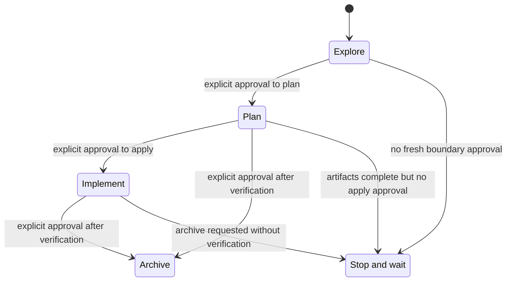
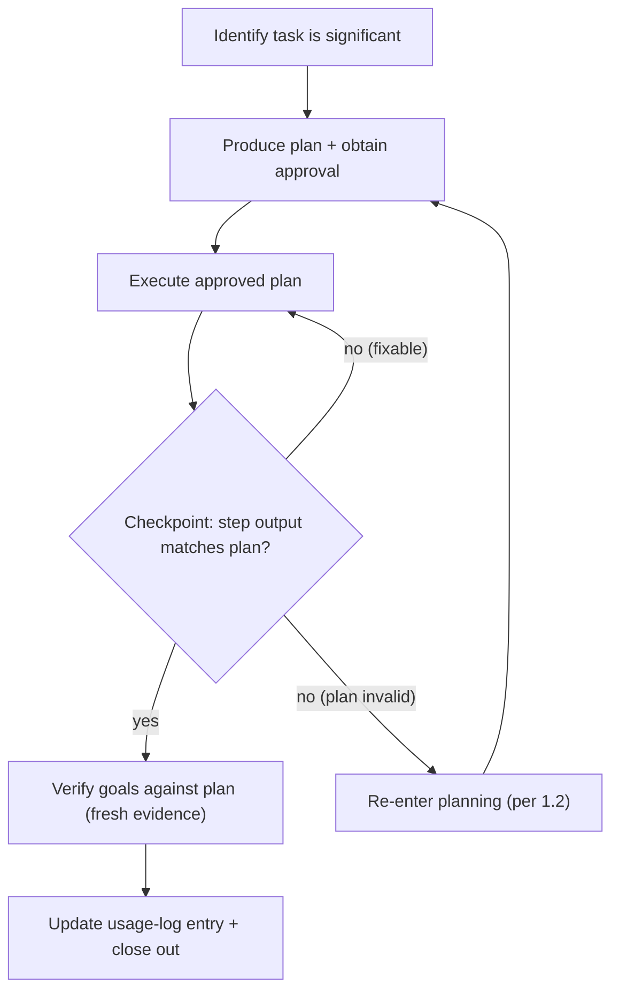

<!-- generated by generate_governance_rules.py — do not edit manually -->

<!-- aiscr:stop-anchor -->
**Entry scope**

- Stay in this Copilot instruction surface and its same-vendor pointers first.
- Do not open parallel vendor trees by default just in case.
- Cross into another vendor tree only for explicit parity checks, generator work, or governance maintenance.

```text
Entry scope — canonical stem: This file is vendor-neutral SSOT for this governance topic. Materialized copies live under assistant delivery trees (for example `.cursor/rules/`, `.claude/rules/`). If you are not editing this stem, open `governance_by_tool.md` and your tool entry doc (`AGENTS.md`, `CLAUDE.md`, `CODEX.md`, `GEMINI.md`, …) before relying on vendor-local paths alone.
```

## Planning-first workflow core

This rule applies to all AI assistants used with this repository. Assistant-specific surfaces should reference it rather than restating its behaviour.

### 1. Planning-first requirement

- Any non-trivial or non-readonly work in this management repo must start in a single explicit planning phase for that task, with human approval before mutating steps.
- Once a plan for a given task has been approved, stay in execution mode and follow it instead of repeatedly re-entering full planning phases unless a re-planning trigger below applies.
- Substantive decisions that change scope, risk, delivery, user-visible outcomes, branch strategy, repo targets, or high-impact scripts belong in the approved plan or in explicit user confirmation. Do not pivot silently during execution.
- Plan can include milestones and gates for desirable user interaction and partial review when commendable.
- Work that always requires a plan with human approval includes:
  - running scripts in `.agents/scripts/` except for tests and pre-commit
  - commands that can change git state or remote services
  - changes under `.agents/**`, `.cursor/**`, `.claude/**`, `.codex/**`, or `.gemini/**`
  - plan-driven refactors touching multiple files or repositories
  - work that can influence AI configuration or behaviour in sibling repositories
- During planning, gather only the minimal necessary context and propose a concise plan that includes:
  - Goals and steps
  - Agent or role assignments when the task is meaningfully multi-agent
  - Impacts
  - Evaluation or recommendation
- For behaviour, AI-config, or cross-assistant alignment work, explicitly consider whether canonical governance, root governance docs, or assistant delivery configs need to change.

### OpenSpec requirement surface

- For workflow domains that have migrated to OpenSpec, treat `openspec/specs/` as the persistent requirement and acceptance surface.
- Treat `openspec/changes/` as the change-local design and task surface for work that modifies those capabilities.
- OpenSpec entry points such as `/opsx:*` commands or generated `openspec-*` skills are allowed inside the same planning-first flow, but they do not replace the approval, checkpoint verification, or usage-logging obligations in this rule.
- Use reusable `.agents/plans/*.plan.md` files for the execution layer, meta-workflows, and procedures that remain plan-driven in this repository.

### 1.5 OpenSpec mode transfer gating

**Iron Law for OpenSpec workflows:** `NEVER TREAT ARTIFACT COMPLETION AS IMPLICIT APPROVAL TO IMPLEMENT.`

OpenSpec workflows follow a phased approach: **explore → plan → implement**. Agents SHALL NOT automatically transfer between these phases without explicit human approval.

The state diagram below summarizes the permitted OpenSpec phase transfers. The
approval rules and red-flag lists that follow remain normative; the diagram is a
supporting aid only and must stay aligned with them.



In practice, the critical guard is the `Plan --> Implement` boundary:
completed proposal, specs, design, and tasks do not authorize apply on their
own.

#### Mode boundaries requiring explicit approval

- **Explore → Plan**: When exploration concludes and formal planning begins
- **Plan → Implement**: When planning artifacts (proposal, specs, design, tasks) are complete and implementation would begin
- **Any → Archive**: When a change is being archived (verify completion first)

Bundled prompts, compressed multi-step requests, and completed OpenSpec
artifacts are not implicit approval to cross a later boundary. A user must
give a fresh instruction that clearly authorizes the specific implementation
or archive action for the current change.

#### Required checkpoint pattern

At each mode boundary, agents SHALL:
1. State clearly which mode boundary is being crossed
2. Explain what will happen next
3. Request explicit user approval that is specific to the current boundary
4. Only proceed after receiving clear approval for that boundary

Approval for a later boundary SHALL be phase-local: approval for exploration,
planning, or promotion does not carry forward to implementation unless the
user explicitly re-authorizes implementation at that later boundary.

#### Red flags — STOP and obtain approval

| Thought | What to do instead |
|---------|-------------------|
| "The artifacts exist, so I should implement now" | Stop. Obtain explicit user approval first. |
| "The user already approved the plan, so that also covers implementation after promotion" | Stop. Implementation still needs fresh phase-local approval after promotion. |
| "I'll continue into the next phase because it follows logically" | Stop. Wait for explicit user direction. |
| "The change is ready, so I'll apply it" | Stop. Confirm user wants to apply now. |
| "I can start implementation straight from exploration" | Stop. Complete planning artifacts first. |
| "The change has a backlog proposal, so I can implement it" | Stop. Backlog changes require promotion to governance-driven first. |

#### Backlog change guard

Changes with `schema: backlog` SHALL NOT be implemented. Backlog proposals
are lightweight idea placeholders. Before any mutating work, the change
MUST be promoted to the `governance-driven` schema through exploration
and planning — producing full proposal, specs, design, and tasks artifacts
— with explicit approval at each mode boundary per §1.5.

Backlog changes that are promoted into the governance-driven lifecycle are
no longer constrained by this guard from the point of promotion onward.

#### Hard stop after planning

After completing OpenSpec planning artifacts (proposal, specs, design, tasks), agents SHALL:
- Stop and offer `/opsx:apply <slug>` as the next step
- Treat implementation as closed until the user gives a fresh post-promotion instruction that clearly authorizes that specific change
- NOT silently continue into implementation
- NOT check off or execute tasks without explicit user request

#### Exception for documented automation

A workflow MAY bypass explicit approval ONLY if:
- The skill or prompt explicitly documents the automated transition
- The automation is clearly described with rationale
- The user has previously approved that specific automation pattern

This rule applies to ALL OpenSpec workflows regardless of entry point (`/opsx:*` commands, skills, or direct CLI usage).

The mode-transfer gating rules in this section are enforced at the skill level through phase-awareness headers in authored `aiscr-*` workflow skills. Each skill declares its lifecycle phase and the boundaries it must not cross. See `canonical_workflows_context.md` for the full two-layer lifecycle model and category classification.

### 1.1 Single-loop planning model

The following flowchart summarizes the expected loop for a significant task. The prose list below the diagram is normative; the diagram is a supporting aid and must stay aligned with it (see `.agents/canonical_configs/references/documentation_visual_conventions.md`).



For a significant task, the expected loop is:

1. Identify that the task is significant.
2. Produce one planning phase and obtain approval.
3. Execute the approved plan.
4. Execute with checkpoint gates: after implementing each step, verify it independently before initiating the next step. A checkpoint means confirming the step's output matches the plan's expectation (test passes, file exists, diff looks correct). Do not advance past a failing checkpoint — stop and either fix the current step or re-enter planning per section 1.2 if the plan is invalid.
5. Verify results against the plan before claiming completion:
   - Identify what evidence proves each goal was met (test output, diff, command exit code, manual inspection result).
   - Run the verification command or check fresh in this session — do not rely on prior runs, assumptions, or partial checks.
   - If any goal lacks fresh evidence, state what is unverified rather than claiming completion.
   - Only after evidence confirms the result: update the usage log entry for the active uncommitted change set (minimal or full per `usage-logging.md` notability rules) and ask about optional plan or run-summary attachment when relevant.
6. Suggest recommended follow ups and gotchas from the session.

This single loop applies to the whole task, not to each tool call, skill invocation, or subagent step.

### 1.2 Re-enter planning only when needed

Re-enter a full planning phase only when:

- the user changes requirements or scope in a way that invalidates the plan
- execution reveals blocking constraints or new information that makes the plan unsafe, incorrect, or materially inefficient
- the work branches into a clearly new independent sub-task
- aks user if unsure or hitting closed implementation loop

When that happens ask the user first and based on the response draft a revised plan, mark it clearly as revised, and obtain approval again before resuming mutating work.

### 1.3 Human-driven override

If the user explicitly asks to execute without a formal plan approval step, treat that instruction as approval of a very small inline plan by briefly restating the intended steps and then proceeding.

Even under this override, do not silently expand scope. High-impact scripts, cross-repo changes, or history-altering git commands still require the user to understand what will be run.

### 1.4 Planning quality gates

- When developing a plan, consider options, evaluate them clearely and present user alternate approaches with recommendations.
- Every planning phase must produce a plan with a `todos` list and SWOT analysis. Prose-only step lists are non-compliant. A minimal SWOT (one sentence per quadrant) is compliant; see `planning-and-usage-logging-detail.md` section 8 for friction guidance.
- To-dos must be specific, actionable, independently verifiable, ordered, and use content-derived kebab-case ids rather than positional labels.
- Plan must state clear impacts, implementation flow and planned subagent or MCP usage.
- Before presenting any plan, verify that it contains no placeholders, that every goal maps to at least one to-do, and that the impacts section names every file, directory, or repository to be touched.

### 2. Very low-impact exception

Agents may skip a full formal plan only when all of the following are true:

- the task is purely informational, or a single local reversible edit in one open markdown/text file that the user explicitly asked to adjust
- there is no script execution, no cross-repo effect, and no change under `.agents/**`, `.cursor/**`, `.claude/**`, `.codex/**`, or `.gemini/**`
- the work can be completed in one or two trivial steps without follow-on automation

Even then, think in terms of a mini-plan and escalate to a full planning phase if the scope grows.

### 3. Skills and reusable plans

- Skills and plans are tools inside the planning flow, not replacements for it.
- Invoking a skill during execution does not require a new planning phase if the skill stays within the approved plan.
- Before invoking a significant workflow where no plan exists yet, the approved plan must identify the skill or reusable plan, the files or repositories that may be affected, and how results will be verified and logged.
- Assistant-specific skills for this repo should point back to this rule and avoid restating behaviour.
