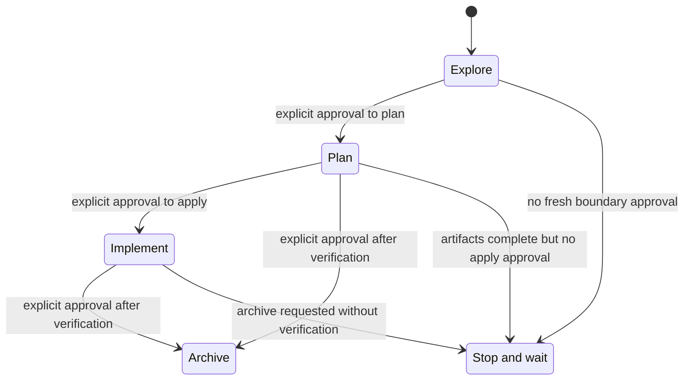
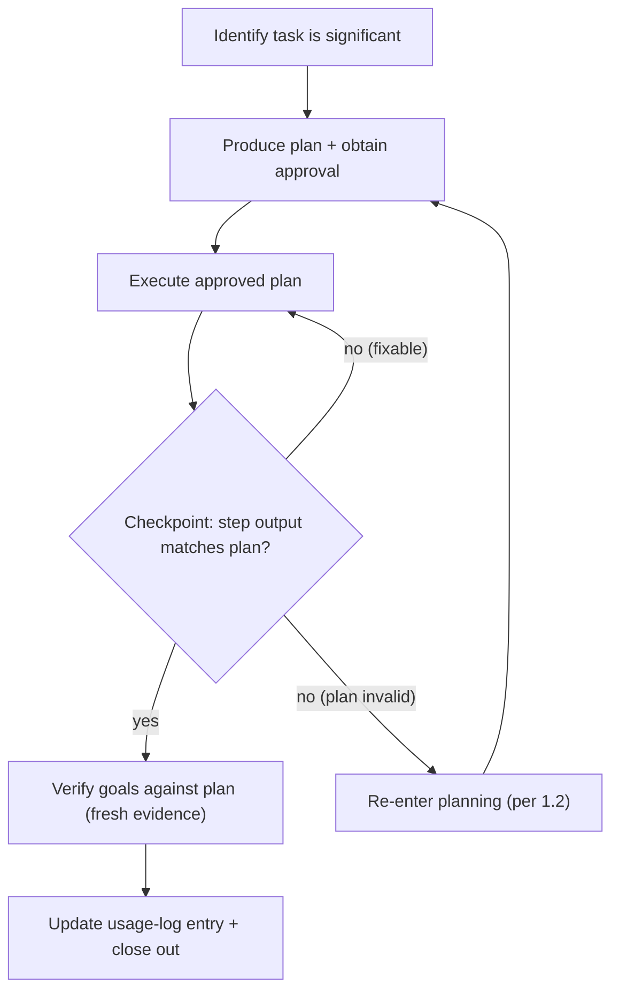

## CODEX — Using Codex in this AIS CR repository

<!-- aiscr:stop-anchor -->
**Entry scope**

- Use this `CODEX.md` together with `.codex/**` as the Codex entry surface. The shared governance rules are embedded below, authored at the `aiscr-management` hub and reconciled here at bootstrap.
- Stay in this document and Codex-native paths first.

This document reuses the same governance as the other assistants in this repository and does not introduce an independent rule set. Read `AGENTS.md` and `CONTRIBUTING.md` first, then the embedded rules below. For any non-trivial work: plan first with human approval before mutating steps, and record the rolling usage-log entry for the current uncommitted change set (with model/runtime metadata). Use `npm run openspec:validate` after editing OpenSpec artifacts.

<!-- begin:generated:aiscr-ecosystem-governance -->

---
description: "AIS CR ecosystem — shared governance rules (non-management repos)"
alwaysApply: true
globs: []
---

```text
Entry scope — canonical stem: This file is vendor-neutral SSOT for this governance topic. Materialized copies live under assistant delivery trees (for example `.cursor/rules/`, `.claude/rules/`). If you are not editing this stem, open `governance_by_tool.md` and your tool entry doc (`AGENTS.md`, `CLAUDE.md`, `CODEX.md`, `GEMINI.md`, …) before relying on vendor-local paths alone.
```

## AIS CR — Ecosystem governance rules

This file applies to **application and docs repos** in the AIS CR ecosystem. Sibling delivery is resolved from the management hub through BASELINE manifest assets and explicit per-repo enrollment. **Management-only** workflow (sibling registry and sync policy, issue tracker, ideas folder) lives in the hub repo's own management stems such as `aiscr-mgmt-entry.md`, `aiscr-mgmt-repo-operating-basics.md`, and `aiscr-hook-intents.md`, not here.

### Ownership boundary

This rule owns only ecosystem and sibling-specific governance deltas: how sibling repos receive and interpret hub-authored assistant surfaces, how vendor integration differs from hub parity, when workflow mirrors are present, how sibling-to-hub reverse-flow handoff works, and where ecosystem-wide reports versus references belong.

Use narrower stems for adjacent topics:

- `.agents/canonical_configs/governance_rules/aiscr-ecosystem-hub-workflow-routing.md` owns the compact "use the management hub" routing instructions for ecosystem-wide workflows.
- `.agents/canonical_configs/governance_rules/aiscr-mgmt-entry.md` owns the management-hub entry surface and hub-local canonical source map.
- `.agents/canonical_configs/governance_rules/aiscr-workspace-boundary-safety.md`, `aiscr-planning-core.md`, and `aiscr-usage-logging.md` own their generic safety, planning, and logging obligations.

Keep duplicated material here as a short pointer to the owning stem. If this file stops owning sibling-specific semantics, it becomes a removal candidate instead of a summary bundle.

### Canonical sources of truth

- **`AGENTS.md`**: Governance for **AI agents** (session actors), scope, in-/out-of-scope work, verification sources, and how `.agents/` is used (when present).
- **Assistant entry doc** (`CLAUDE.md`, `CODEX.md`, or `GEMINI.md` as applicable): product-specific pointers into the shared governance for the tool in use.
- **`CONTRIBUTING.md`**: branch/PR workflow, commit message expectations, agent branch naming.
- **`.agents/README.md`**: structure and purpose of `.agents/` (when present).
- **`.agents/canonical_configs/governance_rules/`**: canonical shared rule source for ecosystem governance, workspace boundary, planning/logging, and related policy fragments.
- **Vendorized rule surfaces:** generated/materialized copies live under `.cursor/rules/*.mdc`, `.claude/rules/*.md`, `.gemini/context/*.md`, `.github/instructions/*.instructions.md`, and generated sections in `CODEX.md`; treat them as assistant-delivery surfaces, not the canonical authoring location.
- **Hub assistant-integration matrix (when present in management):** `.agents/canonical_configs/references/agent_tool_feature_matrix.md` and `mandatory_vendor_doc_urls.toml` map vendor docs to AIS CR paths.
- **`governance_stable_ids.md`**: stable ESS tier slugs, parity check ids, and management hook intent ids (management hub).

### Hub vs sibling workflow surfaces

For the narrower delivery surface that answers only where ecosystem-wide workflows should run, use `.agents/canonical_configs/governance_rules/aiscr-ecosystem-hub-workflow-routing.md`. This parent rule remains the full hub-vs-sibling policy source.

**Cross-assistant registration** (per-slug skill trees, registry rows, plus **`.github/copilot-instructions.md`** where the repo uses GitHub Copilot) is **assembled at the `aiscr-management` hub**: `validate_tool_parity.py` and `canonical_workflows_context` treat the hub as where those registered artefacts must exist together for hub policy. That **does not** mean every assistant uses the same file format or runtime behaviour—see *Vendor integration vs hub parity* below.

**Sibling application/docs repos** may sync only an **operational subset** (shared rules, agents, settings, **`.github/copilot-instructions.md`** committed directly where Copilot is used, and **`aiscr-ecosystem-hub-workflow-routing.md`** via `ecosystem-discovery-assets`). Often that means **no** full hub mirror of the per-slug **`skills/`** trees - `.cursor/skills/`, `.claude/skills/`, `.codex/skills/`, `.gemini/skills/` - **for AGENT_FOLDERS products** until repo policy enables asset group **`ecosystem-sibling-workflow-surface`** (`ess-sibling-workflow-mirror` in `governance_stable_ids.md`), which adds the aligned **`skills/`** trees. Copilot is GitHub-native; selected workflow skills live under **`.github/skills/aiscr-*/SKILL.md`**. **Baseline paths** for each assistant-integration root (rules, settings, agents, etc.) come from **`repos.toml`** plus **`sync_policy.py`** profiles and apply per root the same way.

**Hub authority and reverse-flow handoff (sibling → hub):** Sibling-side workflows SHALL NOT write to hub paths. When a sibling-side workflow (for example, `aiscr-governance-bootstrap` in `bootstrap-mode-reverse-surface`) surfaces a pattern worth considering for hub adoption, it **drafts** a backlog body and **stops**; the user invokes `/aiscr-note-idea <slug>` in the hub as a separate, explicit action. Sibling workflows SHALL NOT auto-invoke hub commands. Hub-required minimums (planning, usage logging, model logging, registry-driven sync) are enforced in every sibling regardless of target configuration; target-side overrides that weaken those minimums are refused without an explicit hub-policy decision recorded outside the override file. See `openspec/specs/repository-governance-setup/spec.md` (Hub authority model, Reverse-flow architecture) for the durable contract.

### Vendor integration vs hub parity

**Each product** loads its **own** config roots: Cursor -> `.cursor/`, Claude Code -> `.claude/`, Codex -> `.codex/`, Gemini CLI -> `.gemini/` (per documentation for the **runtime you use** - local CLI/editor, cloud, or other supported surfaces; the hub does not assume a single host app). **GitHub Copilot** uses **`.github/copilot-instructions.md`** (and GitHub's own rules) when that file is **committed** in the repo.

**Hub parity** (`validate_tool_parity`, registry rows, mirrored `skills/` trees at the hub) keeps **workflow slugs and artefacts aligned** across those trees; it does **not** mean every product natively executes another product's files. **Hub authoring:** the single human-readable canonical workflow body lives at `.agents/canonical_configs/workflow_skills/<slug>.md`. Most vendor surfaces (Cursor, Claude, Codex, Gemini, Cline stems, Gemini commands) are routing stubs to that canonical document. Copilot `.github/skills/aiscr-*/SKILL.md` is the deliberate exception: a self-contained, sibling-safe full-body Agent Skill. Guardrail YAML (`iron_laws`, `red_flags`, `verification`, etc.) lives in the same `.agents/canonical_configs/workflow_skills/<slug>.md`; generated surfaces carry the topic summary, phase awareness, workflow routing, and safety boundaries in the product-appropriate form. For a short vendor-path table aimed at contributors, see **`.github/copilot-instructions.md`** (digest text states the same separation).

### Cross-tool entry-point anti-drift

When adding or renaming a standard **aiscr-** workflow entry point, complete the **numbered checklist in this section** in the **`aiscr-management` hub** (and in **any sibling that mirrors the full sibling workflow mirror surface** via `ecosystem-sibling-workflow-surface`) in the same session:

1. **Cursor skill** — `.cursor/skills/aiscr-<name>/SKILL.md` (and repo mirror rules if your hub defines them).
2. **Claude skill** — `.claude/skills/aiscr-<name>/SKILL.md`; invoke with `/aiscr-<name>` per [Claude skills](https://code.claude.com/docs/en/skills).
3. **Codex skill** — `.codex/skills/aiscr-<name>/SKILL.md`.
4. **Gemini CLI skill** - `.gemini/skills/aiscr-<name>/SKILL.md` at hub root and in sibling targets only when direct-bundle policy enables the workflow surface (regen: `generate_workflow_skills.py`; entry: `GEMINI.md`, `agent_tool_feature_matrix.md`).
5. **By-assistant-product table** - row in `.agents/canonical_configs/references/canonical_workflows_context.md` (or the path your repo uses for the canonical reference).
6. **Skillset mapping** - entry in `.agents/canonical_configs/references/aiscr_skillset_mapping.md`.
7. **GitHub Copilot** - when this repository **commits** **`.github/copilot-instructions.md`** (required integration surface for repos using Copilot), update that digest in the same session when adding or renaming a standard **`aiscr-*`** workflow so the new workflow is mentioned (digest + links to plans/skills). Also regenerate the generated Copilot Agent Skill `.github/skills/aiscr-<name>/SKILL.md` through `generate_workflow_skills.py` when the hub emits that surface. Hub repo **`aiscr-management`** is the canonical reference; from the hub run `python .agents/scripts/report_copilot_instructions_drift.py --repos-root ..` as an **advisory** sibling comparison.

The slug `aiscr-<name>` must be **identical** across every mirrored skill directory name for that workflow.

### Markdown vs structured format

**Structured (TOML / YAML / JSON)** when: a script parses it, schema is stable, authoring is infrequent, content is tabular or key-value only.

**Markdown** when: prescribed agent context, human governance narrative, generated reports, or splitting would duplicate authority without scripting gain.

**Both:** keep Markdown as the human/agent view and a structured twin in sync where CI enforces parity (see `validate_tool_parity` in the management repo).

### Reports vs references (under `.agents/`)

When your repo has `.agents/reports/` and `.agents/canonical_configs/references/`:

- **Reports** — time-stamped outputs (sync reports, audits, incidents, usage logs, release notes).
- **References** — maintained definitions (governance, mappings, registries).

If unsure, prefer **reports** for a snapshot at one point in time, **references** for ongoing rules.

### Branch workflow (brief)

- Local-only AI/agent work should stay on the current branch.
- Agents must not stage, unstage, commit, push, or switch branches for remote delivery without a direct user order for that specific Git index or delivery action.
- AI/agent branches for explicitly requested remote delivery: `agents/{agent_name}/{topic}` where your `CONTRIBUTING.md` requires it.
- Do not push directly to protected branches.
- **Sibling or multi-repo changes:** state the branch per target repo and obtain confirmation before writing.

### Git on Windows — CRLF vs LF

- Ecosystem repos typically use **`.gitattributes`** with **`eol=lf`**, so Git stores **LF**. On Windows, **`core.autocrlf=true`** (common globally) can leave the **working tree as CRLF** while the **index stays LF** — `git ls-files --eol` may show `i/lf` / `w/crlf`.
- **Symptoms:** many files **`modified`** in **`git status`**, **`git diff`** empty (normalized), **`git commit`** empty after staging, or warnings that CRLF will be replaced by LF when Git touches a file.
- **Remediation (this clone):** `git config core.autocrlf false` in **this repository**, then `git restore .` to refresh the working tree from the index. Prefer **LF** in the editor for new edits. Broader checks: **`python .agents/scripts/validate_text_hygiene.py`** when present (management hub and repos that adopt it).

### How to evolve

Keep this file short; move long policy into `AGENTS.md`, `CONTRIBUTING.md`, the owning canonical fragment, or the current assistant entry doc, and leave pointers here. **Do not** embed counts of assistants, workflows, vendors, managed repos, or skill slug sets, or refer to `validate_tool_parity` by legacy numeric parity labels or management hooks by legacy lettered labels — use stable ids from `governance_stable_ids.md` (`parity.*`, `mgmt-hook-*`). Scope and exceptions: **Documentation: dynamic sets and counts** above.

<!-- end:generated:aiscr-ecosystem-governance -->

<!-- begin:generated:aiscr-ecosystem-hub-workflow-routing -->

---
description: "Where to run AIS CR ecosystem-wide workflows (hub-primary; siblings route or mirror per repo policy)"
alwaysApply: true
globs: []
---

```text
Entry scope — canonical stem: This file is vendor-neutral SSOT for this governance topic. Materialized copies live under assistant delivery trees (for example `.cursor/rules/`, `.claude/rules/`). If you are not editing this stem, open `governance_by_tool.md` and your tool entry doc (`AGENTS.md`, `CLAUDE.md`, `CODEX.md`, `GEMINI.md`, …) before relying on vendor-local paths alone.
```

## Ecosystem workflows — use the management hub

This repository is part of the AIS CR ecosystem. **Workflow entry points** for assistant integrations covered by the ecosystem matrix are **authored and validated in `aiscr-management`**. This shard is the narrow delivery surface of **`.agents/canonical_configs/governance_rules/aiscr-ecosystem-governance.md`**: use the parent rule for the full hub-vs-sibling policy, and use this file when the only question is where ecosystem-wide workflows should run.

**When you need ecosystem-wide automation** (config sync orchestration, plan schema validation, `validate_tool_parity`, asset-manifest updates, or repository enrollment changes):

1. Open a local clone of **`aiscr-management`** (sibling under your usual `repos-root`), or open [the hub repository on GitHub](https://github.com/ARUP-CAS/aiscr-management) and use **`gh`** or the web UI for issues and PRs.
2. Use the hub's [config-sync plan](https://github.com/ARUP-CAS/aiscr-management/blob/main/.agents/plans/config-sync.plan.md) and [scripts README](https://github.com/ARUP-CAS/aiscr-management/blob/main/.agents/scripts/README.md). If your workspace **is** `aiscr-management`, the same files live under `.agents/…` locally.
3. Treat [canonical_workflows_context.md](https://github.com/ARUP-CAS/aiscr-management/blob/main/.agents/canonical_configs/references/canonical_workflows_context.md) and [`validate_tool_parity.py`](https://github.com/ARUP-CAS/aiscr-management/blob/main/.agents/scripts/validate_tool_parity.py) as **hub-complete** registries; this repo may carry only an **operational subset** selected by sync (rules, agents, settings, Copilot digest, per-assistant trees per repo policy).

**Do not assume** this repo contains every `aiscr-*` skill or command file; use the hub when the task is cross-repo sync, repo-policy population, or registry maintenance.

**Assistant workflow surfaces:** Standard **`aiscr-*` workflows** are authored in the hub and mirrored only when the repo policy enables the sibling workflow mirror asset group. Cursor, Claude Code, Codex, and Gemini CLI use their own generated `skills/` trees with matching slugs; GitHub Copilot uses the committed digest and generated instruction files rather than per-slug skill files.

<!-- end:generated:aiscr-ecosystem-hub-workflow-routing -->

<!-- begin:generated:aiscr-workspace-boundary-safety -->

---
description: "Workspace-boundary safety — do not read/write outside workspace unless explicitly requested; when requested, state impacts and be reluctant. Exceptions: native app folders; relaxation for sibling repos (repos.toml registry)."
alwaysApply: true
globs: []
---

```text
Entry scope — canonical stem: This file is vendor-neutral SSOT for this governance topic. Materialized copies live under assistant delivery trees (for example `.cursor/rules/`, `.claude/rules/`). If you are not editing this stem, open `governance_by_tool.md` and your tool entry doc (`AGENTS.md`, `CLAUDE.md`, `CODEX.md`, `GEMINI.md`, …) before relying on vendor-local paths alone.
```

<!-- Vendor-path note: concrete vendor paths in this canonical rule are intentional.
When a new assistant product is added, update these enumerations in the same change
and keep mandatory_vendor_doc_urls.toml as the authoritative vendor roster. -->

## Workspace boundary and out-of-workspace reluctance

This rule applies whenever the agent is used (in any repo or no repo). Behaviour is global; repo-level rules are one way to load it through assistant integrations in this repo.

### Default

- Only read and write inside the opened workspace root(s).
- Do **not** read or write system directories (e.g. `C:\Program Files`, `C:\Windows`, `C:\ProgramData`) or personal directories outside the workspace (e.g. user profile folders like Documents, Desktop, or any path outside the workspace) unless the user **explicitly** requests it.
- **Windows:** Treat paths like `C:\Users\...`, `C:\Program Files`, `C:\Windows`, and other non-workspace locations as out of scope by default.

### When the user explicitly requests out-of-workspace access

Before performing any such action, the agent must:

1. State **in plain language** which paths will be touched, what operation (read/write/delete), and what the impact is (e.g. "will overwrite X", "will create Y").
2. Be **reluctant**: prefer suggesting the user do it manually or in a separate, controlled step.
3. Not proceed without the user confirming they understand the impact.

### Exception — native app folders

The reluctance and impact-statement requirement does **not** apply to the tools' own app directories:

- `~/.cursor/` (including plans, temp, hooks)
- `~/.claude/` (including plans, sessions)
- `~/.codex/` (including plans, sessions)

The agent may read/write these for normal tool operation (e.g. plans, temp files) without requiring the same explicit-request + impact-statement flow. System and personal paths (Program Files, Windows, Documents, Desktop, etc.) remain subject to reluctance when explicitly requested.

### Relaxation — sibling repos (repos.toml registry)

When the workspace is aiscr-management (or a repo that contains `.agents/sync/`), the rule is **relaxed** for **sibling repositories** named in **`.agents/sync/repos.toml`** (canonical machine registry; e.g. `aiscr-webamcr`, `aiscr-digiarchiv-2`). Paths to those sibling repo roots (under the same repos-root as the current repo, or under a configured parent) may be read/written when the user's task is to work with siblings (e.g. sync, governance, config propagation). The agent must still state which repo(s) and what operation, and follow existing governance (approved plan, confirmed branch per repo); it need not apply the same reluctance as for arbitrary system/personal paths. Derive the set of allowed sibling names from **`repos.toml`** only, not from scanning retired payload directories. If `repos.toml` is missing or lists no siblings, do not assume any sibling paths.

### Config protection and no self-adaptation

- **Config protection:** Treat safety-related config as **protected**. Do not modify `~/.cursor/sandbox.json`, `~/.cursor/hooks.json`, safety-related keys in `~/.claude/settings.json` (sandbox, permissions.deny), or `~/.codex/config.toml` (sandbox mode, approval_policy) unless the user **strictly orders** it. Same for repo-level `.cursor/sandbox.json`, `.claude/settings.json` (sandbox/permissions), `.codex/config.toml` when they encode safety.
- **No self-adaptation:** The agent must not change its own rules, sandbox settings, permission denies, or approval policy. Do not suggest or apply changes that weaken the workspace boundary or reduce config protection unless the user has **explicitly requested** that change.

<!-- end:generated:aiscr-workspace-boundary-safety -->

<!-- begin:generated:aiscr-model-logging -->

---
description: "Model/runtime metadata for usage log entries"
alwaysApply: true
globs: []
---

```text
Entry scope — canonical stem: This file is vendor-neutral SSOT for this governance topic. Materialized copies live under assistant delivery trees (for example `.cursor/rules/`, `.claude/rules/`). If you are not editing this stem, open `governance_by_tool.md` and your tool entry doc (`AGENTS.md`, `CLAUDE.md`, `CODEX.md`, `GEMINI.md`, …) before relying on vendor-local paths alone.
```

## Model usage logging

- This rule is an **always-on governance baseline** for AIS CR repositories. Treat it as applying to every significant AI-assisted session, regardless of whether a specific plan mentions it.
- This rule defines the **model/runtime metadata** that must appear in the canonical persisted record for the session.
- The canonical persisted record is the **usage log entry for the current uncommitted change set** described in your repo's governance (for example `AGENTS.md`, the current assistant entry doc, and `usage-logging.md` in this management repo). Update that same entry while the local changes remain uncommitted. Do **not** create a second persisted model-only log.
- **Required fields** (all entries must include):
  - the **assistant / runtime** label (e.g. Cursor, Claude Code),
  - the **actual backend model id** when the runtime exposes it,
  - an explicit note that the backend model id was **not exposed by the runtime** when it is unavailable.
- **Full entry additional fields** (optional supplement for audit-heavy work):
  - the **subagents used** in the run, naming each concrete subagent when the runtime exposes it (`aiscr-*` custom agents or the platform/default agent name); use `default` only when no more specific identity is exposed,
  - the **MCP servers used** in the run, naming the server only (for example `GitHub`, `Hugging Face`) rather than individual MCP tools,
  - the **model-routing or reasoning context** only when the runtime exposes a meaningful, vendor-neutral label for it.
- Do **not** log planned-but-unused subagents or configured-but-unused MCP servers.
- Do **not** record vendor-specific configuration keys or routing labels in the canonical persisted log unless that runtime exposes them as the user-facing runtime surface for the session and they add useful context across assistants.
- During execution, you may briefly mention model/runtime changes in chat or tool output when useful, but the persisted compliance record remains the single usage log entry for the current uncommitted change set.
- If the runtime does not expose the backend model id, state that explicitly in the usage log entry instead of inventing one.
- Keep any in-session disclosures **very short** (1-2 sentences) and do not try to change routing.

Example:

`Agent/runtime: Codex CLI; model/backend: not exposed by the runtime.`

Full entry example:

`Agent/runtime: Codex CLI; subagents used: aiscr-governance-reviewer; MCP servers used: GitHub; model/backend: not exposed by the runtime.`

<!-- end:generated:aiscr-model-logging -->

<!-- begin:generated:aiscr-quality-first-execution -->

---
description: "Agent work-style defaults: first-pass quality contract with pre-presentation self-check Iron Law"
alwaysApply: true
globs: []
---

```text
Entry scope — canonical stem: This file is vendor-neutral SSOT for this governance topic. Materialized copies live under assistant delivery trees (for example `.cursor/rules/`, `.claude/rules/`). If you are not editing this stem, open `governance_by_tool.md` and your tool entry doc (`AGENTS.md`, `CLAUDE.md`, `CODEX.md`, `GEMINI.md`, …) before relying on vendor-local paths alone.
```

## Quality-first execution

Durable, vendor-neutral defaults that steer agents toward first-pass thoroughness so sessions need fewer "redo", "think deeper", "be creative", "review and fix" nudges. This stem owns the behavioural work-style contract. It does not restate planning, logging, or workspace rules — those stay in their owning stems and are referenced by path.

### Defaults

- **Quality over speed.** On any task that is not trivially reversible, prefer a deliberate first pass over a minimum-viable first draft, even when the user did not explicitly ask for thoroughness. Trivial-reversible exception per `planning-core.md` §2.
- **Understand before editing.** Before edits whose scope exceeds a few lines or spans multiple files, form a short internal plan (files to touch, intended change shape) even when no formal planning skill is invoked. Pointer: `planning-core.md` §1.
- **Review and refactor before drafting-and-patching.** When prior art exists in the codebase, extend, refactor, or reuse the existing implementation instead of writing a parallel one and reconciling later.
- **Verify assumptions against repo sources.** Confirm file paths, symbols, configuration keys, and governance rules against the current repository state before citing them; do not rely on training or prior-session memory. Pointer: `planning-core.md` §1 step 5.
- **Prefer filesystem evidence over tracker prose.** Treat trackers, summaries, generated overviews, and change task lists as maps. Completion evidence must come from actual files, current command output, and direct content inspection; use trackers to find discrepancies, not to prove success by themselves.
- **Match existing patterns before inventing.** Before introducing a new abstraction, naming convention, file layout, or governance surface, check whether the repository already defines a pattern for that surface and match it.
- **Verify the surface the user cited.** If the user reports a problem in a generated or delivered file, regenerate from the canonical source when needed, then reopen the exact cited surface and confirm the text there before reporting the issue fixed.
- **Re-anchor after context transitions.** After compaction, resume, or interruption, reread the approved plan or active OpenSpec artifacts and continue with narrow patches against the current request instead of acting on stale thread memory.
- **Surface trade-offs at decision points.** When choosing between approaches with materially different trade-offs (effort, risk, coupling, reversibility), present the trade-off summary and a recommendation rather than silently picking one. Pointer: `planning-core.md` §1.4.
- **Clarify before proceeding on ambiguity.** When the chosen interpretation of an ambiguous request would materially change outputs, files touched, or repositories affected, pause for one short, specific clarification question before plowing ahead.
- **Categorize incoming review feedback before implementing.** When receiving review comments (PR reviews, inline comments, verbal direction), classify each item before touching code: **blocking** (security, breakage), **simple fix** (typo, import), **complex fix** (refactor, logic change), **unclear** (ask first — do not implement), **disputed** (state reasoning before agreeing or pushing back). Do not batch-implement without testing each change individually. Outbound review generation is owned by `aiscr-review-pr` and `openspec/specs/pr-review-workflow/spec.md`; this default covers the complementary inbound reception path.
- **Explore mode is not implementation mode.** When `<explicit_instructions type="opsx-explore.md">` is present or the user has invoked an explore stance, read and investigate freely but NEVER write, edit, or execute mutating commands. Creating OpenSpec proposal/design/spec artifacts during exploration is allowed at the user's direction; editing application configs, governance rules, or code is not. When in doubt whether the current mode is explore, stop and ask.
- **Debug by hypothesis, not by patch.** When facing a bug, test failure, or unexpected behaviour, follow the phased progression: (1) investigate root cause first — read the error completely, reproduce, check recent changes; (2) find a working example in the repo or its history and compare; (3) form and test **one** hypothesis at a time with the minimal change that would prove or disprove it; (4) fix at root cause, not at symptom. **If three or more fixes fail, stop and question the architecture rather than attempting another patch.** Pointer: `planning-core.md` re-plan triggers when the architecture question is the right answer.
- **Inspect mechanical bulk edits.** After replace-all, generated rewrites, or broad lint cleanup, scan the resulting diff for joined lines, stripped newlines, trailing whitespace, and unintended prose changes before running validators.

### Iron Law — pre-presentation self-check

`PRE-PRESENTATION SELF-CHECK IS MANDATORY BEFORE REPORTING WORK COMPLETE.`

Before reporting a non-trivial task as complete, run a self-check **in the current session** that confirms:

1. Every goal stated in the plan or user request has **fresh** evidence (tool output, file content, command exit code).
2. Every file path, symbol, or rule cited in the output exists as cited.
3. Required validators or lint have been run fresh in the current session; prior-session results do not count.
4. If an explore-mode stance (`opsx:explore`) was active at any point and was followed by implementation, explicit user direction to exit explore mode was given before the first mutating tool call.

If any item fails or is unverified, flag it as unverified rather than claiming completion. Pointer: `planning-core.md` §1 step 5.

### Related owning stems (pointer, not restate)

- Planning loop, quality gates, verify-before-complete checkpoint, re-plan triggers: `planning-core.md`.
- Upstream-not-behind baseline before significant plans: `planning-baseline-upstream.md`.
- Usage-log lifecycle and required fields for significant work: `usage-logging.md`.
- Model/runtime metadata in the rolling usage-log entry: `model-logging.md`.
- Workspace reluctance, sibling relaxation, config protection: `workspace-boundary-safety.md`.

Durable capability contract: `openspec/specs/agent-quality-first-execution/spec.md`.

<!-- end:generated:aiscr-quality-first-execution -->

<!-- begin:generated:aiscr-planning-core -->

---
description: "Planning-first workflow core for aiscr-management"
alwaysApply: true
globs: []
---

```text
Entry scope — canonical stem: This file is vendor-neutral SSOT for this governance topic. Materialized copies live under assistant delivery trees (for example `.cursor/rules/`, `.claude/rules/`). If you are not editing this stem, open `governance_by_tool.md` and your tool entry doc (`AGENTS.md`, `CLAUDE.md`, `CODEX.md`, `GEMINI.md`, …) before relying on vendor-local paths alone.
```

## Planning-first workflow core

This rule applies to all AI assistants used with this repository. Assistant-specific surfaces should reference it rather than restating its behaviour.

### 1. Planning-first requirement

- Any non-trivial or non-readonly work in this management repo must start in a single explicit planning phase for that task, with human approval before mutating steps.
- Once a plan for a given task has been approved, stay in execution mode and follow it instead of repeatedly re-entering full planning phases unless a re-planning trigger below applies.
- Substantive decisions that change scope, risk, delivery, user-visible outcomes, branch strategy, repo targets, or high-impact scripts belong in the approved plan or in explicit user confirmation. Do not pivot silently during execution.
- Plan can include milestones and gates for desirable user interaction and partial review when commendable.
- Work that always requires a plan with human approval includes:
  - running scripts in `.agents/scripts/` except for tests and pre-commit
  - commands that can change git state or remote services
  - changes under `.agents/**`, `.cursor/**`, `.claude/**`, `.codex/**`, or `.gemini/**`
  - plan-driven refactors touching multiple files or repositories
  - work that can influence AI configuration or behaviour in sibling repositories
- During planning, gather only the minimal necessary context and propose a concise plan that includes:
  - Goals and steps
  - Agent or role assignments when the task is meaningfully multi-agent
  - Impacts
  - Evaluation or recommendation
- For behaviour, AI-config, or cross-assistant alignment work, explicitly consider whether canonical governance, root governance docs, or assistant delivery configs need to change.

### OpenSpec requirement surface

- For workflow domains that have migrated to OpenSpec, treat `openspec/specs/` as the persistent requirement and acceptance surface.
- Treat `openspec/changes/` as the change-local design and task surface for work that modifies those capabilities.
- OpenSpec entry points such as `/opsx:*` commands or generated `openspec-*` skills are allowed inside the same planning-first flow, but they do not replace the approval, checkpoint verification, or usage-logging obligations in this rule.
- Use reusable `.agents/plans/*.plan.md` files for the execution layer, meta-workflows, and procedures that remain plan-driven in this repository.

### 1.5 OpenSpec mode transfer gating

**Iron Law for OpenSpec workflows:** `NEVER TREAT ARTIFACT COMPLETION AS IMPLICIT APPROVAL TO IMPLEMENT.`

OpenSpec workflows follow a phased approach: **explore → plan → implement**. Agents SHALL NOT automatically transfer between these phases without explicit human approval.

The state diagram below summarizes the permitted OpenSpec phase transfers. The
approval rules and red-flag lists that follow remain normative; the diagram is a
supporting aid only and must stay aligned with them.



In practice, the critical guard is the `Plan --> Implement` boundary:
completed proposal, specs, design, and tasks do not authorize apply on their
own.

#### Mode boundaries requiring explicit approval

- **Explore → Plan**: When exploration concludes and formal planning begins
- **Plan → Implement**: When planning artifacts (proposal, specs, design, tasks) are complete and implementation would begin
- **Any → Archive**: When a change is being archived (verify completion first)

Bundled prompts, compressed multi-step requests, and completed OpenSpec
artifacts are not implicit approval to cross a later boundary. A user must
give a fresh instruction that clearly authorizes the specific implementation
or archive action for the current change.

#### Required checkpoint pattern

At each mode boundary, agents SHALL:
1. State clearly which mode boundary is being crossed
2. Explain what will happen next
3. Request explicit user approval that is specific to the current boundary
4. Only proceed after receiving clear approval for that boundary

Approval for a later boundary SHALL be phase-local: approval for exploration,
planning, or promotion does not carry forward to implementation unless the
user explicitly re-authorizes implementation at that later boundary.

#### Red flags — STOP and obtain approval

| Thought | What to do instead |
|---------|-------------------|
| "The artifacts exist, so I should implement now" | Stop. Obtain explicit user approval first. |
| "The user already approved the plan, so that also covers implementation after promotion" | Stop. Implementation still needs fresh phase-local approval after promotion. |
| "I'll continue into the next phase because it follows logically" | Stop. Wait for explicit user direction. |
| "The change is ready, so I'll apply it" | Stop. Confirm user wants to apply now. |
| "I can start implementation straight from exploration" | Stop. Complete planning artifacts first. |
| "The change has a backlog proposal, so I can implement it" | Stop. Backlog changes require promotion to governance-driven first. |

#### Backlog change guard

Changes with `schema: backlog` SHALL NOT be implemented. Backlog proposals
are lightweight idea placeholders. Before any mutating work, the change
MUST be promoted to the `governance-driven` schema through exploration
and planning — producing full proposal, specs, design, and tasks artifacts
— with explicit approval at each mode boundary per §1.5.

Backlog changes that are promoted into the governance-driven lifecycle are
no longer constrained by this guard from the point of promotion onward.

#### Hard stop after planning

After completing OpenSpec planning artifacts (proposal, specs, design, tasks), agents SHALL:
- Stop and offer `/opsx:apply <slug>` as the next step
- Treat implementation as closed until the user gives a fresh post-promotion instruction that clearly authorizes that specific change
- NOT silently continue into implementation
- NOT check off or execute tasks without explicit user request

#### Exception for documented automation

A workflow MAY bypass explicit approval ONLY if:
- The skill or prompt explicitly documents the automated transition
- The automation is clearly described with rationale
- The user has previously approved that specific automation pattern

This rule applies to ALL OpenSpec workflows regardless of entry point (`/opsx:*` commands, skills, or direct CLI usage).

The mode-transfer gating rules in this section are enforced at the skill level through phase-awareness headers in authored `aiscr-*` workflow skills. Each skill declares its lifecycle phase and the boundaries it must not cross. See `canonical_workflows_context.md` for the full two-layer lifecycle model and category classification.

### 1.1 Single-loop planning model

The following flowchart summarizes the expected loop for a significant task. The prose list below the diagram is normative; the diagram is a supporting aid and must stay aligned with it (see `.agents/canonical_configs/references/documentation_visual_conventions.md`).



For a significant task, the expected loop is:

1. Identify that the task is significant.
2. Produce one planning phase and obtain approval.
3. Execute the approved plan.
4. Execute with checkpoint gates: after implementing each step, verify it independently before initiating the next step. A checkpoint means confirming the step's output matches the plan's expectation (test passes, file exists, diff looks correct). Do not advance past a failing checkpoint — stop and either fix the current step or re-enter planning per section 1.2 if the plan is invalid.
5. Verify results against the plan before claiming completion:
   - Identify what evidence proves each goal was met (test output, diff, command exit code, manual inspection result).
   - Run the verification command or check fresh in this session — do not rely on prior runs, assumptions, or partial checks.
   - If any goal lacks fresh evidence, state what is unverified rather than claiming completion.
   - Only after evidence confirms the result: update the usage log entry for the active uncommitted change set (minimal or full per `usage-logging.md` notability rules) and ask about optional plan or run-summary attachment when relevant.
6. Suggest recommended follow ups and gotchas from the session.

This single loop applies to the whole task, not to each tool call, skill invocation, or subagent step.

### 1.2 Re-enter planning only when needed

Re-enter a full planning phase only when:

- the user changes requirements or scope in a way that invalidates the plan
- execution reveals blocking constraints or new information that makes the plan unsafe, incorrect, or materially inefficient
- the work branches into a clearly new independent sub-task
- aks user if unsure or hitting closed implementation loop

When that happens ask the user first and based on the response draft a revised plan, mark it clearly as revised, and obtain approval again before resuming mutating work.

### 1.3 Human-driven override

If the user explicitly asks to execute without a formal plan approval step, treat that instruction as approval of a very small inline plan by briefly restating the intended steps and then proceeding.

Even under this override, do not silently expand scope. High-impact scripts, cross-repo changes, or history-altering git commands still require the user to understand what will be run.

### 1.4 Planning quality gates

- When developing a plan, consider options, evaluate them clearely and present user alternate approaches with recommendations.
- Every planning phase must produce a plan with a `todos` list and SWOT analysis. Prose-only step lists are non-compliant. A minimal SWOT (one sentence per quadrant) is compliant; see `planning-and-usage-logging-detail.md` section 8 for friction guidance.
- To-dos must be specific, actionable, independently verifiable, ordered, and use content-derived kebab-case ids rather than positional labels.
- Plan must state clear impacts, implementation flow and planned subagent or MCP usage.
- Before presenting any plan, verify that it contains no placeholders, that every goal maps to at least one to-do, and that the impacts section names every file, directory, or repository to be touched.

### 2. Very low-impact exception

Agents may skip a full formal plan only when all of the following are true:

- the task is purely informational, or a single local reversible edit in one open markdown/text file that the user explicitly asked to adjust
- there is no script execution, no cross-repo effect, and no change under `.agents/**`, `.cursor/**`, `.claude/**`, `.codex/**`, or `.gemini/**`
- the work can be completed in one or two trivial steps without follow-on automation

Even then, think in terms of a mini-plan and escalate to a full planning phase if the scope grows.

### 3. Skills and reusable plans

- Skills and plans are tools inside the planning flow, not replacements for it.
- Invoking a skill during execution does not require a new planning phase if the skill stays within the approved plan.
- Before invoking a significant workflow where no plan exists yet, the approved plan must identify the skill or reusable plan, the files or repositories that may be affected, and how results will be verified and logged.
- Assistant-specific skills for this repo should point back to this rule and avoid restating behaviour.

<!-- end:generated:aiscr-planning-core -->

<!-- begin:generated:aiscr-usage-logging -->

---
description: "Usage logging lifecycle, notability, and required fields for aiscr-management"
alwaysApply: true
globs: []
---

```text
Entry scope — canonical stem: This file is vendor-neutral SSOT for this governance topic. Materialized copies live under assistant delivery trees (for example `.cursor/rules/`, `.claude/rules/`). If you are not editing this stem, open `governance_by_tool.md` and your tool entry doc (`AGENTS.md`, `CLAUDE.md`, `CODEX.md`, `GEMINI.md`, …) before relying on vendor-local paths alone.
```

## Usage logging for management tasks

### 1. When a persisted log is required (notability)

A persisted usage log entry is **required** when the session performs **significant management work**:

- Running scripts in `.agents/scripts/` (except tests and pre-commit)
- Commands that change git state or remote services
- Changes under `.agents/**`, `.cursor/**`, `.claude/**`, `.codex/**`, or `.gemini/**`
- Plan-driven refactors touching multiple files or repositories
- Work that influences AI configuration or behaviour in sibling repositories
- Cross-repo sync operations

**May omit a log** when **all** of the following are true (very low-impact exception):

- The task is purely informational, or a single local reversible edit in one open markdown/text file that the user explicitly asked to adjust
- There is no script execution, no cross-repo effect, and no change under `.agents/**`, `.cursor/**`, `.claude/**`, `.codex/**`, or `.gemini/**`
- The work can be completed in one or two trivial steps without follow-on automation

#### Ideation-only backlog capture (`aiscr-note-idea`) — no persisted usage log

A persisted usage log entry is **forbidden** when the **only** scoped work is completing **`/aiscr-note-idea`**: creating or updating a single `openspec/changes/<slug>/` backlog proposal (including `.openspec.yaml` and `proposal.md`), running `npx openspec validate` / `openspec status` for that slug as the workflow prescribes, and running `python .agents/scripts/generate_backlog_overview.py`. The backlog change plus refreshed `.agents/backlog-overview.md` are the accountability surface.

Do **not** create or update `.agents/reports/usage/**` to document that ideation path alone. If the same session performs **other** significant management work, normal notability rules apply to that other work; do not use a usage log entry whose sole stated purpose is recording `aiscr-note-idea`.

### 2. Minimal default vs optional supplement

When logging is required, the **default** compliance path is a **minimal entry** with the hub-defined minimal field set. Extended narrative and rolling updates are **optional supplements**, not default obligations.

**Minimal entry (default):**
- One short file or stub per uncommitted change set
- Contains minimal required labels only
- Sufficient for compliance

**Full entry (optional supplement):**
- Rolling updates to the same entry while changes remain uncommitted
- Extended narrative, context, and detail
- Use when audit-heavy work demands additional accountability

**Note:** Detailed plans live in `openspec/changes/<change-slug>/` as the canonical archive. Do not duplicate plan content in usage logs; reference the OpenSpec change slug instead.

### 3. Single canonical persisted record

- The single canonical persisted record for a significant management task is one usage log entry for the current uncommitted change set.
- For **full entries**: keep updating that same entry while the relevant local changes remain uncommitted; do not create separate persisted entries for intermediate substeps inside the same dirty working tree.
- Once those changes are committed, a later significant change set should use a new entry when needed.
- `model-logging.md` defines the runtime and backend metadata that must appear in this same entry. Do not create a second persisted model-only log.

### 4. Required field sets

**All entries (mandatory compliance):**

- `When`
- `Agent / runtime`
- `Model / backend`
- `What`
- `Impacted`
- `Close-out`

**Full entry additional fields (when providing extended metadata):**

- `Subagents used`
- `MCP servers used`
- `Workflow context used`
- `Verification`

Use at least the labels appropriate to the entry type because CI anti-drift checks look for them:

- `Agent / runtime:`
- `Model / backend:`
- `Subagents used:` (full entries)
- `MCP servers used:` (full entries)
- `Workflow context used:` (full entries)
- `Close-out:`

Directory, naming, low-impact exception, and style guidance live in `.agents/canonical_configs/references/planning-and-usage-logging-detail.md`.

For the canonical entry shape definitions, see `openspec/specs/usage-log-lifecycle/spec.md`.

### 5. Maintenance and future-proofing

- Holistic plan refactors, not incremental patch stacks, remain the preferred maintenance model for durable plans.
- Re-validate after substantial edits.
- Treat CI and validators as non-interactive enforcement of the same lifecycle rather than as a substitute for the log entry itself.

<!-- end:generated:aiscr-usage-logging -->
