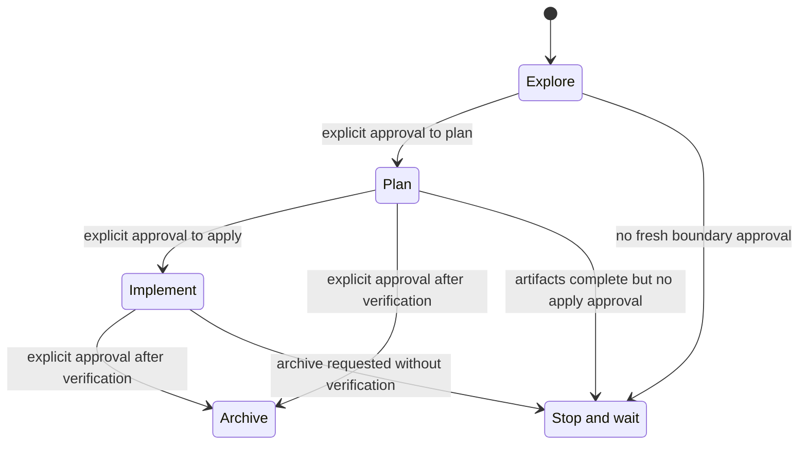
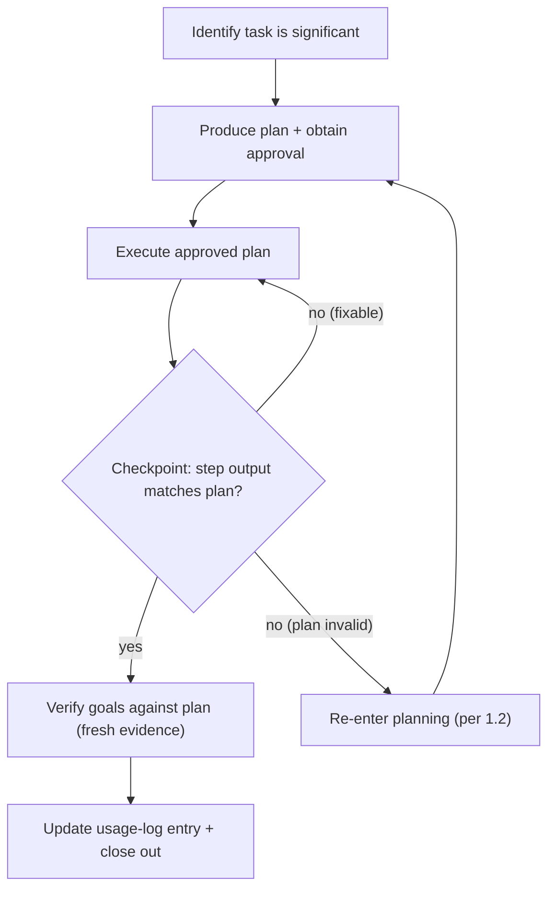

## CODEX — Using Codex in this AIS CR repository

<!-- aiscr:stop-anchor -->
**Entry scope**

- Use this `CODEX.md` together with `.codex/**` as the Codex entry surface. The shared governance rules are embedded below, authored at the `aiscr-management` hub and reconciled here at bootstrap.
- Stay in this document and Codex-native paths first.

This document reuses the same governance as the other assistants in this repository and does not introduce an independent rule set. Read `AGENTS.md` and `CONTRIBUTING.md` first, then the embedded rules below. For any non-trivial work: plan first with human approval before mutating steps, and record the rolling usage-log entry for the current uncommitted change set (with model/runtime metadata). Use `npm run openspec:validate` after editing OpenSpec artifacts.

<!-- begin:generated:vendor-digest-core -->
<!-- generated by generate_governance_rules.py — do not edit manually -->

## AIS CR shared assistant orientation

This repository is part of the AIS CR ecosystem. The entry doc you are reading follows the same shared governance as every other assistant integration in this repository; this section is generated from one shared canonical body and is identical across the vendor entry docs. Entry scope (which surfaces to stay in first) is defined once in this document's preamble and is not repeated here.

### Cross-vendor map

Each product loads its own configuration tree; workflow slugs stay aligned across them:

| Product | Entry surfaces |
| --- | --- |
| Cursor | `.cursor/` (rules, skills, agents) |
| Claude Code | `CLAUDE.md` + `.claude/` |
| Codex | `CODEX.md` + `.codex/` |
| Gemini | `GEMINI.md` + `.gemini/` |
| GitHub Copilot | `.github/copilot-instructions.md` + `.github/` (instructions, prompts, skills) |

Cross into another vendor tree only for explicit parity checks, generator work, or governance maintenance.

### Shared governance kernel

`AGENTS.md` is the governance authority for AI agents in this repository; `CONTRIBUTING.md` owns the branch and PR workflow. The generated `agents-governance-kernel` block in `AGENTS.md` carries the current cross-vendor minimums for planning and approval, usage and model logging, script/sync/git approval, workspace and sibling boundaries, and hub authority.

The full rule bodies are delivered per assistant; the vendor section below says where this product reads them. This digest points to the shared kernel instead of restating it.

### Where workflows live

Standard `aiscr-*` workflows are authored at the `aiscr-management` hub and delivered per repository enrollment as per-vendor skill trees with matching slugs. Do not assume every workflow is mirrored in this repository; when an ecosystem-wide workflow (config sync, parity validation, registry maintenance) is needed, use the management hub.

### OpenSpec

- Whether this repository uses OpenSpec at all is its declared **posture**, read from the `context:` content of its own `openspec/config.yaml`; no config means posture `none`, and at `none` OpenSpec is not in use here — do not create an `openspec/` tree as a side effect of ordinary work. The adoption ladder itself, the work-kind triggers that fire a change inside an adopting posture, and how a session reads and respects the declared posture are owned by the `aiscr-openspec-posture` rule, which is BASELINE-delivered and so is already loaded alongside this digest in every repository that receives it; read the rungs there rather than from a copy here.
- Mode-transfer gating iron law: `NEVER TREAT ARTIFACT COMPLETION AS IMPLICIT APPROVAL TO IMPLEMENT.` The explore → plan → implement boundaries each need fresh, phase-local human approval; after planning artifacts are complete, stop and offer apply instead of continuing silently.
- Validate OpenSpec artifacts after editing them (`npm run openspec:validate` where available).

### Secrets and boundaries

- Do not commit secrets, tokens, or API keys; do not paste production data or real PII into prompts; abstract or redact when demonstrating behaviour. Redact secret-bearing logs and config excerpts **before** they enter AI context or storage, not afterwards, and check a generated artifact for secrets before committing it.
- Use placeholders for internal infrastructure detail — `https://internal.example/...` and equivalents — unless the real value is explicitly needed and allowed.
- Automation must not send sensitive content to an external service silently: that path needs explicit intent, a safeguard, and the user's approval before transmission.
- Stay inside the opened workspace; out-of-workspace access needs an explicit user request and a plain statement of impact.
- Do not weaken sandbox, permission, or other safety-related assistant configuration unless the user strictly orders it.

<!-- end:generated:vendor-digest-core -->

<!-- begin:generated:vendor-digest-codex -->
<!-- generated by generate_governance_rules.py — do not edit manually -->

## Codex in this repository

- Codex has no delivered rule-reader tree; the full BASELINE rule bodies are embedded directly in this document as generated sections (one `begin:generated:<rule>` block per rule) below. Read them here rather than opening another vendor's tree.
- `.codex/README.md` and `.codex/skills/README.md` describe the repo-local Codex layer; repo-scoped skills live under `.codex/skills/`, including the `openspec-*` OpenSpec entry points.
- `.codex/GOVERNANCE.md` is a thin pointer back to this document and `AGENTS.md`; it carries no governance body of its own.
- Any local `.codex/config.toml` carries sandbox and approval policy; prefer `sandbox_mode = "workspace-write"` and do not weaken safety-related keys unless the user strictly orders it.

<!-- end:generated:vendor-digest-codex -->

<!-- begin:generated:aiscr-ecosystem-governance -->

---
description: "AIS CR ecosystem — shared governance rules (non-management repos)"
alwaysApply: true
globs: []
---

```text
Entry scope — canonical stem: This file is vendor-neutral SSOT for this governance topic. Materialized copies live under assistant delivery trees (for example `.cursor/rules/`, `.claude/rules/`). If you are not editing this stem, open `governance_by_tool.md` and your tool entry doc (`AGENTS.md`, `CLAUDE.md`, `CODEX.md`, `GEMINI.md`, …) before relying on vendor-local paths alone.
```

## AIS CR — Ecosystem governance rules

This file applies to **application and docs repos** in the AIS CR ecosystem. Sibling delivery is resolved from the management hub through BASELINE manifest assets and explicit per-repo enrollment. **Management-only** workflow — sibling registry and sync policy, issue tracker, backlog capture — is not governed here.

### Ownership boundary

This rule owns only ecosystem and sibling-specific governance deltas: how sibling repos receive and interpret hub-authored assistant surfaces, how vendor integration differs from hub parity, when workflow mirrors are present, how sibling-to-hub reverse-flow handoff works, how a workflow run designates and binds to a target repository, and where ecosystem-wide reports versus references belong.

Use narrower stems for adjacent topics: `aiscr-workspace-boundary-safety.md`, `aiscr-planning-core.md`, and `aiscr-usage-logging.md` own their generic safety, planning, and logging obligations.

Keep duplicated material here as a short pointer to the owning stem. If this file stops owning sibling-specific semantics, it becomes a removal candidate instead of a summary bundle.

### Canonical sources of truth

- **`AGENTS.md`**: Governance for **AI agents** (session actors), scope, in-/out-of-scope work, verification sources, and how `.agents/` is used (when present).
- **Assistant entry doc** (`CLAUDE.md`, `CODEX.md`, or `GEMINI.md` as applicable): product-specific pointers into the shared governance for the tool in use.
- **`CONTRIBUTING.md`**: branch/PR workflow, commit message expectations, agent branch naming.
- **Repository agent guide**, where the repository carries one: structure and purpose of its `.agents/` tree.
- **Vendorized rule surfaces:** generated/materialized copies live under `.cursor/rules/*.mdc`, `.claude/rules/*.md`, `.gemini/context/*.md`, `.github/instructions/*.instructions.md`, and generated sections in `CODEX.md`; treat them as assistant-delivery surfaces, not the canonical authoring location.

### Hub vs sibling workflow surfaces

**Run ecosystem-wide automation from the management hub.** Config-sync orchestration,
assistant parity validation, asset-manifest updates, and repository enrollment changes
are hub workflows. Open a local `aiscr-management` checkout, or use its GitHub
repository for issue/PR-only work. A sibling may carry only
the operational subset selected by direct-bundle policy; never infer that it contains
the complete workflow registry or every `aiscr-*` entry point.

**Cross-assistant registration** (per-slug skill trees, registry rows, plus **`.github/copilot-instructions.md`** where the repo uses GitHub Copilot) is **assembled at the `aiscr-management` hub**, which is where those registered artefacts must exist together for hub policy. That **does not** mean every assistant uses the same file format or runtime behaviour—see *Vendor integration vs hub parity* below.

**Sibling application/docs repos** may sync only an **operational subset** (shared rules, agents, settings, **`.github/copilot-instructions.md`** committed directly where Copilot is used, and this ecosystem-governance rule via `ecosystem-discovery-assets`). Often that means **no** full hub mirror of the per-slug **`skills/`** trees — `.cursor/skills/`, `.claude/skills/`, `.codex/skills/`, `.gemini/skills/` — **for `agent_folders` products** until repo policy enables asset group **`ecosystem-sibling-workflow-surface`**, which adds the aligned **`skills/`** trees. Copilot is GitHub-native; selected workflow skills live under **`.github/skills/aiscr-*/SKILL.md`**. **Baseline paths** for each assistant-integration root (rules, settings, agents, etc.) come from the hub's sibling registry and delivery profiles, and apply per root the same way.

**Hub authority and reverse-flow handoff (sibling → hub):** Sibling-side workflows SHALL NOT write to hub paths. When a sibling-side workflow (for example, `aiscr-setup-governance` in `bootstrap-mode-reverse-surface`) surfaces a pattern worth considering for hub adoption, it **drafts** a backlog body and **stops**; the user invokes `/aiscr-plan-idea <slug>` in the hub as a separate, explicit action. Sibling workflows SHALL NOT auto-invoke hub commands. Hub-required minimums (planning, usage logging, model logging, registry-driven sync) are enforced in every sibling regardless of target configuration; target-side overrides that weaken those minimums are refused without an explicit hub-policy decision recorded outside the override file. See `openspec/specs/ecosystem/repository-governance/spec.md` (Hub authority model, Reverse-flow architecture) for the durable contract.

### Workflow execution tiers

A standard `aiscr-*` workflow runs in one of two execution tiers. This section is the
single owning home for their semantics: a workflow body declares which tiers it supports
and points here, rather than restating the rules below, because a fact has one owning home.
The per-workflow declaration obligation itself is owned by
`openspec/specs/workflow/workflow-lifecycle-and-phases/spec.md`.

- **In-repo tier.** The target is the repository the workflow is invoked in. A developer
  runs the workflow in their own checkout against their own working tree and remote.
- **Hub-cockpit tier.** A maintainer runs the workflow from the management hub against a
  registered sibling repository. The hub supplies the canonical body and the operator;
  the sibling supplies the subject and receives every output.

**Locus is not a tier.** A workflow's manifest locus decides where its body is
*delivered*; its tier decides what a run *targets*. The two are independent: a `HUB-ONLY`
workflow whose body reaches no sibling can still target one, and an `ENROLLED` workflow
delivered everywhere can still be in-repo only. For a `HUB-ONLY` workflow the invoking
checkout is the hub, because that is the only repository carrying the body.

**Target designation.** The operator states the target. No workflow or engine gains an
argument for this purpose: the workflow resolves the stated name and passes it to the
engine through the argument that engine already accepts.

**Target resolution.** A hub-cockpit target is resolved only from the hub's sibling registry,
never by scanning the filesystem for sibling-looking directories, and an unresolvable
target is refused with that registry named as the authority. This is the sibling
relaxation in `aiscr-workspace-boundary-safety.md` applied, not a second rule.

**Eligibility.** A repository is an eligible hub-cockpit target when the registry lists it
**and** it already carries the setup that workflow needs. Delivery scope is not an
eligibility condition: whether the sibling received a compiled copy of the workflow is
irrelevant, because a hub-cockpit run executes the hub's own canonical body. The two
gates exist for different reasons and are not merged.

**Whose governance binds.** The agent reads the target repository's `AGENTS.md` and the
workflow's target-side configuration before any write-capable step, and the target's
repository-specific instructions take precedence over the invoking checkout's where the
two conflict. Hub-required minimums still hold, per *Hub authority and reverse-flow
handoff* above.

**Write scope.** A hub-cockpit run writes into the target working tree or the target's
remote, and before its first write-capable step the branch is stated for the target
repository and explicitly confirmed, per *Git delivery and branch workflow* below. It
makes no hub-side write except where the workflow's own body designates a report location
in the invoking checkout: a report *about* the target is not a change *to* the hub, but it
is permitted only when the body says so, so the write is never a surprise. A capability
spec may bind its own workflow more strictly than this.

**Tier prose in an `ENROLLED` body.** Name the tiers and point here. Do not name the
sibling registry or any other hub-only path in the body itself — it is compiled into
siblings that carry neither, per *Editing an `ENROLLED` body is editing a sibling's copy*
below.

### Vendor integration vs hub parity

**Each product** loads its **own** config roots: Cursor -> `.cursor/`, Claude Code -> `.claude/`, Codex -> `.codex/`, Gemini CLI -> `.gemini/` (per documentation for the **runtime you use** — local CLI/editor, cloud, or other supported surfaces; the hub does not assume a single host app). **GitHub Copilot** uses **`.github/copilot-instructions.md`** (and GitHub's own rules) when that file is **committed** in the repo.

**Vendor entry-doc digests.** The root vendor digests (`CLAUDE.md`, `CODEX.md`, `GEMINI.md`, `.github/copilot-instructions.md`) share one layered generated-block model: a manual Entry-scope preamble (a single Entry-scope region), a shared `vendor-digest-core` generated block authored once at the hub, a vendor-specific generated part, and sibling-owned regions that are preserved when the generated blocks are refreshed. They are **preserve-only managed digests**: expected in siblings where the vendor is active, reconciled against a rendered sibling candidate, and never copy-overwritten by normal sync apply (`GEMINI.md` included). Generated-block refresh belongs to the governance-bootstrap alignment tooling, not to routine copy delivery.

**Hub parity** (`validate_tool_parity`, registry rows, mirrored `skills/` trees at the hub) keeps **workflow slugs and artefacts aligned** across those trees; it does **not** mean every product natively executes another product's files. **Hub authoring:** the single human-readable canonical workflow body lives at `.agents/canonical_configs/workflows/<slug>.md`, and its guardrail YAML (`iron_laws`, `red_flags`, `verification`, etc.) lives in that same file. What a generated surface receives is gated by the workflow's **manifest locus**, not by which vendor it is for: a per-slug `skills/` tree renders a `HUB-ONLY` workflow as a routing stub pointing at the canonical body with hub paths intact, and compiles an `ENROLLED` workflow into a self-contained, sibling-safe full body, because that body has to work in a sibling that carries no canonical source. The flat command and prompt surfaces (Cline `.clinerules/workflows/`, Gemini `.gemini/commands/aiscr/`) are routing-only at every locus. One hub generator owns that dispatch — vendors differ in their renderer and output path, not in the rule — and `openspec/specs/ecosystem/ecosystem-asset-classification/spec.md` owns the durable contract. Generated surfaces carry the topic summary, phase awareness, workflow routing, and safety boundaries in the product-appropriate form. For a short vendor-path table aimed at contributors, see **`.github/copilot-instructions.md`** (digest text states the same separation).

**Editing an `ENROLLED` body is editing a sibling's copy.** This paragraph binds authoring in the repository that carries the canonical bodies and the manifest; elsewhere those surfaces are absent and there is nothing here to do. Before changing a canonical workflow or agent body, read its manifest locus. An `ENROLLED` body is compiled into siblings that carry no hub tree, so anything it names must resolve there too: no `HUB-ONLY` workflow command or subagent, no hub backlog action, no `openspec/specs/` or `.agents/canonical_configs/` path that is not declared in the row's `bundled_scripts`. `validate_compiled_skill_references` enforces the reference classes it covers and is the reason a locus slip is caught rather than shipped — but its coverage is narrower than the obligation (subagent locus, for one, is outside it), so the check confirms the edit and does not substitute for knowing the locus before making it. Durable contract: `openspec/specs/ecosystem/ecosystem-asset-classification/spec.md`.

### Markdown vs structured format

**Structured (TOML / YAML / JSON)** when: a script parses it, schema is stable, authoring is infrequent, content is tabular or key-value only.

**Markdown** when: prescribed agent context, human governance narrative, generated reports, or splitting would duplicate authority without scripting gain.

**Both:** keep Markdown as the human/agent view and a structured twin in sync where CI enforces parity (see `validate_tool_parity` in the management repo).

### Reports vs references (under `.agents/`)

When your repo has `.agents/reports/` and `.agents/canonical_configs/references/`:

- **Reports** — time-stamped outputs (sync reports, audits, incidents, usage logs, release notes).
- **References** — maintained definitions (governance, mappings, registries).

If unsure, prefer **reports** for a snapshot at one point in time, **references** for ongoing rules.

### Git delivery and branch workflow

This section is the normative agent-facing home for git-delivery gating; entry docs carry the governance-kernel minimums plus a pointer here.

- Local-only AI/agent work should stay on the current branch.
- Agents must not stage, unstage, commit, push, or switch branches for remote delivery without a direct user order for that specific Git index or delivery action. Do not offer staging, committing, pushing, or draft PRs by default unless they are genuinely necessary to complete the requested task.
- **Commands that stage as a side effect are Git index actions.** `git rm`, `git mv`, `git add`, `git restore --staged`, `git reset`, and `git commit -a` all write the index even when the intent was only to delete, rename, or edit a file. Use the plain filesystem equivalent (`rm`, `mv`) for working-tree changes so the diff stays reviewable and unstaged; reach for the `git` form only under a direct order for that index action.
- AI/agent branches for explicitly requested remote delivery: `agents/{agent_name}/{topic}` where your `CONTRIBUTING.md` requires it. If the current branch does not match, ask before creating or switching branches.
- Do not push directly to protected branches.
- **Sibling or multi-repo changes:** state the branch per target repo and obtain confirmation before writing.

### Git on Windows — CRLF vs LF

- Ecosystem repos typically use **`.gitattributes`** with **`eol=lf`**, so Git stores **LF**. On Windows, **`core.autocrlf=true`** (common globally) can leave the **working tree as CRLF** while the **index stays LF** — `git ls-files --eol` may show `i/lf` / `w/crlf`.
- **Symptoms:** many files **`modified`** in **`git status`**, **`git diff`** empty (normalized), **`git commit`** empty after staging, or warnings that CRLF will be replaced by LF when Git touches a file.
- **Remediation (this clone):** `git config core.autocrlf false` in **this repository**, then `git restore .` to refresh the working tree from the index. Prefer **LF** in the editor for new edits. Broader checks: **`python .agents/scripts/validate_text_hygiene.py`** when present (management hub and repos that adopt it).

### How to evolve

Keep this file short; move long policy into `AGENTS.md`, `CONTRIBUTING.md`, the owning canonical fragment, or the current assistant entry doc, and leave pointers here. **Do not** embed counts of assistants, workflows, vendors, managed repos, or skill slug sets: cite the maintained registry instead, so the prose cannot go stale when the set changes. Refer to parity checks and management hooks by their stable ids (`parity.*`, `mgmt-hook-*`), never by legacy numeric or lettered labels.

<!-- end:generated:aiscr-ecosystem-governance -->

<!-- begin:generated:aiscr-workspace-boundary-safety -->

---
description: "Workspace-boundary safety — do not read/write outside workspace unless explicitly requested; when requested, state impacts and be reluctant. Exceptions: native app folders; relaxation for sibling repos (repos.toml registry)."
alwaysApply: true
globs: []
---

```text
Entry scope — canonical stem: This file is vendor-neutral SSOT for this governance topic. Materialized copies live under assistant delivery trees (for example `.cursor/rules/`, `.claude/rules/`). If you are not editing this stem, open `governance_by_tool.md` and your tool entry doc (`AGENTS.md`, `CLAUDE.md`, `CODEX.md`, `GEMINI.md`, …) before relying on vendor-local paths alone.
```

## Workspace boundary and out-of-workspace reluctance

This rule applies whenever the agent is used (in any repo or no repo). Behaviour is global; repo-level rules are one way to load it through assistant integrations in this repo.

### Default

Part of this default is machine-enforced rather than advisory: the repo-level
`.claude/settings.json` `permissions.deny` list denies the system, personal, and
secret-bearing paths named below for the Claude runtime. Other runtimes carry the same
rule as conduct only.

- Only read and write inside the opened workspace root(s).
- Do **not** read or write system directories (e.g. `C:\Program Files`, `C:\Windows`, `C:\ProgramData`) or personal directories outside the workspace (e.g. user profile folders like Documents, Desktop, or any path outside the workspace) unless the user **explicitly** requests it.
- **Windows:** Treat paths like `C:\Users\...`, `C:\Program Files`, `C:\Windows`, and other non-workspace locations as out of scope by default.

### When the user explicitly requests out-of-workspace access

Before performing any such action, the agent must:

1. State **in plain language** which paths will be touched, what operation (read/write/delete), and what the impact is (e.g. "will overwrite X", "will create Y").
2. Be **reluctant**: prefer suggesting the user do it manually or in a separate, controlled step.
3. Not proceed without the user confirming they understand the impact.

### Exception — native app folders

The reluctance and impact-statement requirement does **not** apply to the tools' own app directories:

- `~/.cursor/` (including plans, temp, hooks)
- `~/.claude/` (including plans, sessions)
- `~/.codex/` (including plans, sessions)
- `~/.gemini/` (including sessions and CLI state)

The list covers the vendors whose configuration lives in a user-home directory; a vendor that keeps its surfaces in-repo needs no entry.

The agent may read/write these for normal tool operation (e.g. plans, temp files) without requiring the same explicit-request + impact-statement flow. System and personal paths (Program Files, Windows, Documents, Desktop, etc.) remain subject to reluctance when explicitly requested.

### Config protection and no self-adaptation

- **Config protection:** Treat safety-related config as **protected**. Do not modify `~/.cursor/sandbox.json`, `~/.cursor/hooks.json`, safety-related keys in `~/.claude/settings.json` (sandbox, permissions.deny), or `~/.codex/config.toml` (sandbox mode, approval_policy) unless the user **strictly orders** it. Same for repo-level `.cursor/sandbox.json`, `.claude/settings.json` (sandbox/permissions), `.codex/config.toml` when they encode safety.
- **No self-adaptation:** The agent must not change its own rules, sandbox settings, permission denies, or approval policy. Do not suggest or apply changes that weaken the workspace boundary or reduce config protection unless the user has **explicitly requested** that change.

<!-- end:generated:aiscr-workspace-boundary-safety -->

<!-- begin:generated:aiscr-openspec-posture -->

---
description: "When a repository uses OpenSpec — adoption tiers and work-kind triggers"
alwaysApply: true
globs: []
---

```text
Entry scope — canonical stem: This file is vendor-neutral SSOT for this governance topic. Materialized copies live under assistant delivery trees (for example `.cursor/rules/`, `.claude/rules/`). If you are not editing this stem, open `governance_by_tool.md` and your tool entry doc (`AGENTS.md`, `CLAUDE.md`, `CODEX.md`, `GEMINI.md`, …) before relying on vendor-local paths alone.
```

## OpenSpec adoption posture

Every repository has one declared **posture**, which says whether OpenSpec is used here and for
what. Read it before deciding whether a piece of work needs an OpenSpec change.

**Where to read it.** This repository's own `openspec/config.yaml` carries the posture in its
`context:` content. If this repository has no `openspec/config.yaml`, the posture is `none`.

### If the posture is `none`

OpenSpec is not in use here. Nothing else in this rule binds you: plan and track work the way
this repository already does, and do not create an `openspec/` tree as a side effect of ordinary
work.

Adoption is a repository-level decision arranged with the management hub, not a step taken
mid-task. If OpenSpec looks like the right answer for work you are doing, say so and let the
decision be made deliberately.

### The ladder

| Posture | What it means |
| --- | --- |
| `none` | OpenSpec is not used here. |
| `change-tracked` | Change-scoped planning artifacts live under `openspec/changes/`. No durable capability specs are maintained. |
| `spec-tracked` | As `change-tracked`, and durable capability specs under `openspec/specs/` are this repository's requirement surface. |

The ladder is directional. `none` means *not yet*, not *never*: the ecosystem is mid-rollout and
most repositories are expected to adopt. A repository moves up when the decision is taken, and
does not drift up by accident.

Posture is not the same thing as the schema named in `openspec/config.yaml`, and the two are
declared separately. A repository at `change-tracked` still declares whatever schema its tooling
uses; it simply maintains no `openspec/specs/` tree.

### What fires OpenSpec inside an adopting posture

The posture sets the ceiling; the work decides whether OpenSpec actually fires. At
`change-tracked` or `spec-tracked`, open an OpenSpec change for work that is:

- **behaviour-changing** — user-visible behaviour, an API or data contract, or a stored format;
- **cross-repo** — work whose effect lands in more than one repository;
- **governance-touching** — rules, agent configuration, or CI policy.

Do **not** open one for:

- typo, wording, and formatting fixes;
- dependency bumps that change no behaviour;
- refreshing a generated surface from its source.

When a piece of work sits between the two lists, prefer opening a change and keeping it small
over splitting the work to stay under the line.

### Tooling is not a precondition

Where this repository provides OpenSpec tooling, drive the artifacts through it. Where it does
not, write them directly under `openspec/changes/<slug>/`. A repository without a Node toolchain
can hold an adopting posture, and the absence of a CLI is not a reason to skip the artifacts.

### Changing the posture

Do not edit the declared posture to unblock work in progress. If a workflow stops because the
posture is `none`, that is the rule working: the adoption decision is taken deliberately and
recorded, then applied to this repository. An agent that re-declares the posture to get past a
stop has bypassed the decision rather than made it.

### Boundary

This rule owns the adoption ladder, the work-kind triggers, and how a session reads and respects
the declared posture. It does not own how assistant surfaces reach a repository or what a
repository receives — `aiscr-ecosystem-governance` owns sibling-facing delivery semantics,
including the separation between delivery scope and eligibility that posture deliberately does
not merge with. Delivery of an OpenSpec-related surface is decided by enrollment; whether
OpenSpec *fires* is decided here.

<!-- end:generated:aiscr-openspec-posture -->

<!-- begin:generated:aiscr-model-logging -->

---
description: "Model/runtime metadata for usage log entries"
alwaysApply: true
globs: []
---

```text
Entry scope — canonical stem: This file is vendor-neutral SSOT for this governance topic. Materialized copies live under assistant delivery trees (for example `.cursor/rules/`, `.claude/rules/`). If you are not editing this stem, open `governance_by_tool.md` and your tool entry doc (`AGENTS.md`, `CLAUDE.md`, `CODEX.md`, `GEMINI.md`, …) before relying on vendor-local paths alone.
```

## Model usage logging

- This rule is an **always-on governance baseline** for AIS CR repositories. Treat it as applying to every significant AI-assisted session, regardless of whether a specific plan mentions it.
- This rule defines the **model/runtime metadata** that must appear in the canonical persisted record for the session.
- The canonical persisted record is the **usage log entry for the current uncommitted change set** described in your repo's governance (for example `AGENTS.md`, the current assistant entry doc, and `aiscr-usage-logging.md` in this management repo). Update that same entry while the local changes remain uncommitted. Do **not** create a second persisted model-only log.
- **Required fields** (all entries must include):
  - the **assistant / runtime** label (e.g. Cursor, Claude Code),
  - the **actual backend model id** when the runtime exposes it,
  - an explicit note that the backend model id was **not exposed by the runtime** when it is unavailable.
- **Full entry additional fields** (optional supplement for audit-heavy work):
  - the **subagents used** in the run, naming each concrete subagent when the runtime exposes it (`aiscr-*` custom agents or the platform/default agent name); use `default` only when no more specific identity is exposed,
  - the **MCP servers used** in the run, naming the server only (for example `GitHub`, `Hugging Face`) rather than individual MCP tools,
  - the **model-routing or reasoning context** only when the runtime exposes a meaningful, vendor-neutral label for it.
- Do **not** log planned-but-unused subagents or configured-but-unused MCP servers. Review-only: the omitted case leaves no artifact, so no validator can check it.
- Do **not** record vendor-specific configuration keys or routing labels in the canonical persisted log unless that runtime exposes them as the user-facing runtime surface for the session and they add useful context across assistants.
- During execution, you may briefly mention model/runtime changes in chat or tool output when useful, but the persisted compliance record remains the single usage log entry for the current uncommitted change set.
- If the runtime does not expose the backend model id, state that explicitly in the usage log entry instead of inventing one.
- Keep any in-session disclosures **very short** (1-2 sentences) and do not try to change routing.

Example — use the exact label form the entry validator matches (bold, spaces around the slash), one field per line:

```text
- **Agent / runtime:** Codex CLI
- **Model / backend:** not exposed by the runtime
```

Full entry example:

```text
- **Agent / runtime:** Codex CLI
- **Model / backend:** not exposed by the runtime
- **Subagents used:** aiscr-governance-reviewer
- **MCP servers used:** GitHub
```

Durable capability contract: `openspec/specs/agent/usage-log-lifecycle/spec.md` (this stem is the session-loaded digest of the model/runtime fields that contract requires).

<!-- end:generated:aiscr-model-logging -->

<!-- begin:generated:aiscr-quality-first-execution -->

---
description: "Agent work-style defaults: first-pass quality contract with pre-presentation self-check Iron Law"
alwaysApply: true
globs: []
---

```text
Entry scope — canonical stem: This file is vendor-neutral SSOT for this governance topic. Materialized copies live under assistant delivery trees (for example `.cursor/rules/`, `.claude/rules/`). If you are not editing this stem, open `governance_by_tool.md` and your tool entry doc (`AGENTS.md`, `CLAUDE.md`, `CODEX.md`, `GEMINI.md`, …) before relying on vendor-local paths alone.
```

## Quality-first execution

Durable, vendor-neutral defaults that steer agents toward first-pass thoroughness so sessions need fewer "redo", "think deeper", "be creative", "review and fix" nudges. This stem owns the behavioural work-style contract. It does not restate planning, logging, or workspace rules — those stay in their owning stems and are referenced by path.

### Defaults

- **Quality over speed.** On any task that is not trivially reversible, prefer a deliberate first pass over a minimum-viable first draft, even when the user did not explicitly ask for thoroughness. Trivial-reversible exception per `aiscr-planning-core.md` §2.
- **Understand before editing.** Before edits whose scope exceeds a few lines or spans multiple files, form a short internal plan (files to touch, intended change shape) even when no formal planning skill is invoked. Pointer: `aiscr-planning-core.md` §1.
- **Review and refactor before drafting-and-patching.** When prior art exists in the codebase, extend, refactor, or reuse the existing implementation instead of writing a parallel one and reconciling later.
- **Dedupe and simplify when reasonable and behaviour-preserving.** Beyond reuse at add-time (above), proactively collapse duplicated code, logic, or structure and reduce incidental complexity when doing so is reasonable and carries no effective change. Two guards bound this: *reasonable* is the anti-over-engineering brake — do not dedupe into an unclear abstraction, over-couple modules, or remove a deliberate seam merely to cut lines; *no effective change* is the safety constraint — the collapse is behaviour-preserving, demonstrated by the test suite and branch coverage rather than assumed. Advisory judgment, not a gate. It is the code/logic/structure companion to the single-owner-truth doctrine for *facts*.
- **Verify assumptions against repo sources.** Confirm file paths, symbols, configuration keys, and governance rules against the current repository state before citing them; do not rely on training or prior-session memory. Pointer: `aiscr-planning-core.md` §1 step 5.
- **An obligation is anchored only when someone has checked what it binds.** The default above confirms a cited thing *exists*; this one confirms it *does what the sentence says*. When authoring, amending, or relying on a durable obligation — a requirement, a rule, a guardrail, a documented threshold — **or when registering or editing an enforcement surface such as a check, gate, hook, exemption, or allowlist** — check three things and record what you checked: (1) **the mechanism**, if the statement names one, actually enforces what the statement claims, rather than merely existing — **establish that by running it against a subject that should fail, drawn from the real corpus in the target environment, not by reading its registration**, because an inert check reads as correct: a matcher can match nothing, a constant can be gutted to empty, a flag can be off by default, and a synthetic fixture goes red for all of them; (2) **the population** it governs, so a shape is tested against real instances and not only against its own wording; (3) **the hub's own tree**, because an obligation authored here binds here first, and a self-violation is the obligation's first failed practice test. An obligation with no holder, and no detection surface or explicit review-only declaration, is a dead letter: give it one, declare it review-only, or retire it — do not polish its wording. The same three checks apply to a capability requirement, and any advisory screen for one never gates, because whether an obligation is worth mechanizing is a judgment call.
- **Prefer filesystem evidence over tracker prose.** Treat trackers, summaries, generated overviews, and change task lists as maps. Completion evidence must come from actual files, current command output, and direct content inspection; use trackers to find discrepancies, not to prove success by themselves.
- **Match existing patterns before inventing.** Before introducing a new abstraction, naming convention, file layout, or governance surface, check whether the repository already defines a pattern for that surface and match it.
- **Verify the surface the user cited.** If the user reports a problem in a generated or delivered file, regenerate from the canonical source when needed, then reopen the exact cited surface and confirm the text there before reporting the issue fixed.
- **Re-anchor after context transitions.** After compaction, resume, or interruption, reread the approved plan or active OpenSpec artifacts and continue with narrow patches against the current request instead of acting on stale thread memory.
- **Show the artifact before it lands, when the write is irreversible or outward-facing.** Plan approval gates the *intent*; this gates the *product*, because an approved plan can still produce a wrong diff. Before a write that another party sees or that is costly to undo — a sibling repository, a GitHub release or PR, a user-home config, a production request, an overwrite of existing governance content — present what will actually be written (the diff, the draft, the generated body, or a `--dry-run`) and get explicit approval for that content. Where the write *replaces* existing content, read the destination before writing it — you cannot diff what you have not read, and a write that lands unseen destroys unseen. This binds the paths no runtime read-gate covers, chiefly an in-place shell edit (`sed -i`, a `>` redirect, `Set-Content`); it does **not** bind a generated surface rendered wholesale from its canonical source, where the source is the thing to read and the destination is disposable. Report-only is the right default for an audit or review workflow. Holder: the session agent. Review-only: no validator can know whether content was shown before it landed. This is the general form of an Iron Law that many canonical workflow bodies state in their own vocabulary; those bodies remain the operative surface for their own procedures and this default covers the case no workflow owns. Pointer: `aiscr-planning-core.md` §1 for the plan-level gate this sits under, and `aiscr-workspace-boundary-safety.md` for out-of-workspace impact statements.
- **Surface trade-offs at decision points.** When choosing between approaches with materially different trade-offs (effort, risk, coupling, reversibility), present the trade-off summary and a recommendation rather than silently picking one. Pointer: `aiscr-planning-core.md` §1.4.
- **Clarify before proceeding on ambiguity.** When the chosen interpretation of an ambiguous request would materially change outputs, files touched, or repositories affected, pause for one short, specific clarification question before plowing ahead.
- **Categorize incoming review feedback before implementing.** When receiving review comments (PR reviews, inline comments, verbal direction), classify each item before touching code: **blocking** (security, breakage), **simple fix** (typo, import), **complex fix** (refactor, logic change), **unclear** (ask first — do not implement), **disputed** (state reasoning before agreeing or pushing back). Do not batch-implement without testing each change individually. Outbound review generation is owned by `aiscr-review-pr` and `openspec/specs/review/pr-review/spec.md`; this default covers the complementary inbound reception path.
- **Explore mode is not implementation mode.** The general test is the stance: when the user has invoked explore, read and investigate freely but NEVER write, edit, or execute mutating commands. Some runtimes also inject the workflow file as an explicit marker (for example `<explicit_instructions type="opsx-explore.md">`); treat such a marker as one product's form of the same signal, not as the only trigger, since the `opsx-explore` entry point is named differently per vendor. Creating OpenSpec proposal/design/spec artifacts during exploration is allowed at the user's direction; editing application configs, governance rules, or code is not. When in doubt whether the current mode is explore, stop and ask.
- **Debug by hypothesis, not by patch.** When facing a bug, test failure, or unexpected behaviour, follow the phased progression: (1) investigate root cause first — read the error completely, reproduce, check recent changes; (2) find a working example in the repo or its history and compare; (3) form and test **one** hypothesis at a time with the minimal change that would prove or disprove it; (4) fix at root cause, not at symptom. **If three or more fixes fail, stop and question the architecture rather than attempting another patch.** Pointer: `aiscr-planning-core.md` re-plan triggers when the architecture question is the right answer.
- **Inspect mechanical bulk edits.** After replace-all, generated rewrites, or broad lint cleanup, scan the resulting diff for joined lines, stripped newlines, trailing whitespace, and unintended prose changes before running validators.
- **Run the close-out sequence before reporting complete when the session changed tracked files.** Run this repository's aggregate close-out checks and report what they returned, rather than asserting success. This is not enforced by a session-side oracle; it is enforced by equivalence — CI runs the same checks, so skipping the local run defers the failure to CI rather than avoiding it. Holder: the session agent at close-out. Paired with Iron Law item 3 below, which forbids counting a prior-session run. Writing the usage-log entry afterwards changes a tracked file but does not oblige a second full pass: re-run only what that entry can affect. Which runners compose the sequence, how they split, and how the narrowed usage-log re-run is invoked are repository-local.

### Iron Law — pre-presentation self-check

`PRE-PRESENTATION SELF-CHECK IS MANDATORY BEFORE REPORTING WORK COMPLETE.`

Before reporting a non-trivial task as complete, run a self-check **in the current session** that confirms:

1. Every goal stated in the plan or user request has **fresh** evidence (tool output, file content, command exit code).
2. Every file path, symbol, or rule cited in the output exists as cited.
3. Required validators or lint have been run fresh in the current session; prior-session results do not count.
4. If an explore-mode stance (`opsx:explore`) was active at any point and was followed by implementation, explicit user direction to exit explore mode was given before the first mutating tool call.

If any item fails or is unverified, flag it as unverified rather than claiming completion. Pointer: `aiscr-planning-core.md` §1 step 5.

### Related owning stems (pointer, not restate)

- Planning loop, quality gates, verify-before-complete checkpoint, re-plan triggers: `aiscr-planning-core.md`.
- Upstream-not-behind baseline before significant plans: `aiscr-planning-core.md` (*Upstream baseline before significant planning*).
- Usage-log lifecycle and required fields for significant work: `aiscr-usage-logging.md`.
- Model/runtime metadata in the rolling usage-log entry: `aiscr-model-logging.md`.
- Workspace reluctance, sibling relaxation, config protection: `aiscr-workspace-boundary-safety.md`.

Durable capability contract: `openspec/specs/agent/agent-quality-first-execution/spec.md`. That spec owns the
contract for the Iron Law and for the defaults it carries requirements for; the remaining defaults in
this stem are session-actor conduct owned here, per the two-authored-homes split for the requirement
layer. A default stated only here is no less binding — it is delivered into every session — but the
spec is not its contract.

<!-- end:generated:aiscr-quality-first-execution -->

<!-- begin:generated:aiscr-planning-core -->

---
description: "Planning-first workflow core for aiscr-management"
alwaysApply: true
globs: []
---

```text
Entry scope — canonical stem: This file is vendor-neutral SSOT for this governance topic. Materialized copies live under assistant delivery trees (for example `.cursor/rules/`, `.claude/rules/`). If you are not editing this stem, open `governance_by_tool.md` and your tool entry doc (`AGENTS.md`, `CLAUDE.md`, `CODEX.md`, `GEMINI.md`, …) before relying on vendor-local paths alone.
```

## Planning-first workflow core

This rule applies to all AI assistants used with this repository. Assistant-specific surfaces should reference it rather than restating its behaviour.

### 1. Planning-first requirement

- Any non-trivial or non-readonly work in this repository must start in a single explicit planning phase for that task, with human approval before mutating steps.
- Once a plan for a given task has been approved, stay in execution mode and follow it instead of repeatedly re-entering full planning phases unless a re-planning trigger below applies.
- Substantive decisions that change scope, risk, delivery, user-visible outcomes, branch strategy, repo targets, or high-impact scripts belong in the approved plan or in explicit user confirmation. Do not pivot silently during execution.
- Plan can include milestones and gates for desirable user interaction and partial review when warranted.
- Work that always requires a plan with human approval includes:
  - running scripts in `.agents/scripts/` except for tests and pre-commit
  - commands that can change git state or remote services
  - changes under `.agents/**`, `.cursor/**`, `.claude/**`, `.codex/**`, or `.gemini/**`
  - plan-driven refactors touching multiple files or repositories
  - work that can influence AI configuration or behaviour in sibling repositories
- During planning, gather only the minimal necessary context and propose a concise plan that includes:
  - Goals and steps
  - Agent or role assignments when the task is meaningfully multi-agent
  - Impacts
  - Evaluation or recommendation
- For behaviour, AI-config, or cross-assistant alignment work, explicitly consider whether canonical governance, root governance docs, or assistant delivery configs need to change.

### OpenSpec requirement surface

- For workflow domains that have migrated to OpenSpec, treat `openspec/specs/` as the persistent requirement and acceptance surface.
- Treat `openspec/changes/` as the change-local design and task surface for work that modifies those capabilities.
- OpenSpec entry points such as `/opsx:*` commands or generated `openspec-*` skills are allowed inside the same planning-first flow, but they do not replace the approval, checkpoint verification, or usage-logging obligations in this rule.
- Use the delivered `aiscr-*` workflow skills for reusable execution procedures. Plans remain change- or session-local approval artifacts rather than a parallel authored procedure layer.

### Upstream baseline before significant planning

- Before starting or materially extending non-trivial work, ensure the checkout is not behind its upstream tracking branch: after `git fetch` (or using already-fetched refs), `git rev-list --count HEAD..@{upstream}` must be `0`.
- Uncommitted changes and unpushed local commits are allowed. Missing upstream commits are not; do not draft or extend significant plans until the baseline holds.
- Do not treat rebase as an automatic cleanup. Integrate upstream changes deliberately and resolve conflicts explicitly.
- Where an assistant integration exposes the advisory session-start hook, `.agents/scripts/report_upstream_baseline.py` may warn about a stale baseline; the policy remains blocking when that warning fires.

### 1.5 OpenSpec mode transfer gating

**Iron Law for OpenSpec workflows:** `NEVER TREAT ARTIFACT COMPLETION AS IMPLICIT APPROVAL TO IMPLEMENT.`

OpenSpec workflows follow a phased approach: **explore → plan → implement**. Agents SHALL NOT automatically transfer between these phases without explicit human approval.

The state diagram below summarizes the permitted OpenSpec phase transfers. The
approval rules and red-flag lists that follow remain normative; the diagram is a
supporting aid only and must stay aligned with them.


```mermaid
stateDiagram-v2
  [*] --> Explore
  Explore --> Plan: explicit approval to plan
  Plan --> Implement: explicit approval to apply
  Plan --> Archive: explicit approval after verification
  Implement --> Archive: explicit approval after verification

  state "Stop and wait" as Hold
  Explore --> Hold: no fresh boundary approval
  Plan --> Hold: artifacts complete but no apply approval
  Implement --> Hold: archive requested without verification
```

In practice, the critical guard is the `Plan --> Implement` boundary:
completed proposal, specs, design, and tasks do not authorize apply on their
own.

#### Mode boundaries requiring explicit approval

- **Explore → Plan**: When exploration concludes and formal planning begins
- **Plan → Implement**: When planning artifacts (proposal, specs, design, tasks) are complete and implementation would begin
- **Any → Archive**: When a change is being archived (verify completion first)

Bundled prompts, compressed multi-step requests, and completed OpenSpec
artifacts are not implicit approval to cross a later boundary. A user must
give a fresh instruction that clearly authorizes the specific implementation
or archive action for the current change.

#### Required checkpoint pattern

At each mode boundary, agents SHALL:

1. State clearly which mode boundary is being crossed
2. Explain what will happen next
3. Request explicit user approval that is specific to the current boundary
4. Only proceed after receiving clear approval for that boundary

Approval for a later boundary SHALL be phase-local: approval for exploration,
planning, or promotion does not carry forward to implementation unless the
user explicitly re-authorizes implementation at that later boundary.

#### Red flags — STOP and obtain approval

| Thought | What to do instead |
|---------|-------------------|
| "The artifacts exist, so I should implement now" | Stop. Obtain explicit user approval first. |
| "The user already approved the plan, so that also covers implementation after promotion" | Stop. Implementation still needs fresh phase-local approval after promotion. |
| "I'll continue into the next phase because it follows logically" | Stop. Wait for explicit user direction. |
| "The change is ready, so I'll apply it" | Stop. Confirm user wants to apply now. |
| "I can start implementation straight from exploration" | Stop. Complete planning artifacts first. |
| "The change has a backlog proposal, so I can implement it" | Stop. Backlog changes require promotion to governance-driven first. |

#### Backlog change guard

Changes with `schema: backlog` SHALL NOT be implemented. Backlog proposals
are lightweight idea placeholders. Before any mutating work, the change
MUST be promoted to the `governance-driven` schema through exploration
and planning — producing full proposal, specs, design, and tasks artifacts
— with explicit approval at each mode boundary per §1.5.

Backlog changes that are promoted into the governance-driven lifecycle are
no longer constrained by this guard from the point of promotion onward.

#### Hard stop after planning

After completing OpenSpec planning artifacts (proposal, specs, design, tasks), agents SHALL:

- Stop and offer `/opsx:apply <slug>` as the next step
- Treat implementation as closed until the user gives a fresh post-promotion instruction that clearly authorizes that specific change
- NOT silently continue into implementation
- NOT check off or execute tasks without explicit user request

#### Exception for documented automation

A workflow MAY bypass explicit approval ONLY if:

- The skill or prompt explicitly documents the automated transition
- The automation is clearly described with rationale
- The user has approved that specific automation pattern in an earlier explicit decision

This rule applies to ALL OpenSpec workflows regardless of entry point (`/opsx:*` commands, skills, or direct CLI usage).

The mode-transfer gating rules in this section are enforced at the skill level through phase-awareness headers in authored `aiscr-*` workflow skills. Each skill declares its lifecycle phase and the boundaries it must not cross. The two-layer lifecycle model and its category classification are owned by `openspec/specs/workflow/workflow-lifecycle-and-phases/spec.md`.

### 1.1 Single-loop planning model

The following flowchart summarizes the expected loop for a significant task. The prose list below the diagram is normative; the diagram is a supporting aid and must stay aligned with it (see `.agents/canonical_configs/references/documentation_visual_conventions.md`).


```mermaid
flowchart TD
  identify["Identify task is significant"]
  plan["Produce plan + obtain approval"]
  execute["Execute approved plan"]
  checkpoint{"Checkpoint: step output matches plan?"}
  verify["Verify goals against plan (fresh evidence)"]
  log["Update usage-log entry + close out"]
  replan["Re-enter planning (per 1.2)"]

  identify --> plan
  plan --> execute
  execute --> checkpoint
  checkpoint -- "yes" --> verify
  checkpoint -- "no (fixable)" --> execute
  checkpoint -- "no (plan invalid)" --> replan
  replan --> plan
  verify --> log
```

For a significant task, the expected loop is:

1. Identify that the task is significant.
2. Produce one planning phase and obtain approval.
3. Execute the approved plan.
4. Execute with checkpoint gates: after implementing each step, verify it independently before initiating the next step. A checkpoint means confirming the step's output matches the plan's expectation (test passes, file exists, diff looks correct). Do not advance past a failing checkpoint — stop and either fix the current step or re-enter planning per section 1.2 if the plan is invalid.
5. Verify results against the plan before claiming completion:
   - Identify what evidence proves each goal was met (test output, diff, command exit code, manual inspection result).
   - Run the verification command or check fresh in this session — do not rely on prior runs, assumptions, or partial checks.
   - If any goal lacks fresh evidence, state what is unverified rather than claiming completion.
   - Only after evidence confirms the result: update the usage log entry for the active uncommitted change set (minimal or full per `aiscr-usage-logging.md` notability rules) and ask about an optional run-summary or report attachment when relevant. Do not offer to attach a standalone plan file: plans are either session-local (conversation or runtime scratch) or already persisted as the OpenSpec change artifacts, which the log references by slug.
6. Suggest recommended follow-ups and gotchas from the session.

This single loop applies to the whole task, not to each tool call, skill invocation, or subagent step.

### 1.2 Re-enter planning only when needed

Re-enter a full planning phase only when:

- the user changes requirements or scope in a way that invalidates the plan
- execution reveals blocking constraints or new information that makes the plan unsafe, incorrect, or materially inefficient
- the work branches into a clearly new independent sub-task
- ask the user when unsure, or when execution is stuck in a closed implementation loop

When that happens ask the user first and based on the response draft a revised plan, mark it clearly as revised, and obtain approval again before resuming mutating work.

### 1.3 Human-driven override

If the user explicitly asks to execute without a formal plan approval step, treat that instruction as approval of a very small inline plan by briefly restating the intended steps and then proceeding.

Even under this override, do not silently expand scope. High-impact scripts, cross-repo changes, or history-altering git commands still require the user to understand what will be run.

### 1.4 Planning quality gates

**Scope.** These gates bind the **plan the agent presents for human approval** — the one held in the conversation or the assistant's runtime scratch surface, not a file committed for the purpose. They do **not** govern the shape of OpenSpec change artifacts: `proposal.md`, `specs/`, `design.md`, and `tasks.md` are owned by the schema under `openspec/schemas/<schema>/schema.yaml`, whose artifact instructions define their required sections and their task-id format. Where the schema and these gates would disagree about an artifact's shape, the schema wins for that artifact.

- When developing a plan, consider options, evaluate them clearly, and present the user with alternate approaches plus a recommendation.
- Every planning phase must produce a plan with a `todos` list and a SWOT analysis. Prose-only step lists are non-compliant. A minimal SWOT is compliant: four single-sentence bullets, one per quadrant, placed immediately before the todos, and stated inline when the plan is communicated in chat rather than saved to a file. Do not skip it because the session feels small — write a minimal one instead. **Review-only:** the plan is conversational, so no validator can check this — the human reading the plan before approving it is the oracle. No script enforces it anywhere.
- To-dos must be specific, actionable, independently verifiable, and ordered, and use content-derived kebab-case ids rather than positional labels. This is the presented plan's convention; an OpenSpec `tasks.md` instead uses the numbered checkbox format its schema prescribes, because the apply phase parses that format to track progress.
- Plan must state clear impacts, implementation flow and planned subagent or MCP usage.
- Before presenting any plan, verify that it contains no placeholders, that every goal maps to at least one to-do, and that the impacts section names every file, directory, or repository to be touched.

### 2. Very low-impact exception

Agents may skip a full formal plan only when all of the following are true:

- the task is purely informational, or a single local reversible edit in one open markdown/text file that the user explicitly asked to adjust
- there is no script execution, no cross-repo effect, and no change under `.agents/**`, `.cursor/**`, `.claude/**`, `.codex/**`, or `.gemini/**`
- the work can be completed in one or two trivial steps without follow-on automation

Even then, think in terms of a mini-plan and escalate to a full planning phase if the scope grows.

### 3. Skills and canonical workflows

- Skills and canonical workflow bodies are tools inside the planning flow, not replacements for it.
- Invoking a skill during execution does not require a new planning phase if the skill stays within the approved plan.
- Before invoking a significant workflow, the approved task plan must identify the skill or canonical workflow, the files or repositories that may be affected, and how results will be verified and logged.
- Assistant-specific skills for this repo should point back to this rule and avoid restating behaviour.

<!-- end:generated:aiscr-planning-core -->

<!-- begin:generated:aiscr-usage-logging -->

---
description: "Usage logging lifecycle, notability, and required fields for aiscr-management"
alwaysApply: true
globs: []
---

```text
Entry scope — canonical stem: This file is vendor-neutral SSOT for this governance topic. Materialized copies live under assistant delivery trees (for example `.cursor/rules/`, `.claude/rules/`). If you are not editing this stem, open `governance_by_tool.md` and your tool entry doc (`AGENTS.md`, `CLAUDE.md`, `CODEX.md`, `GEMINI.md`, …) before relying on vendor-local paths alone.
```

## Usage logging for management tasks

### 1. When a persisted log is required (notability)

A persisted usage log entry is **required** when the session performs **significant management work**:

- Running scripts in `.agents/scripts/` (except tests and pre-commit)
- Commands that change git state or remote services
- Changes under `.agents/**`, `.cursor/**`, `.claude/**`, `.codex/**`, or `.gemini/**`
- Plan-driven refactors touching multiple files or repositories
- Work that influences AI configuration or behaviour in sibling repositories
- Cross-repo sync operations

**May omit a log** when **all** of the following are true (very low-impact exception):

- The task is purely informational, or a single local reversible edit in one open markdown/text file that the user explicitly asked to adjust
- There is no script execution, no cross-repo effect, and no change under `.agents/**`, `.cursor/**`, `.claude/**`, `.codex/**`, or `.gemini/**`
- The work can be completed in one or two trivial steps without follow-on automation

The forbidden state has **two independent grounds**. The first is workflow-specific and applies only where that workflow is available: a repository whose ideation runs through a hub-only backlog workflow reads it in that repository's own operating rules, because the ground turns on tracked files the workflow writes and so cannot be tested by an unchanged working tree. The second is general and is stated below.

#### No repository impact with an external artefact — no persisted usage log

A persisted usage log entry is **forbidden** when **both** of the following hold:

- the working tree is unchanged apart from ignored scratch, **and**
- the session's output is a durable, attributed artefact outside the repository — for example a posted, timestamped review or a written issue body.

Both limbs are required. The justification is that the external artefact is the **stronger accountability record** — attributed and timestamped, where a log entry is neither — and **not** that the entry is burdensome. `openspec/specs/agent/usage-log-lifecycle/spec.md` forbids making plan-required or high-impact work log-optional solely to reduce operator burden, and this ground does not rely on that reasoning.

**Non-example:** a review workflow that writes its report into `.agents/reports/` has repository impact and is **not** exempt, even though it also produced a review.

This ground does **not** apply to a session that mutates `.agents/**` or a governed assistant vendor root, that performs sibling delivery apply, or that performs any other significant management work; normal notability applies to that other work. Holder: the session agent at close-out. **Review-only:** nothing observable after a session ends distinguishes an exempt session from one that simply skipped its entry, so this ground is never inferred from an entry's absence.

### 2. Minimal default vs optional supplement

When logging is required, the **default** compliance path is a **minimal entry** with the hub-defined minimal field set. Extended narrative and rolling updates are **optional supplements**, not default obligations.

**Minimal entry (default):**

- One short file or stub per uncommitted change set
- Contains minimal required labels only
- Sufficient for compliance

**Full entry (optional supplement):**

- Rolling updates to the same entry while changes remain uncommitted
- Extended narrative, context, and detail
- Use when audit-heavy work demands additional accountability

**Note:** Detailed plans live in `openspec/changes/<change-slug>/` as the canonical archive. Do not duplicate plan content in usage logs; reference the OpenSpec change slug instead.

### 3. Single canonical persisted record

- The single canonical persisted record for a significant management task is one usage log entry for the current uncommitted change set.
- **When the work is an OpenSpec change, the change is the unit and the entry is keyed by its slug.** A multi-session change spans many commits by design, so its rolling entry keeps accumulating across them rather than fragmenting at each commit boundary. The uncommitted-change-set rule above governs work that has no change folder.
- For **full entries**: keep updating that same entry while the relevant local changes remain uncommitted; do not create separate persisted entries for intermediate substeps inside the same dirty working tree.
- Once those changes are committed, a later significant change set should use a new entry when needed.
- `aiscr-model-logging.md` defines the runtime and backend metadata that must appear in this same entry. Do not create a second persisted model-only log.

### 4. Required field sets

**All entries (mandatory compliance):**

- `When`
- `Agent / runtime`
- `Model / backend`
- `What`
- `Impacted`
- `Close-out`

**Full entry additional fields (when providing extended metadata):**

- `Subagents used`
- `MCP servers used`
- `Workflow context used`
- `Verification`
- `Corrections` — a human correction the session received and what changed because of it. Holder: the session agent at close-out. **Review-only:** no validator can know whether a correction occurred, so this field is never inferred from an entry's absence.

**Use the canonical label exactly.** A near-miss label (`Subagents / MCP`, `Workflow context` without `used`) matches no field, so the entry reads as two silent omissions rather than as content. A session-scoped suffix on a rolling entry (`Impacted (8B.4)`) is a different thing and is fine, provided the entry also carries the canonical label once.

Use at least the labels appropriate to the entry type because CI anti-drift checks look for them:

- `Agent / runtime:`
- `Model / backend:`
- `Subagents used:` (full entries)
- `MCP servers used:` (full entries)
- `Workflow context used:` (full entries)
- `Close-out:`

**Where the entry lives.** Entries live in `.agents/reports/usage/` unless this repository documents another location. One file per change set, named so the entry is identifiable from its filename — a date plus the change slug or a short topic. A repository that keeps its reports elsewhere states that in its own `AGENTS.md` rather than leaving the destination unstated.

For the canonical entry shape definitions, see `openspec/specs/agent/usage-log-lifecycle/spec.md`.

### 5. Maintenance and future-proofing

- Treat CI and validators as non-interactive enforcement of the same lifecycle rather than as a substitute for the log entry itself: a green suite does not discharge the logging obligation.
- Maintenance style for the durable surfaces a session touches (holistic refactor over patch stacks) and the obligation to re-run validators fresh in the current session are owned by `aiscr-quality-first-execution.md` — see its *Review and refactor before drafting-and-patching* and *Dedupe and simplify* defaults and Iron Law item 3.

<!-- end:generated:aiscr-usage-logging -->
