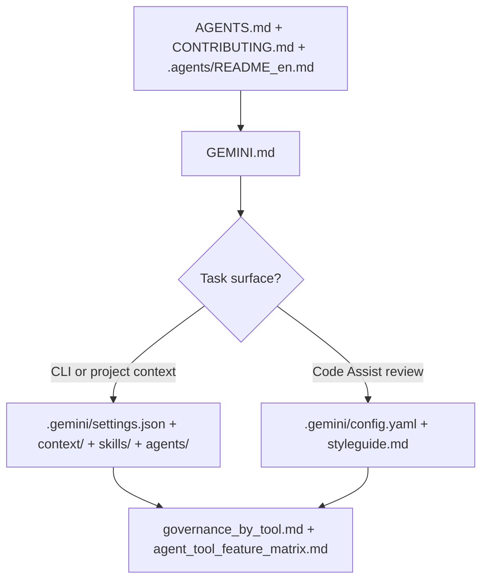

# GEMINI – Using Gemini in aiscr-management

<!-- aiscr:stop-anchor -->
**Entry scope**

- Stay on **`GEMINI.md`** and repo **`.gemini/`** surfaces for Gemini-specific behaviour first.
- Shared policy lives in **`AGENTS.md`** and the full generated rule readers under **`.cursor/rules/`**; Gemini rule files under **`.gemini/context/`** are stubs that link to those readers. Use **`governance_by_tool.md`** for the topic index.

Use this file when the session uses **Gemini CLI** and/or **Gemini Code Assist** with the workspace **`.gemini/`** tree and root **`GEMINI.md`** context. Shared governance is anchored in **`AGENTS.md`** with full generated readers under **`.cursor/rules/`** and Gemini stubs under **`.gemini/context/`**. Hub authoring remains under **`.agents/canonical_configs/governance_rules/`** on **aiscr-management**. Topic index: **`governance_by_tool.md`**. **`GEMINI.md`** is the Gemini-specific entry surface. **`agent_tool_feature_matrix.md`** and **`mandatory_vendor_doc_urls.toml`** map vendor paths and official doc links - do not duplicate long-form rules here.

**Cross-tool map (this hub):** `.agents/canonical_configs/references/agent_tool_feature_matrix.md`, `mandatory_vendor_doc_urls.toml`. **Ecosystem routing:** `.agents/canonical_configs/governance_rules/aiscr-ecosystem-governance.md`, `.agents/sync/README_en.md` - resolve from **`AGENTS.md`** when those paths are absent.

## Vendor behaviour — Gemini CLI ([geminicli.com/docs](https://geminicli.com/docs/))

**Project context:** Root **`GEMINI.md`** is the default project context file (hierarchical lookup toward the `.git` boundary; override via `context.fileName` in project **`settings.json`**). **Governance context:** **`.gemini/context/<stem>.md`** - generated stubs from **`.agents/canonical_configs/governance_rules/<stem>.md`** that keep the entry-scope marker, topic summary, and link to the full **`.cursor/rules/<stem>.mdc`** reader. Regenerate after canonical or stem changes with **`python .agents/scripts/generate_governance_rules.py`**. Loaded via **`context.includeDirectories`** in **`.gemini/settings.json`**. **Project config:** **`.gemini/settings.json`** (tools, sandbox, model, hooks, MCP, context). **Skills:** **`.gemini/skills/`** with `SKILL.md` stubs that link to full **`.cursor/skills/<slug>/SKILL.md`** readers. **Hooks:** Configured under `hooks` in **`settings.json`** ([Hooks](https://geminicli.com/docs/hooks/)); advisory parity with Cursor/Claude uses **`python .agents/scripts/gemini_cli_hooks.py`** (stdout JSON only, per vendor spec). **Subagents:** Built-in CLI subagents plus **project custom agents** as Markdown with YAML frontmatter under **`.gemini/agents/*.md`** ([Subagents](https://geminicli.com/docs/core/subagents/)); hub **`aiscr-*`** definitions are materialized from **`.agents/canonical_configs/agents/`** by **`python .agents/scripts/generate_agent_definitions.py`** (same slug set as Cursor/Claude/Codex). Persistent enable/disable and limits via **`agents.overrides`** in **`settings.json`**. **MCP:** `mcpServers` in **`settings.json`**. **Slash commands:** Built-in CLI commands ([docs home](https://geminicli.com/docs/)). **Exclusions:** **`.geminiignore`** (CLI). **User-level config:** `~/.gemini/settings.json`. **Source:** [Gemini CLI on GitHub](https://github.com/google-gemini/gemini-cli).

## Vendor behaviour — Gemini Code Assist ([developers.google.com/gemini-code-assist](https://developers.google.com/gemini-code-assist/docs/overview))

IDE assistance and a **GitHub PR review** service. **PR reviews:** Trigger with `/gemini` in PR comments. **Review config:** **`.gemini/config.yaml`** (severity, max comments, PR events, drafts, ignore patterns, etc.). **Review rules:** **`.gemini/styleguide.md`** (natural-language guidance). **IDE exclusions:** **`.aiexclude`**. See [Review repo code](https://developers.google.com/gemini-code-assist/docs/review-repo-code) and [Customize repo review](https://developers.google.com/gemini-code-assist/docs/customize-repo-review).

## Governance load order (this repository)

The load path below is a supporting aid; the numbered list stays normative.

1. **`AGENTS.md`**, **`CONTRIBUTING.md`**, **`.agents/README_en.md`**
2. **`GEMINI.md`** (this file)
3. Topic-specific canonical stems and assistant delivery surfaces listed in **`governance_by_tool.md`**

## Workspace boundary and safety config

**Authoritative:** **`AGENTS.md`** and **`.agents/canonical_configs/governance_rules/workspace-boundary-safety.md`**. Gemini still follows the same workspace boundary and config protection as other assistants (including not weakening sandbox or safety-related app config unless the user strictly orders it).

## Operating default

Run repo commands inside the assistant sandbox and the repository virtualenv when a repo venv exists. Prefer `.venv\Scripts\python.exe` on Windows or `.venv/bin/python` on Unix for this hub’s Python tooling. Do not commit secrets or paste production PII into prompts.

## Hub layout (this repository)

**`GEMINI.md`** - Committed at the **repo root** as a hub entry doc (see **`sync_policy.REPO_ROOT_HUB_ENTRY_DOCS`**). **`.gemini/`** - Committed at the **hub repo root** as the generated Gemini delivery surface; selected sibling copies are resolved by direct-bundle sync per **`.agents/sync/repos.toml`** / **`sync_policy.py`**. Regenerated or vendor-specific detail: **`.agents/scripts/README_en.md`**, **`config-sync.plan.md`**.

## Not covered here

Planning-first execution, rolling usage logging, ephemeral plan locations, branch/PR rules, and high-impact script policy are the same as for other assistants — see **`AGENTS.md`**, **`.agents/canonical_configs/governance_rules/planning-core.md`**, **`.agents/canonical_configs/governance_rules/usage-logging.md`**, and **`CONTRIBUTING.md`**.

## OpenSpec

OpenSpec is the repo's default requirement surface for migrated management workflows.

- `openspec/specs/` stores persistent capability specs.
- `openspec/changes/` stores change-scoped OpenSpec artifacts.
- `openspec/config.yaml` defines the repo-specific `governance-driven` schema.

Gemini-facing OpenSpec skills and commands are generated under `.gemini/skills/openspec-*/` and `.gemini/commands/opsx/`. Use `npx openspec validate --all` after editing OpenSpec artifacts. Planning approval, validation, and usage logging remain governed by `AGENTS.md` and the canonical rule stems.
