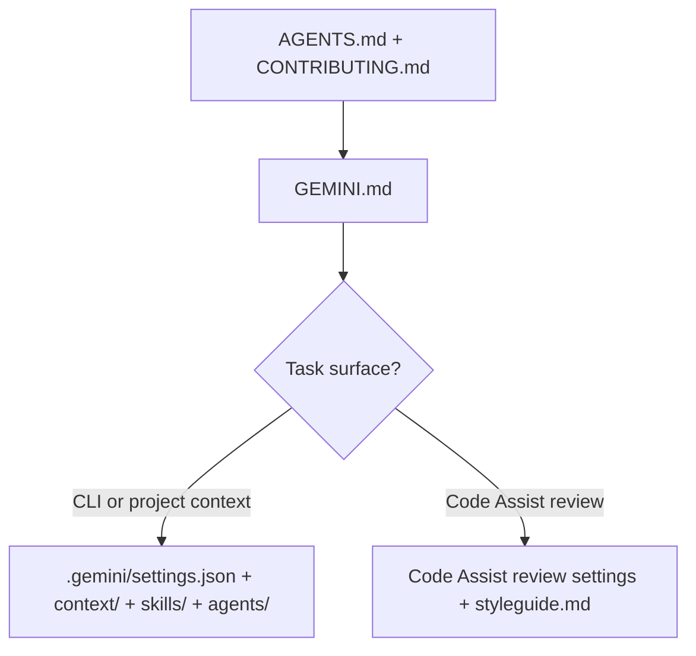

# GEMINI – Using Gemini in this AIS CR repository

<!-- aiscr:stop-anchor -->
**Entry scope**

- Stay on **`GEMINI.md`** and repo **`.gemini/`** surfaces for Gemini-specific behaviour first.
- Shared policy lives in **`AGENTS.md`**; the full generated rule readers are delivered under **`.gemini/context/`** (with **`.cursor/rules/`** as a cross-vendor mirror where present).

Use this file when the session uses **Gemini CLI** and/or **Gemini Code Assist** with the workspace **`.gemini/`** tree and root **`GEMINI.md`** context. Shared governance is anchored in **`AGENTS.md`** with delivered rule readers under **`.gemini/context/`**. These assistant surfaces are authored at the **`aiscr-management`** hub and delivered here by config sync; do not duplicate long-form rules in this file.

## Vendor behaviour — Gemini CLI ([geminicli.com/docs](https://geminicli.com/docs/))

**Project context:** Root **`GEMINI.md`** is the default project context file (hierarchical lookup toward the `.git` boundary; override via `context.fileName` in project **`settings.json`**). **Governance context:** **`.gemini/context/<stem>.md`** — delivered stubs that keep the entry-scope marker, topic summary, and link to the fuller reader; kept in sync from the `aiscr-management` hub. Loaded via **`context.includeDirectories`** in **`.gemini/settings.json`**. **Project config:** **`.gemini/settings.json`** (tools, sandbox, model, hooks, MCP, context). **Skills:** **`.gemini/skills/`** with `SKILL.md` stubs. **Hooks:** Configured under `hooks` in **`settings.json`** ([Hooks](https://geminicli.com/docs/hooks/)). **Subagents:** Built-in CLI subagents plus **project custom agents** as Markdown with YAML frontmatter under **`.gemini/agents/*.md`** ([Subagents](https://geminicli.com/docs/core/subagents/)). **MCP:** `mcpServers` in **`settings.json`**. **Slash commands:** Built-in CLI commands ([docs home](https://geminicli.com/docs/)). **Exclusions:** **`.geminiignore`** (CLI). **User-level config:** `~/.gemini/settings.json`. **Source:** [Gemini CLI on GitHub](https://github.com/google-gemini/gemini-cli).

## Vendor behaviour — Gemini Code Assist ([developers.google.com/gemini-code-assist](https://developers.google.com/gemini-code-assist/docs/overview))

IDE assistance and a **GitHub PR review** service. **PR reviews:** Trigger with `/gemini` in PR comments. Review configuration is optional and is not committed here unless maintainers deliberately add it. **Review rules:** **`.gemini/styleguide.md`** (natural-language guidance). **IDE exclusions:** **`.aiexclude`**. See [Review repo code](https://developers.google.com/gemini-code-assist/docs/review-repo-code) and [Customize repo review](https://developers.google.com/gemini-code-assist/docs/customize-repo-review).

## Governance load order

The load path below is a supporting aid; the numbered list stays normative.

1. **`AGENTS.md`**, **`CONTRIBUTING.md`**
2. **`GEMINI.md`** (this file)
3. Topic-specific delivered surfaces under **`.gemini/context/`**

## Workspace boundary and safety config

**Authoritative:** **`AGENTS.md`** and **`.gemini/context/aiscr-workspace-boundary-safety.md`**. Gemini still follows the same workspace boundary and config protection as other assistants (including not weakening sandbox or safety-related app config unless the user strictly orders it).

## Operating default

Run repo commands inside the assistant sandbox and the repository virtualenv
when a repo venv exists. Prefer `.venv\Scripts\python.exe` on Windows or
`.venv/bin/python` on Unix for this repo's Python tooling. Safety and
data-exposure rules are in `AGENTS.md` and the delivered rule readers.

## Not covered here

Planning-first execution, rolling usage logging, ephemeral plan locations, branch/PR rules, and high-impact script policy are the same as for other assistants — see **`AGENTS.md`**, the delivered rule readers under **`.gemini/context/`**, and **`CONTRIBUTING.md`**.

## Local OpenSpec entry points

Gemini-facing OpenSpec skills and commands are delivered under
`.gemini/skills/openspec-*/` and `.gemini/commands/opsx/`. Use
`npm run openspec:validate` after editing OpenSpec artifacts; shared OpenSpec
gating remains in the generated orientation below and the delivered rule
readers.

<!-- begin:generated:vendor-digest-core -->
<!-- generated by generate_governance_rules.py — do not edit manually -->

## AIS CR shared assistant orientation

This repository is part of the AIS CR ecosystem. The entry doc you are reading follows the same shared governance as every other assistant integration in this repository; this section is generated from one shared canonical body and is identical across the vendor entry docs. Entry scope (which surfaces to stay in first) is defined once in this document's preamble and is not repeated here.

### Cross-vendor map

Each product loads its own configuration tree; workflow slugs stay aligned across them:

| Product | Entry surfaces |
| --- | --- |
| Cursor | `.cursor/` (rules, skills, agents) |
| Claude Code | `CLAUDE.md` + `.claude/` |
| Codex | `CODEX.md` + `.codex/` |
| Gemini | `GEMINI.md` + `.gemini/` |
| GitHub Copilot | `.github/copilot-instructions.md` + `.github/` (instructions, prompts, skills) |

Cross into another vendor tree only for explicit parity checks, generator work, or governance maintenance.

### Shared governance kernel

`AGENTS.md` is the governance authority for AI agents in this repository; `CONTRIBUTING.md` owns the branch and PR workflow. The generated `agents-governance-kernel` block in `AGENTS.md` carries the current cross-vendor minimums for planning and approval, usage and model logging, script/sync/git approval, workspace and sibling boundaries, and hub authority.

The full rule bodies are delivered per assistant; the vendor section below says where this product reads them. This digest points to the shared kernel instead of restating it.

### Where workflows live

Standard `aiscr-*` workflows are authored at the `aiscr-management` hub and delivered per repository enrollment as per-vendor skill trees with matching slugs. Do not assume every workflow is mirrored in this repository; when an ecosystem-wide workflow (config sync, parity validation, registry maintenance) is needed, use the management hub.

### OpenSpec

- `openspec/specs/` stores persistent capability specs, `openspec/changes/` stores change-scoped artifacts, and `openspec/config.yaml` selects the repo schema.
- Mode-transfer gating iron law: `NEVER TREAT ARTIFACT COMPLETION AS IMPLICIT APPROVAL TO IMPLEMENT.` The explore → plan → implement boundaries each need fresh, phase-local human approval; after planning artifacts are complete, stop and offer apply instead of continuing silently.
- Validate OpenSpec artifacts after editing them (`npm run openspec:validate` where available).

### Secrets and boundaries

- Do not commit secrets, tokens, or API keys; do not paste production data or real PII into prompts; abstract or redact when demonstrating behaviour.
- Stay inside the opened workspace; out-of-workspace access needs an explicit user request and a plain statement of impact.
- Do not weaken sandbox, permission, or other safety-related assistant configuration unless the user strictly orders it.

<!-- end:generated:vendor-digest-core -->

<!-- begin:generated:vendor-digest-gemini -->
<!-- generated by generate_governance_rules.py — do not edit manually -->

## Gemini in this repository

### Gemini CLI ([geminicli.com/docs](https://geminicli.com/docs/))

**Project context:** root `GEMINI.md` is the default project context file (hierarchical lookup toward the `.git` boundary; override via `context.fileName` in project `settings.json`). **Governance context:** `.gemini/context/<stem>.md` — delivered rule readers loaded via `context.includeDirectories` in `.gemini/settings.json`. **Project config:** `.gemini/settings.json` (tools, sandbox, model, hooks, MCP, context). **Skills:** `.gemini/skills/` with `SKILL.md` stubs; OpenSpec entry points are delivered under `.gemini/skills/openspec-*/` and `.gemini/commands/opsx/` where enrolled. **Hooks:** configured under `hooks` in `settings.json` ([Hooks](https://geminicli.com/docs/hooks/)). **Subagents:** project custom agents as Markdown with YAML frontmatter under `.gemini/agents/*.md` ([Subagents](https://geminicli.com/docs/core/subagents/)). **MCP:** `mcpServers` in `settings.json`. **Exclusions:** `.geminiignore`. **User-level config:** `~/.gemini/settings.json`. **Source:** [Gemini CLI on GitHub](https://github.com/google-gemini/gemini-cli).

### Gemini Code Assist ([developers.google.com/gemini-code-assist](https://developers.google.com/gemini-code-assist/docs/overview))

IDE assistance and a GitHub PR review service. **PR reviews:** trigger with `/gemini` in PR comments. **Review rules:** `.gemini/styleguide.md` (natural-language guidance) is the committed, delivered review customization. Code Assist review settings (severity, max comments, PR events, drafts, ignore patterns) and IDE exclusions live in optional Code Assist files this repository does not commit — defaults apply until a maintainer adds them per Google's docs: [Review repo code](https://developers.google.com/gemini-code-assist/docs/review-repo-code) and [Customize repo review](https://developers.google.com/gemini-code-assist/docs/customize-repo-review).

### Governance load order (Gemini)

1. `AGENTS.md`, `CONTRIBUTING.md`
2. `GEMINI.md` (this file)
3. Topic-specific delivered rule readers under `.gemini/context/`

<!-- end:generated:vendor-digest-gemini -->
