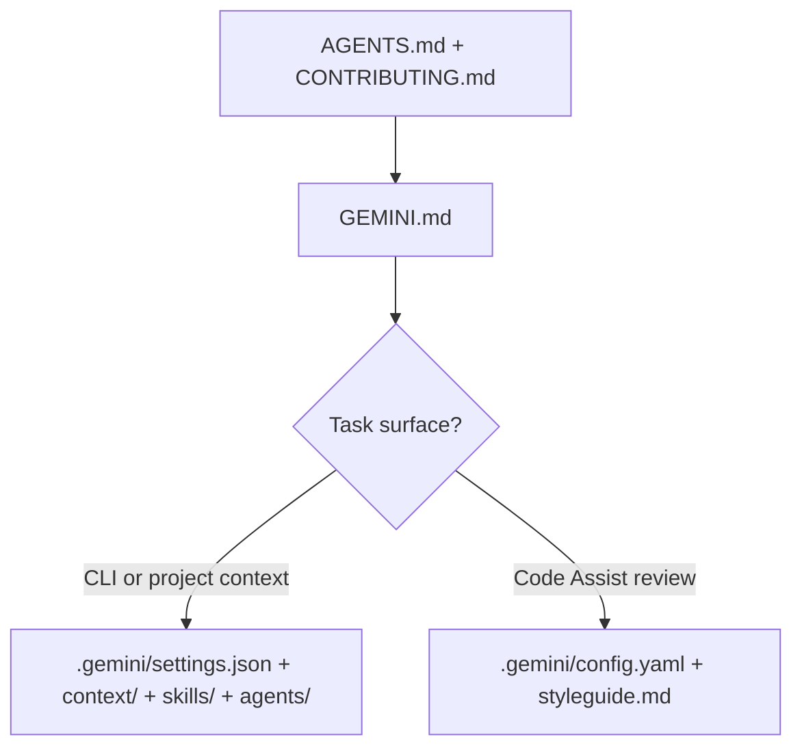

# GEMINI – Using Gemini in this AIS CR repository

<!-- aiscr:stop-anchor -->
**Entry scope**

- Stay on **`GEMINI.md`** and repo **`.gemini/`** surfaces for Gemini-specific behaviour first.
- Shared policy lives in **`AGENTS.md`**; the full generated rule readers are delivered under **`.gemini/context/`** (with **`.cursor/rules/`** as a cross-vendor mirror where present).

Use this file when the session uses **Gemini CLI** and/or **Gemini Code Assist** with the workspace **`.gemini/`** tree and root **`GEMINI.md`** context. Shared governance is anchored in **`AGENTS.md`** with delivered rule readers under **`.gemini/context/`**. These assistant surfaces are authored at the **`aiscr-management`** hub and delivered here by config sync; do not duplicate long-form rules in this file.

## Vendor behaviour — Gemini CLI ([geminicli.com/docs](https://geminicli.com/docs/))

**Project context:** Root **`GEMINI.md`** is the default project context file (hierarchical lookup toward the `.git` boundary; override via `context.fileName` in project **`settings.json`**). **Governance context:** **`.gemini/context/<stem>.md`** — delivered stubs that keep the entry-scope marker, topic summary, and link to the fuller reader; kept in sync from the `aiscr-management` hub. Loaded via **`context.includeDirectories`** in **`.gemini/settings.json`**. **Project config:** **`.gemini/settings.json`** (tools, sandbox, model, hooks, MCP, context). **Skills:** **`.gemini/skills/`** with `SKILL.md` stubs. **Hooks:** Configured under `hooks` in **`settings.json`** ([Hooks](https://geminicli.com/docs/hooks/)). **Subagents:** Built-in CLI subagents plus **project custom agents** as Markdown with YAML frontmatter under **`.gemini/agents/*.md`** ([Subagents](https://geminicli.com/docs/core/subagents/)). **MCP:** `mcpServers` in **`settings.json`**. **Slash commands:** Built-in CLI commands ([docs home](https://geminicli.com/docs/)). **Exclusions:** **`.geminiignore`** (CLI). **User-level config:** `~/.gemini/settings.json`. **Source:** [Gemini CLI on GitHub](https://github.com/google-gemini/gemini-cli).

## Vendor behaviour — Gemini Code Assist ([developers.google.com/gemini-code-assist](https://developers.google.com/gemini-code-assist/docs/overview))

IDE assistance and a **GitHub PR review** service. **PR reviews:** Trigger with `/gemini` in PR comments. **Review config:** **`.gemini/config.yaml`** (severity, max comments, PR events, drafts, ignore patterns, etc.). **Review rules:** **`.gemini/styleguide.md`** (natural-language guidance). **IDE exclusions:** **`.aiexclude`**. See [Review repo code](https://developers.google.com/gemini-code-assist/docs/review-repo-code) and [Customize repo review](https://developers.google.com/gemini-code-assist/docs/customize-repo-review).

## Governance load order

The load path below is a supporting aid; the numbered list stays normative.

1. **`AGENTS.md`**, **`CONTRIBUTING.md`**
2. **`GEMINI.md`** (this file)
3. Topic-specific delivered surfaces under **`.gemini/context/`**

## Workspace boundary and safety config

**Authoritative:** **`AGENTS.md`** and **`.gemini/context/aiscr-workspace-boundary-safety.md`**. Gemini still follows the same workspace boundary and config protection as other assistants (including not weakening sandbox or safety-related app config unless the user strictly orders it).

## Operating default

Run repo commands inside the assistant sandbox and the repository virtualenv when a repo venv exists. Prefer `.venv\Scripts\python.exe` on Windows or `.venv/bin/python` on Unix for this repo's Python tooling. Do not commit secrets or paste production PII into prompts.

## Not covered here

Planning-first execution, rolling usage logging, ephemeral plan locations, branch/PR rules, and high-impact script policy are the same as for other assistants — see **`AGENTS.md`**, the delivered rule readers under **`.gemini/context/`**, and **`CONTRIBUTING.md`**.

## OpenSpec

OpenSpec is the repo's default requirement surface for migrated management workflows.

- `openspec/specs/` stores persistent capability specs.
- `openspec/changes/` stores change-scoped OpenSpec artifacts.
- `openspec/config.yaml` defines the repo's schema.

Gemini-facing OpenSpec skills and commands are delivered under `.gemini/skills/openspec-*/` and `.gemini/commands/opsx/`. Use `npm run openspec:validate` after editing OpenSpec artifacts. Planning approval, validation, and usage logging remain governed by `AGENTS.md` and the delivered rule readers.

