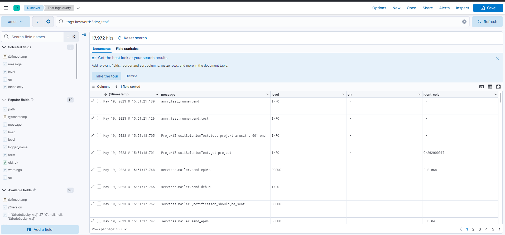
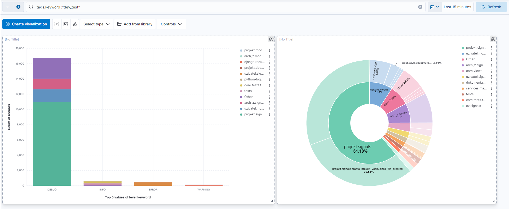

.. _automaticke-testy:

Automatické testy
=================

Ke spuštění testů slouží vývojový server (.24). Před spuštěním testů je nutné nasadit aktuální nebo požadovanou verzi aplikace WebAMČR.
To se provede pomocí skriptu ``./scripts/test_deploy.sh``. Skript se při spuštění také zeptá, zda má stáhnout aktuální verzi WebAMČR origin/dev.
Po nasazení verze je potřeba cca 5 minut počkat než se WebAMČR rozběhne
Testy je možné spustit následujícím příkazem 

::

./scripts/start_selenium_tests.sh

skript má následující parametry:
 * `-f`          Provede neúspěšné testy v tabulce 
 * `-a`          Provede všechny testy (výchozí)
 * `-t cislo`    Provede test zadaneho čísla
 * `-b`          Spustí všechny testy na pozadí, výstup se uloží do /opt/selenium_test/test.log a run.log
 * `-h`          Zobrazí nápovědu
  
Výsledky testů se uloží do /opt/selenium_test/results.xlsx. 

V tabulce se ukládá:
 * `index` Pořadové číslo testu
 * `date` Datum a čas provedení testu
 * `test name` Jméno testu
 * `result` Výsledek testu (OK, Fail nebo Error)

V  adresáři ``/opt/selenium_test/`` se ukládají také screenshoty každého testu.

**Pozn.** Pokud uživatel přeruší probíhající test, je potřeba před spuštěním nového testu počkat několik minut, než se ukonči Selenium.

Vyhodnocení výsledků testu
--------------------------

K vyhodnocení běhu testu slouží aplikace Kibana. V ní je připraven
pohled ``Test logs query`` (zobrazuje logové zprávy z půběhu testu).

Dále jsou k dispozici dashboardy ``Test Errors`` (zobrazuje chyby a
varování) a ``Test Overview`` (statistika chybových zpráv testu).

Požadované vlastnosti testovacího scénáře
-----------------------------------------

Požadované vlastnosti testovacího scénáře jsou následující (vychází z
článku `How to Write Test Cases in Software Testing with
Examples <https://www.guru99.com/test-case.html>`__:

-  testovací scénář by měl být jednoduchý a měl by testovat max. jednu
   stránku či jednu sadu funkcí,
-  testovací scénář musí být napsán a vytvořen z pohledu uživatele, tj.
   musí přesně simulovat kroky, které by prováděl uživatel, pokud by
   chtěl dosáhnout daného výsledku,
-  testy by se neměly překrývat,
-  u každého testu musí být specifikována alespoň jedna metrika
   úspěšnosti průběhu.

Postup vytvoření kódu testu
---------------------------

Pro scénář je třeba připravit sadu vstupních dat a kontrolní výstup.

Struktura popisu scénáře
------------------------

Popis scénáře by měl obsahovat následující:

-  ID scénáře,
-  stručný popis scénáře,
-  uživatelská role,
-  předpoklady pro průběh testu (pokud jsou),
-  uživatelské kroky, které scénář simuluje,
-  testovací data,
-  očekávané výsledky (tj. metriky, které oveřují úspěšný průběh testu).

Scénáře jsou seskupeny podle jednotlivých aplikací.

.. AUTO-GENERATED-SELENIUM-TESTS-START

.. (tuto část generuje pre-commit, neupravovat ručně)

Přehled testů
-------------

.. list-table::
   :widths: 5 9 12 24
   :header-rows: 1

   * - Test č.
     - Modul
     - Uživ. role
     - Název

   * - 001
     - core
     - | Archeolog
     -
       .. raw:: html
       
          <a class="reference internal" href="#selenium-test-core-001-test-001-p-ihl-en-do-am-r" title="Testuje přihlášení uživatele.">Přihlášení do AMČR</a>

   * - 002
     - projekt
     - | Archeolog
     -
       .. raw:: html
       
          <a class="reference internal" href="#selenium-test-projekt-002-test-002-otev-en-tabulky-projekty" title="Testuje tabulku s projekty. Ověřuje, zda funguje řazení podle">Otevření tabulky projekty</a>

   * - 003
     - projekt
     - | Archeolog
     -
       .. raw:: html
       
          <a class="reference internal" href="#selenium-test-projekt-003-test-003-zaps-n-projektu-pozitivn-sc-n-1" title="Test zapsání projektu na stránce ``/projekt/zapsat``. Test simuluje">Zapsání projektu (pozitivní scénář 1)</a>

   * - 006
     - projekt
     - | Archeolog
     -
       .. raw:: html
       
          <a class="reference internal" href="#selenium-test-projekt-006-test-006-schv-len-projektu-pozitivn-sc-n-1" title="Test schválení projektu">Schválení projektu (pozitivní scénář 1)</a>

   * - 007
     - projekt
     - | Archeolog
     -
       .. raw:: html
       
          <a class="reference internal" href="#selenium-test-projekt-007-test-007-zah-jen-v-zkumu-pozitivn-sc-n-1" title="Test zahájení výzkumu u projektu ve stavu P2 s pozitivním výsledkem. Měl by končit posunem projektu do stavu P3">Zahájení výzkumu (pozitivní scénář 1)</a>

   * - 008
     - projekt
     - | Archeolog
     -
       .. raw:: html
       
          <a class="reference internal" href="#selenium-test-projekt-008-test-008-ukon-en-v-zkumu-pozitivn-sc-n-1" title="Test ukončení výzkumu u projektu ve stavu P3 s pozitivním výsledkem. Měl by končit posunem projektu do stavu P4.">Ukončení výzkumu (pozitivní scénář 1)</a>

   * - 009
     - projekt
     - | Archeolog
     -
       .. raw:: html
       
          <a class="reference internal" href="#selenium-test-projekt-009-test-009-ukon-en-v-zkumu-negativn-sc-n-1" title="Test ukončení výzkumu u projektu ve stavu P3 s negativním výsledkem. Měl by končit neposunutím projektu do stavu P4.">Ukončení výzkumu (negativní scénář 1)</a>

   * - 010
     - projekt
     - | Archeolog
     -
       .. raw:: html
       
          <a class="reference internal" href="#selenium-test-projekt-010-test-010-uzav-en-projektu-pozitivn-sc-n-1" title="Test uzavření projektu ve stavu P4 s pozitivním výsledkem. Měl by končin posunem projektu do stavu P5.">Uzavření projektu (pozitivní scénář 1)</a>

   * - 011
     - projekt
     - | Archeolog
     -
       .. raw:: html
       
          <a class="reference internal" href="#selenium-test-projekt-011-test-011-uzav-en-projektu-negativn-sc-n-1" title="Test uzavření projektu ve stavu P4 s negativním výsledkem. Měl by končin neposunutím projektu do stavu P5.">Uzavření projektu (negativní scénář 1)</a>

   * - 012
     - projekt
     - | Archivář
     -
       .. raw:: html
       
          <a class="reference internal" href="#selenium-test-projekt-012-test-012-archivace-projektu-pozitivn-sc-n-1" title="Test archivace projektu ve stavu P5 s pozitivním výsledkem. Scénář končí pousnem projektu do stavu P6,">Archivace projektu (pozitivní scénář 1)</a>

   * - 013
     - projekt
     - | Archivář
     -
       .. raw:: html
       
          <a class="reference internal" href="#selenium-test-projekt-013-test-013-archivace-projektu-negativn-sc-n-1" title="Test archivace projektu ve stavu P5 s negativním výsledkem. Scénář končí nepousnutím projektu do stavu P6,">Archivace projektu (negativní scénář 1)</a>

   * - 014
     - projekt
     - | Archivář
     -
       .. raw:: html
       
          <a class="reference internal" href="#selenium-test-projekt-014-test-014-vr-cen-stavu-u-archivovan-ho-projektu-pozitiv" title="Test vrácení projektu do stavu P5 s pozitivním výsledkem. Scénář končí posunem do stavu P5.">Vrácení stavu u archivovaného projektu (pozitivní scénář 1)</a>

   * - 015
     - projekt
     - | Archivář
     -
       .. raw:: html
       
          <a class="reference internal" href="#selenium-test-projekt-015-test-015-vr-cen-stavu-u-uzav-en-ho-projektu-pozitivn-s" title="Test vrácení projektu do stavu P4 s pozitivním výsledkem. Scénář končí posunem do stavu P4.">Vrácení stavu u uzavřeného projektu (pozitivní scénář 2)</a>

   * - 016
     - projekt
     - | Archivář
     -
       .. raw:: html
       
          <a class="reference internal" href="#selenium-test-projekt-016-test-016-vr-cen-stavu-u-ukon-en-ho-projektu-pozitivn-s" title="Test vrácení projektu do stavu P3 s pozitivním výsledkem. Scénář končí posunem do stavu P3.">Vrácení stavu u ukončeného projektu (pozitivní scénář 3)</a>

   * - 017
     - projekt
     - | Archivář
     -
       .. raw:: html
       
          <a class="reference internal" href="#selenium-test-projekt-017-test-017-vr-cen-stavu-u-zah-jen-ho-projektu-pozitivn-s" title="Test vrácení projektu do stavu P2 s pozitivním výsledkem. Scénář končí posunem do stavu P2.">Vrácení stavu u zahájeného projektu (pozitivní scénář 4)</a>

   * - 018
     - projekt
     - | Archivář
     -
       .. raw:: html
       
          <a class="reference internal" href="#selenium-test-projekt-018-test-018-vr-cen-stavu-u-p-ihl-en-ho-projektu-pozitivn" title="Test vrácení projektu do stavu P2 s pozitivním výsledkem. Scénář končí posunem do stavu A1.">Vrácení stavu u přihlášeného projektu (pozitivní scénář 5)</a>

   * - 019
     - projekt
     - | Archivář
     -
       .. raw:: html
       
          <a class="reference internal" href="#selenium-test-projekt-019-test-019-navr-en-zru-en-projektu-pozitivn-sc-n-1" title="Test navržení zrušení projektu s pozitivním výsledkem. Scénář končí posunem projektu do stavu A7.">Navržení zrušení projektu (pozitivní scénář 1)</a>

   * - 020
     - projekt
     - | Archivář
     -
       .. raw:: html
       
          <a class="reference internal" href="#selenium-test-projekt-020-test-020-navr-en-zru-en-projektu-pozitivn-sc-n-2" title="Test navržení zrušení projektu s pozitivním výsledkem. Scénář končí posunem projektu do stavu A7.">Navržení zrušení projektu (pozitivní scénář 2)</a>

   * - 021
     - projekt
     - | Archivář
     -
       .. raw:: html
       
          <a class="reference internal" href="#selenium-test-projekt-021-test-021-navr-en-zru-en-projektu-negativn-sc-n-1" title="Test navržení zrušení projektu s negativním výsledkem. Scénář končí neposunutím projektu do stavu A7.">Navržení zrušení projektu (negativní scénář 1)</a>

   * - 022
     - projekt
     - | Archivář
     -
       .. raw:: html
       
          <a class="reference internal" href="#selenium-test-projekt-022-test-022-zru-en-projektu-pozitivn-sc-n-1" title="Test zrušení projektu s pozitivním výsledkem. Scénář končí posunem projektu do stavu A8">Zrušení projektu (pozitivní scénář 1)</a>

   * - 023
     - projekt
     - | Archeolog
     -
       .. raw:: html
       
          <a class="reference internal" href="#selenium-test-projekt-023-test-023-vytvo-en-projektov-akce-pozitivn-sc-n-1" title="Test vytvoření projektové akce. Scénář končí vytvořením projektové akce ve stavu A1.">Vytvoření projektové akce (pozitivní scénář 1)</a>

   * - 024
     - arch_z
     - | Archeolog
     -
       .. raw:: html
       
          <a class="reference internal" href="#selenium-test-arch-z-024-test-024-p-id-n-dokumenta-n-jednotky-celek-akce-pozitiv" title="Test vytvoření dokumentační jednotky typu celek akce u projektové akce ve stavu A1. Scénář končí vytvořením dokumenta...">Přidání dokumentační jednotky celek akce (pozitivní scénář 1)</a>

   * - 025
     - pas
     - | Badatel
     -
       .. raw:: html
       
          <a class="reference internal" href="#selenium-test-pas-025-test-025-zaps-n-samostatn-ho-n-lezu-pozitivn-sc-n-1" title="Test zapsání samostatného nálezu na stránce /pas/zapsat. Končí zapsáním samostatného nálezu do databáze.">Zapsání samostatného nálezu (pozitivní scénář 1)</a>

   * - 026
     - pas
     - | Badatel
     -
       .. raw:: html
       
          <a class="reference internal" href="#selenium-test-pas-026-test-026-zaps-n-samostatn-ho-n-lezu-negativn-sc-n-1" title="Test zapsání samostatného nálezu na stránce /pas/zapsat. Test simuluje zadání nevalidních dat a měl by končit nezapsá...">Zapsání samostatného nálezu (negativní scénář 1)</a>

   * - 027
     - oznameni
     - | \-
     -
       .. raw:: html
       
          <a class="reference internal" href="#selenium-test-oznameni-027-test-027-proces-ozn-men-projektu-pozitivn-sc-n-1" title="Oznámení projektu stavebníkem">Proces oznámení projektu (pozitivní scénář 1)</a>

   * - 028
     - pas
     - | Badatel
     -
       .. raw:: html
       
          <a class="reference internal" href="#selenium-test-pas-028-test-028-odesl-n-samostatn-ho-n-lezu-pozitivn-sc-n-1" title="Test odeslání samostatného nálezu ve stavu SN1 na stránce /pas/detail. Měl by končit odesláním samostatného nálezu a ...">Odeslání samostatného nálezu (pozitivní scénář 1)</a>

   * - 029
     - pas
     - | Badatel
     -
       .. raw:: html
       
          <a class="reference internal" href="#selenium-test-pas-029-test-029-odesl-n-samostatn-ho-n-lezu-negativn-sc-n-1" title="Test odeslání samostatného nálezu ve stavu SN1 na stránce /pas/detail. Test simuluje zadání nevalidních dat a měl by ...">Odeslání samostatného nálezu (negativní scénář 1)</a>

   * - 030
     - pas
     - | Archeolog
     -
       .. raw:: html
       
          <a class="reference internal" href="#selenium-test-pas-030-test-030-potvrzen-samostatn-ho-n-lezu-pozitivn-sc-n-1" title="Test odeslání samostatného nálezu ve stavu SN2 na stránce /pas/detail. Měl by končit potvrzením samostatného nálezu a...">Potvrzení samostatného nálezu (pozitivní scénář 1)</a>

   * - 031
     - pas
     - | Archeolog
     -
       .. raw:: html
       
          <a class="reference internal" href="#selenium-test-pas-031-test-031-potvrzen-samostatn-ho-n-lezu-negativn-sc-n-1" title="Test potvrzení samostatného nálezu ve stavu SN2 na stránce /pas/detail. Test simuluje zadání nevalidních dat a měl by...">Potvrzení samostatného nálezu (negativní scénář 1)</a>

   * - 032
     - pas
     - | Archeolog
     -
       .. raw:: html
       
          <a class="reference internal" href="#selenium-test-pas-032-test-032-potvrzen-samostatn-ho-n-lezu-negativn-sc-n-2" title="Test potvrzení samostatného nálezu ve stavu SN2 na stránce /pas/detail. Test simuluje zadání nevalidních dat a měl by...">Potvrzení samostatného nálezu (negativní scénář 2)</a>

   * - 034
     - arch_z
     - | Archeolog
     -
       .. raw:: html
       
          <a class="reference internal" href="#selenium-test-arch-z-034-test-034-p-id-n-dokumenta-n-jednotky-celek-akce-negativ" title="Test vytvoření dokumentační jednotky typu celek akce u projektové akce ve stavu A1. Scénář končí nevytvořením dokumen...">Přidání dokumentační jednotky celek akce (negativní scénář 1)</a>

   * - 035
     - arch_z
     - | Archeolog
     -
       .. raw:: html
       
          <a class="reference internal" href="#selenium-test-arch-z-035-test-035-p-id-n-dokumenta-n-jednotky-st-akce-pozitivn-s" title="Test vytvoření dokumentační jednotky typu část akce u projektové akce ve stavu A1. Scénář končí vytvořením dokumentač...">Přidání dokumentační jednotky část akce (pozitivní scénář 2)</a>

   * - 036
     - arch_z
     - | Archeolog
     -
       .. raw:: html
       
          <a class="reference internal" href="#selenium-test-arch-z-036-test-036-p-id-n-dokumenta-n-jednotky-st-akce-negativn-s" title="Test vytvoření dokumentační jednotky typu část akce u projektové akce ve stavu A1. Scénář končí nevytvořením dokument...">Přidání dokumentační jednotky část akce (negativní scénář 2)</a>

   * - 037
     - arch_z
     - | Archeolog
     -
       .. raw:: html
       
          <a class="reference internal" href="#selenium-test-arch-z-037-test-037-p-id-n-komponenty-k-dokumenta-n-jednotce-celek" title="Test vytvoření komponenty u dokumentační jednotky typu celek akce u projektové akce ve stavu A1. Scénář končí vytvoře...">Přidání komponenty k dokumentační jednotce celek akce (pozitivní scénář 1)</a>

   * - 038
     - pas
     - | Archivář
     -
       .. raw:: html
       
          <a class="reference internal" href="#selenium-test-pas-038-test-038-archivace-samostatn-ho-n-lezu-pozitivn-sc-n-1" title="Test archivace samostatného nálezu ve stavu SN3 na stránce /pas/detail. Měl by končit potvrzením samostatného nálezu ...">Archivace samostatného nálezu (pozitivní scénář 1)</a>

   * - 039
     - pas
     - | Archivář
     -
       .. raw:: html
       
          <a class="reference internal" href="#selenium-test-pas-039-test-039-archivace-samostatn-ho-n-lezu-negativn-sc-n-1" title="Test archivace samostatného nálezu ve stavu SN3 na stránce /pas/detail. Test simuluje zadání nevalidních dat a měl by...">Archivace samostatného nálezu (negativní scénář 1)</a>

   * - 040
     - arch_z
     - | Archeolog
     -
       .. raw:: html
       
          <a class="reference internal" href="#selenium-test-arch-z-040-test-040-p-id-n-komponenty-k-dokumenta-n-jednotce-celek" title="Test vytvoření komponenty u dokumentační jednotky typu celek akce u projektové akce ve stavu A1. Scénář končí nevytvo...">Přidání komponenty k dokumentační jednotce celek akce (negativní scénář 1)</a>

   * - 041
     - arch_z
     - | Archeolog
     -
       .. raw:: html
       
          <a class="reference internal" href="#selenium-test-arch-z-041-test-041-p-id-n-objektu-k-pozitivn-komponent-pozitivn-s" title="Test vytvoření objektu u komponenty připojené k dokumentační jednotce projektové akce. Scénář končí vytvořením objekt...">Přidání objektu k pozitivní komponentě (pozitivní scénář 1)</a>

   * - 042
     - arch_z
     - | Archeolog
     -
       .. raw:: html
       
          <a class="reference internal" href="#selenium-test-arch-z-042-test-042-p-id-n-p-edm-tu-k-pozitivn-komponent-pozitivn" title="Test vytvoření předmětu u komponenty připojené k dokumentační jednotce projektové akce. Scénář končí vytvořením předm...">Přidání předmětu k pozitivní komponentě (pozitivní scénář 1)</a>

   * - 043
     - arch_z
     - | Archeolog
     -
       .. raw:: html
       
          <a class="reference internal" href="#selenium-test-arch-z-043-test-043-smaz-n-objektu-u-projektov-akce-pozitivn-sc-n" title="Test smazání objektu u komponenty připojené k dokumentační jednotce projektové akce. Scénář končí smazáním objektu.">Smazání objektu u projektové akce (pozitivní scénář 1)</a>

   * - 044
     - arch_z
     - | Archeolog
     -
       .. raw:: html
       
          <a class="reference internal" href="#selenium-test-arch-z-044-test-044-smaz-n-p-edm-tu-u-projektov-akce-pozitivn-sc-n" title="Test smazání předmětu u komponenty připojené k dokumentační jednotce projektové akce. Scénář končí smazáním předmětu.">Smazání předmětu u projektové akce (pozitivní scénář 1)</a>

   * - 045
     - pas
     - | Archivář
     -
       .. raw:: html
       
          <a class="reference internal" href="#selenium-test-pas-045-test-045-vr-cen-samostatn-ho-n-lezu-pozitivn-sc-n-1" title="Test vrácení samostatného nálezu ve stavu SN3 na stránce /pas/detail. Měl by končit vrácením samostatného nálezu a zm...">Vrácení samostatného nálezu (pozitivní scénář 1)</a>

   * - 046
     - arch_z
     - | Badatel
     -
       .. raw:: html
       
          <a class="reference internal" href="#selenium-test-arch-z-046-test-046-vytvo-en-samostan-akce-pozitivn-sc-n-1" title="Test vytvoření samostatné akce. Scénář končí vytvořením samostatné akce akce ve stavu A1.">Vytvoření samostané akce (pozitivní scénář 1)</a>

   * - 047
     - arch_z
     - | Badatel
     -
       .. raw:: html
       
          <a class="reference internal" href="#selenium-test-arch-z-047-test-047-vytvo-en-samostatn-akce-negativn-sc-n-1" title="Test vytvoření samostatné akce. Scénář nekončí vytvořením samostatné akce ve stavu A1.">Vytvoření samostatné akce (negativní scénář 1)</a>

   * - 048
     - arch_z
     - | Badatel
     -
       .. raw:: html
       
          <a class="reference internal" href="#selenium-test-arch-z-048-test-048-p-id-n-dokumenta-n-jednotky-celek-akce-pozitiv" title="Test vytvoření dokumentační jednotky typu celek akce u samostané akce ve stavu A1. Scénář končí vytvořením dokumentač...">Přidání dokumentační jednotky celek akce (pozitivní scénář 1)</a>

   * - 049
     - arch_z
     - | Badatel
     -
       .. raw:: html
       
          <a class="reference internal" href="#selenium-test-arch-z-049-test-049-p-id-n-dokumenta-n-jednotky-celek-akce-negativ" title="Test vytvoření dokumentační jednotky typu celek akce u samostatné akce ve stavu A1. Scénář nekončí vytvořením dokumen...">Přidání dokumentační jednotky “Celek akce” (negativní scénář 1)</a>

   * - 050
     - arch_z
     - | Badatel
     -
       .. raw:: html
       
          <a class="reference internal" href="#selenium-test-arch-z-050-test-050-p-id-n-komponenty-k-dj-u-samostatn-akce-poziti" title="Test vytvoření komponenty k DJ u samostatné akce ve stavu A1. Scénář    končí vytvořením komponenty K01.">Přidání komponenty k DJ u samostatné akce (pozitivní scénář 1)</a>

   * - 051
     - lokalita
     - | Archeolog
     -
       .. raw:: html
       
          <a class="reference internal" href="#selenium-test-lokalita-051-test-051-zaps-n-lokality-pozitivn-sc-n-1" title="Test zapsání lokality na stránce /arch-z/lokalita/zapsat. Končí zapsáním lokality do databáze.">Zapsání lokality (pozitivní scénář 1)</a>

   * - 052
     - lokalita
     - | Archeolog
     -
       .. raw:: html
       
          <a class="reference internal" href="#selenium-test-lokalita-052-test-052-zaps-n-lokality-negativn-sc-n-1" title="Test zapsání lokality na stránce /arch-z/lokalita/zapsat. Nekončí zapsáním lokality do databáze.">Zapsání lokality (negativní scénář 1)</a>

   * - 053
     - lokalita
     - | Archeolog
     -
       .. raw:: html
       
          <a class="reference internal" href="#selenium-test-lokalita-053-test-053-p-id-n-dokumenta-n-jednotky-lokalita-pozitiv" title="Test vytvoření dokumentační jednotky typu lokalita u lokalita ve stavu L1. Scénář končí vytvořením dokumentační jedno...">Přidání dokumentační jednotky lokalita (pozitivní scénář 1)</a>

   * - 054
     - lokalita
     - | Archeolog
     -
       .. raw:: html
       
          <a class="reference internal" href="#selenium-test-lokalita-054-test-054-p-id-n-dokumenta-n-jednotky-lokalita-negativ" title="Test vytvoření dokumentační jednotky typu lokalita u lokalita ve stavu L1. Scénář nekončí vytvořením dokumentační jed...">Přidání dokumentační jednotky lokalita (negativní scénář 1)</a>

   * - 055
     - lokalita
     - | Archeolog
     -
       .. raw:: html
       
          <a class="reference internal" href="#selenium-test-lokalita-055-test-055-p-id-n-komponenty-k-dokumenta-n-jednotce-lok" title="Test vytvoření komponenty u dokumentační jednotky typu lokalita u lokality ve stavu L1. Scénář končí vytvořením kompo...">Přidání komponenty k dokumentační jednotce lokalita (pozitivní scénář 1)</a>

   * - 056
     - lokalita
     - | Archeolog
     -
       .. raw:: html
       
          <a class="reference internal" href="#selenium-test-lokalita-056-test-056-odesl-n-lokality-pozitivn-sc-n-1" title="Test odeslání lokality ve stavu L1 na stránce /arch-z/lokalita/detail. Měl by končit odesláním lokality a změnou jeho...">Odeslání lokality (pozitivní scénář 1)</a>

   * - 057
     - lokalita
     - | Badatel
     -
       .. raw:: html
       
          <a class="reference internal" href="#selenium-test-lokalita-057-test-057-odesl-n-dokumentu-negativn-sc-n-1" title="Test odeslání dokumentu ve stavu D1 na stránce /dokument/detail/. Měl by končit neúspěšným odesláním dokumentu a jeho...">Odeslání dokumentu (negativní scénář 1)</a>

   * - 058
     - lokalita
     - | Archivář
     -
       .. raw:: html
       
          <a class="reference internal" href="#selenium-test-lokalita-058-test-058-archivace-lokality-pozitivn-sc-n-1" title="Test archivace lokality ve stavu L2 na stránce /arch-z/lokalita/detail. Měl by končit archivací lokality a změnou jeh...">Archivace lokality (pozitivní scénář 1)</a>

   * - 059
     - lokalita
     - | Archivář
     -
       .. raw:: html
       
          <a class="reference internal" href="#selenium-test-lokalita-059-test-059-archivace-lokality-negativn-sc-n-1" title="Test archivace lokality ve stavu L2 na stránce /arch-z/lokalita/detail. Měl by končit ponecháním lokality ve stavu L2.">Archivace lokality (negativní scénář 1)</a>

   * - 060
     - lokalita
     - | Archivář
     -
       .. raw:: html
       
          <a class="reference internal" href="#selenium-test-lokalita-060-test-060-vr-cen-odeslan-lokality-pozitivn-sc-n-1" title="Test vrácení lokality ve stavu L2 na stránce /arch-z/lokalita/detail. Měl by končit vrácením lokality a změnou jejího...">Vrácení odeslané lokality (pozitivní scénář 1)</a>

   * - 061
     - lokalita
     - | Archivář
     -
       .. raw:: html
       
          <a class="reference internal" href="#selenium-test-lokalita-061-test-061-vr-cen-odeslan-lokality-negativn-sc-n-1" title="Test vrácení lokality ve stavu L2 na stránce /arch-z/lokalita/detail. Měl by končit neúspěšným vrácením a ponecháním ...">Vrácení odeslané lokality (negativní scénář 1)</a>

   * - 062
     - lokalita
     - | Archivář
     -
       .. raw:: html
       
          <a class="reference internal" href="#selenium-test-lokalita-062-test-062-vr-cen-archivovan-lokality-pozitivn-sc-n-1" title="Test vrácení lokality ve stavu L3 na stránce /arch-z/lokalita/detail. Měl by končit vrácením lokality a změnou jejího...">Vrácení archivované lokality (pozitivní scénář 1)</a>

   * - 063
     - lokalita
     - | Archivář
     -
       .. raw:: html
       
          <a class="reference internal" href="#selenium-test-lokalita-063-test-063-vr-cen-archivovan-lokality-negativn-sc-n-1" title="Test vrácení lokality ve stavu L3 na stránce /arch-z/lokalita/detail. Měl by končit neúspěšným vrácením a ponecháním ...">Vrácení archivované lokality (negativní scénář 1)</a>

   * - 064
     - dokument
     - | Badatel
     -
       .. raw:: html
       
          <a class="reference internal" href="#selenium-test-dokument-064-test-064-zaps-n-dokumentu-pozitivn-sc-n-1" title="Test zapsání dokumentu na stránce /dokument/zapsat. Končí zapsáním dokumentu do databáze.">Zapsání dokumentu (pozitivní scénář 1)</a>

   * - 065
     - dokument
     - | Badatel
     -
       .. raw:: html
       
          <a class="reference internal" href="#selenium-test-dokument-065-test-065-zaps-n-dokumentu-negativn-sc-n-1" title="Test zapsání dokumentu na stránce /dokument/zapsat. Končí neúspěšným zapsáním dokumentu do databáze.">Zapsání dokumentu (negativní scénář 1)</a>

   * - 066
     - dokument
     - | Badatel
     -
       .. raw:: html
       
          <a class="reference internal" href="#selenium-test-dokument-066-test-066-odesl-n-dokumentu-pozitivn-sc-n-1" title="Test odeslání dokumentu ve stavu D1 na stránce /dokument/detail/. Měl by končit úspěšným odesláním dokumentu a jeho p...">Odeslání dokumentu (pozitivní scénář 1)</a>

   * - 067
     - dokument
     - | Badatel
     -
       .. raw:: html
       
          <a class="reference internal" href="#selenium-test-dokument-067-test-067-odesl-n-dokumentu-negativn-sc-n-1" title="Test odeslání dokumentu ve stavu D1 na stránce /dokument/detail/. Měl by končit neúspěšným odesláním dokumentu a jeho...">Odeslání dokumentu (negativní scénář 1)</a>

   * - 068
     - dokument
     - | Archivář
     -
       .. raw:: html
       
          <a class="reference internal" href="#selenium-test-dokument-068-test-068-archivace-dokumentu-pozitivn-sc-n-1" title="Test archivace dokumentu ve stavu D2 na stránce /dokument/detail/. Měl by končit archivací dokumentu a změnou jeho st...">Archivace dokumentu (pozitivní scénář 1)</a>

   * - 069
     - dokument
     - | Archivář
     -
       .. raw:: html
       
          <a class="reference internal" href="#selenium-test-dokument-069-test-069-archivace-dokumentu-negativn-sc-n-1" title="Test archivace dokumentu ve stavu D2 na stránce /dokument/detail/. Měl by končit neúspěšnou archivací dokumentu a jeh...">Archivace dokumentu (negativní scénář 1)</a>

   * - 070
     - dokument
     - | Archivář
     -
       .. raw:: html
       
          <a class="reference internal" href="#selenium-test-dokument-070-test-070-vr-cen-odeslan-ho-dokumentu-pozitivn-sc-n-1" title="Test vrácení dokumentu ve stavu D2 na stránce /dokument/detail. Měl by končit vrácením dokumentu a změnou jeho stavu ...">Vrácení odeslaného dokumentu (pozitivní scénář 1)</a>

   * - 071
     - dokument
     - | Archivář
     -
       .. raw:: html
       
          <a class="reference internal" href="#selenium-test-dokument-071-test-071-vr-cen-odeslan-ho-dokumentu-negativn-sc-n-1" title="Test vrácení dokumentu ve stavu D2 na stránce /dokument/detail. Měl by končit neúspěšným vrácením a ponecháním dokume...">Vrácení odeslaného dokumentu (negativní scénář 1)</a>

   * - 072
     - dokument
     - | Archivář
     -
       .. raw:: html
       
          <a class="reference internal" href="#selenium-test-dokument-072-test-072-vr-cen-archivovan-ho-dokumentu-pozitivn-sc-n" title="Test vrácení dokumentu ve stavu D3 na stránce /dokument/detail. Měl by končit vrácením dokumentu a změnou jeho stavu ...">Vrácení archivovaného dokumentu (pozitivní scénář 1)</a>

   * - 073
     - dokument
     - | Archivář
     -
       .. raw:: html
       
          <a class="reference internal" href="#selenium-test-dokument-073-test-073-vr-cen-archivovan-ho-dokumentu-negativn-sc-n" title="Test vrácení dokumentu ve stavu D3 na stránce /dokument/detail. Měl by končit neúspěšným vrácením a ponecháním dokume...">Vrácení archivovaného dokumentu (negativní scénář 1)</a>

   * - 074
     - arch_z
     - | Badatel
     -
       .. raw:: html
       
          <a class="reference internal" href="#selenium-test-arch-z-074-test-074-p-id-n-komponenty-k-dj-u-samostatn-akce-negati" title="Test vytvoření komponenty k DJ u samostatné akce ve stavu A1. Scénář nekončí vytvořením komponenty.">Přidání komponenty k DJ u samostatné akce (negativní scénář 1)</a>

   * - 075
     - arch_z
     - | Badatel
     -
       .. raw:: html
       
          <a class="reference internal" href="#selenium-test-arch-z-075-test-075-p-id-n-objektu-k-pozitivn-komponent-pozitivn-s" title="Test vytvoření objektu u komponenty připojené k dokumentační jednotce samostatné akce. Scénář končí vytvořením objekt...">Přidání objektu k pozitivní komponentě (pozitivní scénář 1)</a>

   * - 076
     - arch_z
     - | Badatel
     -
       .. raw:: html
       
          <a class="reference internal" href="#selenium-test-arch-z-076-test-076-p-id-n-p-edm-tu-k-pozitivn-komponent-pozitivn" title="Test vytvoření předmětu u komponenty připojené k dokumentační jednotce samostatné akce. Scénář končí vytvořením předm...">Přidání předmětu k pozitivní komponentě (pozitivní scénář 1)</a>

   * - 077
     - arch_z
     - | Badatel
     -
       .. raw:: html
       
          <a class="reference internal" href="#selenium-test-arch-z-077-test-077-smaz-n-objektu-u-samostatn-akce-pozitivn-sc-n" title="Test smazání objektu u komponenty připojené k dokumentační jednotce samostatné akce. Scénář končí smazáním objektu.">Smazání objektu u samostatné akce (pozitivní scénář 1)</a>

   * - 078
     - arch_z
     - | Badatel
     -
       .. raw:: html
       
          <a class="reference internal" href="#selenium-test-arch-z-078-test-078-smaz-n-p-edm-tu-u-samostatn-akce-pozitivn-sc-n" title="Test smazání předmětu u komponenty připojené k dokumentační jednotce samostatné akce. Scénář končí smazáním předmětu.">Smazání předmětu u samostatné akce (pozitivní scénář 1)</a>

   * - 079
     - arch_z
     - | Archeolog
     -
       .. raw:: html
       
          <a class="reference internal" href="#selenium-test-arch-z-079-test-079-p-id-n-dokumentu-pozitivn-sc-n-1" title="Test přidání dokumentu k projektové akci. Scénář končí vytvořením záznamu dokumentu a jeho připojením k projektové akci.">Přidání dokumentu (pozitivní scénář 1)</a>

   * - 080
     - arch_z
     - | Archeolog
     -
       .. raw:: html
       
          <a class="reference internal" href="#selenium-test-arch-z-080-test-080-p-ipojen-existuj-c-ho-dokumentu-pozitivn-sc-n" title="Test připojení existujícího dokumentu k projektové akci. Scénář končí vytvořením vazby mezi dokumentem a projektovou ...">Připojení existujícího dokumentu (pozitivní scénář 1)</a>

   * - 081
     - arch_z
     - | Archeolog
     -
       .. raw:: html
       
          <a class="reference internal" href="#selenium-test-arch-z-081-test-081-p-ipojen-existuj-c-ho-dokumentu-z-projektu-poz" title="Test připojení existujícího dokumentu z projektu k projektové akci. Scénář končí vytvořením vazby mezi dokumentem a p...">Připojení existujícího dokumentu z projektu (pozitivní scénář 1)</a>

   * - 082
     - arch_z
     - | Badatel
     -
       .. raw:: html
       
          <a class="reference internal" href="#selenium-test-arch-z-082-test-082-p-id-n-dokumentu-k-samostatn-akci-pozitivn-sc" title="Test přidání dokumentu k samostatné akci. Scénář končí vytvořením záznamu dokumentu a jeho připojením k samostatné akci.">Přidání dokumentu k samostatné akci (pozitivní scénář 1)</a>

   * - 083
     - arch_z
     - | Badatel
     -
       .. raw:: html
       
          <a class="reference internal" href="#selenium-test-arch-z-083-test-083-p-ipojen-existuj-c-ho-dokumentu-k-samostatn-ak" title="Test připojení existujícího dokumentu k samostatné akci.Scénář končí vytvořením vazby mezi dokumentem a samostatnou a...">Připojení existujícího dokumentu k samostatné akci (pozitivní scénář 1)</a>

   * - 084
     - arch_z
     - | Archeolog
     -
       .. raw:: html
       
          <a class="reference internal" href="#selenium-test-arch-z-084-test-084-p-ipojen-extern-ho-zdroje-k-projektov-akci-poz" title="Test připojení externího zdroje k projektové akci. Scénář končí vytvořením vazby mezi samostatnou akcí a externím zdr...">Připojení externího zdroje k projektové akci (pozitivní scénář 1)</a>

   * - 085
     - arch_z
     - | Badatel
     -
       .. raw:: html
       
          <a class="reference internal" href="#selenium-test-arch-z-085-test-085-p-ipojen-extern-ho-zdroje-k-samostatn-akci-poz" title="Test připojení externího zdroje k samostatné akci..Scénář končí vytvořením vazby mezi samostatnou akcí a externím zdr...">Připojení externího zdroje k samostatné akci (pozitivní scénář 1)</a>

   * - 086
     - arch_z
     - | Archeolog
     -
       .. raw:: html
       
          <a class="reference internal" href="#selenium-test-arch-z-086-test-086-vytvo-en-pian-u-projektov-akce-pozitivn-sc-n-1" title="Test vytvoření PIAN k projektové akci.Scénář končí vytvořením nového PIAN připojeného k DJ 01 u projektové akce.">Vytvoření PIAN u projektové akce (pozitivní scénář 1)</a>

   * - 087
     - arch_z
     - | Archeolog
     -
       .. raw:: html
       
          <a class="reference internal" href="#selenium-test-arch-z-087-test-087-editace-pian-u-projektov-akce-pozitivn-sc-n-1" title="Test editace PIAN u projektové akci. Scénář končí novu geometrií PIAN u dokumentační jednotky DJ 01 u projektové akce.">Editace PIAN u projektové akce (pozitivní scénář 1)</a>

   * - 088
     - arch_z
     - | Archeolog
     -
       .. raw:: html
       
          <a class="reference internal" href="#selenium-test-arch-z-088-test-088-smaz-n-pian-u-projektov-akce-pozitivn-sc-n-1" title="Test smazání PIAN u projektové akci. Scénář končí smazáním nepotvrzeného PIAN u dokumentační jednotky D01 u projektov...">Smazání PIAN u projektové akce (pozitivní scénář 1)</a>

   * - 089
     - arch_z
     - | Archeolog
     -
       .. raw:: html
       
          <a class="reference internal" href="#selenium-test-arch-z-089-test-089-p-ipojen-pian-z-mapy-u-projektov-akce-pozitivn" title="Test připojení PIAN z mapy u projektové akci. Scénář končí připojením existujícího PIAN k dokumentační jednotce D01 u...">Připojení PIAN z mapy u projektové akce (pozitivní scénář 1)</a>

   * - 090
     - arch_z
     - | Archeolog
     -
       .. raw:: html
       
          <a class="reference internal" href="#selenium-test-arch-z-090-test-090-odpojen-potvrzen-ho-pian-u-projektov-akce-pozi" title="Test odpojení potvrzeného PIAN projektové akci. Scénář končí odpojením existujícího PIAN od dokumentační jednotky D01...">Odpojení potvrzeného PIAN u projektové akce (pozitivní scénář 1)</a>

   * - 091
     - arch_z
     - | Archeolog
     -
       .. raw:: html
       
          <a class="reference internal" href="#selenium-test-arch-z-091-test-091-import-pian-k-projektov-akci-pozitivn-sc-n-1" title="Test importu PIAN k projektové akci. Scénář končí vytvořením PIAN u dokumentační jednotky D01 u projektové akce.">Import PIAN k projektové akci (pozitivní scénář 1)</a>

   * - 092
     - arch_z
     - | Archeolog
     -
       .. raw:: html
       
          <a class="reference internal" href="#selenium-test-arch-z-092-test-092-editace-pian-k-projektov-akci-importem-pozitiv" title="Test editace PIAN k projektové akci importem. Scénář končí upraveným PIAN u dokumentační jednotky D01 u projektové akce.">Editace PIAN k projektové akci importem (pozitivní scénář 1)</a>

   * - 093
     - arch_z
     - | Archivář
     -
       .. raw:: html
       
          <a class="reference internal" href="#selenium-test-arch-z-093-test-093-p-ipojen-pian-k-projektov-akci-podle-id-poziti" title="Test připojení PIAN k projektové akci podel ID. Scénář končí připojením PIAN podle ID u dokumentační jednotky D01 u p...">Připojení PIAN k projektové akci podle ID (pozitivní scénář 1)</a>

   * - 094
     - arch_z
     - | Archeolog
     -
       .. raw:: html
       
          <a class="reference internal" href="#selenium-test-arch-z-094-test-094-smaz-n-komponenty-u-projektov-akce-pozitivn-sc" title="Test smazání komponenty u projektové akce. Scénář končí smazáním komponenty K001 u dokumentační jednotky D01 u projek...">Smazání komponenty u projektové akce (pozitivní scénář 1)</a>

   * - 095
     - arch_z
     - | Archeolog
     -
       .. raw:: html
       
          <a class="reference internal" href="#selenium-test-arch-z-095-test-095-smaz-n-dokumenta-n-jednotky-u-projektov-akce-p" title="Test smazání dokumentační jednotky u projektové akce. Scénář končí smazáním dokumentační jednotky D01 u projektové akce.">Smazání dokumentační jednotky u projektové akce (pozitivní scénář 1)</a>

   * - 096
     - arch_z
     - | Badatel
     -
       .. raw:: html
       
          <a class="reference internal" href="#selenium-test-arch-z-096-test-096-vytvo-en-pian-u-samostatn-akce-pozitivn-sc-n-1" title="Test vytvoření PIAN k samostatné akci.Scénář končí vytvořením nového PIAN připojeného k DJ D01 u samostatné akce.">Vytvoření PIAN u samostatné akce (pozitivní scénář 1)</a>

   * - 097
     - arch_z
     - | Badatel
     -
       .. raw:: html
       
          <a class="reference internal" href="#selenium-test-arch-z-097-test-097-editace-pian-u-samostatn-akce-pozitivn-sc-n-1" title="Test editace PIAN u samostatné akce. Scénář končí novou geometrií PIAN u dokumentační jednotky D01 u samostatné akce.">Editace PIAN u samostatné akce (pozitivní scénář 1)</a>

   * - 098
     - arch_z
     - | Badatel
     -
       .. raw:: html
       
          <a class="reference internal" href="#selenium-test-arch-z-098-test-098-editace-pian-k-samostatn-akci-importem-pozitiv" title="Test editace PIAN k samostatné akci importem. Scénář končí upraveným PIAN u dokumentační jednotky D01 u samostatné akce.">Editace PIAN k samostatné akci importem (pozitivní scénář 1)</a>

   * - 099
     - arch_z
     - | Badatel
     -
       .. raw:: html
       
          <a class="reference internal" href="#selenium-test-arch-z-099-test-099-import-pian-k-samostatn-akci-pozitivn-sc-n-1" title="Test importu PIAN k samostatné akci. Scénář končí vytvořením PIAN u dokumentační jednotky D01 u samostatné akce.">Import PIAN k samostatné akci (pozitivní scénář 1)</a>

   * - 100
     - arch_z
     - | Badatel
     -
       .. raw:: html
       
          <a class="reference internal" href="#selenium-test-arch-z-100-test-100-odpojen-potvrzen-ho-pian-u-samostatn-akce-pozi" title="Test odpojení potvrzeného PIAN u samostatné akce. Scénář končí odpojením existujícího PIAN od dokumentační jednotky D...">Odpojení potvrzeného PIAN u samostatné akce (pozitivní scénář 1)</a>

   * - 101
     - arch_z
     - | Badatel
     -
       .. raw:: html
       
          <a class="reference internal" href="#selenium-test-arch-z-101-test-101-smaz-n-pian-u-samostatn-akce-pozitivn-sc-n-1" title="Test smazání PIAN u samostatné akce. Scénář končí smazáním nepotvrzeného PIAN u dokumentační jednotky D01 u samostatn...">Smazání PIAN u samostatné akce (pozitivní scénář 1)</a>

   * - 102
     - arch_z
     - | Archivář
     -
       .. raw:: html
       
          <a class="reference internal" href="#selenium-test-arch-z-102-test-102-archivace-projektov-akce-pozitivn-sc-n-1" title="Test archivace projektové akce. Scénář končí posunem projektové akce ze stavu A2 do stavu A3.">Archivace projektové akce (pozitivní scénář 1)</a>

   * - 103
     - arch_z
     - | Archivář
     -
       .. raw:: html
       
          <a class="reference internal" href="#selenium-test-arch-z-103-test-103-archivace-samostatn-akce-pozitivn-sc-n-1" title="Test archivace samostatné akce. Scénář končí posunem projektové akce ze stavu A2 do stavu A3.">Archivace samostatné akce (pozitivní scénář 1)</a>

   * - 104
     - dokument
     - | Archeolog
     -
       .. raw:: html
       
          <a class="reference internal" href="#selenium-test-dokument-104-test-104-z-pis-z-znamu-do-knihovny-3d-pozitivn-sc-n-1" title="Test zápisu nového záznamu do Knihovny 3D. Scénář končí vytvořením nového záznamu v Knihovně 3D.">Zápis záznamu do knihovny 3D (pozitivní scénář 1)</a>

   * - 105
     - dokument
     - | Archeolog
     -
       .. raw:: html
       
          <a class="reference internal" href="#selenium-test-dokument-105-test-105-odesl-n-z-znamu-do-knihovny-3d-pozitivn-sc-n" title="Test odeslání záznamu do Knihovny 3D. Scénář končí posunem záznamu ze stavu D1 do stavu D2.">Odeslání záznamu do knihovny 3D (pozitivní scénář 1)</a>

   * - 106
     - dokument
     - | Archeolog
     -
       .. raw:: html
       
          <a class="reference internal" href="#selenium-test-dokument-106-test-106-p-id-n-objektu-k-z-znamu-v-knihovn-3d-poziti" title="Test přidání objektu k záznamu v Knihovně 3D. Scénář končí přidání objektu k záznamu v Knihovně 3D - v databázi je o ...">Přidání objektu k záznamu v Knihovně 3D (pozitivní scénář 1)</a>

   * - 107
     - dokument
     - | Archeolog
     -
       .. raw:: html
       
          <a class="reference internal" href="#selenium-test-dokument-107-test-107-p-id-n-p-edm-tu-k-z-znamu-v-knihovn-3d-pozit" title="Test přidání objektu k záznamu v Knihovně 3D. Scénář končí přidáním předmětu k záznamu v Knihovně 3D - v databázi je ...">Přidání předmětu k záznamu v Knihovně 3D (pozitivní scénář 1)</a>

   * - 108
     - dokument
     - | Archeolog
     -
       .. raw:: html
       
          <a class="reference internal" href="#selenium-test-dokument-108-test-108-p-id-n-prostorov-ho-vymezen-k-z-znamu-v-knih" title="Test přidání prostorového vymezení k záznamu v Knihovně 3D.">Přidání prostorového vymezení k záznamu v Knihovně 3D (pozitivní scénář 1)</a>

   * - 109
     - dokument
     - | Archeolog
     -
       .. raw:: html
       
          <a class="reference internal" href="#selenium-test-dokument-109-test-109-p-id-n-souboru-k-z-znamu-v-knihovn-3d-poziti" title="Test přidání souboru k záznamu v Knihovně 3D.">Přidání souboru k záznamu v Knihovně 3D (pozitivní scénář 1)</a>

   * - 110
     - dokument
     - | Archivář
     -
       .. raw:: html
       
          <a class="reference internal" href="#selenium-test-dokument-110-test-110-archivace-z-znamu-v-knihovn-3d-pozitivn-sc-n" title="Test archivace záznamu v Knihovně 3D. Test končí posunem záznamu ze stavu D2 do D3.">Archivace záznamu v Knihovně 3D (pozitivní scénář 1)</a>

   * - 111
     - dokument
     - | Badatel
     -
       .. raw:: html
       
          <a class="reference internal" href="#selenium-test-dokument-111-test-111-z-pis-z-znamu-do-knihovny-3d-pozitivn-sc-n-2" title="Test zápisu nového záznamu do Knihovny 3D. Scénář končí vytvořením nového záznamu v Knihovně 3D.">Zápis záznamu do knihovny 3D (pozitivní scénář 2)</a>

   * - 112
     - dokument
     - | Badatel
     -
       .. raw:: html
       
          <a class="reference internal" href="#selenium-test-dokument-112-test-112-odesl-n-z-znamu-do-knihovny-3d-pozitivn-sc-n" title="Test odeslání záznamu do Knihovny 3D. Scénář končí posunem záznamu ze stavu D1 do stavu D2.">Odeslání záznamu do knihovny 3D (pozitivní scénář 2)</a>

   * - 113
     - dokument
     - | Badatel
     -
       .. raw:: html
       
          <a class="reference internal" href="#selenium-test-dokument-113-test-113-p-id-n-objektu-k-z-znamu-v-knihovn-3d-poziti" title="Test přidání objektu k záznamu v Knihovně 3D. Scénář končí přidání objektu k záznamu v Knihovně 3D - v databázi je o ...">Přidání objektu k záznamu v Knihovně 3D (pozitivní scénář 2)</a>

   * - 114
     - dokument
     - | Badatel
     -
       .. raw:: html
       
          <a class="reference internal" href="#selenium-test-dokument-114-test-114-p-id-n-p-edm-tu-k-z-znamu-v-knihovn-3d-pozit" title="Test přidání objektu k záznamu v Knihovně 3D. Scénář končí přidáním předmětu k záznamu v Knihovně 3D - v databázi je ...">Přidání předmětu k záznamu v Knihovně 3D (pozitivní scénář 2)</a>

   * - 115
     - dokument
     - | Badatel
     -
       .. raw:: html
       
          <a class="reference internal" href="#selenium-test-dokument-115-test-115-p-id-n-prostorov-ho-vymezen-k-z-znamu-v-knih" title="Test přidání prostorového vymezení k záznamu v Knihovně 3D.">Přidání prostorového vymezení k záznamu v Knihovně 3D (pozitivní scénář 2)</a>

   * - 116
     - dokument
     - | Badatel
     -
       .. raw:: html
       
          <a class="reference internal" href="#selenium-test-dokument-116-test-116-p-id-n-souboru-k-z-znamu-v-knihovn-3d-poziti" title="Test přidání souboru k záznamu v Knihovně 3D.">Přidání souboru k záznamu v Knihovně 3D (pozitivní scénář 2)</a>

   * - 117
     - ez
     - | Archeolog
     -
       .. raw:: html
       
          <a class="reference internal" href="#selenium-test-ez-117-test-117-z-ps-n-nov-ho-extern-ho-zdroje-typu-kniha-pozitivn" title="Test zapsání externího zdroje na stránce /ext-zdroj/zapsat. Končí zapsáním externího zdroje do databáze.">Zápsání nového externího zdroje typu kniha (pozitivní scénář 1)</a>

   * - 118
     - ez
     - | Archeolog
     -
       .. raw:: html
       
          <a class="reference internal" href="#selenium-test-ez-118-test-118-odesl-n-z-znamu-extern-zdroj-pozitivn-sc-n-1" title="Test odeslání záznamu Externí zdroj. Scénář končí posunem záznamu ze stavu EZ1 do stavu EZ2.">Odeslání záznamu Externí zdroj (pozitivní scénář 1)</a>

   * - 119
     - ez
     - | Archeolog
     -
       .. raw:: html
       
          <a class="reference internal" href="#selenium-test-ez-119-test-119-p-ipojen-akce-k-extern-mu-zdroji-pozitivn-sc-n-1" title="Test připojení záznamu Akce k záznamu Externí zdroj. Scénář končí vytvořením vazby mezi záznamy.">Připojení akce k externímu zdroji (pozitivní scénář 1)</a>

   * - 120
     - ez
     - | Archeolog
     -
       .. raw:: html
       
          <a class="reference internal" href="#selenium-test-ez-120-test-120-p-ipojen-lokality-k-extern-mu-zdroji-pozitivn-sc-n" title="Test připojení záznamu Akce k záznamu Externí zdroj. Scénář končí vytvořením vazby mezi záznamy.">Připojení lokality k externímu zdroji (pozitivní scénář 1)</a>

   * - 121
     - ez
     - | Archivář
     -
       .. raw:: html
       
          <a class="reference internal" href="#selenium-test-ez-121-test-121-potvrzen-extern-ho-zdroje-pozitivn-sc-n-1" title="Test potvrzení záznamu v modulu Externí zdroje. Test končí posunem záznamu ze stavu EZ2 do EZ3.">Potvrzení externího zdroje (pozitivní scénář 1)</a>

   * - 122
     - ez
     - | Badatel
     -
       .. raw:: html
       
          <a class="reference internal" href="#selenium-test-ez-122-test-122-zaps-n-nov-ho-extern-ho-zdroje-pozitivn-sc-n-2" title="Test zapsání externího zdroje na stránce /ext-zdroj/zapsat. Končí zapsáním externího zdroje do databáze.">Zapsání nového externího zdroje (pozitivní scénář 2)</a>

   * - 123
     - ez
     - | Badatel
     -
       .. raw:: html
       
          <a class="reference internal" href="#selenium-test-ez-123-test-123-odesl-n-z-znamu-extern-zdroj-pozitivn-sc-n-1" title="Test odeslání záznamu Externí zdroj. Scénář končí posunem záznamu ze stavu EZ1 do stavu EZ2.">Odeslání záznamu Externí zdroj (pozitivní scénář 1)</a>

   * - 124
     - ez
     - | Archeolog
     -
       .. raw:: html
       
          <a class="reference internal" href="#selenium-test-ez-124-test-124-z-ps-n-nov-ho-extern-ho-zdroje-typu-st-knihy-pozit" title="Test zapsání externího zdroje na stránce /ext-zdroj/zapsat. Končí zapsáním externího zdroje do databáze.">Zápsání nového externího zdroje typu část knihy (pozitivní scénář 3)</a>

   * - 125
     - ez
     - | Archeolog
     -
       .. raw:: html
       
          <a class="reference internal" href="#selenium-test-ez-125-test-125-zaps-n-nov-ho-extern-ho-zdroje-typu-l-nek-v-asopis" title="Test zapsání externího zdroje na stránce /ext-zdroj/zapsat. Končí zapsáním externího zdroje do databáze.">Zapsání nového externího zdroje typu článek v časopise (pozitivní scénář 4)</a>

   * - 126
     - ez
     - | Archeolog
     -
       .. raw:: html
       
          <a class="reference internal" href="#selenium-test-ez-126-test-126-zaps-n-nov-ho-extern-ho-zdroje-typu-l-nek-v-novin" title="Test zapsání externího zdroje na stránce /ext-zdroj/zapsat. Končí zapsáním externího zdroje do databáze.">Zapsání nového externího zdroje typu článek v novinách (pozitivní scénář 5)</a>

   * - 127
     - ez
     - | Archeolog
     -
       .. raw:: html
       
          <a class="reference internal" href="#selenium-test-ez-127-test-127-zaps-n-nov-ho-extern-ho-zdroje-typu-jin-zdroj-pozi" title="Test zapsání externího zdroje na stránce /ext-zdroj/zapsat. Končí zapsáním externího zdroje do databáze.">Zapsání nového externího zdroje typu jiný zdroj (pozitivní scénář 6)</a>

   * - 128
     - ez
     - | Badatel
     -
       .. raw:: html
       
          <a class="reference internal" href="#selenium-test-ez-128-test-128-z-ps-n-nov-ho-extern-ho-zdroje-typu-st-knihy-pozit" title="Test zapsání externího zdroje na stránce /ext-zdroj/zapsat. Končí zapsáním externího zdroje do databáze.">Zápsání nového externího zdroje typu část knihy (pozitivní scénář 7)</a>

   * - 129
     - ez
     - | Badatel
     -
       .. raw:: html
       
          <a class="reference internal" href="#selenium-test-ez-129-test-129-zaps-n-nov-ho-extern-ho-zdroje-typu-l-nek-v-asopis" title="Test zapsání externího zdroje na stránce /ext-zdroj/zapsat. Končí zapsáním externího zdroje do databáze.">Zapsání nového externího zdroje typu článek v časopise (pozitivní scénář 8)</a>

   * - 130
     - ez
     - | Badatel
     -
       .. raw:: html
       
          <a class="reference internal" href="#selenium-test-ez-130-test-130-zaps-n-nov-ho-extern-ho-zdroje-typu-l-nek-v-novin" title="Test zapsání externího zdroje na stránce /ext-zdroj/zapsat. Končí zapsáním externího zdroje do databáze.">Zapsání nového externího zdroje typu článek v novinách (pozitivní scénář 9)</a>

   * - 131
     - ez
     - | Badatel
     -
       .. raw:: html
       
          <a class="reference internal" href="#selenium-test-ez-131-test-131-zaps-n-nov-ho-extern-ho-zdroje-typu-jin-zdroj-pozi" title="Test zapsání externího zdroje na stránce /ext-zdroj/zapsat. Končí zapsáním externího zdroje do databáze.">Zapsání nového externího zdroje typu jiný zdroj (pozitivní scénář 10)</a>

   * - 132
     - dokument
     - | Archeolog
     -
       .. raw:: html
       
          <a class="reference internal" href="#selenium-test-dokument-132-test-132-zaps-n-dokumentu-pozitivn-sc-n-2" title="Test zapsání dokumentu na stránce /dokument/zapsat. Končí zapsáním dokumentu do databáze.">Zapsání dokumentu (pozitivní scénář 2)</a>

   * - 133
     - dokument
     - | Archeolog
     -
       .. raw:: html
       
          <a class="reference internal" href="#selenium-test-dokument-133-test-133-zaps-n-dokumentu-negativn-sc-n-2" title="Test zapsání dokumentu na stránce /dokument/zapsat. Končí neúspěšným zapsáním dokumentu do databáze.">Zapsání dokumentu (negativní scénář 2)</a>

   * - 134
     - dokument
     - | Archeolog
     -
       .. raw:: html
       
          <a class="reference internal" href="#selenium-test-dokument-134-test-134-odesl-n-dokumentu-pozitivn-sc-n-2" title="Test odeslání dokumentu ve stavu D1 na stránce /dokument/detail/. Měl by končit úspěšným odesláním dokumentu a jeho p...">Odeslání dokumentu (pozitivní scénář 2)</a>

   * - 135
     - dokument
     - | Archeolog
     -
       .. raw:: html
       
          <a class="reference internal" href="#selenium-test-dokument-135-test-135-odesl-n-dokumentu-negativn-sc-n-2" title="Test odeslání dokumentu ve stavu D1 na stránce /dokument/detail/. Měl by končit neúspěšným odesláním dokumentu a jeho...">Odeslání dokumentu (negativní scénář 2)</a>

   * - 136
     - ez
     - | Archeolog
       | Archivář
     -
       .. raw:: html
       
          <a class="reference internal" href="#selenium-test-ez-136-test-136-test-fedory-pro-ez-pozitivn-sc-n-1" title="Test zapsání dat do Fedory v EZ">Test Fedory pro EZ (pozitivní scénář 1)</a>

   * - 137
     - ez
     - | Archeolog
     -
       .. raw:: html
       
          <a class="reference internal" href="#selenium-test-ez-137-test-137-test-fedory-pro-ez-pozitivn-sc-n-2" title="Test zapsání dat do Fedory v EZ">Test Fedory pro EZ (pozitivní scénář 2)</a>

   * - 138
     - arch_z
     - | Badatel
       | Archivář
     -
       .. raw:: html
       
          <a class="reference internal" href="#selenium-test-arch-z-138-test-138-test-fedory-pro-samostatne-akce-pozitivn-sc-n" title="Test Fedory pro Samostatne akce">Test Fedory pro Samostatne akce (pozitivní scénář 1)</a>

   * - 139
     - arch_z
     - | Archivář
     -
       .. raw:: html
       
          <a class="reference internal" href="#selenium-test-arch-z-139-test-139-test-fedory-pro-pian-adb-vyskovy-bod-pozitivn" title="">Test Fedory pro PIAN, ADB, vyskovy bod (pozitivní scénář 1)</a>

   * - 140
     - arch_z
     - | Archivář
     -
       .. raw:: html
       
          <a class="reference internal" href="#selenium-test-arch-z-140-test-140-test-fedory-pro-adb-pozitivn-sc-n-1" title="">Test Fedory pro ADB (pozitivní scénář 1)</a>

   * - 141
     - dokument
     - | Archivář
     -
       .. raw:: html
       
          <a class="reference internal" href="#selenium-test-dokument-141-test-141-test-fedory-pro-dokument-pozitivn-sc-n-1" title="">Test Fedory pro Dokument (pozitivní scénář 1)</a>

   * - 142
     - dokument
     - | Administrator
     -
       .. raw:: html
       
          <a class="reference internal" href="#selenium-test-dokument-142-test-142-test-fedory-pro-let-pozitivn-sc-n-1" title="">Test Fedory pro LET (pozitivní scénář 1)</a>

   * - 143
     - lokalita
     - | Archivář
     -
       .. raw:: html
       
          <a class="reference internal" href="#selenium-test-lokalita-143-test-143-test-fedory-pro-lokalitu-pozitivn-sc-n-1" title="">Test Fedory pro lokalitu (pozitivní scénář 1)</a>

   * - 144
     - dokument
     - | Archivář
     -
       .. raw:: html
       
          <a class="reference internal" href="#selenium-test-dokument-144-test-144-test-fedory-pro-3d-dokumenty-pozitivn-sc-n-1" title="">Test Fedory pro 3D dokumenty (pozitivní scénář 1)</a>

   * - 145
     - projekt
     - | Archivář
     -
       .. raw:: html
       
          <a class="reference internal" href="#selenium-test-projekt-145-test-145-test-fedory-pro-projekty-pozitivn-sc-n-1" title="Test zapsání dat do Fedory v projektech">Test Fedory pro projekty (pozitivní scénář 1)</a>

   * - 146
     - projekt
     - | Archivář
       | Administrator
     -
       .. raw:: html
       
          <a class="reference internal" href="#selenium-test-projekt-146-test-146-test-fedory-pro-projekty-pozitivn-sc-n-2" title="test zapsání dat do Fedory v projektech">Test Fedory pro projekty (pozitivní scénář 2)</a>

   * - 147
     - pas
     - | Badatel
       | Archivář
     -
       .. raw:: html
       
          <a class="reference internal" href="#selenium-test-pas-147-test-147-test-fedory-pas-pozitivn-sc-n-1" title="">Test Fedory PAS (pozitivní scénář 1)</a>

   * - 148
     - uzivatel
     - | Administrator
     -
       .. raw:: html
       
          <a class="reference internal" href="#selenium-test-uzivatel-148-test-148-test-fedory-pro-u-ivatele-pozitivn-sc-n-1" title="">Test Fedory pro uživatele (pozitivní scénář 1)</a>

   * - 149
     - uzivatel
     - | Badatel
       | Archeolog
     -
       .. raw:: html
       
          <a class="reference internal" href="#selenium-test-uzivatel-149-test-149-test-fedory-pro-u-ivatele-pozitivn-sc-n-2" title="">Test Fedory pro uživatele (pozitivní scénář 2)</a>

   * - 150
     - uzivatel
     - | Badatel
       | Archeolog
     -
       .. raw:: html
       
          <a class="reference internal" href="#selenium-test-uzivatel-150-test-150-test-fedory-pro-spolupr-ci-pas-pozitivn-sc-n" title="">Test Fedory pro spolupráci PAS (pozitivní scénář 1)</a>

   * - 151
     - heslar
     - | Administrator
     -
       .. raw:: html
       
          <a class="reference internal" href="#selenium-test-heslar-151-test-151-test-fedory-pro-hesl-e-pozitivn-sc-n-1" title="">Test Fedory pro hesláře (pozitivní scénář 1)</a>

   * - 152
     - uzivatel
     - | Administrator
     -
       .. raw:: html
       
          <a class="reference internal" href="#selenium-test-uzivatel-152-test-152-test-fedory-pro-organizaci-pozitivn-sc-n-1" title="">Test Fedory pro organizaci (pozitivní scénář 1)</a>

   * - 153
     - uzivatel
     - | Administrator
     -
       .. raw:: html
       
          <a class="reference internal" href="#selenium-test-uzivatel-153-test-153-test-fedory-pro-osobu-pozitivn-sc-n-1" title="">Test Fedory pro osobu (pozitivní scénář 1)</a>

   * - 154
     - pas
     - | Badatel
       | Archeolog
     -
       .. raw:: html
       
          <a class="reference internal" href="#selenium-test-pas-154-test-154-zobrazebn-spolupr-ce-badatel-archeolog-pozitivn-s" title="Test  &quot;Badatel&quot; vidí jen své spolupráce a &quot;Archeolog&quot; vidí jen spolupráce své organizace">Zobrazební spolupráce Badatel - Archeolog (pozitivní scénář 1)</a>

Arch Z
------

.. _selenium-test-arch-z-024-test-024-p-id-n-dokumenta-n-jednotky-celek-akce-pozitiv:

Test 024 Přidání dokumentační jednotky celek akce (pozitivní scénář 1)
~~~~~~~~~~~~~~~~~~~~~~~~~~~~~~~~~~~~~~~~~~~~~~~~~~~~~~~~~~~~~~~~~~~~~~

Test vytvoření dokumentační jednotky typu celek akce u projektové akce ve stavu A1. Scénář končí vytvořením dokumentační jednotky D01 typu celek akce.

Uživatelská role
^^^^^^^^^^^^^^^^

Archeolog

Předpoklady
^^^^^^^^^^^

- Uživatel je přihlášen.
- Projekt je ve stavu P3
- Projekt obsahuje projektovou akci ve stavu A1, která nemá žádnou dokumentační jednotku.

Testovací data
^^^^^^^^^^^^^^

- typ: celek akce
- negativni_jednotka : Ano

Uživatelské kroky
^^^^^^^^^^^^^^^^^

- Uživatel se přihlásí
- Uživatel otevře projekt ve stavu P3 (viz předpoklady)
- Projekty → Vybrat → Filtr → ID obsahuje „C-202110946“ → Vybrat → otevřít projekt
- Uživatel otevře akci ve stavu A1 (C-202110946A).
- Kliknout na tlačítko “Přidat dokumentační jednotku”
- Zvolit typ DJ “celek akce”
- Zvolit typ Negativní jednotka “ano”
- Kliknout na “uložit”

Očekávané výsledky
^^^^^^^^^^^^^^^^^^

- U akce bude vytvořena DJ typu “celek akce” (v databázi je o jednu DJ více).

Stav testu
^^^^^^^^^^

Implementován v
``webclient.arch_z.tests.test_selenium.AkceProjektoveAkce.test_024_pridani_dokumentacni_jednotky_p_001``.

.. _selenium-test-arch-z-034-test-034-p-id-n-dokumenta-n-jednotky-celek-akce-negativ:

Test 034 Přidání dokumentační jednotky celek akce (negativní scénář 1)
~~~~~~~~~~~~~~~~~~~~~~~~~~~~~~~~~~~~~~~~~~~~~~~~~~~~~~~~~~~~~~~~~~~~~~

Test vytvoření dokumentační jednotky typu celek akce u projektové akce ve stavu A1. Scénář končí nevytvořením dokumentační jednotky D01 typu celek akce.

Uživatelská role
^^^^^^^^^^^^^^^^

Archeolog

Předpoklady
^^^^^^^^^^^

- Uživatel je přihlášen.
- Projekt je ve stavu P3
- Projekt obsahuje projektovou akci ve stavu A1, která nemá žádnou dokumentační jednotku.

Testovací data
^^^^^^^^^^^^^^

Akce C-202401502A

Uživatelské kroky
^^^^^^^^^^^^^^^^^

- Uživatel se přihlásí
- Uživatel otevře projekt ve stavu P3 (číslo projektu)
- Projekty → Vybrat → Filtr → ID obsahuje „číslo projektu“ → Vybrat → otevřít projekt
- Uživatel otevře akci ve stavu A1 (číslo akce).
- Kliknout na tlačítko “Přidat dokumentační jednotku”
- Zvolit typ DJ - ponechat nevyplněno
- Zvolit typ Negativní jednotka “ano”
- Kliknout na “uložit změny”

Očekávané výsledky
^^^^^^^^^^^^^^^^^^

-  U akce nebude vytvořena DJ typu “celek akce” (v databázi není o jednu DJ více).

Stav testu
^^^^^^^^^^

Implementován v
``webclient.arch_z.tests.test_selenium.AkceProjektoveAkce.test_034_pridani_dokumentacni_jednotky_n_001``.

.. _selenium-test-arch-z-035-test-035-p-id-n-dokumenta-n-jednotky-st-akce-pozitivn-s:

Test 035 Přidání dokumentační jednotky část akce (pozitivní scénář 2)
~~~~~~~~~~~~~~~~~~~~~~~~~~~~~~~~~~~~~~~~~~~~~~~~~~~~~~~~~~~~~~~~~~~~~

Test vytvoření dokumentační jednotky typu část akce u projektové akce ve stavu A1. Scénář končí vytvořením dokumentační jednotky D02 typu část akce.

Uživatelská role
^^^^^^^^^^^^^^^^

Archeolog

Předpoklady
^^^^^^^^^^^

- Uživatel je přihlášen.
- Projekt je ve stavu P3
- Projekt obsahuje projektovou akci ve stavu A1, která  má dokumentační jednotku D01 typu celkem akce.

Testovací data
^^^^^^^^^^^^^^

C-202309552A

Uživatelské kroky
^^^^^^^^^^^^^^^^^

- Uživatel se přihlásí
- Uživatel otevře projekt ve stavu P3 (M-202400005)
- Projekty → Vybrat → Filtr → ID obsahuje „M-202400005“ → Vybrat → otevřít projekt
- Uživatel otevře akci ve stavu A1 (M-202400005A).
- Kliknout na tlačítko “Přidat dokumentační jednotku”
- Zvolit typ DJ “část akce”
- Zvolit typ Negativní jednotka “ano”
- Kliknout na “uložit změny”

Očekávané výsledky
^^^^^^^^^^^^^^^^^^

- U akce bude vytvořena DJ D02 typu “část akce” (v databázi je o jednu DJ více).

Stav testu
^^^^^^^^^^

Implementován v
``webclient.arch_z.tests.test_selenium.AkceProjektoveAkce.test_035_pridani_dokumentacni_jednotky_p_002``.

.. _selenium-test-arch-z-036-test-036-p-id-n-dokumenta-n-jednotky-st-akce-negativn-s:

Test 036 Přidání dokumentační jednotky část akce (negativní scénář 2)
~~~~~~~~~~~~~~~~~~~~~~~~~~~~~~~~~~~~~~~~~~~~~~~~~~~~~~~~~~~~~~~~~~~~~

Test vytvoření dokumentační jednotky typu část akce u projektové akce ve stavu A1. Scénář končí nevytvořením dokumentační jednotky D02 typu část akce.

Uživatelská role
^^^^^^^^^^^^^^^^

Archeolog

Předpoklady
^^^^^^^^^^^

- Uživatel je přihlášen.
- Projekt je ve stavu P3
- Projekt obsahuje projektovou akci ve stavu A1, která  má dokumentační jednotku D01 typu celkem akce.

Testovací data
^^^^^^^^^^^^^^

C-202309552

Uživatelské kroky
^^^^^^^^^^^^^^^^^

- Uživatel se přihlásí
- Uživatel otevře projekt ve stavu P3 (C-202309552)
- Projekty → Vybrat → Filtr → ID obsahuje „C-202309552“ → Vybrat → otevřít projekt
- Uživatel otevře akci ve stavu A1 (C-202309552A).
- Kliknout na tlačítko “Přidat dokumentační jednotku”
- Zvolit typ DJ “nevyplněno”
- Zvolit typ Negativní jednotka “ano”
- Kliknout na “uložit změny”

Očekávané výsledky
^^^^^^^^^^^^^^^^^^

-  U akce nebude vytvořena DJ D02 typu “část akce” (v databázi není o jednu DJ více).

Stav testu
^^^^^^^^^^

Implementován v
``webclient.arch_z.tests.test_selenium.AkceProjektoveAkce.test_036_pridani_dokumentacni_jednotky_n_002``.

.. _selenium-test-arch-z-037-test-037-p-id-n-komponenty-k-dokumenta-n-jednotce-celek:

Test 037 Přidání komponenty k dokumentační jednotce celek akce (pozitivní scénář 1)
~~~~~~~~~~~~~~~~~~~~~~~~~~~~~~~~~~~~~~~~~~~~~~~~~~~~~~~~~~~~~~~~~~~~~~~~~~~~~~~~~~~

Test vytvoření komponenty u dokumentační jednotky typu celek akce u projektové akce ve stavu A1. Scénář končí vytvořením komponenty K001 u dokumentační jednotky D01.

Uživatelská role
^^^^^^^^^^^^^^^^

Archeolog

Předpoklady
^^^^^^^^^^^

- Uživatel je přihlášen.
- Projekt je ve stavu P3
- Projekt obsahuje projektovou akci ve stavu A1, která  má dokumentační jednotku D01 typu celkem akce, která je pozitivní.

Testovací data
^^^^^^^^^^^^^^

C-202309027

Uživatelské kroky
^^^^^^^^^^^^^^^^^

- Uživatel se přihlásí
- Uživatel otevře projekt ve stavu P3 (M-202400004)
- Projekty → Vybrat → Filtr → ID obsahuje „M-202400004“ → Vybrat → otevřít projekt
- Uživatel otevře akci ve stavu A1 (M-202400004A).
- Kliknout na dokumentační jednotku D01
- Kliknout na “Další volby” a zvolit ”Přidat komponentu”.
- Zvolit Období “únětická k.”
- Zvolit Areál “sídliště nesp.”.
- Kliknout na “uložit změny”

Očekávané výsledky
^^^^^^^^^^^^^^^^^^

-  U DJ D01 bude vytvořena nová komponenta K001, v databázi bude o jednu komponentu více.

Stav testu
^^^^^^^^^^

Implementován v
``webclient.arch_z.tests.test_selenium.AkceProjektoveAkce.test_037_pridani_komponenty_dokumentacni_jednotky_p_001``.

.. _selenium-test-arch-z-040-test-040-p-id-n-komponenty-k-dokumenta-n-jednotce-celek:

Test 040 Přidání komponenty k dokumentační jednotce celek akce (negativní scénář 1)
~~~~~~~~~~~~~~~~~~~~~~~~~~~~~~~~~~~~~~~~~~~~~~~~~~~~~~~~~~~~~~~~~~~~~~~~~~~~~~~~~~~

Test vytvoření komponenty u dokumentační jednotky typu celek akce u projektové akce ve stavu A1. Scénář končí nevytvořením komponenty K001 u dokumentační jednotky D01.

Uživatelská role
^^^^^^^^^^^^^^^^

Archeolog

Předpoklady
^^^^^^^^^^^

- Uživatel je přihlášen.
- Projekt je ve stavu P3
- Projekt obsahuje projektovou akci ve stavu A1, která  má dokumentační jednotku D01 typu celkem akce, která je pozitivní.

Testovací data
^^^^^^^^^^^^^^

C-202309027

Uživatelské kroky
^^^^^^^^^^^^^^^^^

- Uživatel se přihlásí
- Uživatel otevře projekt ve stavu P3 (C-202309027)
- Projekty → Vybrat → Filtr → ID obsahuje „C-202309027“ → Vybrat → otevřít projekt
- Uživatel otevře akci ve stavu A1 (C-202309027A).
- Kliknout na dokumentační jednotku D01
- Kliknout na “Další volby” a zvolit ”Přidat komponentu”.
- Zvolit Období “únětická k.”
- Zvolit Areál “zůstane nevyplněno”.
- Kliknout na “uložit změny”

Očekávané výsledky
^^^^^^^^^^^^^^^^^^

-  U DJ D01 nebude vytvořena nová komponenta K001, v databázi bude o jednu komponentu více.

Stav testu
^^^^^^^^^^

Implementován v
``webclient.arch_z.tests.test_selenium.AkceProjektoveAkce.test_040_pridani_komponenty_dokumentacni_jednotky_n_001``.

.. _selenium-test-arch-z-041-test-041-p-id-n-objektu-k-pozitivn-komponent-pozitivn-s:

Test 041  Přidání objektu k pozitivní komponentě (pozitivní scénář 1)
~~~~~~~~~~~~~~~~~~~~~~~~~~~~~~~~~~~~~~~~~~~~~~~~~~~~~~~~~~~~~~~~~~~~~

Test vytvoření objektu u komponenty připojené k dokumentační jednotce projektové akce. Scénář končí vytvořením objektu u komponenty K001 u dokumentační jednotky D01.

Uživatelská role
^^^^^^^^^^^^^^^^

Archeolog

Předpoklady
^^^^^^^^^^^

- Uživatel je přihlášen.
- Projekt je ve stavu P3
- Projekt obsahuje projektovou akci ve stavu A1, která  má dokumentační jednotku D01 typu celkem akce, která je pozitivní a obsahuje komponentu K001.

Testovací data
^^^^^^^^^^^^^^

C-202004814

Uživatelské kroky
^^^^^^^^^^^^^^^^^

- Uživatel se přihlásí
- Uživatel otevře projekt ve stavu P3 (C-202004814)
- Projekty → Vybrat → Filtr → ID obsahuje „C-202004814“ → Vybrat → otevřít projekt
- Uživatel otevře akci ve stavu A1 (C-202004814A).
- Kliknout na komponentu K001 u dokumentační jednotky D01
- V sekci Nálezy a Objekty zvolit Druh “(polo)zemnice”.
- V sekci Nálezy a Objekty vyplnit Počet “1”.
- Kliknout na “Uložit změny”

Očekávané výsledky
^^^^^^^^^^^^^^^^^^

- U komponenty K001 bude vytvořen nový objekt. V databázi bude o jeden objekt více.

Stav testu
^^^^^^^^^^

Implementován v
``webclient.arch_z.tests.test_selenium.AkceProjektoveAkce.test_041_pridani_objektu_komponente_p_001``.

.. _selenium-test-arch-z-042-test-042-p-id-n-p-edm-tu-k-pozitivn-komponent-pozitivn:

Test 042 Přidání předmětu k pozitivní komponentě (pozitivní scénář 1)
~~~~~~~~~~~~~~~~~~~~~~~~~~~~~~~~~~~~~~~~~~~~~~~~~~~~~~~~~~~~~~~~~~~~~

Test vytvoření předmětu u komponenty připojené k dokumentační jednotce projektové akce. Scénář končí vytvořením předmětu u komponenty K001 u dokumentační jednotky D01.

Uživatelská role
^^^^^^^^^^^^^^^^

Archeolog

Předpoklady
^^^^^^^^^^^

- Uživatel je přihlášen.
- Projekt je ve stavu P3
- Projekt obsahuje projektovou akci ve stavu A1, která  má dokumentační jednotku D01 typu celkem akce, která je pozitivní a obsahuje komponentu K001.

Testovací data
^^^^^^^^^^^^^^

C-202004814

Uživatelské kroky
^^^^^^^^^^^^^^^^^

- Uživatel se přihlásí
- Uživatel otevře projekt ve stavu P3 (C-202004814)
- Projekty → Vybrat → Filtr → ID obsahuje „C-202004814“ → Vybrat → otevřít projekt
- Uživatel otevře akci ve stavu A1 (C-202004814A).
- Kliknout na komponentu K001 u dokumentační jednotky D01
- V sekci Nálezy a Předměty zvolit Druh “džbán”.
- V sekci Nálezy a Předměty zvolit Specifikace “keramika nesp.”.
- V sekci Nálezy a Předměty vyplnit Počet “1”.
- Kliknout na “Uložit změny”

Očekávané výsledky
^^^^^^^^^^^^^^^^^^

- U komponenty K001 bude vytvořen nový objekt. V databázi bude o jeden objekt více.

Stav testu
^^^^^^^^^^

Implementován v
``webclient.arch_z.tests.test_selenium.AkceProjektoveAkce.test_042_pridani_predmetu_komponente_p_001``.

.. _selenium-test-arch-z-043-test-043-smaz-n-objektu-u-projektov-akce-pozitivn-sc-n:

Test 043 Smazání objektu u projektové akce (pozitivní scénář 1)
~~~~~~~~~~~~~~~~~~~~~~~~~~~~~~~~~~~~~~~~~~~~~~~~~~~~~~~~~~~~~~~

Test smazání objektu u komponenty připojené k dokumentační jednotce projektové akce. Scénář končí smazáním objektu.

Uživatelská role
^^^^^^^^^^^^^^^^

Archeolog

Předpoklady
^^^^^^^^^^^

- Uživatel je přihlášen.
- Projektová akce ve stavu A1
- Dokumentační jednotka D01
- Komponenta K001
- Objekt “jáma kůlová/sloupová” připojený ke komponentě K001

Testovací data
^^^^^^^^^^^^^^

X-C-91277520A

Uživatelské kroky
^^^^^^^^^^^^^^^^^

- Uživatel se přihlásí
- Uživatel otevře projektovou akci ve stavu A1 (X-C-91277520A)
- Projekty → Vybrat → Filtr → ID obsahuje „X-C-91277520“ → Vybrat → otevřít projektovou akci X-C-91277520A
- Kliknout na komponentu K001 u dokumentační jednotky D01
- V sekci Nálezy a Objekty u položky “jáma kůlová/sloupová” kliknout na možnost “odstranit”
- Volbu potvrdit

Očekávané výsledky
^^^^^^^^^^^^^^^^^^

-  U komponenty K001 bude odebrána položka typu objekt. V databázi bude o jeden objekt méně. Oznámení “Záznam byl úspěšně smazán”

Stav testu
^^^^^^^^^^

Implementován v
``webclient.arch_z.tests.test_selenium.AkceProjektoveAkce.test_043_smazani_objektu_komponente_p_001``.

.. _selenium-test-arch-z-044-test-044-smaz-n-p-edm-tu-u-projektov-akce-pozitivn-sc-n:

Test 044 Smazání předmětu u projektové akce (pozitivní scénář 1)
~~~~~~~~~~~~~~~~~~~~~~~~~~~~~~~~~~~~~~~~~~~~~~~~~~~~~~~~~~~~~~~~

Test smazání předmětu u komponenty připojené k dokumentační jednotce projektové akce. Scénář končí smazáním předmětu.

Uživatelská role
^^^^^^^^^^^^^^^^

Archeolog

Předpoklady
^^^^^^^^^^^

- Uživatel je přihlášen.
- Projektová akce ve stavu A1
- Dokumentační jednotka D01
- Komponenta K001
- Předmět “doklad umění/kultu” připojený ke komponentě K001

Testovací data
^^^^^^^^^^^^^^

X-C-91277520A

Uživatelské kroky
^^^^^^^^^^^^^^^^^

- Uživatel se přihlásí
- Uživatel otevře projektovou akci ve stavu A1 (M-202400926A)
- Projekty → Vybrat → Filtr → ID obsahuje „M-202400926“ → Vybrat → otevřít projektovou akci M-202400926A
- Kliknout na komponentu K001 u dokumentační jednotky D01
- V sekci Nálezy a Předměty u položky “doklad umění/kultu” kliknout na možnost “odstranit”
- Volbu potvrdit

Očekávané výsledky
^^^^^^^^^^^^^^^^^^

-  U komponenty K001 bude odebrána položka typu předmět. V databázi bude o jeden předmět méně. Oznámení “Záznam byl úspěšně smazán”

Stav testu
^^^^^^^^^^

Implementován v
``webclient.arch_z.tests.test_selenium.AkceProjektoveAkce.test_044_smazani_predmetu_komponente_p_001``.

.. _selenium-test-arch-z-046-test-046-vytvo-en-samostan-akce-pozitivn-sc-n-1:

Test 046 Vytvoření samostané akce (pozitivní scénář 1)
~~~~~~~~~~~~~~~~~~~~~~~~~~~~~~~~~~~~~~~~~~~~~~~~~~~~~~

Test vytvoření samostatné akce. Scénář končí vytvořením samostatné akce akce ve stavu A1.

Uživatelská role
^^^^^^^^^^^^^^^^

Badatel

Předpoklady
^^^^^^^^^^^

- Uživatel je přihlášen.

Uživatelské kroky
^^^^^^^^^^^^^^^^^

- Uživatel se přihlásí
- Uživatel vstoupí do modulu Samostatné akce pro zápis nové akce
- Samostatné akce → Zapsat
- Uživatel vyplní povinné položky
- Uživatel klikne na tlačítko “Zapsat”

Očekávané výsledky
^^^^^^^^^^^^^^^^^^

-  Vytvoření samostatné akce - v databázi bude o jednu akci více

Stav testu
^^^^^^^^^^

Implementován v
``webclient.arch_z.tests.test_selenium.AkceSamostatneAkce.test_046_vytvoreni_samostatne_akce_p_001``.

.. _selenium-test-arch-z-047-test-047-vytvo-en-samostatn-akce-negativn-sc-n-1:

Test 047 Vytvoření samostatné akce (negativní scénář 1)
~~~~~~~~~~~~~~~~~~~~~~~~~~~~~~~~~~~~~~~~~~~~~~~~~~~~~~~

Test vytvoření samostatné akce. Scénář nekončí vytvořením samostatné akce ve stavu A1.

Uživatelská role
^^^^^^^^^^^^^^^^

Badatel

Uživatelské kroky
^^^^^^^^^^^^^^^^^

- Uživatel se přihlásí
- Uživatel vstoupí do modulu Samostatné akce pro zápis nové akce
- Samostatné akce → Zapsat
- Uživatel vyplní povinné položky, nevyplní Hlavní katastr
- Uživatel klikne na tlačítko “Zapsat”

Očekávané výsledky
^^^^^^^^^^^^^^^^^^

- Nedojde k vytvoření samostatné akce - v databázi bude stejný počet akcí

Stav testu
^^^^^^^^^^

Implementován v
``webclient.arch_z.tests.test_selenium.AkceSamostatneAkce.test_047_vytvoreni_samostatne_akce_n_001``.

.. _selenium-test-arch-z-048-test-048-p-id-n-dokumenta-n-jednotky-celek-akce-pozitiv:

Test 048 Přidání dokumentační jednotky celek akce (pozitivní scénář 1)
~~~~~~~~~~~~~~~~~~~~~~~~~~~~~~~~~~~~~~~~~~~~~~~~~~~~~~~~~~~~~~~~~~~~~~

Test vytvoření dokumentační jednotky typu celek akce u samostané akce ve stavu A1. Scénář končí vytvořením dokumentační jednotky D01.

Uživatelská role
^^^^^^^^^^^^^^^^

Badatel

Předpoklady
^^^^^^^^^^^

- Uživatel je přihlášen.
- Samostatná akce ve stavu A1

Testovací data
^^^^^^^^^^^^^^

X-C-9000000001A

Uživatelské kroky
^^^^^^^^^^^^^^^^^

- Uživatel se přihlásí
- Uživatel otevře samostatnou akci ve stavu A1
- Samostatné akce  → Vybrat → Filtr → ID obsahuje „číslo SA“ → Vybrat → otevřít SA
- Uživatel přidá dokumentační jednotku “Celek akce” (v sekci dokumentační jednotky)
- Dokumentační jednotky  → Přidat dokumentační jednotku
- Uživatel vyplní povinná pole
- Uživatel klikne na tlačítko “Uložit změny”

Očekávané výsledky
^^^^^^^^^^^^^^^^^^

- U akce bude vytvořena DJ D01 typu “Celek akce” (v databázi je o jednu DJ více)

Stav testu
^^^^^^^^^^

Implementován v
``webclient.arch_z.tests.test_selenium.AkceSamostatneAkce.test_048_pridani_dokumentacni_jednotky_samostatne_akce_p_001``.

.. _selenium-test-arch-z-049-test-049-p-id-n-dokumenta-n-jednotky-celek-akce-negativ:

Test 049  Přidání dokumentační jednotky “Celek akce” (negativní scénář 1)
~~~~~~~~~~~~~~~~~~~~~~~~~~~~~~~~~~~~~~~~~~~~~~~~~~~~~~~~~~~~~~~~~~~~~~~~~

Test vytvoření dokumentační jednotky typu celek akce u samostatné akce ve stavu A1. Scénář nekončí vytvořením dokumentační jednotky D01.

Uživatelská role
^^^^^^^^^^^^^^^^

Badatel

Předpoklady
^^^^^^^^^^^

- Uživatel je přihlášen.
- Samostatná akce ve stavu A1

Testovací data
^^^^^^^^^^^^^^

X-C-9000000001A

Uživatelské kroky
^^^^^^^^^^^^^^^^^

- Uživatel se přihlásí
- Uživatel otevře samostatnou akci ve stavu A1
- Samostatné akce  → Vybrat → Filtr → ID obsahuje „číslo SA“ → Vybrat → otevřít SA
- Uživatel přidá dokumentační jednotku “Celek akce” (v sekci dokumentační jednotky)
- Dokumentační jednotky  → Přidat dokumentační jednotku
- Uživatel vyplní povinná pole, nevyplní Typ
- Uživatel klikne na tlačítko “Uložit změny”

Očekávané výsledky
^^^^^^^^^^^^^^^^^^

- U akce NEbude vytvořena DJ typu “Celek akce” (v databázi je stejný počet DJ)

Stav testu
^^^^^^^^^^

Implementován v
``webclient.arch_z.tests.test_selenium.AkceSamostatneAkce.test_049_pridani_dokumentacni_jednotky_samostatne_akce_n_001``.

.. _selenium-test-arch-z-050-test-050-p-id-n-komponenty-k-dj-u-samostatn-akce-poziti:

Test 050 Přidání komponenty k DJ u samostatné akce (pozitivní scénář 1)
~~~~~~~~~~~~~~~~~~~~~~~~~~~~~~~~~~~~~~~~~~~~~~~~~~~~~~~~~~~~~~~~~~~~~~~

Test vytvoření komponenty k DJ u samostatné akce ve stavu A1. Scénář    končí vytvořením komponenty K01.

Uživatelská role
^^^^^^^^^^^^^^^^

Badatel

Předpoklady
^^^^^^^^^^^

- Uživatel je přihlášen.
- Samostatná akce ve stavu A1
- Dokumentační jednotka D01

Testovací data
^^^^^^^^^^^^^^

X-C-9000000002A

Uživatelské kroky
^^^^^^^^^^^^^^^^^

- Uživatel se přihlásí
- Uživatel otevře samostatnou akci ve stavu A1
- Samostatné akce  → Vybrat → Filtr → ID obsahuje „číslo SA“ → Vybrat → otevřít SA
- Uživatel vybere dokumentační jednotku D01 (v sekci “Dokumentační jednotky”)
- Uživatel k DJ přidá komponentu K01 - X-C-9000000060A-D01  → Další volby (+) → Komponenta vytvořit
- Uživatel vyplní povinná pole
- Uživatel klikne na tlačítko “Uložit změny”

Očekávané výsledky
^^^^^^^^^^^^^^^^^^

-  U DJ bude vytvořena komponenta K01. V databázi bude o jednu komponentu více.

Stav testu
^^^^^^^^^^

Implementován v
``webclient.arch_z.tests.test_selenium.AkceSamostatneAkce.test_050_pridani_komponenty_DJ_samostatne_akce_p_001``.

.. _selenium-test-arch-z-074-test-074-p-id-n-komponenty-k-dj-u-samostatn-akce-negati:

Test 074 Přidání komponenty k DJ u samostatné akce (negativní scénář 1)
~~~~~~~~~~~~~~~~~~~~~~~~~~~~~~~~~~~~~~~~~~~~~~~~~~~~~~~~~~~~~~~~~~~~~~~

Test vytvoření komponenty k DJ u samostatné akce ve stavu A1. Scénář nekončí vytvořením komponenty.

Uživatelská role
^^^^^^^^^^^^^^^^

Badatel

Předpoklady
^^^^^^^^^^^

- Uživatel je přihlášen.
- Samostatná akce ve stavu A1
- Dokumentační jednotka D01

Testovací data
^^^^^^^^^^^^^^

X-C-9000000002A

Uživatelské kroky
^^^^^^^^^^^^^^^^^

-  Uživatel se přihlásí
-  Uživatel otevře samostatnou akci ve stavu A1
-  Samostatné akce  → Vybrat → Filtr → ID obsahuje „X-C-9000000002A“ → Vybrat → otevřít SA
-  Uživatel vybere dokumentační jednotku D01 (v sekci “Dokumentační jednotky”)
-  Uživatel k DJ přidá komponentu K01  X-C-9000000002AD01  → Další volby (+) → Komponenta vytvořit
-  Uživatel vyplní povinná pole, nevyplní Areál
-  Uživatel klikne na tlačítko “Uložit změny”

Očekávané výsledky
^^^^^^^^^^^^^^^^^^

- U dokumentační jednotky D01 NEbude vytvořena komponenta (v databázi je stejný počet DJ). U pole Areál se objeví nápověda “Vyberte prosím v seznamu některou položku”.

Stav testu
^^^^^^^^^^

Implementován v
``webclient.arch_z.tests.test_selenium.AkceSamostatneAkce.test_074_pridani_komponenty_DJ_samostatne_akce_n_001``.

.. _selenium-test-arch-z-075-test-075-p-id-n-objektu-k-pozitivn-komponent-pozitivn-s:

Test 075 Přidání objektu k pozitivní komponentě (pozitivní scénář 1)
~~~~~~~~~~~~~~~~~~~~~~~~~~~~~~~~~~~~~~~~~~~~~~~~~~~~~~~~~~~~~~~~~~~~

Test vytvoření objektu u komponenty připojené k dokumentační jednotce samostatné akce. Scénář končí vytvořením objektu u komponenty K001 u dokumentační jednotky D01.

Uživatelská role
^^^^^^^^^^^^^^^^

Badatel

Předpoklady
^^^^^^^^^^^

- Uživatel je přihlášen.
- Samostatná akce ve stavu A1
- Dokumentační jednotka D01
- Komponenta K001

Testovací data
^^^^^^^^^^^^^^

X-C-9000000003A

Uživatelské kroky
^^^^^^^^^^^^^^^^^

- Uživatel se přihlásí
- Uživatel otevře samostatnou akci ve stavu A1 (X-C-9000000003A)
- Samostatné akce → Vybrat → Filtr → ID obsahuje „X-C-9000000003A“ → Vybrat → otevřít samostatnou akci
- Kliknout na komponentu K001 u dokumentační jednotky D01
- V sekci Nálezy a Objekty zvolit Druh “(polo)zemnice”.
- V sekci Nálezy a Objekty vyplnit Počet “1”.
- Kliknout na “Uložit změny”

Očekávané výsledky
^^^^^^^^^^^^^^^^^^

- U komponenty K001 bude vytvořen nový objekt. V databázi bude o jeden objekt více.

Stav testu
^^^^^^^^^^

Implementován v
``webclient.arch_z.tests.test_selenium.AkceSamostatneAkce.test_075_pridani_objektu_komponente_DJ_samostatna_akce_p_001``.

.. _selenium-test-arch-z-076-test-076-p-id-n-p-edm-tu-k-pozitivn-komponent-pozitivn:

Test 076 Přidání předmětu k pozitivní komponentě (pozitivní scénář 1)
~~~~~~~~~~~~~~~~~~~~~~~~~~~~~~~~~~~~~~~~~~~~~~~~~~~~~~~~~~~~~~~~~~~~~

Test vytvoření předmětu u komponenty připojené k dokumentační jednotce samostatné akce. Scénář končí vytvořením předmětu u komponenty K001 u dokumentační jednotky D01.

Uživatelská role
^^^^^^^^^^^^^^^^

Badatel

Předpoklady
^^^^^^^^^^^

- Uživatel je přihlášen.
- Samostatná akce ve stavu A1
- Dokumentační jednotka D01
- Komponenta K001

Testovací data
^^^^^^^^^^^^^^

X-C-9000000003A

Uživatelské kroky
^^^^^^^^^^^^^^^^^

- Uživatel se přihlásí
- Uživatel otevře samostatnou akci ve stavu A1 (X-C-9000000003A)
- Samostatné akce → Vybrat → Filtr → ID obsahuje „X-C-9000000003A“ → Vybrat → otevřít samostatnou akci
- Kliknout na komponentu K001 u dokumentační jednotky D01
- V sekci Nálezy a Předměty zvolit Druh “džbán”.
- V sekci Nálezy a Předměty zvolit Specifikace “keramika”.
- V sekci Nálezy a Předměty vyplnit Počet “1”.
- Kliknout na “Uložit změny”

Očekávané výsledky
^^^^^^^^^^^^^^^^^^

- U komponenty K001 bude vytvořen nový předmět. V databázi bude o jeden předmět více.

Stav testu
^^^^^^^^^^

Implementován v
``webclient.arch_z.tests.test_selenium.AkceSamostatneAkce.test_076_pridani_predmetu_komponente_DJ_samostatna_akce_p_001``.

.. _selenium-test-arch-z-077-test-077-smaz-n-objektu-u-samostatn-akce-pozitivn-sc-n:

Test 077 Smazání objektu u samostatné akce (pozitivní scénář 1)
~~~~~~~~~~~~~~~~~~~~~~~~~~~~~~~~~~~~~~~~~~~~~~~~~~~~~~~~~~~~~~~

Test smazání objektu u komponenty připojené k dokumentační jednotce samostatné akce. Scénář končí smazáním objektu.

Uživatelská role
^^^^^^^^^^^^^^^^

Badatel

Předpoklady
^^^^^^^^^^^

- Uživatel je přihlášen.
- Samostatná akce ve stavu A1
- Dokumentační jednotka D01
- Komponenta K001
- Objekt “jáma kůlová/sloupová” připojený ke komponentě K001

Testovací data
^^^^^^^^^^^^^^

X-C-9000000004A

Uživatelské kroky
^^^^^^^^^^^^^^^^^

- Uživatel se přihlásí
- Uživatel otevře samostatnou akci ve stavu A1 (X-C-9000000004A)
- Samostatné akce → Vybrat → Filtr → ID obsahuje „X-C-9000000004A“ → Vybrat → otevřít samostatnou akci
- Kliknout na komponentu K001 u dokumentační jednotky D01
- V sekci Nálezy a Objekty u položky “jáma kůlová/sloupová” kliknout na možnost “odstranit”
- Volbu potvrdit

Očekávané výsledky
^^^^^^^^^^^^^^^^^^

-  U komponenty K001 bude odebrána položka typu objekt. V databázi bude o jeden objekt méně. Oznámení “Záznam byl úspěšně smazán”

Stav testu
^^^^^^^^^^

Implementován v
``webclient.arch_z.tests.test_selenium.AkceSamostatneAkce.test_077_smazani_objektu_komponenty_DJ_samostatna_akce_p_001``.

.. _selenium-test-arch-z-078-test-078-smaz-n-p-edm-tu-u-samostatn-akce-pozitivn-sc-n:

Test 078 Smazání předmětu u samostatné akce (pozitivní scénář 1)
~~~~~~~~~~~~~~~~~~~~~~~~~~~~~~~~~~~~~~~~~~~~~~~~~~~~~~~~~~~~~~~~

Test smazání předmětu u komponenty připojené k dokumentační jednotce samostatné akce. Scénář končí smazáním předmětu.

Uživatelská role
^^^^^^^^^^^^^^^^

Badatel

Předpoklady
^^^^^^^^^^^

- Uživatel je přihlášen.
- Samostatná akce ve stavu A1
- Dokumentační jednotka D01
- Komponenta K001
- Předmět “doklad umění/kultu” připojený ke komponentě K001

Testovací data
^^^^^^^^^^^^^^

X-C-9000000004A

Uživatelské kroky
^^^^^^^^^^^^^^^^^

- Uživatel se přihlásí
- Uživatel otevře samostatnou akci ve stavu A1 (X-C-9000000004A)
- Samostatné akce → Vybrat → Filtr → ID obsahuje „X-C-9000000004A“ → Vybrat → otevřít samostatnou akci
- Kliknout na komponentu K001 u dokumentační jednotky D01
- V sekci Nálezy a Předměty u položky “doklad umění/kultu” kliknout na možnost “odstranit”
- Volbu potvrdit

Očekávané výsledky
^^^^^^^^^^^^^^^^^^

- U komponenty K001 bude odebrána položka typu předmět. V databázi bude o jeden předmět méně. Oznámení “Záznam byl úspěšně smazán”

Stav testu
^^^^^^^^^^

Implementován v
``webclient.arch_z.tests.test_selenium.AkceSamostatneAkce.test_078_smazani_predmetu_komponenty_DJ_samostatna_akce_p_001``.

.. _selenium-test-arch-z-079-test-079-p-id-n-dokumentu-pozitivn-sc-n-1:

Test 079 Přidání dokumentu (pozitivní scénář 1)
~~~~~~~~~~~~~~~~~~~~~~~~~~~~~~~~~~~~~~~~~~~~~~~

Test přidání dokumentu k projektové akci. Scénář končí vytvořením záznamu dokumentu a jeho připojením k projektové akci.

Uživatelská role
^^^^^^^^^^^^^^^^

Archeolog

Předpoklady
^^^^^^^^^^^

- Uživatel je přihlášen.
- Projekt je ve stavu P3
- Projekt obsahuje projektovou akci ve stavu A1.

Testovací data
^^^^^^^^^^^^^^

C-202207641A

Uživatelské kroky
^^^^^^^^^^^^^^^^^

- Uživatel se přihlásí
- Uživatel otevře projekt ve stavu P3 (C-202207641A)
- Projekty → Vybrat → Filtr → ID obsahuje „C-202207641A“ → Vybrat → otevřít projekt
- Uživatel otevře akci (C-202207641A).
- V tabulce Dokumenty kliknout na tlačítko “Přidat dokument”
- Uživatel vyplní povinné údaje ve formuláři Dokument
- Klikne na tlačítko Zapsat

Očekávané výsledky
^^^^^^^^^^^^^^^^^^

- Bude vytvořen nový záznam typu dokument (v databázi je o jeden dokument více). Tento dokument je připojený k projektové akci C-202207641A

Stav testu
^^^^^^^^^^

Implementován v
``webclient.arch_z.tests.test_selenium.AkceProjektoveAkce.test_079_pridani_dokumentu_projektove_akci_p_001``.

.. _selenium-test-arch-z-080-test-080-p-ipojen-existuj-c-ho-dokumentu-pozitivn-sc-n:

Test 080 Připojení existujícího dokumentu (pozitivní scénář 1)
~~~~~~~~~~~~~~~~~~~~~~~~~~~~~~~~~~~~~~~~~~~~~~~~~~~~~~~~~~~~~~

Test připojení existujícího dokumentu k projektové akci. Scénář končí vytvořením vazby mezi dokumentem a projektovou akcí.

Uživatelská role
^^^^^^^^^^^^^^^^

Archeolog

Předpoklady
^^^^^^^^^^^

- Uživatel je přihlášen.
- Projekt je ve stavu P3
- Projekt obsahuje projektovou akci ve stavu A1.

Testovací data
^^^^^^^^^^^^^^

C-202207641
M-TX-194300151

Uživatelské kroky
^^^^^^^^^^^^^^^^^

- Uživatel se přihlásí
- Uživatel otevře projekt ve stavu P3 (C-202207641)
- Projekty → Vybrat → Filtr → ID obsahuje „C-202207641“ → Vybrat → otevřít projekt
- Uživatel otevře akci (C-202207641A).
- V tabulce Dokumenty kliknout na tlačítko “Připojit existující dokument”
- Uživatel vyhledá dokument “M-TX-194300114”
- Klikne na tlačítko Připojit

Očekávané výsledky
^^^^^^^^^^^^^^^^^^

- Je vytvořena vazba mezi dokumentem a projektovou akcí C-202207641A

Stav testu
^^^^^^^^^^

Implementován v
``webclient.arch_z.tests.test_selenium.AkceProjektoveAkce.test_080_pridani_existujiciho_dokumentu_projektove_akci_p_001``.

.. _selenium-test-arch-z-081-test-081-p-ipojen-existuj-c-ho-dokumentu-z-projektu-poz:

Test 081 Připojení existujícího dokumentu z projektu (pozitivní scénář 1)
~~~~~~~~~~~~~~~~~~~~~~~~~~~~~~~~~~~~~~~~~~~~~~~~~~~~~~~~~~~~~~~~~~~~~~~~~

Test připojení existujícího dokumentu z projektu k projektové akci. Scénář končí vytvořením vazby mezi dokumentem a projektovou akcí.

Uživatelská role
^^^^^^^^^^^^^^^^

Archeolog

Předpoklady
^^^^^^^^^^^

- Uživatel je přihlášen.
- Projekt je ve stavu P3
- Projekt obsahuje projektovou akci s připojeným dokumentem
- Projekt obsahuje další projektovou akci ve stavu A1

Testovací data
^^^^^^^^^^^^^^

C-202401979B

Uživatelské kroky
^^^^^^^^^^^^^^^^^

- Uživatel se přihlásí
- Uživatel otevře projekt ve stavu P3 (M-202400928)
- Projekty → Vybrat → Filtr → ID obsahuje „C-202401979“ → Vybrat → otevřít projekt
- Uživatel otevře akci (C-202401979B).
- V tabulce Dokumenty kliknout na tlačítko “Připojit existující dokument z projektu”
- Uživatel vyhledá dokument “...”
- Zaškrtne políčko Vybrat a klikne na tlačítko Připojit

Očekávané výsledky
^^^^^^^^^^^^^^^^^^

- Je vytvořena vazba mezi dokumentem a projektovou akcí C-202401979B

Stav testu
^^^^^^^^^^

Implementován v
``webclient.arch_z.tests.test_selenium.AkceProjektoveAkce.test_081_pridani_existujiciho_dokumentu_z_projektu_projektove_akci_p_001``.

.. _selenium-test-arch-z-082-test-082-p-id-n-dokumentu-k-samostatn-akci-pozitivn-sc:

Test 082 Přidání dokumentu k samostatné akci (pozitivní scénář 1)
~~~~~~~~~~~~~~~~~~~~~~~~~~~~~~~~~~~~~~~~~~~~~~~~~~~~~~~~~~~~~~~~~

Test přidání dokumentu k samostatné akci. Scénář končí vytvořením záznamu dokumentu a jeho připojením k samostatné akci.

Uživatelská role
^^^^^^^^^^^^^^^^

Badatel

Předpoklady
^^^^^^^^^^^

- Uživatel je přihlášen.
- Samostatná akce je ve stavu A1.

Testovací data
^^^^^^^^^^^^^^

X-C-9000000003A

Uživatelské kroky
^^^^^^^^^^^^^^^^^

- Uživatel se přihlásí
- Uživatel otevře samostatnou akci ve stavu A1 (X-C-9000000003A)
- Samostatné akce → Vybrat → Filtr → ID obsahuje „X-C-9000000003A“ → Vybrat → otevřít samostatnou akci
- V tabulce Dokumenty kliknout na tlačítko “Přidat dokument”
- Uživatel vyplní povinné údaje ve formuláři Dokument
- Klikne na tlačítko Zapsat

Očekávané výsledky
^^^^^^^^^^^^^^^^^^

- Bude vytvořen nový záznam typu dokument (v databázi je o jeden dokument více). Tento dokument je připojený k samostatné akci X-C-9000000003A

Stav testu
^^^^^^^^^^

Implementován v
``webclient.arch_z.tests.test_selenium.AkceSamostatneAkce.test_082_pridani_dokumentu_samostatne_akci_p_001``.

.. _selenium-test-arch-z-083-test-083-p-ipojen-existuj-c-ho-dokumentu-k-samostatn-ak:

Test 083 Připojení existujícího dokumentu k samostatné akci (pozitivní scénář 1)
~~~~~~~~~~~~~~~~~~~~~~~~~~~~~~~~~~~~~~~~~~~~~~~~~~~~~~~~~~~~~~~~~~~~~~~~~~~~~~~~

Test připojení existujícího dokumentu k samostatné akci.Scénář končí vytvořením vazby mezi dokumentem a samostatnou akcí.

Uživatelská role
^^^^^^^^^^^^^^^^

Badatel

Předpoklady
^^^^^^^^^^^

- Uživatel je přihlášen.
- Samostatná akce je ve stavu A1.

Testovací data
^^^^^^^^^^^^^^

X-C-9000000004A

Uživatelské kroky
^^^^^^^^^^^^^^^^^

- Uživatel se přihlásí
- Uživatel otevře samostatnou akci ve stavu A1 (X-C-9000000004A)
- Samostatné akce → Vybrat → Filtr → ID obsahuje „X-C-9000000004A“ → Vybrat → otevřít projekt
- V tabulce Dokumenty kliknout na tlačítko “Připojit existující dokument”
- Uživatel vyhledá dokument “M-TX-194300126”
- Klikne na tlačítko Připojit

Očekávané výsledky
^^^^^^^^^^^^^^^^^^

- Je vytvořena vazba mezi dokumentem a projektovou akcí X-C-9000000004A

Stav testu
^^^^^^^^^^

Implementován v
``webclient.arch_z.tests.test_selenium.AkceSamostatneAkce.test_083_pridani_existujiciho_dokumentu_samostatne_akci_p_001``.

.. _selenium-test-arch-z-084-test-084-p-ipojen-extern-ho-zdroje-k-projektov-akci-poz:

Test 084 Připojení externího zdroje k projektové akci (pozitivní scénář 1)
~~~~~~~~~~~~~~~~~~~~~~~~~~~~~~~~~~~~~~~~~~~~~~~~~~~~~~~~~~~~~~~~~~~~~~~~~~

Test připojení externího zdroje k projektové akci. Scénář končí vytvořením vazby mezi samostatnou akcí a externím zdrojem.

Uživatelská role
^^^^^^^^^^^^^^^^

Archeolog

Předpoklady
^^^^^^^^^^^

- Uživatel je přihlášen.
- Projektová akce ve stavu A1.

Testovací data
^^^^^^^^^^^^^^

C-202301164
X-BIB-1295324

Uživatelské kroky
^^^^^^^^^^^^^^^^^

- Uživatel se přihlásí
- Uživatel otevře projekt s připojenou akcí ve stavu A1 a otevře tuto akci (C-202301164)
- Projekty → Vybrat → Filtr → ID obsahuje „C-202301164“ → Vybrat → otevřít projekt → otevřít akci „C-202301164A“
- V části “Externí zdroje” kliknout na “připojit externí zdroj”
- Uživatel vyhledá identifikátor “X-BIB-1295324”
- Klikne na tlačítko Připojit

Očekávané výsledky
^^^^^^^^^^^^^^^^^^

-  Je vytvořena vazba mezi projektovou akcí externím zdrojem  „X-BIB-1295324“

Stav testu
^^^^^^^^^^

Implementován v
``webclient.arch_z.tests.test_selenium.AkceProjektoveAkce.test_084_pripojeni_externiho_zdroje_projektove_akci_p_001``.

.. _selenium-test-arch-z-085-test-085-p-ipojen-extern-ho-zdroje-k-samostatn-akci-poz:

Test 085 Připojení externího zdroje k samostatné akci (pozitivní scénář 1)
~~~~~~~~~~~~~~~~~~~~~~~~~~~~~~~~~~~~~~~~~~~~~~~~~~~~~~~~~~~~~~~~~~~~~~~~~~

Test připojení externího zdroje k samostatné akci..Scénář končí vytvořením vazby mezi samostatnou akcí a externím zdrojem.

Uživatelská role
^^^^^^^^^^^^^^^^

Badatel

Předpoklady
^^^^^^^^^^^

- Uživatel je přihlášen.
- Samostatná akce ve stavu A1.

Testovací data
^^^^^^^^^^^^^^

X-C-9000000003A
X-BIB-1295324

Uživatelské kroky
^^^^^^^^^^^^^^^^^

- Uživatel se přihlásí
- Uživatel otevře samostatnou akci ve stavu A1 (X-C-9000000003A)
- Samostatné akce → Vybrat → Filtr → ID obsahuje „X-C-9000000003A“ → Vybrat → otevřít akci „X-C-9000000003A“
- V části “Externí zdroje” kliknout na “připojit externí zdroj”
- Uživatel vyhledá identifikátor “X-BIB-1295325”
- Klikne na tlačítko Připojit

Očekávané výsledky
^^^^^^^^^^^^^^^^^^

- Je vytvořena vazba mezi samostatnou akcí externím zdrojem  „X-BIB-1295325“

Stav testu
^^^^^^^^^^

Implementován v
``webclient.arch_z.tests.test_selenium.AkceSamostatneAkce.test_085_pripojeni_externiho_zdroje_samostatne_akci_p_001``.

.. _selenium-test-arch-z-086-test-086-vytvo-en-pian-u-projektov-akce-pozitivn-sc-n-1:

Test 086 Vytvoření PIAN u projektové akce (pozitivní scénář 1)
~~~~~~~~~~~~~~~~~~~~~~~~~~~~~~~~~~~~~~~~~~~~~~~~~~~~~~~~~~~~~~

Test vytvoření PIAN k projektové akci.Scénář končí vytvořením nového PIAN připojeného k DJ 01 u projektové akce.

Uživatelská role
^^^^^^^^^^^^^^^^

Archeolog

Předpoklady
^^^^^^^^^^^

- Uživatel je přihlášen.
- Projektová akce ve stavu A1 s dokumentační jednotkou D01, která nemá připojen PIAN.

Testovací data
^^^^^^^^^^^^^^

C-202401980

Uživatelské kroky
^^^^^^^^^^^^^^^^^

- Uživatel se přihlásí
- Uživatel otevře projekt s připojenou akcí ve stavu A1 a otevře tuto akci (C-202401980)
- Projekty → Vybrat → Filtr → ID obsahuje „C-202401980“ → Vybrat → otevřít projekt → otevřít akci „C-202401980“
- V části “Dokumentační jednotky” kliknout na dokumentační jednotku “D01”
- V části “Dokumentační jednotka C-202401980-D01” kliknout na Další volby → PIAN - vytvořit → vytvořit geometrii PIAN (jak vyřešit v testu?)
- V části nový PIAN nastavit přesnost na hodnotu “odchylka jednotky metrů”

Očekávané výsledky
^^^^^^^^^^^^^^^^^^

- U dokumentační jednotky “C-202401980-D01” je připojen nový PIAN.

Stav testu
^^^^^^^^^^

Implementován v
``webclient.arch_z.tests.test_selenium.AkceProjektoveAkce.test_086_vytvoreni_PIAN_projektove_akce_p_001``.

.. _selenium-test-arch-z-087-test-087-editace-pian-u-projektov-akce-pozitivn-sc-n-1:

Test 087 Editace PIAN u projektové akce (pozitivní scénář 1)
~~~~~~~~~~~~~~~~~~~~~~~~~~~~~~~~~~~~~~~~~~~~~~~~~~~~~~~~~~~~

Test editace PIAN u projektové akci. Scénář končí novu geometrií PIAN u dokumentační jednotky DJ 01 u projektové akce.

Uživatelská role
^^^^^^^^^^^^^^^^

Archeolog

Předpoklady
^^^^^^^^^^^

- Uživatel je přihlášen.
- Projektová akce ve stavu A1 s dokumentační jednotkou D01, která má připojen nepotvrzený PIAN.

Testovací data
^^^^^^^^^^^^^^

N-1212-000000002
C-202401981A

Uživatelské kroky
^^^^^^^^^^^^^^^^^

- Uživatel se přihlásí
- Uživatel otevře projekt s připojenou akcí ve stavu A1 a otevře tuto akci (C-202401981A)
- Projekty → Vybrat → Filtr → ID obsahuje „C-202401981A“ → Vybrat → otevřít projekt → otevřít akci „C-202401981A“
- V části “Dokumentační jednotky” kliknout na dokumentační jednotku “D01”
- V části “Dokumentační jednotka C-202401981A-D01” kliknout na Další volby → PIAN - upravit → upravit geometrii PIAN

Očekávané výsledky
^^^^^^^^^^^^^^^^^^

- U dokumentační jednotky “C-202401981A-D01” je upravena geometrie připojeného PIAN.

Stav testu
^^^^^^^^^^

Implementován v
``webclient.arch_z.tests.test_selenium.AkceProjektoveAkce.test_087_editace_PIAN_projektove_akce_p_001``.

.. _selenium-test-arch-z-088-test-088-smaz-n-pian-u-projektov-akce-pozitivn-sc-n-1:

Test 088 Smazání PIAN u projektové akce (pozitivní scénář 1)
~~~~~~~~~~~~~~~~~~~~~~~~~~~~~~~~~~~~~~~~~~~~~~~~~~~~~~~~~~~~

Test smazání PIAN u projektové akci. Scénář končí smazáním nepotvrzeného PIAN u dokumentační jednotky D01 u projektové akce.

Uživatelská role
^^^^^^^^^^^^^^^^

Archeolog

Předpoklady
^^^^^^^^^^^

- Uživatel je přihlášen.
- Projektová akce ve stavu A1 s dokumentační jednotkou D01, která má připojen nepotvrzený PIAN.

Testovací data
^^^^^^^^^^^^^^

C-202401981A

Uživatelské kroky
^^^^^^^^^^^^^^^^^

- Uživatel se přihlásí
- Uživatel otevře projekt s připojenou akcí ve stavu A1 a otevře tuto akci (C-202401981A)
- Projekty → Vybrat → Filtr → ID obsahuje „C-202401981“ → Vybrat → otevřít projekt → otevřít akci „C-202401981A“
- V části “Dokumentační jednotky” kliknout na dokumentační jednotku “D01”
- V části “Dokumentační jednotka C-202401981A-D01” kliknout na Další volby → PIAN - odpojit → v dialogovém okně “Odpojení PIAN” kliknout na tlačítko “Odpojit”

Očekávané výsledky
^^^^^^^^^^^^^^^^^^

- U dokumentační jednotky “C-202401981A-D01” je smazán nepotvrzený PIAN, v databázi je o 1 PIAN méně.

Stav testu
^^^^^^^^^^

Implementován v
``webclient.arch_z.tests.test_selenium.AkceProjektoveAkce.test_088_smazani_PIAN_projektove_akce_p_001``.

.. _selenium-test-arch-z-089-test-089-p-ipojen-pian-z-mapy-u-projektov-akce-pozitivn:

Test 089 Připojení PIAN z mapy u projektové akce (pozitivní scénář 1)
~~~~~~~~~~~~~~~~~~~~~~~~~~~~~~~~~~~~~~~~~~~~~~~~~~~~~~~~~~~~~~~~~~~~~

Test připojení PIAN z mapy u projektové akci. Scénář končí připojením existujícího PIAN k dokumentační jednotce D01 u projektové akce.

Uživatelská role
^^^^^^^^^^^^^^^^

Archeolog

Předpoklady
^^^^^^^^^^^

- Uživatel je přihlášen.
- Projektová akce ve stavu A1 s dokumentační jednotkou D01, která nemá připojen PIAN.

Testovací data
^^^^^^^^^^^^^^

C-202401980

Uživatelské kroky
^^^^^^^^^^^^^^^^^

- Uživatel se přihlásí
- Uživatel otevře projekt s připojenou akcí ve stavu A1 a otevře tuto akci (C-202401980A)
- Projekty → Vybrat → Filtr → ID obsahuje „C-202401980“ → Vybrat → otevřít projekt → otevřít akci „C-202401980A“
- V části “Dokumentační jednotky” kliknout na dokumentační jednotku “D01”
- V části “Dokumentační jednotka C-202401980A-D01” kliknout na Další volby → PIAN - připojit z mapy→ kliknout na PIAN XXX  → kliknout na “Uložit změny”

Očekávané výsledky
^^^^^^^^^^^^^^^^^^

- U dokumentační jednotky “C-202401980A-D01” bude vytvořena vazba s PIAN „XXX”.

Stav testu
^^^^^^^^^^

Implementován v
``webclient.arch_z.tests.test_selenium.AkceProjektoveAkce.test_089_pripojeni_PIAN_projektove_akce_p_001``.

.. _selenium-test-arch-z-090-test-090-odpojen-potvrzen-ho-pian-u-projektov-akce-pozi:

Test 090 Odpojení potvrzeného PIAN u projektové akce (pozitivní scénář 1)
~~~~~~~~~~~~~~~~~~~~~~~~~~~~~~~~~~~~~~~~~~~~~~~~~~~~~~~~~~~~~~~~~~~~~~~~~

Test odpojení potvrzeného PIAN projektové akci. Scénář končí odpojením existujícího PIAN od dokumentační jednotky D01 u projektové akce.

Uživatelská role
^^^^^^^^^^^^^^^^

Archeolog

Předpoklady
^^^^^^^^^^^

- Uživatel je přihlášen.
- Projektová akce ve stavu A1 s dokumentační jednotkou D01, která má připojen potvrzený PIAN.

Testovací data
^^^^^^^^^^^^^^

C-202007232A

Uživatelské kroky
^^^^^^^^^^^^^^^^^

- Uživatel se přihlásí
- Uživatel otevře projekt s připojenou akcí ve stavu A1 a otevře tuto akci (C-202007232A)
- Projekty → Vybrat → Filtr → ID obsahuje „C-202007232“ → Vybrat → otevřít projekt → otevřít akci „C-202007232A“
- V části “Dokumentační jednotky” kliknout na dokumentační jednotku “D01”
- V části “Dokumentační jednotka C-202007232A-D01” kliknout na Další volby → PIAN - odpojit → V dialogovém okně “Odpojení PIAN” kliknout na “Odpojit”

Očekávané výsledky
^^^^^^^^^^^^^^^^^^

- U dokumentační jednotky “C-202007232A-D01” zanikne vazba s PIAN „XXX”.

Stav testu
^^^^^^^^^^

Implementován v
``webclient.arch_z.tests.test_selenium.AkceProjektoveAkce.test_090_odpojeni_PIAN_projektove_akce_p_001``.

.. _selenium-test-arch-z-091-test-091-import-pian-k-projektov-akci-pozitivn-sc-n-1:

Test 091 Import PIAN k projektové akci (pozitivní scénář 1)
~~~~~~~~~~~~~~~~~~~~~~~~~~~~~~~~~~~~~~~~~~~~~~~~~~~~~~~~~~~

Test importu PIAN k projektové akci. Scénář končí vytvořením PIAN u dokumentační jednotky D01 u projektové akce.

Uživatelská role
^^^^^^^^^^^^^^^^

Archeolog

Předpoklady
^^^^^^^^^^^

- Uživatel je přihlášen.
- Projektová akce ve stavu A1 s dokumentační jednotkou D01, která nemá připojen PIAN.

Testovací data
^^^^^^^^^^^^^^

geom.csv
C-202309724

Uživatelské kroky
^^^^^^^^^^^^^^^^^

- Uživatel se přihlásí
- Uživatel otevře projekt s připojenou akcí ve stavu A1 a otevře tuto akci (C-202309724A)
- Projekty → Vybrat → Filtr → ID obsahuje „C-202309724“ → Vybrat → otevřít projekt → otevřít akci „C-202309724A“
- V části “Dokumentační jednotky” kliknout na dokumentační jednotku “D01”
- V části “Dokumentační jednotka C-202309724A-D01” kliknout na Další volby → PIAN - importovat → V dialogovém okně “Importovat PIAN” vložit soubor CSV geom.csv a kliknout na Dokončit
- V části “Nový PIAN” vybrat přesnost “odchylka jednotky metrů” a kliknout “uložit změny”

Očekávané výsledky
^^^^^^^^^^^^^^^^^^

- U dokumentační jednotky “C-202309724A-D01” bude připojen nový PIAN „XXX”. V databázi bude o jeden PIAN více (vznikne vazba s D01).

Stav testu
^^^^^^^^^^

Implementován v
``webclient.arch_z.tests.test_selenium.AkceProjektoveAkce.test_091_import_PIAN_projektove_akce_p_001``.

.. _selenium-test-arch-z-092-test-092-editace-pian-k-projektov-akci-importem-pozitiv:

Test 092 Editace PIAN k projektové akci importem (pozitivní scénář 1)
~~~~~~~~~~~~~~~~~~~~~~~~~~~~~~~~~~~~~~~~~~~~~~~~~~~~~~~~~~~~~~~~~~~~~

Test editace PIAN k projektové akci importem. Scénář končí upraveným PIAN u dokumentační jednotky D01 u projektové akce.

Uživatelská role
^^^^^^^^^^^^^^^^

Archeolog

Předpoklady
^^^^^^^^^^^

- Uživatel je přihlášen.
- Projektová akce ve stavu A1 s dokumentační jednotkou D01, která má připojen nepotvrzený PIAN.

Testovací data
^^^^^^^^^^^^^^

C-202005190A
geom.csv

Uživatelské kroky
^^^^^^^^^^^^^^^^^

- Uživatel se přihlásí
- Uživatel otevře projekt s připojenou akcí ve stavu A1 a otevře tuto akci (C-202005190)
- Projekty → Vybrat → Filtr → ID obsahuje „C-202005190“ → Vybrat → otevřít projekt → otevřít akci „C-202005190A“
- V části “Dokumentační jednotky” kliknout na dokumentační jednotku “D01”
- V části “Dokumentační jednotka C-202005190A-D01” kliknout na Další volby → PIAN - upravit importem → V dialogovém okně “Importovat PIAN” vložit soubor CSV geom.csv a kliknout na Dokončit
- V části ““Dokumentační jednotka C-202005190A-D01” kliknout na “uložit změny”

Očekávané výsledky
^^^^^^^^^^^^^^^^^^

- U dokumentační jednotky “C-202005190A-D01” bude upravena geometrie PIAN „XXX”.

Stav testu
^^^^^^^^^^

Implementován v
``webclient.arch_z.tests.test_selenium.AkceProjektoveAkce.test_092_editace_PIAN_projektove_akce_importem_p_001``.

.. _selenium-test-arch-z-093-test-093-p-ipojen-pian-k-projektov-akci-podle-id-poziti:

Test 093 Připojení PIAN k projektové akci podle ID (pozitivní scénář 1)
~~~~~~~~~~~~~~~~~~~~~~~~~~~~~~~~~~~~~~~~~~~~~~~~~~~~~~~~~~~~~~~~~~~~~~~

Test připojení PIAN k projektové akci podel ID. Scénář končí připojením PIAN podle ID u dokumentační jednotky D01 u projektové akce.

Uživatelská role
^^^^^^^^^^^^^^^^

Archivář

Předpoklady
^^^^^^^^^^^

- Uživatel je přihlášen.
- Projektová akce ve stavu A1 s dokumentační jednotkou D01, která nemá připojen PIAN.

Testovací data
^^^^^^^^^^^^^^

C-202401980
P-0134-00000

Uživatelské kroky
^^^^^^^^^^^^^^^^^

- Uživatel se přihlásí
- Uživatel otevře projekt s připojenou akcí ve stavu A1 a otevře tuto akci (C-202401980A)
- Projekty → Vybrat → Filtr → ID obsahuje „C-202401980“ → Vybrat → otevřít projekt → otevřít akci „C-202401980A“
- V části “Dokumentační jednotky” kliknout na dokumentační jednotku “D01”
- V části “Dokumentační jednotka C-202401980A-D01” kliknout na Další volby → PIAN - připojit podle ID
- V části ““Dokumentační jednotka C-202401980A-D01” v poli “PIAN” zadat ID PIAN “P-0134-00000” a kliknout na “uložit změny”

Očekávané výsledky
^^^^^^^^^^^^^^^^^^

- U dokumentační jednotky “C-202401980A-D01” bude připojen PIAN „P-0134-00000”. V databázi bude vytvořena vazba mezi PIAN a dokumentační jednotkou “C-202401980A-D01”.

Stav testu
^^^^^^^^^^

Implementován v
``webclient.arch_z.tests.test_selenium.AkceProjektoveAkce.test_093_pripojeni_PIAN_projektove_akce_p_001``.

.. _selenium-test-arch-z-094-test-094-smaz-n-komponenty-u-projektov-akce-pozitivn-sc:

Test 094 Smazání komponenty u projektové akce (pozitivní scénář 1)
~~~~~~~~~~~~~~~~~~~~~~~~~~~~~~~~~~~~~~~~~~~~~~~~~~~~~~~~~~~~~~~~~~

Test smazání komponenty u projektové akce. Scénář končí smazáním komponenty K001 u dokumentační jednotky D01 u projektové akce.

Uživatelská role
^^^^^^^^^^^^^^^^

Archeolog

Předpoklady
^^^^^^^^^^^

- Uživatel je přihlášen.
- Projektová akce ve stavu A1 s dokumentační jednotkou D01, která má připojenou komponentu K001.

Testovací data
^^^^^^^^^^^^^^

C-201015104A

Uživatelské kroky
^^^^^^^^^^^^^^^^^

- Uživatel se přihlásí
- Uživatel otevře projekt s připojenou akcí ve stavu A1 a otevře tuto akci (C-201015104A)
- Projekty → Vybrat → Filtr → ID obsahuje „C-201015104“ → Vybrat → otevřít projekt → otevřít akci „C-201015104A“
- V části “Dokumentační jednotky” kliknout na komponentu “K001” u dokumentační jednotky “D01”
- V části “Komponenta C-201015104A-K001 ” kliknout na Další nabídka → Smazat komponentu  → v dialogovém okne “SMazat komponetnu” kliknout na “Smazat”

Očekávané výsledky
^^^^^^^^^^^^^^^^^^

- U dokumentační jednotky “C-201015104A-D01” bude smazána komponenta K001 „XXX”. V databázi bude o jeden záznam méně.

Stav testu
^^^^^^^^^^

Implementován v
``webclient.arch_z.tests.test_selenium.AkceProjektoveAkce.test_094_smazani_komponenty_projektove_akce_p_001``.

.. _selenium-test-arch-z-095-test-095-smaz-n-dokumenta-n-jednotky-u-projektov-akce-p:

Test 095 Smazání dokumentační jednotky u projektové akce (pozitivní scénář 1)
~~~~~~~~~~~~~~~~~~~~~~~~~~~~~~~~~~~~~~~~~~~~~~~~~~~~~~~~~~~~~~~~~~~~~~~~~~~~~

Test smazání dokumentační jednotky u projektové akce. Scénář končí smazáním dokumentační jednotky D01 u projektové akce.

Uživatelská role
^^^^^^^^^^^^^^^^

Archeolog

Předpoklady
^^^^^^^^^^^

- Uživatel je přihlášen.
- Projektová akce ve stavu A1 s dokumentační jednotkou D01.

Testovací data
^^^^^^^^^^^^^^

C-202401980A

Uživatelské kroky
^^^^^^^^^^^^^^^^^

- Uživatel se přihlásí
- Uživatel otevře projekt s připojenou akcí ve stavu A1 a otevře tuto akci (C-202401980A)
- Projekty → Vybrat → Filtr → ID obsahuje „C-202401980“ → Vybrat → otevřít projekt → otevřít akci „C-202401980A“
- V části “Dokumentační jednotky” kliknout na dokumentační jednotku“D01”  →  v části “Dokumentační jednotka “Dokumentační jednotka C-202401980A-D01“ kliknout na “Další volby”  → DJ - smazat
- V části “Dokumentační jednotka “Dokumentační jednotka C-202401980A-D01“ kliknout na “Další volby”  → DJ - smazat → v dialogovém okně “Smazat dokumentační jednotku” kliknout na “Smazat”

Očekávané výsledky
^^^^^^^^^^^^^^^^^^

- U projektové akce  “C-202401980A” bude smazána dokumentační jednotka D01. V databázi bude o jeden záznam méně.

Stav testu
^^^^^^^^^^

Implementován v
``webclient.arch_z.tests.test_selenium.AkceProjektoveAkce.test_095_smazani_DJ_projektove_akce_p_001``.

.. _selenium-test-arch-z-096-test-096-vytvo-en-pian-u-samostatn-akce-pozitivn-sc-n-1:

Test 096 Vytvoření PIAN u samostatné akce (pozitivní scénář 1)
~~~~~~~~~~~~~~~~~~~~~~~~~~~~~~~~~~~~~~~~~~~~~~~~~~~~~~~~~~~~~~

Test vytvoření PIAN k samostatné akci.Scénář končí vytvořením nového PIAN připojeného k DJ D01 u samostatné akce.

Uživatelská role
^^^^^^^^^^^^^^^^

Badatel

Předpoklady
^^^^^^^^^^^

- Uživatel je přihlášen.
- Samostatná akce ve stavu A1 s dokumentační jednotkou D01, která nemá připojen PIAN.

Uživatelské kroky
^^^^^^^^^^^^^^^^^

- Uživatel se přihlásí
- Uživatel otevře projekt s připojenou akcí ve stavu A1 a otevře tuto akci (X-C-9000000002A)
- Samostatné acke → Vybrat → Filtr → ID obsahuje „X-C-9000000002A“ → Vybrat → otevřít akci „X-C-9000000002A“
- V části “Dokumentační jednotky” kliknout na dokumentační jednotku “D01”
- V části “Dokumentační jednotka X-C-9000000002A-D01” kliknout na Další volby → PIAN - vytvořit → vytvořit geometrii PIAN
- V části nový PIAN nastavit přesnost na hodnotu “odchylka jednotky metrů”

Očekávané výsledky
^^^^^^^^^^^^^^^^^^

- U dokumentační jednotky “X-C-9000000002A-D01” samostatné akce je připojen nový PIAN. V databázi je o jeden záznam více.

Stav testu
^^^^^^^^^^

Implementován v
``webclient.arch_z.tests.test_selenium.AkceSamostatneAkce.test_096_vytvoreni_PIAN_samostatne_akce_p_001``.

.. _selenium-test-arch-z-097-test-097-editace-pian-u-samostatn-akce-pozitivn-sc-n-1:

Test 097 Editace PIAN u samostatné akce (pozitivní scénář 1)
~~~~~~~~~~~~~~~~~~~~~~~~~~~~~~~~~~~~~~~~~~~~~~~~~~~~~~~~~~~~

Test editace PIAN u samostatné akce. Scénář končí novou geometrií PIAN u dokumentační jednotky D01 u samostatné akce.

Uživatelská role
^^^^^^^^^^^^^^^^

Badatel

Předpoklady
^^^^^^^^^^^

- Uživatel je přihlášen.
- Samostatná akce ve stavu A1 s dokumentační jednotkou D01, která má připojen nepotvrzený PIAN.

Testovací data
^^^^^^^^^^^^^^

X-C-9000000006A

Uživatelské kroky
^^^^^^^^^^^^^^^^^

- Uživatel se přihlásí
- Uživatel otevře projekt s připojenou akcí ve stavu A1 a otevře tuto akci (X-C-9000000006A-)
- Samostatné akce → Vybrat → Filtr → ID obsahuje „X-C-9000000006A-“ → Vybrat → otevřít akci „X-C-9000000006A-“
- V části “Dokumentační jednotky” kliknout na dokumentační jednotku “D01”
- V části “Dokumentační jednotka X-C-9000000006A--D01” kliknout na Další volby → PIAN - upravit → upravit geometrii PIAN (jak vyřešit v testu?)

Očekávané výsledky
^^^^^^^^^^^^^^^^^^

- U dokumentační jednotky “X-C-9000000006A--D01” je upravena geometrie připojeného PIAN (jak poznáme v testu?).

Stav testu
^^^^^^^^^^

Implementován v
``webclient.arch_z.tests.test_selenium.AkceSamostatneAkce.test_097_editace_PIAN_samostatne_akce_p_001``.

.. _selenium-test-arch-z-098-test-098-editace-pian-k-samostatn-akci-importem-pozitiv:

Test 098 Editace PIAN k samostatné akci importem (pozitivní scénář 1)
~~~~~~~~~~~~~~~~~~~~~~~~~~~~~~~~~~~~~~~~~~~~~~~~~~~~~~~~~~~~~~~~~~~~~

Test editace PIAN k samostatné akci importem. Scénář končí upraveným PIAN u dokumentační jednotky D01 u samostatné akce.

Uživatelská role
^^^^^^^^^^^^^^^^

Badatel

Předpoklady
^^^^^^^^^^^

- Uživatel je přihlášen.
- Samostatná akce ve stavu A1 s dokumentační jednotkou D01, která má připojen nepotvrzený PIAN.

Testovací data
^^^^^^^^^^^^^^

X-C-9000000006A
geom.csv

Uživatelské kroky
^^^^^^^^^^^^^^^^^

- Uživatel se přihlásí
- Uživatel otevře projekt s připojenou akcí ve stavu A1 a otevře tuto akci (X-C-9000000006A)
- Samostatné akce → Vybrat → Filtr → ID obsahuje „X-C-9000000006A“ → Vybrat → otevřít akci „X-C-9000000006A“
- V části “Dokumentační jednotky” kliknout na dokumentační jednotku “D01”
- V části “Dokumentační jednotka X-C-9000000006A-D01” kliknout na Další volby → PIAN - upravit importem → V dialogovém okně “Importovat PIAN” vložit soubor CSV geom.csv a kliknout na Dokončit
- V části ““Dokumentační jednotka X-C-9000000006A-D01” kliknout na “uložit změny”

Očekávané výsledky
^^^^^^^^^^^^^^^^^^

- U dokumentační jednotky “X-C-9000000006A-D01” bude upravena geometrie PIAN „XXX”.

Stav testu
^^^^^^^^^^

Implementován v
``webclient.arch_z.tests.test_selenium.AkceSamostatneAkce.test_098_editace_PIAN_samostatne_akce_importem_p_001``.

.. _selenium-test-arch-z-099-test-099-import-pian-k-samostatn-akci-pozitivn-sc-n-1:

Test 099 Import PIAN k samostatné akci (pozitivní scénář 1)
~~~~~~~~~~~~~~~~~~~~~~~~~~~~~~~~~~~~~~~~~~~~~~~~~~~~~~~~~~~

Test importu PIAN k samostatné akci. Scénář končí vytvořením PIAN u dokumentační jednotky D01 u samostatné akce.

Uživatelská role
^^^^^^^^^^^^^^^^

Badatel

Předpoklady
^^^^^^^^^^^

- Uživatel je přihlášen.
- Samostatná akce ve stavu A1 s dokumentační jednotkou D01, která nemá připojen PIAN.

Testovací data
^^^^^^^^^^^^^^

X-C-9000000002A
geom.csv

Uživatelské kroky
^^^^^^^^^^^^^^^^^

- Uživatel se přihlásí
- Uživatel otevře projekt s připojenou akcí ve stavu A1 a otevře tuto akci (X-C-9000000002A)
- Samostatné akce → Vybrat → Filtr → ID obsahuje „X-C-9000000002A“ → Vybrat → otevřít akci „X-C-9000000002A“
- V části “Dokumentační jednotky” kliknout na dokumentační jednotku “D01”
- V části “Dokumentační jednotka X-C-9000000002A-D01” kliknout na Další volby → PIAN - importovat → V dialogovém okně “Importovat PIAN” vložit soubor CSV geom.csv a kliknout na Dokončit
- V části “Nový PIAN” vybrat přesnost “odchylka jednotky metrů” a kliknout “uložit změny”

Očekávané výsledky
^^^^^^^^^^^^^^^^^^

- U dokumentační jednotky “X-C-9000000002A-D01” bude připojen nový PIAN „XXX”. V databázi bude o jeden PIAN více (vznikne vazba s D01).

Stav testu
^^^^^^^^^^

Implementován v
``webclient.arch_z.tests.test_selenium.AkceSamostatneAkce.test_099_import_PIAN_samostatne_akce_p_001``.

.. _selenium-test-arch-z-100-test-100-odpojen-potvrzen-ho-pian-u-samostatn-akce-pozi:

Test 100 Odpojení potvrzeného PIAN u samostatné akce (pozitivní scénář 1)
~~~~~~~~~~~~~~~~~~~~~~~~~~~~~~~~~~~~~~~~~~~~~~~~~~~~~~~~~~~~~~~~~~~~~~~~~

Test odpojení potvrzeného PIAN u samostatné akce. Scénář končí odpojením existujícího PIAN od dokumentační jednotky D01 u samostatné akce.

Uživatelská role
^^^^^^^^^^^^^^^^

Badatel

Předpoklady
^^^^^^^^^^^

- Uživatel je přihlášen.
- amostatná akce ve stavu A1 s dokumentační jednotkou D01, která má připojen potvrzený PIAN.

Testovací data
^^^^^^^^^^^^^^

X-C-9000000012A

Uživatelské kroky
^^^^^^^^^^^^^^^^^

- Uživatel se přihlásí
- Uživatel otevře projekt s připojenou akcí ve stavu A1 a otevře tuto akci (X-C-9000000012A)
- Samostatné akce → Vybrat → Filtr → ID obsahuje „X-C-9000000012A“ → Vybrat → otevřít akci „X-C-9000000012A“
- V části “Dokumentační jednotky” kliknout na dokumentační jednotku “D01”
- V části “Dokumentační jednotka X-C-9000000012A-D01” kliknout na Další volby → PIAN - odpojit → V dialogovém okně “Odpojení PIAN” kliknout na “Odpojit”

Očekávané výsledky
^^^^^^^^^^^^^^^^^^

- U dokumentační jednotky “X-C-9000000012A-D01” zanikne vazba s PIAN „XXX”.

Stav testu
^^^^^^^^^^

Implementován v
``webclient.arch_z.tests.test_selenium.AkceSamostatneAkce.test_100_odpojeni_potvrzeneho_PIAN_samostatne_akce_p_001``.

.. _selenium-test-arch-z-101-test-101-smaz-n-pian-u-samostatn-akce-pozitivn-sc-n-1:

Test 101 Smazání PIAN u samostatné akce (pozitivní scénář 1)
~~~~~~~~~~~~~~~~~~~~~~~~~~~~~~~~~~~~~~~~~~~~~~~~~~~~~~~~~~~~

Test smazání PIAN u samostatné akce. Scénář končí smazáním nepotvrzeného PIAN u dokumentační jednotky D01 u samostatné akce.

Uživatelská role
^^^^^^^^^^^^^^^^

Badatel

Předpoklady
^^^^^^^^^^^

- Uživatel je přihlášen.
- Samostatná akce ve stavu A1 s dokumentační jednotkou D01, která má připojen nepotvrzený PIAN.

Testovací data
^^^^^^^^^^^^^^

X-C-9000000006A

Uživatelské kroky
^^^^^^^^^^^^^^^^^

- Uživatel se přihlásí
- Uživatel otevře projekt s připojenou akcí ve stavu A1 a otevře tuto akci (X-C-9000000006A)
- Samostatné akce → Vybrat → Filtr → ID obsahuje „X-C-9000000006A“ → Vybrat → otevřít akci „X-C-9000000006A“
- V části “Dokumentační jednotky” kliknout na dokumentační jednotku “D01”
- V části “Dokumentační jednotka X-C-9000000006A-D01” kliknout na Další volby → PIAN - odpojit → v dialogovém okně “Odpojení PIAN” kliknout na tlačítko “Odpojit”

Očekávané výsledky
^^^^^^^^^^^^^^^^^^

- U dokumentační jednotky “X-C-9000000006A-D01” je smazán nepotvrzený PIAN, v databázi je o 1 PIAN méně.

Stav testu
^^^^^^^^^^

Implementován v
``webclient.arch_z.tests.test_selenium.AkceSamostatneAkce.test_101_smazani_PIAN_samostatne_akce_p_001``.

.. _selenium-test-arch-z-102-test-102-archivace-projektov-akce-pozitivn-sc-n-1:

Test 102 Archivace projektové akce (pozitivní scénář 1)
~~~~~~~~~~~~~~~~~~~~~~~~~~~~~~~~~~~~~~~~~~~~~~~~~~~~~~~

Test archivace projektové akce. Scénář končí posunem projektové akce ze stavu A2 do stavu A3.

Uživatelská role
^^^^^^^^^^^^^^^^

Archivář

Předpoklady
^^^^^^^^^^^

- Uživatel je přihlášen.
- Projektová akce ve stavu A2 s dokumentační jednotkou D01, která má připojen potvrzený PIAN.
- Nahrazuje NZ - Ano

Testovací data
^^^^^^^^^^^^^^

C-201443939A

Uživatelské kroky
^^^^^^^^^^^^^^^^^

- Uživatel se přihlásí
- Uživatel otevře projekt s připojenou akcí ve stavu A1 a otevře tuto akci (C-201443939A)
- Projekty → Vybrat → Filtr → ID obsahuje C-201443939A → Vybrat → otevřít projekt →  otevřít akci „C-201443939A“
- V panelu pro akce kliknout na “Archivovat” → v dialogovém okně “Archivovat záznam” kliknout na “Archivovat”
- V dalším dialogovém okně “Archivace projektu” kliknout na “Archivovat”

Očekávané výsledky
^^^^^^^^^^^^^^^^^^

- Projektová akce “C-201443939A” se posune ze stavu A2 do stavu A3. Projekt “C-201443939A” se posune ze stavu P5 do stavu P6.

Stav testu
^^^^^^^^^^

Implementován v
``webclient.arch_z.tests.test_selenium.AkceProjektoveAkce.test_102_archivace_projektove_akce_p_001``.

.. _selenium-test-arch-z-103-test-103-archivace-samostatn-akce-pozitivn-sc-n-1:

Test 103 Archivace samostatné akce (pozitivní scénář 1)
~~~~~~~~~~~~~~~~~~~~~~~~~~~~~~~~~~~~~~~~~~~~~~~~~~~~~~~

Test archivace samostatné akce. Scénář končí posunem projektové akce ze stavu A2 do stavu A3.

Uživatelská role
^^^^^^^^^^^^^^^^

Archivář

Předpoklady
^^^^^^^^^^^

- Uživatel je přihlášen.
- Samostatná akce ve stavu A2 s dokumentační jednotkou D01, která má připojen potvrzený PIAN.
- Nahrazuje NZ - Ano

Testovací data
^^^^^^^^^^^^^^

C-9157766A

Uživatelské kroky
^^^^^^^^^^^^^^^^^

- Uživatel se přihlásí
- Uživatel otevře projekt s připojenou akcí ve stavu A1 a otevře tuto akci (C-9157766A)
- Samostatné akce → Vybrat → Filtr → ID obsahuje „C-9157766A“ → Vybrat →  otevřít akci „C-9157766A“
- V panelu pro akce kliknout na “Archivovat” → v dialogovém okně “Archivovat záznam” kliknout na “Archivovat”

Očekávané výsledky
^^^^^^^^^^^^^^^^^^

- Samostatná akce “C-9157766A” se posune ze stavu A2 do stavu A3.

Stav testu
^^^^^^^^^^

Implementován v
``webclient.arch_z.tests.test_selenium.AkceSamostatneAkce.test_103_archivace_samostatne_akce_p_001``.

.. _selenium-test-arch-z-138-test-138-test-fedory-pro-samostatne-akce-pozitivn-sc-n:

Test 138 Test Fedory pro Samostatne akce (pozitivní scénář 1)
~~~~~~~~~~~~~~~~~~~~~~~~~~~~~~~~~~~~~~~~~~~~~~~~~~~~~~~~~~~~~

Test Fedory pro Samostatne akce

Uživatelská role
^^^^^^^^^^^^^^^^

Badatel, Archivář

Testovací data
^^^^^^^^^^^^^^

X-M-9922437A
X-C-9000000002A
BIB-0000001
X-C-91468414A
X-C-TX-000000008
ADB-BLAT60-000001
N-2214-000000004
C-9003982A
X-M-91558334A
M-TX-194300151

Uživatelské kroky
^^^^^^^^^^^^^^^^^

- Vytvoření Samostatné Akce
- Editace Akce
- Vytvoření vedoucího Akce
- Editace vedoudího Akce
- Smazání vedoucího Akce
- Vytvoření DJ
- Editace DJ
- Smazání DJ
- Vytvoření komponenty
- Editace komponenty
- Vytvoření nálezu
- Editace nálezu
- Smazání nálezu
- Smazání komponenty
- Připojení nového Dokumentu
- Odpojení Dokumentu
- Připojení EZ
- Editace EZ
- Odpojení EZ
- Odeslání Akce
- Samzání Akce
- Připojení existujícího dokumentu

Očekávané výsledky
^^^^^^^^^^^^^^^^^^

- zápis dat do Fedory

Stav testu
^^^^^^^^^^

Implementován v
``webclient.arch_z.tests.test_selenium.AkceSamostatneAkce.test_138_test_Fedory_samostatne_akce_p_001``.

.. _selenium-test-arch-z-139-test-139-test-fedory-pro-pian-adb-vyskovy-bod-pozitivn:

Test 139 Test Fedory pro PIAN, ADB, vyskovy bod (pozitivní scénář 1)
~~~~~~~~~~~~~~~~~~~~~~~~~~~~~~~~~~~~~~~~~~~~~~~~~~~~~~~~~~~~~~~~~~~~

Uživatelská role
^^^^^^^^^^^^^^^^

Archivář

Testovací data
^^^^^^^^^^^^^^

X-C-9000000011A
P-1121-100070
ruian-693154
ruian-600016
X-C-91601363A
P-2212-010011

Uživatelské kroky
^^^^^^^^^^^^^^^^^

- Vytvoření PIAN
- Vytvoření ADB
- Vytvoření Výškového bodu
- Editace PIAN
- Editace ADB
- Změna přístupnosti Akce
- Editace Výškového bodu
- Smazání Výškového bodu
- Smazání ADB
- Odpojení a smazání PIAN
- Pripojení existujícího PIAN
- Odpojení PIAN bez smazání
- Potvrzení PIAN
- Vytvoření DJ typu katastr
- Editace DJ typu katastr
- Smazání DJ typu katastr
- Smazání DJ

Očekávané výsledky
^^^^^^^^^^^^^^^^^^

- zápis dat do Fedory

Stav testu
^^^^^^^^^^

Implementován v
``webclient.arch_z.tests.test_selenium.AkceSamostatneAkce.test_139_test_Fedory_PIAN_p_001``.

.. _selenium-test-arch-z-140-test-140-test-fedory-pro-adb-pozitivn-sc-n-1:

Test 140 Test Fedory pro ADB (pozitivní scénář 1)
~~~~~~~~~~~~~~~~~~~~~~~~~~~~~~~~~~~~~~~~~~~~~~~~~

Uživatelská role
^^^^^^^^^^^^^^^^

Archivář

Testovací data
^^^^^^^^^^^^^^

M-9002352A
N-1541-000000005
ADB-OPAV13-000001

Uživatelské kroky
^^^^^^^^^^^^^^^^^

- Arcivovat Akci s ADB

Očekávané výsledky
^^^^^^^^^^^^^^^^^^

- zápis dat do Fedory

Stav testu
^^^^^^^^^^

Implementován v
``webclient.arch_z.tests.test_selenium.AkceSamostatneAkce.test_140_test_Fedory_ADB_p_001``.

Core
----

.. _selenium-test-core-001-test-001-p-ihl-en-do-am-r:

Test 001 Přihlášení do AMČR
~~~~~~~~~~~~~~~~~~~~~~~~~~~

Testuje přihlášení uživatele.

Uživatelská role
^^^^^^^^^^^^^^^^

Archeolog

Testovací data
^^^^^^^^^^^^^^

uživatelské jméno a heslo

Uživatelské kroky
^^^^^^^^^^^^^^^^^

1. Vyplnění formuláře na titulní stránce

Očekávané výsledky
^^^^^^^^^^^^^^^^^^

1. Uživatel je přesměrován na stránku s titulkem AMČR Homepage

Stav testu
^^^^^^^^^^

Implementován v
``webclient.core.tests.test_selenium.CoreSeleniumTest.test_001_core_001``.

Dokument
--------

.. _selenium-test-dokument-064-test-064-zaps-n-dokumentu-pozitivn-sc-n-1:

Test 064 Zapsání dokumentu (pozitivní scénář 1)
~~~~~~~~~~~~~~~~~~~~~~~~~~~~~~~~~~~~~~~~~~~~~~~

Test zapsání dokumentu na stránce /dokument/zapsat. Končí zapsáním dokumentu do databáze.

Uživatelská role
^^^^^^^^^^^^^^^^

Badatel

Předpoklady
^^^^^^^^^^^

- Uživatel je přihlášen.

Uživatelské kroky
^^^^^^^^^^^^^^^^^

- Uživatel se přihlásí
- Uživatel klikne na menu Dokumenty -> Zapsat
- Uživatel vyplní územní příslušnost
- Uživatel vyplní data do formuláře
- Uživatel klikne na tlačítko Zapsat

Očekávané výsledky
^^^^^^^^^^^^^^^^^^

- Po kliknutí na tlačítko Zapsat je v databázi o jeden dokument více. Dokument změní svůj stav na D1

Stav testu
^^^^^^^^^^

Implementován v
``webclient.dokument.tests.test_selenium.AkceDokumenty.test_064_zapsani_dokumentu_p_001``.

.. _selenium-test-dokument-065-test-065-zaps-n-dokumentu-negativn-sc-n-1:

Test 065 Zapsání dokumentu (negativní scénář 1)
~~~~~~~~~~~~~~~~~~~~~~~~~~~~~~~~~~~~~~~~~~~~~~~

Test zapsání dokumentu na stránce /dokument/zapsat. Končí neúspěšným zapsáním dokumentu do databáze.

Uživatelská role
^^^^^^^^^^^^^^^^

Badatel

Předpoklady
^^^^^^^^^^^

- Uživatel je přihlášen.

Uživatelské kroky
^^^^^^^^^^^^^^^^^

- Uživatel se přihlásí
- Uživatel klikne na menu Dokumenty -> Zapsat
- Uživatel vyplní územní příslušnost
- Uživatel vyplní data do formuláře, nevyplní pole Autoři
- Uživatel klikne na tlačítko Zapsat

Očekávané výsledky
^^^^^^^^^^^^^^^^^^

- Po kliknutí na tlačítko Zapsat se objeví nápověda u pole autoři “Vyberte prosím v seznamu některou položku”

Stav testu
^^^^^^^^^^

Implementován v
``webclient.dokument.tests.test_selenium.AkceDokumenty.test_065_zapsani_dokumentu_n_001``.

.. _selenium-test-dokument-066-test-066-odesl-n-dokumentu-pozitivn-sc-n-1:

Test 066 Odeslání dokumentu (pozitivní scénář 1)
~~~~~~~~~~~~~~~~~~~~~~~~~~~~~~~~~~~~~~~~~~~~~~~~

Test odeslání dokumentu ve stavu D1 na stránce /dokument/detail/. Měl by končit úspěšným odesláním dokumentu a jeho posunutím do stavu D2.

Uživatelská role
^^^^^^^^^^^^^^^^

Badatel

Předpoklady
^^^^^^^^^^^

- Uživatel je přihlášen.
- Dokument je ve stavu D1.

Testovací data
^^^^^^^^^^^^^^

X-C-TX-000000003

Uživatelské kroky
^^^^^^^^^^^^^^^^^

- Uživatel se přihlásí
- Uživatel otevře dokument ve stavu D1
- Dokument → Vybrat → Filtr → ID obsahuje „X-C-TX-000000003“ → Vybrat → otevřít dokument
- Uživatel klikne na tlačítko Odeslat

Očekávané výsledky
^^^^^^^^^^^^^^^^^^

- Odeslání dokumentu a změna jeho procesního stavu na D2.

Stav testu
^^^^^^^^^^

Implementován v
``webclient.dokument.tests.test_selenium.AkceDokumenty.test_066_odeslani_dokumentu_p_001``.

.. _selenium-test-dokument-067-test-067-odesl-n-dokumentu-negativn-sc-n-1:

Test 067 Odeslání dokumentu (negativní scénář 1)
~~~~~~~~~~~~~~~~~~~~~~~~~~~~~~~~~~~~~~~~~~~~~~~~

Test odeslání dokumentu ve stavu D1 na stránce /dokument/detail/. Měl by končit neúspěšným odesláním dokumentu a jeho ponecháním ve stavu D1.

Uživatelská role
^^^^^^^^^^^^^^^^

Badatel

Předpoklady
^^^^^^^^^^^

- Uživatel je přihlášen.
- Dokument je ve stavu D1.

Testovací data
^^^^^^^^^^^^^^

X-C-TX-000000003

Uživatelské kroky
^^^^^^^^^^^^^^^^^

- Uživatel se přihlásí
- Uživatel otevře dokument ve stavu L1
- Dokument → Vybrat → Filtr → ID obsahuje „X-C-TX-000000003“ → Vybrat → otevřít dokument
- Uživatel klikne na tlačítko Odeslat

Očekávané výsledky
^^^^^^^^^^^^^^^^^^

-  Neúspěšné odeslání dokumentu a jeho ponechání ve stavu D1. Chybová hláška “Dokument nelze odeslat, zkontrolujte zda má všechny náležitosti.” a nápověda “Dokument musí mít alespoň jeden soubor.”,

Stav testu
^^^^^^^^^^

Implementován v
``webclient.dokument.tests.test_selenium.AkceDokumenty.test_067_odeslani_dokumentu_n_001``.

.. _selenium-test-dokument-068-test-068-archivace-dokumentu-pozitivn-sc-n-1:

Test 068 Archivace dokumentu (pozitivní scénář 1)
~~~~~~~~~~~~~~~~~~~~~~~~~~~~~~~~~~~~~~~~~~~~~~~~~

Test archivace dokumentu ve stavu D2 na stránce /dokument/detail/. Měl by končit archivací dokumentu a změnou jeho stavu na D3.

Uživatelská role
^^^^^^^^^^^^^^^^

Archivář

Předpoklady
^^^^^^^^^^^

- Uživatel je přihlášen.
- Dokument je ve stavu D2.

Testovací data
^^^^^^^^^^^^^^

X-C-TX-202413020

Uživatelské kroky
^^^^^^^^^^^^^^^^^

- Uživatel se přihlásí
- Uživatel otevře dokument ve stavu D2
- Dokumenty → Vybrat → Filtr → ID obsahuje „X-C-TX-202413020“ → Vybrat → otevřít dokument
- Uživatel klikne na tlačítko Archivovat a volbu potvrdí

Očekávané výsledky
^^^^^^^^^^^^^^^^^^

- Archivace dokumentu a jeho posunutí do stavu D3.

Stav testu
^^^^^^^^^^

Implementován v
``webclient.dokument.tests.test_selenium.AkceDokumenty.test_068_archivace_dokumentu_p_001``.

.. _selenium-test-dokument-069-test-069-archivace-dokumentu-negativn-sc-n-1:

Test 069 Archivace dokumentu (negativní scénář 1)
~~~~~~~~~~~~~~~~~~~~~~~~~~~~~~~~~~~~~~~~~~~~~~~~~

Test archivace dokumentu ve stavu D2 na stránce /dokument/detail/. Měl by končit neúspěšnou archivací dokumentu a jeho ponecháním ve stavu D2.

Uživatelská role
^^^^^^^^^^^^^^^^

Archivář

Předpoklady
^^^^^^^^^^^

- Uživatel je přihlášen.
- Dokument je ve stavu D1.

Testovací data
^^^^^^^^^^^^^^

X-C-TX-202413013

Uživatelské kroky
^^^^^^^^^^^^^^^^^

- Uživatel se přihlásí
- Uživatel otevře dokument ve stavu D2
- Dokument → Vybrat → Filtr → ID obsahuje „X-C-TX-202413013“ → Vybrat → otevřít dokument
- Uživatel klikne na tlačítko Archivovat

Očekávané výsledky
^^^^^^^^^^^^^^^^^^

- Neúspěšná archivace dokumentu a jeho ponechání ve stavu D2. Chybová hláška “Dokument nelze archivovat, zkontrolujte zda má všechny náležitosti.” a nápověda “Dokument musí mít alespoň jeden soubor.”

Stav testu
^^^^^^^^^^

Implementován v
``webclient.dokument.tests.test_selenium.AkceDokumenty.test_069_archivace_dokumentu_n_001``.

.. _selenium-test-dokument-070-test-070-vr-cen-odeslan-ho-dokumentu-pozitivn-sc-n-1:

Test 070 Vrácení odeslaného dokumentu (pozitivní scénář 1)
~~~~~~~~~~~~~~~~~~~~~~~~~~~~~~~~~~~~~~~~~~~~~~~~~~~~~~~~~~

Test vrácení dokumentu ve stavu D2 na stránce /dokument/detail. Měl by končit vrácením dokumentu a změnou jeho stavu na D1.

Uživatelská role
^^^^^^^^^^^^^^^^

Archivář

Předpoklady
^^^^^^^^^^^

- Uživatel je přihlášen.
- Dokument je ve stavu D2

Testovací data
^^^^^^^^^^^^^^

M-TX-201604272

Uživatelské kroky
^^^^^^^^^^^^^^^^^

- Uživatel se přihlásí
- Uživatel otevře dokument ve stavu D2
- Dokumenty → Vybrat → Filtr → ID obsahuje „M-TX-201604272“ → Vybrat → otevřít dokument
- Uživatel klikne na tlačítko Vrátit, vyplní důvod a volbu potvrdí

Očekávané výsledky
^^^^^^^^^^^^^^^^^^

- Vrácení dokumentu do stavu D1.

Stav testu
^^^^^^^^^^

Implementován v
``webclient.dokument.tests.test_selenium.AkceDokumenty.test_070_vraceni_odeslaneho_dokumentu_p_001``.

.. _selenium-test-dokument-071-test-071-vr-cen-odeslan-ho-dokumentu-negativn-sc-n-1:

Test 071 Vrácení odeslaného dokumentu (negativní scénář 1)
~~~~~~~~~~~~~~~~~~~~~~~~~~~~~~~~~~~~~~~~~~~~~~~~~~~~~~~~~~

Test vrácení dokumentu ve stavu D2 na stránce /dokument/detail. Měl by končit neúspěšným vrácením a ponecháním dokumentu ve stavu D2.

Uživatelská role
^^^^^^^^^^^^^^^^

Archivář

Předpoklady
^^^^^^^^^^^

- Uživatel je přihlášen.
- Dokument je ve stavu D2

Testovací data
^^^^^^^^^^^^^^

M-TX-201604272

Uživatelské kroky
^^^^^^^^^^^^^^^^^

- Uživatel se přihlásí
- Uživatel otevře dokument ve stavu D2
- Dokumenty → Vybrat → Filtr → ID obsahuje „M-TX-201604272“ → Vybrat → otevřít dokument
- Uživatel klikne na tlačítko Vrátit a volbu potvrdí

Očekávané výsledky
^^^^^^^^^^^^^^^^^^

- K vrácení dokumentu nedojde, ten zůstane ve stavu D2.
- Zobrazena nápověda “Vyplňte prosím toto pole”

Stav testu
^^^^^^^^^^

Implementován v
``webclient.dokument.tests.test_selenium.AkceDokumenty.test_071_vraceni_odeslaneho_dokumentu_n_001``.

.. _selenium-test-dokument-072-test-072-vr-cen-archivovan-ho-dokumentu-pozitivn-sc-n:

Test 072 Vrácení archivovaného dokumentu (pozitivní scénář 1)
~~~~~~~~~~~~~~~~~~~~~~~~~~~~~~~~~~~~~~~~~~~~~~~~~~~~~~~~~~~~~

Test vrácení dokumentu ve stavu D3 na stránce /dokument/detail. Měl by končit vrácením dokumentu a změnou jeho stavu na D2.

Uživatelská role
^^^^^^^^^^^^^^^^

Archivář

Předpoklady
^^^^^^^^^^^

- Uživatel je přihlášen.
- Dokument je ve stavu D3

Testovací data
^^^^^^^^^^^^^^

C-TX-202400071

Uživatelské kroky
^^^^^^^^^^^^^^^^^

- Uživatel se přihlásí
- Uživatel otevře dokument ve stavu D3
- Dokumenty → Vybrat → Filtr → ID obsahuje „C-TX-202400071“ → Vybrat → otevřít dokument
- Uživatel klikne na tlačítko Vrátit, vyplní důvod a volbu potvrdí

Očekávané výsledky
^^^^^^^^^^^^^^^^^^

- Vrácení dokumentu do stavu D2.

Stav testu
^^^^^^^^^^

Implementován v
``webclient.dokument.tests.test_selenium.AkceDokumenty.test_072_vraceni_archivovaneho_dokumentu_p_001``.

.. _selenium-test-dokument-073-test-073-vr-cen-archivovan-ho-dokumentu-negativn-sc-n:

Test 073 Vrácení archivovaného dokumentu (negativní scénář 1)
~~~~~~~~~~~~~~~~~~~~~~~~~~~~~~~~~~~~~~~~~~~~~~~~~~~~~~~~~~~~~

Test vrácení dokumentu ve stavu D3 na stránce /dokument/detail. Měl by končit neúspěšným vrácením a ponecháním dokumentu ve stavu D3.

Uživatelská role
^^^^^^^^^^^^^^^^

Archivář

Předpoklady
^^^^^^^^^^^

- Uživatel je přihlášen.
- Dokument je ve stavu D3

Testovací data
^^^^^^^^^^^^^^

C-TX-202400071

Uživatelské kroky
^^^^^^^^^^^^^^^^^

- Uživatel se přihlásí
- Uživatel otevře dokument ve stavu D3
- Lokality → Vybrat → Filtr → ID obsahuje „C-TX-202400071“ → Vybrat → otevřít dokument
- Uživatel klikne na tlačítko Vrátit a volbu potvrdí

Očekávané výsledky
^^^^^^^^^^^^^^^^^^

- K vrácení dokumentu nedojde, ten zůstane ve stavu D3.
- Zobrazena nápověda “Vyplňte prosím toto pole”

Stav testu
^^^^^^^^^^

Implementován v
``webclient.dokument.tests.test_selenium.AkceDokumenty.test_073_vraceni_archivovaneho_dokumentu_n_001``.

.. _selenium-test-dokument-104-test-104-z-pis-z-znamu-do-knihovny-3d-pozitivn-sc-n-1:

Test 104 Zápis záznamu do knihovny 3D (pozitivní scénář 1)
~~~~~~~~~~~~~~~~~~~~~~~~~~~~~~~~~~~~~~~~~~~~~~~~~~~~~~~~~~

Test zápisu nového záznamu do Knihovny 3D. Scénář končí vytvořením nového záznamu v Knihovně 3D.

Uživatelská role
^^^^^^^^^^^^^^^^

Archeolog

Předpoklady
^^^^^^^^^^^

- Uživatel je přihlášen.
- Hodnoty pro povinná pole

Uživatelské kroky
^^^^^^^^^^^^^^^^^

- Uživatel se přihlásí
- Uživatel otevře modul “Knihovna 3D”  → Zapsat  → uživatel vyplní povinná pole  → uživatel klikne na tlačítko “Zapsat”

Očekávané výsledky
^^^^^^^^^^^^^^^^^^

- Vznikne nový záznam v Knihovně 3D - v databázi bude o jeden záznam více.

Stav testu
^^^^^^^^^^

Implementován v
``webclient.dokument.tests.test_selenium.AkceKnihovna3D.test_104_zapis_do_knihovny_D3_p_001``.

.. _selenium-test-dokument-105-test-105-odesl-n-z-znamu-do-knihovny-3d-pozitivn-sc-n:

Test 105 Odeslání záznamu do knihovny 3D (pozitivní scénář 1)
~~~~~~~~~~~~~~~~~~~~~~~~~~~~~~~~~~~~~~~~~~~~~~~~~~~~~~~~~~~~~

Test odeslání záznamu do Knihovny 3D. Scénář končí posunem záznamu ze stavu D1 do stavu D2.

Uživatelská role
^^^^^^^^^^^^^^^^

Archeolog

Předpoklady
^^^^^^^^^^^

- Uživatel je přihlášen.
- Hodnoty pro povinná pole
- Soubor s náhledem 3D modelu

Testovací data
^^^^^^^^^^^^^^

X-C-3D-000000005
del.zip

Uživatelské kroky
^^^^^^^^^^^^^^^^^

- Uživatel se přihlásí
- Uživatel otevře modul “Knihovna 3D”  → Vybrat → Filtr → ID obsahuje „X-C-3D-000000005“ → Vybrat → otevřít záznam „X-C-3D-000000005“
- Uživatel vyplní povinná pole
- V sekci “Náhledy 3D modelu/soubory s texturou” klikne uživatel na možnost “Nahrát soubory” → vloží soubor “del.zip” a klikne na “Dokončit”
- V panelu pro akce klikne uživatel na tlačítko “Odeslat” → v dialogovém okně “Odeslat dokument” klikne uživatel na tlačítko “Odeslat”

Očekávané výsledky
^^^^^^^^^^^^^^^^^^

- Záznam v Knihovně 3D se posune ze stavu D1 do stavu D2.

Stav testu
^^^^^^^^^^

Implementován v
``webclient.dokument.tests.test_selenium.AkceKnihovna3D.test_105_odeslani_zaznamu_knihovny_D3_p_001``.

.. _selenium-test-dokument-106-test-106-p-id-n-objektu-k-z-znamu-v-knihovn-3d-poziti:

Test 106 Přidání objektu k záznamu v Knihovně 3D (pozitivní scénář 1)
~~~~~~~~~~~~~~~~~~~~~~~~~~~~~~~~~~~~~~~~~~~~~~~~~~~~~~~~~~~~~~~~~~~~~

Test přidání objektu k záznamu v Knihovně 3D. Scénář končí přidání objektu k záznamu v Knihovně 3D - v databázi je o jeden záznam více.

Uživatelská role
^^^^^^^^^^^^^^^^

Archeolog

Předpoklady
^^^^^^^^^^^

- Uživatel je přihlášen
- Záznam v Knihovně 3D ve stavu D1.

Testovací data
^^^^^^^^^^^^^^

X-C-3D-000000005

Uživatelské kroky
^^^^^^^^^^^^^^^^^

- Uživatel se přihlásí
- Uživatel otevře modul “Knihovna 3D”  → Vybrat → Filtr → ID obsahuje „X-C-3D-000000005“ → Vybrat → otevřít záznam „X-C-3D-000000005“
- V části “Specifikace obsahu” v části “Objekty” vybere uživatel v poli “Druh” hodnotu “hradba” a klikne na “Uložit změny”

Očekávané výsledky
^^^^^^^^^^^^^^^^^^

- U záznamu v Knihovně 3D bude vytvořen nový objekt. V databázi bude o jeden objekt více.

Stav testu
^^^^^^^^^^

Implementován v
``webclient.dokument.tests.test_selenium.AkceKnihovna3D.test_106_pridani_objektu_knihovny_D3_p_001``.

.. _selenium-test-dokument-107-test-107-p-id-n-p-edm-tu-k-z-znamu-v-knihovn-3d-pozit:

Test 107 Přidání předmětu k záznamu v Knihovně 3D (pozitivní scénář 1)
~~~~~~~~~~~~~~~~~~~~~~~~~~~~~~~~~~~~~~~~~~~~~~~~~~~~~~~~~~~~~~~~~~~~~~

Test přidání objektu k záznamu v Knihovně 3D. Scénář končí přidáním předmětu k záznamu v Knihovně 3D - v databázi je o jeden záznam více.

Uživatelská role
^^^^^^^^^^^^^^^^

Archeolog

Předpoklady
^^^^^^^^^^^

- Uživatel je přihlášen
- Záznam v Knihovně 3D ve stavu D1.

Testovací data
^^^^^^^^^^^^^^

X-C-3D-000000005

Uživatelské kroky
^^^^^^^^^^^^^^^^^

- Uživatel se přihlásí
- Uživatel otevře modul “Knihovna 3D”  → Vybrat → Filtr → ID obsahuje „X-C-3D-000000005“ → Vybrat → otevřít záznam „X-C-3D-000000005“
- V části “Specifikace obsahu” v části “Předměty” vybere uživatel v poli “Druh” hodnotu “dýka”, v poli “Specifikace” hodnotu “kámen štípaný” a klikne na “Uložit změny”

Očekávané výsledky
^^^^^^^^^^^^^^^^^^

- U záznamu v Knihovně 3D bude vytvořen nový předmět. V databázi bude o jeden předmět více.

Stav testu
^^^^^^^^^^

Implementován v
``webclient.dokument.tests.test_selenium.AkceKnihovna3D.test_107_pridani_predmetu_knihovny_D3_p_001``.

.. _selenium-test-dokument-108-test-108-p-id-n-prostorov-ho-vymezen-k-z-znamu-v-knih:

Test 108 Přidání prostorového vymezení k záznamu v Knihovně 3D (pozitivní scénář 1)
~~~~~~~~~~~~~~~~~~~~~~~~~~~~~~~~~~~~~~~~~~~~~~~~~~~~~~~~~~~~~~~~~~~~~~~~~~~~~~~~~~~

Test přidání prostorového vymezení k záznamu v Knihovně 3D.

Uživatelská role
^^^^^^^^^^^^^^^^

Archeolog

Předpoklady
^^^^^^^^^^^

- Uživatel je přihlášen
- Záznam v Knihovně 3D ve stavu D1.

Testovací data
^^^^^^^^^^^^^^

X-C-3D-000000005

Uživatelské kroky
^^^^^^^^^^^^^^^^^

- Uživatel se přihlásí
- Uživatel otevře modul “Knihovna 3D”  → Vybrat → Filtr → ID obsahuje „X-C-3D-000000005“ → Vybrat → otevřít záznam „X-C-3D-000000005“
- V části “Detail” klikne uživatel na “upravit”  → v mapě se přiblíží na místo XXX a klikne do mapy (jak vyřešit v testu?) → kliknout na “Uložit změny”

Očekávané výsledky
^^^^^^^^^^^^^^^^^^

- U záznamu v Knihovně 3D bude vytvořeno nové prostorové vymezení - bude vytvořena vazba mezi záznamem a prostorovým vymezením.

Stav testu
^^^^^^^^^^

Implementován v
``webclient.dokument.tests.test_selenium.AkceKnihovna3D.test_108_pridani_souradnic_knihovny_D3_p_001``.

.. _selenium-test-dokument-109-test-109-p-id-n-souboru-k-z-znamu-v-knihovn-3d-poziti:

Test 109 Přidání souboru k záznamu v Knihovně 3D (pozitivní scénář 1)
~~~~~~~~~~~~~~~~~~~~~~~~~~~~~~~~~~~~~~~~~~~~~~~~~~~~~~~~~~~~~~~~~~~~~

Test přidání souboru k záznamu v Knihovně 3D.

Uživatelská role
^^^^^^^^^^^^^^^^

Archeolog

Předpoklady
^^^^^^^^^^^

- Uživatel je přihlášen
- Záznam v Knihovně 3D ve stavu D1, který nemá připojený soubor.

Testovací data
^^^^^^^^^^^^^^

del.zip
X-C-3D-000000005

Uživatelské kroky
^^^^^^^^^^^^^^^^^

- Uživatel se přihlásí
- Uživatel otevře modul “Knihovna 3D”  → Vybrat → Filtr → ID obsahuje „X-C-3D-000000005“ → Vybrat → otevřít záznam „X-C-3D-000000005“
- V části “Náhledy 3D modelu/soubory s texturou” klikne uživatel na “nahrát soubory” → v dialogové obrazovce vybere uživatel soubor del.zip → kliknout na “Dokončit”

Očekávané výsledky
^^^^^^^^^^^^^^^^^^

- U záznamu v Knihovně 3D bude připojen nový soubor.

Stav testu
^^^^^^^^^^

Implementován v
``webclient.dokument.tests.test_selenium.AkceKnihovna3D.test_109_pridani_souboru_zaznamu_knihovny_D3_p_001``.

.. _selenium-test-dokument-110-test-110-archivace-z-znamu-v-knihovn-3d-pozitivn-sc-n:

Test 110 Archivace záznamu v Knihovně 3D (pozitivní scénář 1)
~~~~~~~~~~~~~~~~~~~~~~~~~~~~~~~~~~~~~~~~~~~~~~~~~~~~~~~~~~~~~

Test archivace záznamu v Knihovně 3D. Test končí posunem záznamu ze stavu D2 do D3.

Uživatelská role
^^^^^^^^^^^^^^^^

Archivář

Předpoklady
^^^^^^^^^^^

- Uživatel je přihlášen
- Záznam v Knihovně 3D ve stavu D2, který má vyplněny všechny náležitosti.

Uživatelské kroky
^^^^^^^^^^^^^^^^^

- Uživatel se přihlásí
- Uživatel otevře modul “Knihovna 3D”  → Vybrat → Filtr → ID obsahuje „XXX“ → Vybrat → otevřít záznam „XXX“
- V panelu pro akce klikne uživatel na tlačítko “Archivovat” → v dialogovém okně “Archivovat dokument” klikne uživatel na tlačítko “Archivovat”

Očekávané výsledky
^^^^^^^^^^^^^^^^^^

- Záznam v Knihovně 3D se posune ze stavu D2 do stavu D3.

Stav testu
^^^^^^^^^^

Implementován v
``webclient.dokument.tests.test_selenium.AkceKnihovna3D.test_110_archivace_zaznamu_knihovny_D3_p_001``.

.. _selenium-test-dokument-111-test-111-z-pis-z-znamu-do-knihovny-3d-pozitivn-sc-n-2:

Test 111 Zápis záznamu do knihovny 3D (pozitivní scénář 2)
~~~~~~~~~~~~~~~~~~~~~~~~~~~~~~~~~~~~~~~~~~~~~~~~~~~~~~~~~~

Test zápisu nového záznamu do Knihovny 3D. Scénář končí vytvořením nového záznamu v Knihovně 3D.

Uživatelská role
^^^^^^^^^^^^^^^^

Badatel

Předpoklady
^^^^^^^^^^^

- Uživatel je přihlášen.
- Hodnoty pro povinná pole

Uživatelské kroky
^^^^^^^^^^^^^^^^^

- Uživatel se přihlásí
- Uživatel otevře modul “Knihovna 3D”  → Zapsat  → uživatel vyplní povinná pole  → uživatel klikne na tlačítko “Zapsat”

Očekávané výsledky
^^^^^^^^^^^^^^^^^^

- Vznikne nový záznam v Knihovně 3D - v databázi bude o jeden záznam více.

Stav testu
^^^^^^^^^^

Implementován v
``webclient.dokument.tests.test_selenium.AkceKnihovna3D.test_111_zapis_do_knihovny_D3_p_002``.

.. _selenium-test-dokument-112-test-112-odesl-n-z-znamu-do-knihovny-3d-pozitivn-sc-n:

Test 112 Odeslání záznamu do knihovny 3D (pozitivní scénář 2)
~~~~~~~~~~~~~~~~~~~~~~~~~~~~~~~~~~~~~~~~~~~~~~~~~~~~~~~~~~~~~

Test odeslání záznamu do Knihovny 3D. Scénář končí posunem záznamu ze stavu D1 do stavu D2.

Uživatelská role
^^^^^^^^^^^^^^^^

Badatel

Předpoklady
^^^^^^^^^^^

- Uživatel je přihlášen.
- Hodnoty pro povinná pole
- Soubor s náhledem 3D modelu

Testovací data
^^^^^^^^^^^^^^

del.zip
X-C-3D-000000006

Uživatelské kroky
^^^^^^^^^^^^^^^^^

- Uživatel se přihlásí
- Uživatel otevře modul “Knihovna 3D”  → Vybrat → Filtr → ID obsahuje „X-C-3D-000000006“ → Vybrat → otevřít záznam „X-C-3D-000000006“
- Uživatel vyplní povinná pole
- V sekci “Náhledy 3D modelu/soubory s texturou” klikne uživatel na možnost “Nahrát soubory” → vloží soubor “del.zip” a klikne na “Dokončit”
- V panelu pro akce klikne uživatel na tlačítko “Odeslat” → v dialogovém okně “Odeslat dokument” klikne uživatel na tlačítko “Odeslat”

Očekávané výsledky
^^^^^^^^^^^^^^^^^^

- Záznam v Knihovně 3D se posune ze stavu D1 do stavu D2.

Stav testu
^^^^^^^^^^

Implementován v
``webclient.dokument.tests.test_selenium.AkceKnihovna3D.test_112_odeslani_zaznamu_knihovny_D3_p_002``.

.. _selenium-test-dokument-113-test-113-p-id-n-objektu-k-z-znamu-v-knihovn-3d-poziti:

Test 113 Přidání objektu k záznamu v Knihovně 3D (pozitivní scénář 2)
~~~~~~~~~~~~~~~~~~~~~~~~~~~~~~~~~~~~~~~~~~~~~~~~~~~~~~~~~~~~~~~~~~~~~

Test přidání objektu k záznamu v Knihovně 3D. Scénář končí přidání objektu k záznamu v Knihovně 3D - v databázi je o jeden záznam více.

Uživatelská role
^^^^^^^^^^^^^^^^

Badatel

Předpoklady
^^^^^^^^^^^

- Uživatel je přihlášen
- Záznam v Knihovně 3D ve stavu D1.

Testovací data
^^^^^^^^^^^^^^

X-C-3D-000000006

Uživatelské kroky
^^^^^^^^^^^^^^^^^

- Uživatel se přihlásí
- Uživatel otevře modul “Knihovna 3D”  → Vybrat → Filtr → ID obsahuje „X-C-3D-000000006“ → Vybrat → otevřít záznam „X-C-3D-000000006“
- V části “Specifikace obsahu” v části “Objekty” vybere uživatel v poli “Druh” hodnotu “kašna” a klikne na “Uložit změny”

Očekávané výsledky
^^^^^^^^^^^^^^^^^^

- U záznamu v Knihovně 3D bude vytvořen nový objekt. V databázi bude o jeden objekt více.

Stav testu
^^^^^^^^^^

Implementován v
``webclient.dokument.tests.test_selenium.AkceKnihovna3D.test_113_pridani_objektu_knihovny_D3_p_002``.

.. _selenium-test-dokument-114-test-114-p-id-n-p-edm-tu-k-z-znamu-v-knihovn-3d-pozit:

Test 114 Přidání předmětu k záznamu v Knihovně 3D (pozitivní scénář 2)
~~~~~~~~~~~~~~~~~~~~~~~~~~~~~~~~~~~~~~~~~~~~~~~~~~~~~~~~~~~~~~~~~~~~~~

Test přidání objektu k záznamu v Knihovně 3D. Scénář končí přidáním předmětu k záznamu v Knihovně 3D - v databázi je o jeden záznam více.

Uživatelská role
^^^^^^^^^^^^^^^^

Badatel

Předpoklady
^^^^^^^^^^^

- Uživatel je přihlášen
- Záznam v Knihovně 3D ve stavu D1.

Testovací data
^^^^^^^^^^^^^^

X-C-3D-000000006

Uživatelské kroky
^^^^^^^^^^^^^^^^^

- Uživatel se přihlásí
- Uživatel otevře modul “Knihovna 3D”  → Vybrat → Filtr → ID obsahuje „X-C-3D-000000006“ → Vybrat → otevřít záznam „X-C-3D-000000006“
- V části “Specifikace obsahu” v části “Předměty” vybere uživatel v poli “Druh” hodnotu “zub”, v poli “Specifikace” hodnotu “zub lidský” a klikne na “Uložit změny”

Očekávané výsledky
^^^^^^^^^^^^^^^^^^

- U záznamu v Knihovně 3D bude vytvořen nový předmět. V databázi bude o jeden předmět více.

Stav testu
^^^^^^^^^^

Implementován v
``webclient.dokument.tests.test_selenium.AkceKnihovna3D.test_114_pridani_predmetu_knihovny_D3_p_002``.

.. _selenium-test-dokument-115-test-115-p-id-n-prostorov-ho-vymezen-k-z-znamu-v-knih:

Test 115 Přidání prostorového vymezení k záznamu v Knihovně 3D (pozitivní scénář 2)
~~~~~~~~~~~~~~~~~~~~~~~~~~~~~~~~~~~~~~~~~~~~~~~~~~~~~~~~~~~~~~~~~~~~~~~~~~~~~~~~~~~

Test přidání prostorového vymezení k záznamu v Knihovně 3D.

Uživatelská role
^^^^^^^^^^^^^^^^

Badatel

Předpoklady
^^^^^^^^^^^

- Uživatel je přihlášen
- Záznam v Knihovně 3D ve stavu D1.

Testovací data
^^^^^^^^^^^^^^

X-C-3D-000000006

Uživatelské kroky
^^^^^^^^^^^^^^^^^

- Uživatel se přihlásí
- Uživatel otevře modul “Knihovna 3D”  → Vybrat → Filtr → ID obsahuje „X-C-3D-000000006“ → Vybrat → otevřít záznam „X-C-3D-000000006“
- V části “Detail” klikne uživatel na “upravit”  → v mapě se přiblíží na místo XXX a klikne do mapy → kliknout na “Uložit změny”

Očekávané výsledky
^^^^^^^^^^^^^^^^^^

- U záznamu v Knihovně 3D bude vytvořeno nové prostorové vymezení - bude vytvořena vazba mezi záznamem a prostorovým vymezením.

Stav testu
^^^^^^^^^^

Implementován v
``webclient.dokument.tests.test_selenium.AkceKnihovna3D.test_115_pridani_souradnic_knihovny_D3_p_002``.

.. _selenium-test-dokument-116-test-116-p-id-n-souboru-k-z-znamu-v-knihovn-3d-poziti:

Test 116 Přidání souboru k záznamu v Knihovně 3D (pozitivní scénář 2)
~~~~~~~~~~~~~~~~~~~~~~~~~~~~~~~~~~~~~~~~~~~~~~~~~~~~~~~~~~~~~~~~~~~~~

Test přidání souboru k záznamu v Knihovně 3D.

Uživatelská role
^^^^^^^^^^^^^^^^

Badatel

Předpoklady
^^^^^^^^^^^

- Uživatel je přihlášen
- Záznam v Knihovně 3D ve stavu D1, který nemá připojený soubor.

Testovací data
^^^^^^^^^^^^^^

del.zip
X-C-3D-000000006

Uživatelské kroky
^^^^^^^^^^^^^^^^^

- Uživatel se přihlásí
- Uživatel otevře modul “Knihovna 3D”  → Vybrat → Filtr → ID obsahuje „X-C-3D-000000006“ → Vybrat → otevřít záznam „X-C-3D-000000006“
- V části “Náhledy 3D modelu/soubory s texturou” klikne uživatel na “nahrát soubory” → v dialogové obrazovce vybere uživatel soubor del.zip  → kliknout na “Dokončit”

Očekávané výsledky
^^^^^^^^^^^^^^^^^^

- U záznamu v Knihovně 3D bude připojen nový soubor.

Stav testu
^^^^^^^^^^

Implementován v
``webclient.dokument.tests.test_selenium.AkceKnihovna3D.test_116_pridani_souboru_zaznamu_knihovny_D3_p_002``.

.. _selenium-test-dokument-132-test-132-zaps-n-dokumentu-pozitivn-sc-n-2:

Test 132 Zapsání dokumentu (pozitivní scénář 2)
~~~~~~~~~~~~~~~~~~~~~~~~~~~~~~~~~~~~~~~~~~~~~~~

Test zapsání dokumentu na stránce /dokument/zapsat. Končí zapsáním dokumentu do databáze.

Uživatelská role
^^^^^^^^^^^^^^^^

Archeolog

Předpoklady
^^^^^^^^^^^

- Uživatel je přihlášen.

Uživatelské kroky
^^^^^^^^^^^^^^^^^

- Uživatel se přihlásí
- Uživatel klikne na menu Dokumenty -> Zapsat
- Uživatel vyplní územní příslušnost
- Uživatel vyplní data do formuláře
- Uživatel klikne na tlačítko Zapsat

Očekávané výsledky
^^^^^^^^^^^^^^^^^^

- Po kliknutí na tlačítko Zapsat je v databázi o jeden dokument více. Dokument změní svůj stav na D1

Stav testu
^^^^^^^^^^

Implementován v
``webclient.dokument.tests.test_selenium.AkceDokumenty.test_132_zapsani_dokumentu_p_002``.

.. _selenium-test-dokument-133-test-133-zaps-n-dokumentu-negativn-sc-n-2:

Test 133 Zapsání dokumentu (negativní scénář 2)
~~~~~~~~~~~~~~~~~~~~~~~~~~~~~~~~~~~~~~~~~~~~~~~

Test zapsání dokumentu na stránce /dokument/zapsat. Končí neúspěšným zapsáním dokumentu do databáze.

Uživatelská role
^^^^^^^^^^^^^^^^

Archeolog

Předpoklady
^^^^^^^^^^^

- Uživatel je přihlášen.

Testovací data
^^^^^^^^^^^^^^

Očekávané výsledky
^^^^^^^^^^^^^^^^^^

- Po kliknutí na tlačítko Zapsat se objeví nápověda u pole autoři “Vyberte prosím v seznamu některou položku”

Uživatelské kroky
^^^^^^^^^^^^^^^^^

- Uživatel se přihlásí
- Uživatel klikne na menu Dokumenty -> Zapsat
- Uživatel vyplní územní příslušnost
- Uživatel vyplní data do formuláře, nevyplní pole Autoři
- Uživatel klikne na tlačítko Zapsat

Očekávané výsledky
^^^^^^^^^^^^^^^^^^

- Po kliknutí na tlačítko Zapsat se objeví nápověda u pole autoři “Vyberte prosím v seznamu některou položku”

Stav testu
^^^^^^^^^^

Implementován v
``webclient.dokument.tests.test_selenium.AkceDokumenty.test_133_zapsani_dokumentu_n_002``.

.. _selenium-test-dokument-134-test-134-odesl-n-dokumentu-pozitivn-sc-n-2:

Test 134 Odeslání dokumentu (pozitivní scénář 2)
~~~~~~~~~~~~~~~~~~~~~~~~~~~~~~~~~~~~~~~~~~~~~~~~

Test odeslání dokumentu ve stavu D1 na stránce /dokument/detail/. Měl by končit úspěšným odesláním dokumentu a jeho posunutím do stavu D2.

Uživatelská role
^^^^^^^^^^^^^^^^

Archeolog

Předpoklady
^^^^^^^^^^^

- Uživatel je přihlášen.
- Dokument je ve stavu D1.

Testovací data
^^^^^^^^^^^^^^

X-C-TX-000000002

Uživatelské kroky
^^^^^^^^^^^^^^^^^

- Uživatel se přihlásí
- Uživatel otevře dokument ve stavu L1
- Dokument → Vybrat → Filtr → ID obsahuje „X-C-TX-000000002“ → Vybrat → otevřít dokument
- Uživatel klikne na tlačítko Odeslat

Očekávané výsledky
^^^^^^^^^^^^^^^^^^

- Odeslání dokumentu a změna jeho procesního stavu na D2.

Stav testu
^^^^^^^^^^

Implementován v
``webclient.dokument.tests.test_selenium.AkceDokumenty.test_134_odeslani_dokumentu_p_002``.

.. _selenium-test-dokument-135-test-135-odesl-n-dokumentu-negativn-sc-n-2:

Test 135 Odeslání dokumentu (negativní scénář 2)
~~~~~~~~~~~~~~~~~~~~~~~~~~~~~~~~~~~~~~~~~~~~~~~~

Test odeslání dokumentu ve stavu D1 na stránce /dokument/detail/. Měl by končit neúspěšným odesláním dokumentu a jeho ponecháním ve stavu D1.

Uživatelská role
^^^^^^^^^^^^^^^^

Archeolog

Předpoklady
^^^^^^^^^^^

- Uživatel je přihlášen.
- Dokument je ve stavu D1.

Testovací data
^^^^^^^^^^^^^^

X-C-TX-000000002

Uživatelské kroky
^^^^^^^^^^^^^^^^^

- Uživatel se přihlásí
- Uživatel otevře dokument ve stavu L1
- Dokument → Vybrat → Filtr → ID obsahuje „X-C-TX-000000002“ → Vybrat → otevřít dokument
- Uživatel klikne na tlačítko Odeslat

Očekávané výsledky
^^^^^^^^^^^^^^^^^^

- Neúspěšné odeslání dokumentu a jeho ponechání ve stavu D1. Chybová hláška “Dokument nelze odeslat, zkontrolujte zda má všechny náležitosti.” a nápověda “Dokument musí mít alespoň jeden soubor.”,

Stav testu
^^^^^^^^^^

Implementován v
``webclient.dokument.tests.test_selenium.AkceDokumenty.test_135_odeslani_dokumentu_n_002``.

.. _selenium-test-dokument-141-test-141-test-fedory-pro-dokument-pozitivn-sc-n-1:

Test 141 Test Fedory pro Dokument (pozitivní scénář 1)
~~~~~~~~~~~~~~~~~~~~~~~~~~~~~~~~~~~~~~~~~~~~~~~~~~~~~~

Uživatelská role
^^^^^^^^^^^^^^^^

Archivář

Testovací data
^^^^^^^^^^^^^^

C-LET-00001
C-200810821A
C-K9000001
C-201911202
C-TX-197602290
X-C-TX-201801164
C-201125635A
C-202010506
C-K9000010
C-LET-00010
X-C-TX-201801166
C-201226860A
C-K9000024
C-202104117

Uživatelské kroky
^^^^^^^^^^^^^^^^^

- Vytvoření Dokumentu
- Editace Dokumentu
- Editace Letu v Dokumentu
- Vytvoření Části Dokumentu typ Akce
- Vytvoření Části Dokumentu typ Lokalita
- Vytvoření Části Dokumentu typ Projekt
- Vytvoření komponenty
- Vytvoření nálezu objektu a předmětu
- Vytvoření Tvaru
- Přidání souboru
- Odeslání Dokumentu
- Editace Části Dokumentu
- Editace komponenty
- Editace nálezu
- Smazání nálezu
- Smazání komponenty
- Smazání Části Dokumentu
- Smazání Části Dokumentu typ projekt
- Smazání Části Dokumentu typ lokalita
- Editace Tvaru
- Smazání Tvaru
- Upgrade souboru
- Smazání souboru
- Editace Neidentifikované Akce
- Smazání Neidentifikované Akce
- Smazání Dokumentu
- Odpojení Akce
- Odpojení Lokality
- Odpojení Projektu

Očekávané výsledky
^^^^^^^^^^^^^^^^^^

- zápis dat do Fedory

Stav testu
^^^^^^^^^^

Implementován v
``webclient.dokument.tests.test_selenium.AkceDokumenty.test_141_test_Fedory_dokument_p_001``.

.. _selenium-test-dokument-142-test-142-test-fedory-pro-let-pozitivn-sc-n-1:

Test 142 Test Fedory pro LET (pozitivní scénář 1)
~~~~~~~~~~~~~~~~~~~~~~~~~~~~~~~~~~~~~~~~~~~~~~~~~

Uživatelská role
^^^^^^^^^^^^^^^^

Administrator

Testovací data
^^^^^^^^^^^^^^

M-TX-202000166

Uživatelské kroky
^^^^^^^^^^^^^^^^^

- Vytvoření Letu
- Editace Letu
- Připojení Letu v Dokumentu
- Odpojení Letu v Dokumentu
- Smazání Letu

Očekávané výsledky
^^^^^^^^^^^^^^^^^^

- zápis dat do Fedory

Stav testu
^^^^^^^^^^

Implementován v
``webclient.dokument.tests.test_selenium.AkceDokumenty.test_142_test_Fedory_LET_p_001``.

.. _selenium-test-dokument-144-test-144-test-fedory-pro-3d-dokumenty-pozitivn-sc-n-1:

Test 144 Test Fedory pro 3D dokumenty (pozitivní scénář 1)
~~~~~~~~~~~~~~~~~~~~~~~~~~~~~~~~~~~~~~~~~~~~~~~~~~~~~~~~~~

Uživatelská role
^^^^^^^^^^^^^^^^

Archivář

Uživatelské kroky
^^^^^^^^^^^^^^^^^

- Vytvoření 3D dokumentu
- Editace 3D dokumentu
- Editace komponenty
- Vytvoření nálezu
- Editace nálezu
- Nahrání souboru
- Upgrade souboru
- Odeslání 3D dokumentu
- Smazáí nálezu
- Smazání souboru
- Smazání 3D dokumentu

Očekávané výsledky
^^^^^^^^^^^^^^^^^^

-  zápis dat do Fedory

Stav testu
^^^^^^^^^^

Implementován v
``webclient.dokument.tests.test_selenium.AkceKnihovna3D.test_144_test_Fedory_3D_p_001``.

Ez
--

.. _selenium-test-ez-117-test-117-z-ps-n-nov-ho-extern-ho-zdroje-typu-kniha-pozitivn:

Test 117 Zápsání nového externího zdroje typu kniha (pozitivní scénář 1)
~~~~~~~~~~~~~~~~~~~~~~~~~~~~~~~~~~~~~~~~~~~~~~~~~~~~~~~~~~~~~~~~~~~~~~~~

Test zapsání externího zdroje na stránce /ext-zdroj/zapsat. Končí zapsáním externího zdroje do databáze.

Uživatelská role
^^^^^^^^^^^^^^^^

Archeolog

Předpoklady
^^^^^^^^^^^

- Uživatel je přihlášen.

Uživatelské kroky
^^^^^^^^^^^^^^^^^

- Uživatel se přihlásí
- Uživatel klikne na menu Externí zdroje -> Zapsat
- Uživatel vyplní data do formuláře
- Uživatel klikne na tlačítko Zapsat

Očekávané výsledky
^^^^^^^^^^^^^^^^^^

- Po kliknutí na tlačítko Zapsat je v databázi o jeden externí zdroj více; externí zdroj změní svůj stav na EZ1

Stav testu
^^^^^^^^^^

Implementován v
``webclient.ez.tests.test_selenium.AkceExterniZdroj.test_117_zapsani_externího_zdroje_p_001``.

.. _selenium-test-ez-118-test-118-odesl-n-z-znamu-extern-zdroj-pozitivn-sc-n-1:

Test 118 Odeslání záznamu Externí zdroj (pozitivní scénář 1)
~~~~~~~~~~~~~~~~~~~~~~~~~~~~~~~~~~~~~~~~~~~~~~~~~~~~~~~~~~~~

Test odeslání záznamu Externí zdroj. Scénář končí posunem záznamu ze stavu EZ1 do stavu EZ2.

Uživatelská role
^^^^^^^^^^^^^^^^

Archeolog

Předpoklady
^^^^^^^^^^^

- Uživatel je přihlášen.
- záznam Externí zdroj ve stavu EZ1

Testovací data
^^^^^^^^^^^^^^

X-BIB-000000001

Uživatelské kroky
^^^^^^^^^^^^^^^^^

- Uživatel se přihlásí
- Uživatel otevře modul “Externí zdroje”  → Vybrat → Filtr → ID obsahuje „X-BIB-000000001“ → Vybrat → otevřít záznam „X-BIB-000000001“
- V panelu pro akce klikne uživatel na tlačítko “Odeslat” → v dialogovém okně “Odeslat dokument” klikne uživatel na tlačítko “Odeslat”

Očekávané výsledky
^^^^^^^^^^^^^^^^^^

- Záznam Externí zdroj se posune ze stavu EZ1 do stavu EZ2.

Stav testu
^^^^^^^^^^

Implementován v
``webclient.ez.tests.test_selenium.AkceExterniZdroj.test_118_odeslani_externího_zdroje_p_001``.

.. _selenium-test-ez-119-test-119-p-ipojen-akce-k-extern-mu-zdroji-pozitivn-sc-n-1:

Test 119 Připojení akce k externímu zdroji (pozitivní scénář 1)
~~~~~~~~~~~~~~~~~~~~~~~~~~~~~~~~~~~~~~~~~~~~~~~~~~~~~~~~~~~~~~~

Test připojení záznamu Akce k záznamu Externí zdroj. Scénář končí vytvořením vazby mezi záznamy.

Uživatelská role
^^^^^^^^^^^^^^^^

Archeolog

Předpoklady
^^^^^^^^^^^

- Uživatel je přihlášen.
- záznam Externí zdroj ve stavu EZ1

Testovací data
^^^^^^^^^^^^^^

X-BIB-000000001

Uživatelské kroky
^^^^^^^^^^^^^^^^^

- Uživatel se přihlásí
- Uživatel otevře modul “Externí zdroje”  → Vybrat → Filtr → ID obsahuje „X-BIB-000000001“ → Vybrat → otevřít záznam „X-BIB-000000001“
- V tabulce Připojené akce kliknout na “Připojit akci” → v dialogovém okně v poli “Připojovaný záznam” vyhledat záznam akce X-M-9000000007A, po vyhledání potvrdit kliknutím na “Připojit”

Očekávané výsledky
^^^^^^^^^^^^^^^^^^

- V tabulce připojených akcí je o jednu připojenou akci více

Stav testu
^^^^^^^^^^

Implementován v
``webclient.ez.tests.test_selenium.AkceExterniZdroj.test_119_pripojeni_akce_externího_zdroje_p_001``.

.. _selenium-test-ez-120-test-120-p-ipojen-lokality-k-extern-mu-zdroji-pozitivn-sc-n:

Test 120 Připojení lokality k externímu zdroji (pozitivní scénář 1)
~~~~~~~~~~~~~~~~~~~~~~~~~~~~~~~~~~~~~~~~~~~~~~~~~~~~~~~~~~~~~~~~~~~

Test připojení záznamu Akce k záznamu Externí zdroj. Scénář končí vytvořením vazby mezi záznamy.

Uživatelská role
^^^^^^^^^^^^^^^^

Archeolog

Předpoklady
^^^^^^^^^^^

- Uživatel je přihlášen.
- záznam Externí zdroj ve stavu EZ1

Testovací data
^^^^^^^^^^^^^^

C-K9000001
X-BIB-000000001

Uživatelské kroky
^^^^^^^^^^^^^^^^^

- Uživatel se přihlásí
- Uživatel otevře modul “Externí zdroje”  → Vybrat → Filtr → ID obsahuje „X-BIB-000000001“ → Vybrat → otevřít záznam „X-BIB-000000001“
- V tabulce Připojené lokality kliknout na “Připojit lokalitu” → v dialogovém okně v poli “Připojovaný záznam” vyhledat záznam lokality C-K9000001, po vyhledání potvrdit kliknutím na “Připojit”

Očekávané výsledky
^^^^^^^^^^^^^^^^^^

- V tabulce připojených lokalit je o jednu připojenou lokalitu více

Stav testu
^^^^^^^^^^

Implementován v
``webclient.ez.tests.test_selenium.AkceExterniZdroj.test_120_pripojeni_lokality_externího_zdroje_p_001``.

.. _selenium-test-ez-121-test-121-potvrzen-extern-ho-zdroje-pozitivn-sc-n-1:

Test 121 Potvrzení externího zdroje (pozitivní scénář 1)
~~~~~~~~~~~~~~~~~~~~~~~~~~~~~~~~~~~~~~~~~~~~~~~~~~~~~~~~

Test potvrzení záznamu v modulu Externí zdroje. Test končí posunem záznamu ze stavu EZ2 do EZ3.

Uživatelská role
^^^^^^^^^^^^^^^^

Archivář

Předpoklady
^^^^^^^^^^^

- Uživatel je přihlášen
- Záznam v modulu Externí zdroje ve stavu EZ2, který má vyplněny všechny náležitosti.

Testovací data
^^^^^^^^^^^^^^

X-BIB-1408662

Uživatelské kroky
^^^^^^^^^^^^^^^^^

- Uživatel se přihlásí
- Uživatel otevře modul “Externí zdroje”  → Vybrat → Filtr → ID obsahuje „X-BIB-1408662“ → Vybrat → otevřít záznam „X-BIB-1408662“
- V panelu pro akce klikne uživatel na tlačítko “Potvrdit” → v dialogovém okně “Potvrdit externí zdroj” klikne uživatel na tlačítko “Potvrdit”

Očekávané výsledky
^^^^^^^^^^^^^^^^^^

- Záznam Externí zdroj se posune ze stavu EZ2 do stavu EZ3.

Stav testu
^^^^^^^^^^

Implementován v
``webclient.ez.tests.test_selenium.AkceExterniZdroj.test_121_potvrzení_externího_zdroje_p_001``.

.. _selenium-test-ez-122-test-122-zaps-n-nov-ho-extern-ho-zdroje-pozitivn-sc-n-2:

Test 122 Zapsání nového externího zdroje (pozitivní scénář 2)
~~~~~~~~~~~~~~~~~~~~~~~~~~~~~~~~~~~~~~~~~~~~~~~~~~~~~~~~~~~~~

Test zapsání externího zdroje na stránce /ext-zdroj/zapsat. Končí zapsáním externího zdroje do databáze.

Uživatelská role
^^^^^^^^^^^^^^^^

Badatel

Předpoklady
^^^^^^^^^^^

- Uživatel je přihlášen.

Uživatelské kroky
^^^^^^^^^^^^^^^^^

- Uživatel se přihlásí
- Uživatel klikne na menu Externí zdroje -> Zapsat
- Uživatel vyplní data do formuláře
- Uživatel klikne na tlačítko Zapsat

Očekávané výsledky
^^^^^^^^^^^^^^^^^^

- Po kliknutí na tlačítko Zapsat je v databázi o jeden externí zdroj více; externí zdroj změní svůj stav na EZ1

Stav testu
^^^^^^^^^^

Implementován v
``webclient.ez.tests.test_selenium.AkceExterniZdroj.test_122_zapsani_externího_zdroje_p_002``.

.. _selenium-test-ez-123-test-123-odesl-n-z-znamu-extern-zdroj-pozitivn-sc-n-1:

Test 123 Odeslání záznamu Externí zdroj (pozitivní scénář 1)
~~~~~~~~~~~~~~~~~~~~~~~~~~~~~~~~~~~~~~~~~~~~~~~~~~~~~~~~~~~~

Test odeslání záznamu Externí zdroj. Scénář končí posunem záznamu ze stavu EZ1 do stavu EZ2.

Uživatelská role
^^^^^^^^^^^^^^^^

Badatel

Předpoklady
^^^^^^^^^^^

- Uživatel je přihlášen.
- záznam Externí zdroj ve stavu EZ1

Testovací data
^^^^^^^^^^^^^^

X-BIB-000000002

Uživatelské kroky
^^^^^^^^^^^^^^^^^

- Uživatel se přihlásí
- Uživatel otevře modul “Externí zdroje”  → Vybrat → Filtr → ID obsahuje „X-BIB-000000002“ → Vybrat → otevřít záznam „X-BIB-000000002“
- V panelu pro akce klikne uživatel na tlačítko “Odeslat” → v dialogovém okně “Odeslat dokument” klikne uživatel na tlačítko “Odeslat”

Očekávané výsledky
^^^^^^^^^^^^^^^^^^

- Záznam Externí zdroj se posune ze stavu EZ1 do stavu EZ2.

Stav testu
^^^^^^^^^^

Implementován v
``webclient.ez.tests.test_selenium.AkceExterniZdroj.test_123_odeslani_externího_zdroje_p_001``.

.. _selenium-test-ez-124-test-124-z-ps-n-nov-ho-extern-ho-zdroje-typu-st-knihy-pozit:

Test 124 Zápsání nového externího zdroje typu část knihy (pozitivní scénář 3)
~~~~~~~~~~~~~~~~~~~~~~~~~~~~~~~~~~~~~~~~~~~~~~~~~~~~~~~~~~~~~~~~~~~~~~~~~~~~~

Test zapsání externího zdroje na stránce /ext-zdroj/zapsat. Končí zapsáním externího zdroje do databáze.

Uživatelská role
^^^^^^^^^^^^^^^^

Archeolog

Předpoklady
^^^^^^^^^^^

- Uživatel je přihlášen.

Uživatelské kroky
^^^^^^^^^^^^^^^^^

- Uživatel se přihlásí
- Uživatel klikne na menu Externí zdroje -> Zapsat
- Uživatel vyplní data do formuláře
- Uživatel klikne na tlačítko Zapsat

Očekávané výsledky
^^^^^^^^^^^^^^^^^^

- Po kliknutí na tlačítko Zapsat je v databázi o jeden externí zdroj více; externí zdroj změní svůj stav na EZ1

Stav testu
^^^^^^^^^^

Implementován v
``webclient.ez.tests.test_selenium.AkceExterniZdroj.test_124_zapsani_externího_zdroje_p_003``.

.. _selenium-test-ez-125-test-125-zaps-n-nov-ho-extern-ho-zdroje-typu-l-nek-v-asopis:

Test 125 Zapsání nového externího zdroje typu článek v časopise (pozitivní scénář 4)
~~~~~~~~~~~~~~~~~~~~~~~~~~~~~~~~~~~~~~~~~~~~~~~~~~~~~~~~~~~~~~~~~~~~~~~~~~~~~~~~~~~~

Test zapsání externího zdroje na stránce /ext-zdroj/zapsat. Končí zapsáním externího zdroje do databáze.

Uživatelská role
^^^^^^^^^^^^^^^^

Archeolog

Předpoklady
^^^^^^^^^^^

- Uživatel je přihlášen.

Uživatelské kroky
^^^^^^^^^^^^^^^^^

- Uživatel se přihlásí
- Uživatel klikne na menu Externí zdroje -> Zapsat
- Uživatel vyplní data do formuláře
- Uživatel klikne na tlačítko Zapsat

Očekávané výsledky
^^^^^^^^^^^^^^^^^^

- Po kliknutí na tlačítko Zapsat je v databázi o jeden externí zdroj více; externí zdroj změní svůj stav na EZ1

Stav testu
^^^^^^^^^^

Implementován v
``webclient.ez.tests.test_selenium.AkceExterniZdroj.test_125_zapsani_externího_zdroje_p_004``.

.. _selenium-test-ez-126-test-126-zaps-n-nov-ho-extern-ho-zdroje-typu-l-nek-v-novin:

Test 126 Zapsání nového externího zdroje typu článek v novinách (pozitivní scénář 5)
~~~~~~~~~~~~~~~~~~~~~~~~~~~~~~~~~~~~~~~~~~~~~~~~~~~~~~~~~~~~~~~~~~~~~~~~~~~~~~~~~~~~

Test zapsání externího zdroje na stránce /ext-zdroj/zapsat. Končí zapsáním externího zdroje do databáze.

Uživatelská role
^^^^^^^^^^^^^^^^

Archeolog

Předpoklady
^^^^^^^^^^^

- Uživatel je přihlášen.

Uživatelské kroky
^^^^^^^^^^^^^^^^^

- Uživatel se přihlásí
- Uživatel klikne na menu Externí zdroje -> Zapsat
- Uživatel vyplní data do formuláře
- Uživatel klikne na tlačítko Zapsat

Očekávané výsledky
^^^^^^^^^^^^^^^^^^

- Po kliknutí na tlačítko Zapsat je v databázi o jeden externí zdroj více; externí zdroj změní svůj stav na EZ1

Stav testu
^^^^^^^^^^

Implementován v
``webclient.ez.tests.test_selenium.AkceExterniZdroj.test_126_zapsani_externího_zdroje_p_005``.

.. _selenium-test-ez-127-test-127-zaps-n-nov-ho-extern-ho-zdroje-typu-jin-zdroj-pozi:

Test 127 Zapsání nového externího zdroje typu jiný zdroj (pozitivní scénář 6)
~~~~~~~~~~~~~~~~~~~~~~~~~~~~~~~~~~~~~~~~~~~~~~~~~~~~~~~~~~~~~~~~~~~~~~~~~~~~~

Test zapsání externího zdroje na stránce /ext-zdroj/zapsat. Končí zapsáním externího zdroje do databáze.

Uživatelská role
^^^^^^^^^^^^^^^^

Archeolog

Předpoklady
^^^^^^^^^^^

- Uživatel je přihlášen.

Uživatelské kroky
^^^^^^^^^^^^^^^^^

- Uživatel se přihlásí
- Uživatel klikne na menu Externí zdroje -> Zapsat
- Uživatel vyplní data do formuláře
- Uživatel klikne na tlačítko Zapsat

Očekávané výsledky
^^^^^^^^^^^^^^^^^^

- Po kliknutí na tlačítko Zapsat je v databázi o jeden externí zdroj více; externí zdroj změní svůj stav na EZ1

Stav testu
^^^^^^^^^^

Implementován v
``webclient.ez.tests.test_selenium.AkceExterniZdroj.test_127_zapsani_externího_zdroje_p_006``.

.. _selenium-test-ez-128-test-128-z-ps-n-nov-ho-extern-ho-zdroje-typu-st-knihy-pozit:

Test 128 Zápsání nového externího zdroje typu část knihy (pozitivní scénář 7)
~~~~~~~~~~~~~~~~~~~~~~~~~~~~~~~~~~~~~~~~~~~~~~~~~~~~~~~~~~~~~~~~~~~~~~~~~~~~~

Test zapsání externího zdroje na stránce /ext-zdroj/zapsat. Končí zapsáním externího zdroje do databáze.

Uživatelská role
^^^^^^^^^^^^^^^^

Badatel

Předpoklady
^^^^^^^^^^^

Uživatel je přihlášen.

Uživatelské kroky
^^^^^^^^^^^^^^^^^

- Uživatel se přihlásí
- Uživatel klikne na menu Externí zdroje -> Zapsat
- Uživatel vyplní data do formuláře
- Uživatel klikne na tlačítko Zapsat

Očekávané výsledky
^^^^^^^^^^^^^^^^^^

- Po kliknutí na tlačítko Zapsat je v databázi o jeden externí zdroj více; externí zdroj změní svůj stav na EZ1

Stav testu
^^^^^^^^^^

Implementován v
``webclient.ez.tests.test_selenium.AkceExterniZdroj.test_128_zapsani_externího_zdroje_p_007``.

.. _selenium-test-ez-129-test-129-zaps-n-nov-ho-extern-ho-zdroje-typu-l-nek-v-asopis:

Test 129 Zapsání nového externího zdroje typu článek v časopise (pozitivní scénář 8)
~~~~~~~~~~~~~~~~~~~~~~~~~~~~~~~~~~~~~~~~~~~~~~~~~~~~~~~~~~~~~~~~~~~~~~~~~~~~~~~~~~~~

Test zapsání externího zdroje na stránce /ext-zdroj/zapsat. Končí zapsáním externího zdroje do databáze.

Uživatelská role
^^^^^^^^^^^^^^^^

Badatel

Předpoklady
^^^^^^^^^^^

- Uživatel je přihlášen.

Uživatelské kroky
^^^^^^^^^^^^^^^^^

- Uživatel se přihlásí
- Uživatel klikne na menu Externí zdroje -> Zapsat
- Uživatel vyplní data do formuláře
- Uživatel klikne na tlačítko Zapsat

Očekávané výsledky
^^^^^^^^^^^^^^^^^^

- Po kliknutí na tlačítko Zapsat je v databázi o jeden externí zdroj více; externí zdroj změní svůj stav na EZ1

Stav testu
^^^^^^^^^^

Implementován v
``webclient.ez.tests.test_selenium.AkceExterniZdroj.test_129_zapsani_externího_zdroje_p_008``.

.. _selenium-test-ez-130-test-130-zaps-n-nov-ho-extern-ho-zdroje-typu-l-nek-v-novin:

Test 130 Zapsání nového externího zdroje typu článek v novinách (pozitivní scénář 9)
~~~~~~~~~~~~~~~~~~~~~~~~~~~~~~~~~~~~~~~~~~~~~~~~~~~~~~~~~~~~~~~~~~~~~~~~~~~~~~~~~~~~

Test zapsání externího zdroje na stránce /ext-zdroj/zapsat. Končí zapsáním externího zdroje do databáze.

Uživatelská role
^^^^^^^^^^^^^^^^

Badatel

Předpoklady
^^^^^^^^^^^

- Uživatel je přihlášen.

Uživatelské kroky
^^^^^^^^^^^^^^^^^

- Uživatel se přihlásí
- Uživatel klikne na menu Externí zdroje -> Zapsat
- Uživatel vyplní data do formuláře
- Uživatel klikne na tlačítko Zapsat

Očekávané výsledky
^^^^^^^^^^^^^^^^^^

- Po kliknutí na tlačítko Zapsat je v databázi o jeden externí zdroj více; externí zdroj změní svůj stav na EZ1

Stav testu
^^^^^^^^^^

Implementován v
``webclient.ez.tests.test_selenium.AkceExterniZdroj.test_130_zapsani_externího_zdroje_p_009``.

.. _selenium-test-ez-131-test-131-zaps-n-nov-ho-extern-ho-zdroje-typu-jin-zdroj-pozi:

Test 131 Zapsání nového externího zdroje typu jiný zdroj (pozitivní scénář 10)
~~~~~~~~~~~~~~~~~~~~~~~~~~~~~~~~~~~~~~~~~~~~~~~~~~~~~~~~~~~~~~~~~~~~~~~~~~~~~~

Test zapsání externího zdroje na stránce /ext-zdroj/zapsat. Končí zapsáním externího zdroje do databáze.

Uživatelská role
^^^^^^^^^^^^^^^^

Badatel

Předpoklady
^^^^^^^^^^^

- Uživatel je přihlášen.

Uživatelské kroky
^^^^^^^^^^^^^^^^^

- Uživatel se přihlásí
- Uživatel klikne na menu Externí zdroje -> Zapsat
- Uživatel vyplní data do formuláře
- Uživatel klikne na tlačítko Zapsat

Očekávané výsledky
^^^^^^^^^^^^^^^^^^

- Po kliknutí na tlačítko Zapsat je v databázi o jeden externí zdroj více; externí zdroj změní svůj stav na EZ1

Stav testu
^^^^^^^^^^

Implementován v
``webclient.ez.tests.test_selenium.AkceExterniZdroj.test_131_zapsani_externího_zdroje_p_010``.

.. _selenium-test-ez-136-test-136-test-fedory-pro-ez-pozitivn-sc-n-1:

Test 136 Test Fedory pro EZ (pozitivní scénář 1)
~~~~~~~~~~~~~~~~~~~~~~~~~~~~~~~~~~~~~~~~~~~~~~~~

Test zapsání dat do Fedory v EZ

Uživatelská role
^^^^^^^^^^^^^^^^

Archeolog, Archivář

Testovací data
^^^^^^^^^^^^^^

X-BIB-1408662
X-BIB-0926116
X-BIB-0700016

Uživatelské kroky
^^^^^^^^^^^^^^^^^

- Vytvoření EZ
- Potvrzení EZ
- Editace EZ
- Smazání EZ

Očekávané výsledky
^^^^^^^^^^^^^^^^^^

- zápis dat do Fedory

Stav testu
^^^^^^^^^^

Implementován v
``webclient.ez.tests.test_selenium.AkceExterniZdroj.test_136_test_Fedory_externi_zdroj_p_001``.

.. _selenium-test-ez-137-test-137-test-fedory-pro-ez-pozitivn-sc-n-2:

Test 137 Test Fedory pro EZ (pozitivní scénář 2)
~~~~~~~~~~~~~~~~~~~~~~~~~~~~~~~~~~~~~~~~~~~~~~~~

Test zapsání dat do Fedory v EZ

Uživatelská role
^^^^^^^^^^^^^^^^

Archeolog

Testovací data
^^^^^^^^^^^^^^

X-BIB-000000001
X-C-9000000001A
C-K9000001

Uživatelské kroky
^^^^^^^^^^^^^^^^^

Připojení AZ
Připojení Lokalita
Editace paginace AZ
Editace paginace Lokalita
Odpojení AZ
Odpojení Lokalita

Očekávané výsledky
^^^^^^^^^^^^^^^^^^

- zápis dat do Fedory

Stav testu
^^^^^^^^^^

Implementován v
``webclient.ez.tests.test_selenium.AkceExterniZdroj.test_137_test_Fedory_externi_zdroj_p_002``.

Heslar
------

.. _selenium-test-heslar-151-test-151-test-fedory-pro-hesl-e-pozitivn-sc-n-1:

Test 151 Test Fedory pro hesláře (pozitivní scénář 1)
~~~~~~~~~~~~~~~~~~~~~~~~~~~~~~~~~~~~~~~~~~~~~~~~~~~~~

Uživatelská role
^^^^^^^^^^^^^^^^

Administrator

Testovací data
^^^^^^^^^^^^^^

HES-000886
HES-001066
HES-001065

Uživatelské kroky
^^^^^^^^^^^^^^^^^

- Vytvoření záznamu Heslář
- Editace záznamu Heslář
- Vytvoření záznamu Heslář datace
- Editace záznamu Heslář datace
- Smazání záznamu Heslář datace
- Vytvoření záznamu Heslář hierarchie
- Editace záznamu Heslář hierarchie
- Smazání záznamu Heslář hierarchie
- Vytvoření záznamu Heslář odkaz
- Editace záznamu Heslář odkaz
- Smazání záznamu Heslář odkaz
- Smazání záznamu Heslář

Očekávané výsledky
^^^^^^^^^^^^^^^^^^

- zápis dat do Fedory

Stav testu
^^^^^^^^^^

Implementován v
``webclient.heslar.tests.test_selenium.AkceHeslar.test_151_test_Fedora_heslar_001``.

Lokalita
--------

.. _selenium-test-lokalita-051-test-051-zaps-n-lokality-pozitivn-sc-n-1:

Test 051 Zapsání lokality (pozitivní scénář 1)
~~~~~~~~~~~~~~~~~~~~~~~~~~~~~~~~~~~~~~~~~~~~~~

Test zapsání lokality na stránce /arch-z/lokalita/zapsat. Končí zapsáním lokality do databáze.

Uživatelská role
^^^^^^^^^^^^^^^^

Archeolog

Předpoklady
^^^^^^^^^^^

- Uživatel je přihlášen

Uživatelské kroky
^^^^^^^^^^^^^^^^^

- Uživatel se přihlásí
- Uživatel klikne na menu Lokality -> Zapsat
- Uživatel vyplní data do formuláře
- Uživatel klikne na tlačítko Zapsat

Očekávané výsledky
^^^^^^^^^^^^^^^^^^

- Po kliknutí na tlačítko Zapsat je v databázi o jednu lokalitu více.

Stav testu
^^^^^^^^^^

Implementován v
``webclient.lokalita.tests.test_selenium.AkceLokality.test_051_zapsani_lokality_p_001``.

.. _selenium-test-lokalita-052-test-052-zaps-n-lokality-negativn-sc-n-1:

Test 052 Zapsání lokality (negativní scénář 1)
~~~~~~~~~~~~~~~~~~~~~~~~~~~~~~~~~~~~~~~~~~~~~~

Test zapsání lokality na stránce /arch-z/lokalita/zapsat. Nekončí zapsáním lokality do databáze.

Uživatelská role
^^^^^^^^^^^^^^^^

Archeolog

Předpoklady
^^^^^^^^^^^

- Uživatel je přihlášen.

Uživatelské kroky
^^^^^^^^^^^^^^^^^

- Uživatel se přihlásí
- Uživatel klikne na menu Lokality -> Zapsat
- Uživatel vyplní data do formuláře, nevyplní pole Název
- Uživatel klikne na tlačítko Zapsat

Očekávané výsledky
^^^^^^^^^^^^^^^^^^

- Neuspěšné zapsání lokality, počet lokalit v databázi se nezměnil.
- Zobrazena nápověda “Vyplňte prosím toto pole” u pole Název.

Stav testu
^^^^^^^^^^

Implementován v
``webclient.lokalita.tests.test_selenium.AkceLokality.test_052_zapsani_lokality_n_001``.

.. _selenium-test-lokalita-053-test-053-p-id-n-dokumenta-n-jednotky-lokalita-pozitiv:

Test 053 Přidání dokumentační jednotky lokalita (pozitivní scénář 1)
~~~~~~~~~~~~~~~~~~~~~~~~~~~~~~~~~~~~~~~~~~~~~~~~~~~~~~~~~~~~~~~~~~~~

Test vytvoření dokumentační jednotky typu lokalita u lokalita ve stavu L1. Scénář končí vytvořením dokumentační jednotky D01 typu lokalita.

Uživatelská role
^^^^^^^^^^^^^^^^

Archeolog

Předpoklady
^^^^^^^^^^^

- Uživatel je přihlášen.
- Lokalita je ve stavu L1 a nemá žádnou dokumentační jednotku

Testovací data
^^^^^^^^^^^^^^

X-C-L000000001

Uživatelské kroky
^^^^^^^^^^^^^^^^^

- Uživatel se přihlásí
- Uživatel otevře lokalitu ve stavu L1 (viz předpoklady)
- Lokalita → Vybrat → Filtr → ID obsahuje „X-C-L000000001“ → Vybrat → otevřít lokalitu
- Kliknout na tlačítko “Přidat dokumentační jednotku”
- Zvolit typ DJ “lokalita”
- Zvolit typ Negativní jednotka “ne”
- Kliknout na “uložit”

Očekávané výsledky
^^^^^^^^^^^^^^^^^^

- U akce bude vytvořena DJ typu “lokalita” (v databázi je o jednu DJ více).

Stav testu
^^^^^^^^^^

Implementován v
``webclient.lokalita.tests.test_selenium.AkceLokality.test_053_pridani_DJ_lokality_p_001``.

.. _selenium-test-lokalita-054-test-054-p-id-n-dokumenta-n-jednotky-lokalita-negativ:

Test 054 Přidání dokumentační jednotky lokalita (negativní scénář 1)
~~~~~~~~~~~~~~~~~~~~~~~~~~~~~~~~~~~~~~~~~~~~~~~~~~~~~~~~~~~~~~~~~~~~

Test vytvoření dokumentační jednotky typu lokalita u lokalita ve stavu L1. Scénář nekončí vytvořením dokumentační jednotky D01 typu lokalita.

Uživatelská role
^^^^^^^^^^^^^^^^

Archeolog

Předpoklady
^^^^^^^^^^^

- Uživatel je přihlášen.
- Lokalita je ve stavu L1 a nemá žádnou dokumentační jednotku

Testovací data
^^^^^^^^^^^^^^

X-C-L000000001

Uživatelské kroky
^^^^^^^^^^^^^^^^^

- Uživatel se přihlásí
- Uživatel otevře lokalitu ve stavu L1 (viz předpoklady)
- Lokalita → Vybrat → Filtr → ID obsahuje „X-C-L000000001“ → Vybrat → otevřít lokalitu
- Kliknout na tlačítko “Přidat dokumentační jednotku”
- Zvolit typ Negativní jednotka “ne”, nevybere pole Typ
- Kliknout na “uložit”

Očekávané výsledky
^^^^^^^^^^^^^^^^^^

- Neuspěšné vytvoření DJ typu “lokalita”, počet DJ v databázi se nezměnil.
- Zobrazena nápověda “Vyberte prosím v seznamu některou položku” u pole Typ.

Stav testu
^^^^^^^^^^

Implementován v
``webclient.lokalita.tests.test_selenium.AkceLokality.test_054_pridani_DJ_lokality_n_001``.

.. _selenium-test-lokalita-055-test-055-p-id-n-komponenty-k-dokumenta-n-jednotce-lok:

Test 055 Přidání komponenty k dokumentační jednotce lokalita (pozitivní scénář 1)
~~~~~~~~~~~~~~~~~~~~~~~~~~~~~~~~~~~~~~~~~~~~~~~~~~~~~~~~~~~~~~~~~~~~~~~~~~~~~~~~~

Test vytvoření komponenty u dokumentační jednotky typu lokalita u lokality ve stavu L1. Scénář končí vytvořením komponenty K001 u dokumentační jednotky D01.

Uživatelská role
^^^^^^^^^^^^^^^^

Archeolog

Předpoklady
^^^^^^^^^^^

- Uživatel je přihlášen.
- Lokalita je ve stavu L1 a má dokumentační jednotku D01 typu lokalita, která je pozitivní.

Testovací data
^^^^^^^^^^^^^^

X-C-L000000002

Uživatelské kroky
^^^^^^^^^^^^^^^^^

- Uživatel se přihlásí
- Uživatel otevře lokalitu ve stavu L1 (X-C-L000000002)
- Lokalita → Vybrat → Filtr → ID obsahuje „X-C-L000000002“ → Vybrat → otevřít lokalitu
- Kliknout na dokumentační jednotku D01
- Kliknout na “Další volby” a zvolit ”Komponenta - vytvořit”.
- Zvolit Období “únětická k.”
- Zvolit Areál “sídliště nesp.”.
- Kliknout na “uložit změny”

Očekávané výsledky
^^^^^^^^^^^^^^^^^^

- U DJ D01 bude vytvořena nová komponenta K001, v databázi bude o jednu komponentu více.

Stav testu
^^^^^^^^^^

Implementován v
``webclient.lokalita.tests.test_selenium.AkceLokality.test_055_pridani_komponenty_DJ_lokality_p_001``.

.. _selenium-test-lokalita-056-test-056-odesl-n-lokality-pozitivn-sc-n-1:

Test 056 Odeslání lokality (pozitivní scénář 1)
~~~~~~~~~~~~~~~~~~~~~~~~~~~~~~~~~~~~~~~~~~~~~~~

Test odeslání lokality ve stavu L1 na stránce /arch-z/lokalita/detail. Měl by končit odesláním lokality a změnou jeho stavu na L2.

Uživatelská role
^^^^^^^^^^^^^^^^

Archeolog

Předpoklady
^^^^^^^^^^^

- Uživatel je přihlášen.
- Lokalita je ve stavu L1, má připojenu dokumentační jednotku D01, ta má připojenu komponentu K001. Dokumentační jednotka má připojený PIAN.

Testovací data
^^^^^^^^^^^^^^

C-N9000579

Uživatelské kroky
^^^^^^^^^^^^^^^^^

- Uživatel se přihlásí
- Uživatel otevře lokalitu ve stavu L1
- Lokalita → Vybrat → Filtr → ID obsahuje „C-N9000579“ → Vybrat → otevřít lokalitu
- Uživatel klikne na tlačítko Odeslat a volbu potvrdí

Očekávané výsledky
^^^^^^^^^^^^^^^^^^

-  Odeslání lokality a změna jejího stavu na L2.

Stav testu
^^^^^^^^^^

Implementován v
``webclient.lokalita.tests.test_selenium.AkceLokality.test_056_odeslani_lokality_p_001``.

.. _selenium-test-lokalita-057-test-057-odesl-n-dokumentu-negativn-sc-n-1:

Test 057 Odeslání dokumentu (negativní scénář 1)
~~~~~~~~~~~~~~~~~~~~~~~~~~~~~~~~~~~~~~~~~~~~~~~~

Test odeslání dokumentu ve stavu D1 na stránce /dokument/detail/. Měl by končit neúspěšným odesláním dokumentu a jeho ponecháním ve stavu D1.

Uživatelská role
^^^^^^^^^^^^^^^^

Badatel

Předpoklady
^^^^^^^^^^^

- Uživatel je přihlášen.
- Dokument je ve stavu D1.

Testovací data
^^^^^^^^^^^^^^

X-C-TX-000000003

Uživatelské kroky
^^^^^^^^^^^^^^^^^

- Uživatel se přihlásí
- Uživatel otevře dokument ve stavu L1
- Dokument → Vybrat → Filtr → ID obsahuje „X-C-TX-000000003“ → Vybrat → otevřít dokument
- Uživatel klikne na tlačítko Odeslat

Očekávané výsledky
^^^^^^^^^^^^^^^^^^

-  Neúspěšné odeslání dokumentu a jeho ponechání ve stavu D1. Chybová hláška “Dokument nelze odeslat, zkontrolujte zda má všechny náležitosti.” a nápověda “Dokument musí mít alespoň jeden soubor.”,

Stav testu
^^^^^^^^^^

Implementován v
``webclient.lokalita.tests.test_selenium.AkceLokality.test_057_odeslani_lokality_n_001``.

.. _selenium-test-lokalita-058-test-058-archivace-lokality-pozitivn-sc-n-1:

Test 058 Archivace lokality (pozitivní scénář 1)
~~~~~~~~~~~~~~~~~~~~~~~~~~~~~~~~~~~~~~~~~~~~~~~~

Test archivace lokality ve stavu L2 na stránce /arch-z/lokalita/detail. Měl by končit archivací lokality a změnou jeho stavu na L3.

Uživatelská role
^^^^^^^^^^^^^^^^

Archivář

Předpoklady
^^^^^^^^^^^

- Uživatel je přihlášen.
- Lokalita je ve stavu L2.

Testovací data
^^^^^^^^^^^^^^

C-N1000003

Uživatelské kroky
^^^^^^^^^^^^^^^^^

- Uživatel se přihlásí
- Uživatel otevře lokalitu ve stavu L2
- Lokality → Vybrat → Filtr → ID obsahuje „C-N1000003“ → Vybrat → otevřít lokalitu
- Uživatel vybere dokumentační jednotku D01 a potvrdí nepotvrzený PIAN
- Dokumentační jednotky → D01 → Další volby → PIAN - potvrdit
- Uživatel klikne na tlačítko Archivovat a volbu potvrdí

Očekávané výsledky
^^^^^^^^^^^^^^^^^^

- Archivace lokality a její posunutí do stavu L3.

Stav testu
^^^^^^^^^^

Implementován v
``webclient.lokalita.tests.test_selenium.AkceLokality.test_058_archivace_lokality_p_001``.

.. _selenium-test-lokalita-059-test-059-archivace-lokality-negativn-sc-n-1:

Test 059 Archivace lokality (negativní scénář 1)
~~~~~~~~~~~~~~~~~~~~~~~~~~~~~~~~~~~~~~~~~~~~~~~~

Test archivace lokality ve stavu L2 na stránce /arch-z/lokalita/detail. Měl by končit ponecháním lokality ve stavu L2.

Uživatelská role
^^^^^^^^^^^^^^^^

Archivář

Předpoklady
^^^^^^^^^^^

- Uživatel je přihlášen.
- Lokalita je ve stavu L2.

Testovací data
^^^^^^^^^^^^^^

C-N1000109

Uživatelské kroky
^^^^^^^^^^^^^^^^^

- Uživatel se přihlásí
- Uživatel otevře lokalitu ve stavu L2
- Lokality → Vybrat → Filtr → ID obsahuje „C-N1000109“ → Vybrat → otevřít lokalitu
- Uživatel klikne na tlačítko Archivovat

Očekávané výsledky
^^^^^^^^^^^^^^^^^^

- K archivaci lokality nedojde, ta zůstane ve stavu L2.
- Zobrazena chyba “Lokalitu nelze odeslat. Zkontrolujte, zda má všechny náležitosti.” a nápověda “Dokumentační jednotce X-M-K000000034-D01 chybí PIAN.”

Stav testu
^^^^^^^^^^

Implementován v
``webclient.lokalita.tests.test_selenium.AkceLokality.test_059_archivace_lokality_n_001``.

.. _selenium-test-lokalita-060-test-060-vr-cen-odeslan-lokality-pozitivn-sc-n-1:

Test 060 Vrácení odeslané lokality (pozitivní scénář 1)
~~~~~~~~~~~~~~~~~~~~~~~~~~~~~~~~~~~~~~~~~~~~~~~~~~~~~~~

Test vrácení lokality ve stavu L2 na stránce /arch-z/lokalita/detail. Měl by končit vrácením lokality a změnou jejího stavu na L1.

Uživatelská role
^^^^^^^^^^^^^^^^

Archivář

Předpoklady
^^^^^^^^^^^

- Uživatel je přihlášen.
- Lokalita je ve stavu L2

Testovací data
^^^^^^^^^^^^^^

C-N1000003

Uživatelské kroky
^^^^^^^^^^^^^^^^^

- Uživatel se přihlásí
- Uživatel otevře lokalitu ve stavu L2
- Lokality → Vybrat → Filtr → ID obsahuje „C-N1000003“ → Vybrat → otevřít lokalitu
- Uživatel klikne na tlačítko Vrátit, vyplní důvod a volbu potvrdí

Očekávané výsledky
^^^^^^^^^^^^^^^^^^

- Vrácení lokality do stavu L1.

Stav testu
^^^^^^^^^^

Implementován v
``webclient.lokalita.tests.test_selenium.AkceLokality.test_060_vraceni_odeslane_lokality_p_001``.

.. _selenium-test-lokalita-061-test-061-vr-cen-odeslan-lokality-negativn-sc-n-1:

Test 061 Vrácení odeslané lokality (negativní scénář 1)
~~~~~~~~~~~~~~~~~~~~~~~~~~~~~~~~~~~~~~~~~~~~~~~~~~~~~~~

Test vrácení lokality ve stavu L2 na stránce /arch-z/lokalita/detail. Měl by končit neúspěšným vrácením a ponecháním lokality ve stavu L2.

Uživatelská role
^^^^^^^^^^^^^^^^

Archivář

Předpoklady
^^^^^^^^^^^

- Uživatel je přihlášen.
- Lokalita je ve stavu L2

Testovací data
^^^^^^^^^^^^^^

C-N1000003

Uživatelské kroky
^^^^^^^^^^^^^^^^^

- Uživatel se přihlásí
- Uživatel otevře lokalitu ve stavu L2
- Lokality → Vybrat → Filtr → ID obsahuje „C-N1000003“ → Vybrat → otevřít lokalitu
- Uživatel klikne na tlačítko Vrátit a volbu potvrdí

Očekávané výsledky
^^^^^^^^^^^^^^^^^^

- K vrácení lokality nedojde, ta zůstane ve stavu L2.
- Zobrazena nápověda “Vyplňte prosím toto pole”

Stav testu
^^^^^^^^^^

Implementován v
``webclient.lokalita.tests.test_selenium.AkceLokality.test_061_vraceni_odeslane_lokality_n_001``.

.. _selenium-test-lokalita-062-test-062-vr-cen-archivovan-lokality-pozitivn-sc-n-1:

Test 062 Vrácení archivované lokality (pozitivní scénář 1)
~~~~~~~~~~~~~~~~~~~~~~~~~~~~~~~~~~~~~~~~~~~~~~~~~~~~~~~~~~

Test vrácení lokality ve stavu L3 na stránce /arch-z/lokalita/detail. Měl by končit vrácením lokality a změnou jejího stavu na L2.

Uživatelská role
^^^^^^^^^^^^^^^^

Archivář

Předpoklady
^^^^^^^^^^^

- Uživatel je přihlášen.
- Lokalita je ve stavu L3

Testovací data
^^^^^^^^^^^^^^

C-N9000593

Uživatelské kroky
^^^^^^^^^^^^^^^^^

- Uživatel se přihlásí
- Uživatel otevře lokalitu ve stavu L3
- Lokality → Vybrat → Filtr → ID obsahuje „C-N9000593“ → Vybrat → otevřít lokalitu
- Uživatel klikne na tlačítko Vrátit, vyplní důvod a volbu potvrdí

Očekávané výsledky
^^^^^^^^^^^^^^^^^^

- Vrácení lokality do stavu L2.

Stav testu
^^^^^^^^^^

Implementován v
``webclient.lokalita.tests.test_selenium.AkceLokality.test_062_vraceni_archivovane_lokality_p_001``.

.. _selenium-test-lokalita-063-test-063-vr-cen-archivovan-lokality-negativn-sc-n-1:

Test 063 Vrácení archivované lokality (negativní scénář 1)
~~~~~~~~~~~~~~~~~~~~~~~~~~~~~~~~~~~~~~~~~~~~~~~~~~~~~~~~~~

Test vrácení lokality ve stavu L3 na stránce /arch-z/lokalita/detail. Měl by končit neúspěšným vrácením a ponecháním lokality ve stavu L3.

Uživatelská role
^^^^^^^^^^^^^^^^

Archivář

Předpoklady
^^^^^^^^^^^

- Uživatel je přihlášen.
- Lokalita je ve stavu L3

Testovací data
^^^^^^^^^^^^^^

C-N9000593

Uživatelské kroky
^^^^^^^^^^^^^^^^^

- Uživatel se přihlásí
- Uživatel otevře lokalitu ve stavu L3
- Lokality → Vybrat → Filtr → ID obsahuje „C-N9000593“ → Vybrat → otevřít lokalitu
- Uživatel klikne na tlačítko Vrátit a volbu potvrdí

Očekávané výsledky
^^^^^^^^^^^^^^^^^^

- K vrácení lokality nedojde, ta zůstane ve stavu L3.
- Zobrazena nápověda “Vyplňte prosím toto pole”

Stav testu
^^^^^^^^^^

Implementován v
``webclient.lokalita.tests.test_selenium.AkceLokality.test_063_vraceni_archivovane_lokality_n_001``.

.. _selenium-test-lokalita-143-test-143-test-fedory-pro-lokalitu-pozitivn-sc-n-1:

Test 143 Test Fedory pro lokalitu (pozitivní scénář 1)
~~~~~~~~~~~~~~~~~~~~~~~~~~~~~~~~~~~~~~~~~~~~~~~~~~~~~~

Uživatelská role
^^^^^^^^^^^^^^^^

Archivář

Testovací data
^^^^^^^^^^^^^^

ruian-679038
BIB-0000001
X-C-K0751147
N-1412-000000007
M-L9000181
M-TX-194300151

Uživatelské kroky
^^^^^^^^^^^^^^^^^

- Vytvoření Lokality
- Editace Lokality
- Vytvoření DJ
- Editace DJ
- Vytvoření PIAN
- Editace PIAN
- Vytvoření komponenty
- Editace komponenty
- Vytvoření nálezu
- Editace nálezu
- Připojení a vytvoření nového Části dokumentu
- Připojení EZ
- Editace EZ
- Odeslání Lokality
- Smazaní EZ
- Smazání Části dokumentu
- Smazání nálezu
- Smazání komponenty
- Smazání DJ
- Smazání Lokality
- Potvrzení PIAN
- Připojení existujícího dokumentu

Očekávané výsledky
^^^^^^^^^^^^^^^^^^

- zápis dat do Fedory

Stav testu
^^^^^^^^^^

Implementován v
``webclient.lokalita.tests.test_selenium.AkceLokality.test_143_test_Fedory_lokalita_p_001``.

Oznameni
--------

.. _selenium-test-oznameni-027-test-027-proces-ozn-men-projektu-pozitivn-sc-n-1:

Test 027 Proces oznámení projektu (pozitivní scénář 1)
~~~~~~~~~~~~~~~~~~~~~~~~~~~~~~~~~~~~~~~~~~~~~~~~~~~~~~

Oznámení projektu stavebníkem

Uživatelská role
^^^^^^^^^^^^^^^^

\-

Předpoklady
^^^^^^^^^^^

žádné

Testovací data
^^^^^^^^^^^^^^

test_foto_1.jpg

Uživatelské kroky
^^^^^^^^^^^^^^^^^

Uživatel na stránce /oznameni vyplní formulář a odešle ho.

Očekávané výsledky
^^^^^^^^^^^^^^^^^^

-  V databázi je o jedn projekt více.

Stav testu
^^^^^^^^^^

Implementován v
``webclient.oznameni.tests.test_selenium.OznameniSeleniumTest.test_027_oznameni_projektu_001``.

Pas
---

.. _selenium-test-pas-025-test-025-zaps-n-samostatn-ho-n-lezu-pozitivn-sc-n-1:

Test 025 Zapsání samostatného nálezu (pozitivní scénář 1)
~~~~~~~~~~~~~~~~~~~~~~~~~~~~~~~~~~~~~~~~~~~~~~~~~~~~~~~~~

Test zapsání samostatného nálezu na stránce /pas/zapsat. Končí zapsáním samostatného nálezu do databáze.

Uživatelská role
^^^^^^^^^^^^^^^^

Badatel

Předpoklady
^^^^^^^^^^^

- Uživatel je přihlášen.
- Projekt typu “průzkum” je ve stavu P3

Uživatelské kroky
^^^^^^^^^^^^^^^^^

- Uživatel se přihlásí
- Uživatel klikne na menu Samostatné nálezy -> Zapsat nález
- Uživatel vyplní data do formuláře a kliknutím na mapu vybere lokalizaci nálezu
- Uživatel klikne na tlačítko Uložit

Očekávané výsledky
^^^^^^^^^^^^^^^^^^

-  Po kliknutí na tlačítko Uložit je v databázi o jeden samostatný nález více.

Stav testu
^^^^^^^^^^

Implementován v
``webclient.pas.tests.test_selenium.AkceSamostatneNalezy.test_025_zapsani_samostatneho_nalezu_p_001``.

.. _selenium-test-pas-026-test-026-zaps-n-samostatn-ho-n-lezu-negativn-sc-n-1:

Test 026 Zapsání samostatného nálezu (negativní scénář 1)
~~~~~~~~~~~~~~~~~~~~~~~~~~~~~~~~~~~~~~~~~~~~~~~~~~~~~~~~~

Test zapsání samostatného nálezu na stránce /pas/zapsat. Test simuluje zadání nevalidních dat a měl by končit nezapsáním projektu do databáze.

Uživatelská role
^^^^^^^^^^^^^^^^

Badatel

Předpoklady
^^^^^^^^^^^

- Uživatel je přihlášen.
- Projekt typu “průzkum” je ve stavu P3

Uživatelské kroky
^^^^^^^^^^^^^^^^^

- Uživatel se přihlásí
- Uživatel klikne na menu Samostatné nálezy -> Zapsat nález
- Uživatel vyplní data do formuláře a kliknutím na mapu vybere lokalizaci nálezu
- Uživatel klikne na tlačítko Uložit

Očekávané výsledky
^^^^^^^^^^^^^^^^^^

- Neuspěšné zapsání projektu, počet projektů v databázi se nezměnil.
- Zobrazena chyba “Chybí Projekt”

Stav testu
^^^^^^^^^^

Implementován v
``webclient.pas.tests.test_selenium.AkceSamostatneNalezy.test_026_zapsani_samostatneho_nalezu_n_001``.

.. _selenium-test-pas-028-test-028-odesl-n-samostatn-ho-n-lezu-pozitivn-sc-n-1:

Test 028 Odeslání samostatného nálezu (pozitivní scénář 1)
~~~~~~~~~~~~~~~~~~~~~~~~~~~~~~~~~~~~~~~~~~~~~~~~~~~~~~~~~~

Test odeslání samostatného nálezu ve stavu SN1 na stránce /pas/detail. Měl by končit odesláním samostatného nálezu a změnou jeho stavu na SN2.

Uživatelská role
^^^^^^^^^^^^^^^^

Badatel

Předpoklady
^^^^^^^^^^^

- Uživatel je přihlášen.
- Samostatný nález je ve stavu SN1

Testovací data
^^^^^^^^^^^^^^

test_foto_1.jpg

Uživatelské kroky
^^^^^^^^^^^^^^^^^

- Uživatel se přihlásí
- Uživatel otevře samostatný nález ve stavu SN1
- Uživatel nahraje k nálezu fotografii
- Uživatel klikne na tlačítko Odeslat a volbu potvrdí

Očekávané výsledky
^^^^^^^^^^^^^^^^^^

-  Odeslání samostatného nálezu a změna jeho stavu na SN2.

Stav testu
^^^^^^^^^^

Implementován v
``webclient.pas.tests.test_selenium.AkceSamostatneNalezy.test_028_odeslani_samostatneho_nalezu_p_001``.

.. _selenium-test-pas-029-test-029-odesl-n-samostatn-ho-n-lezu-negativn-sc-n-1:

Test 029 Odeslání samostatného nálezu (negativní scénář 1)
~~~~~~~~~~~~~~~~~~~~~~~~~~~~~~~~~~~~~~~~~~~~~~~~~~~~~~~~~~

Test odeslání samostatného nálezu ve stavu SN1 na stránce /pas/detail. Test simuluje zadání nevalidních dat a měl by končit neodesláním samostatného nálezu a jeho ponecháním ve stavu SN1.

Uživatelská role
^^^^^^^^^^^^^^^^

Badatel

Předpoklady
^^^^^^^^^^^

- Uživatel je přihlášen.
- Samostatný nález je ve stavu SN1

Testovací data
^^^^^^^^^^^^^^

M-202105907-N00091

Uživatelské kroky
^^^^^^^^^^^^^^^^^

- Uživatel se přihlásí
- Uživatel otevře samostatný nález ve stavu SN1 (číslo SN)
- Vybrat → Filtr → ID obsahuje „číslo SN“ → Vybrat → otevřít SN
- Uživatel klikne na tlačítko Odeslat

Očekávané výsledky
^^^^^^^^^^^^^^^^^^

-  Neodeslání samostatného nálezu a jeho ponechání ve stavu SN1.

Stav testu
^^^^^^^^^^

Implementován v
``webclient.pas.tests.test_selenium.AkceSamostatneNalezy.test_029_odeslani_samostatneho_nalezu_n_001``.

.. _selenium-test-pas-030-test-030-potvrzen-samostatn-ho-n-lezu-pozitivn-sc-n-1:

Test 030 Potvrzení samostatného nálezu (pozitivní scénář 1)
~~~~~~~~~~~~~~~~~~~~~~~~~~~~~~~~~~~~~~~~~~~~~~~~~~~~~~~~~~~

Test odeslání samostatného nálezu ve stavu SN2 na stránce /pas/detail. Měl by končit potvrzením samostatného nálezu a změnou jeho stavu na SN3.

Uživatelská role
^^^^^^^^^^^^^^^^

Archeolog

Předpoklady
^^^^^^^^^^^

- Uživatel je přihlášen.
- Samostatný nález je ve stavu SN2

Testovací data
^^^^^^^^^^^^^^

C-202211308-N00213

Uživatelské kroky
^^^^^^^^^^^^^^^^^

- Uživatel se přihlásí
- Uživatel otevře samostatný nález ve stavu SN2 (číslo SN) → Vybrat → Filtr → ID obsahuje „číslo SN“ → Vybrat → otevřít SN
- Uživatel vyplní testovací data do formuláře
- Uživatel klikne na tlačítko Odeslat a volbu potvrdí

Očekávané výsledky
^^^^^^^^^^^^^^^^^^

-  Odeslání samostatného nálezu a změna jeho stavu na SN3.

Stav testu
^^^^^^^^^^

Implementován v
``webclient.pas.tests.test_selenium.AkceSamostatneNalezy.test_030_potvrzeni_samostatneho_nalezu_p_001``.

.. _selenium-test-pas-031-test-031-potvrzen-samostatn-ho-n-lezu-negativn-sc-n-1:

Test 031 Potvrzení samostatného nálezu (negativní scénář 1)
~~~~~~~~~~~~~~~~~~~~~~~~~~~~~~~~~~~~~~~~~~~~~~~~~~~~~~~~~~~

Test potvrzení samostatného nálezu ve stavu SN2 na stránce /pas/detail. Test simuluje zadání nevalidních dat a měl by končit nepotvrzením samostatného nálezu a jeho ponecháním ve stavu SN2.

Uživatelská role
^^^^^^^^^^^^^^^^

Archeolog

Předpoklady
^^^^^^^^^^^

- Uživatel je přihlášen.
- Samostatný nález je ve stavu SN2

Testovací data
^^^^^^^^^^^^^^

PAS C-202211308-N00213

Uživatelské kroky
^^^^^^^^^^^^^^^^^

- Uživatel se přihlásí
- Uživatel otevře samostatný nález ve stavu SN2 (čílso SN)
- Samostatné nálezy → Vybrat → Filtr → ID obsahuje „čílso SN“ → Vybrat → otevřít SN
- Uživatel vyplní testovací data do formuláře
- Uživatel klikne na tlačítko Odeslat a volbu potvrdí

Očekávané výsledky
^^^^^^^^^^^^^^^^^^

- Nepotvrzení samostatného nálezu a jeho ponechání ve stavu SN2.
- Zobrazena chyba “Před potvrzením musí být nález předán”

Stav testu
^^^^^^^^^^

Implementován v
``webclient.pas.tests.test_selenium.AkceSamostatneNalezy.test_031_potvrzeni_samostatneho_nalezu_n_001``.

.. _selenium-test-pas-032-test-032-potvrzen-samostatn-ho-n-lezu-negativn-sc-n-2:

Test 032 Potvrzení samostatného nálezu (negativní scénář 2)
~~~~~~~~~~~~~~~~~~~~~~~~~~~~~~~~~~~~~~~~~~~~~~~~~~~~~~~~~~~

Test potvrzení samostatného nálezu ve stavu SN2 na stránce /pas/detail. Test simuluje zadání nevalidních dat a měl by končit nepotvrzením samostatného nálezu a jeho ponecháním ve stavu SN2.

Uživatelská role
^^^^^^^^^^^^^^^^

Archeolog

Předpoklady
^^^^^^^^^^^

- Uživatel je přihlášen.
- Samostatný nález je ve stavu SN2

Testovací data
^^^^^^^^^^^^^^

PAS C-202211308-N00213

Uživatelské kroky
^^^^^^^^^^^^^^^^^

- Uživatel se přihlásí
- Uživatel otevře samostatný nález ve stavu SN2 (číslo SN)
- Samostatný nález → Vybrat → Filtr → ID obsahuje „číslo SN“ → Vybrat → otevřít SN
- Uživatel vyplní tetovací data do formuláře
- Uživatel klikne na tlačítko Odeslat a volbu potvrdí

Očekávané výsledky
^^^^^^^^^^^^^^^^^^

- Nepotvrzení samostatného nálezu a jeho ponechání ve stavu SN2.
- Zobrazena chyba “Vyplňte prosím toto pole”

Stav testu
^^^^^^^^^^

Implementován v
``webclient.pas.tests.test_selenium.AkceSamostatneNalezy.test_032_potvrzeni_samostatneho_nalezu_n_002``.

.. _selenium-test-pas-038-test-038-archivace-samostatn-ho-n-lezu-pozitivn-sc-n-1:

Test 038 Archivace samostatného nálezu (pozitivní scénář 1)
~~~~~~~~~~~~~~~~~~~~~~~~~~~~~~~~~~~~~~~~~~~~~~~~~~~~~~~~~~~

Test archivace samostatného nálezu ve stavu SN3 na stránce /pas/detail. Měl by končit potvrzením samostatného nálezu a změnou jeho stavu na SN4.

Uživatelská role
^^^^^^^^^^^^^^^^

Archivář

Předpoklady
^^^^^^^^^^^

- Uživatel je přihlášen.
- Samostatný nález je ve stavu SN3

Testovací data
^^^^^^^^^^^^^^

C-202010474-N00002

Uživatelské kroky
^^^^^^^^^^^^^^^^^

- Uživatel se přihlásí
- Uživatel otevře samostatný nález ve stavu SN3
- Samostatné nálezy → Vybrat → Filtr → ID obsahuje „C-202010474-N00002“ → Vybrat → otevřít samostatný nález
- Uživatel klikne na tlačítko Archivovat a volbu potvrdí

Očekávané výsledky
^^^^^^^^^^^^^^^^^^

-  Archivace samostatného nálezu a jeho posunutí do stavu SN4.

Stav testu
^^^^^^^^^^

Implementován v
``webclient.pas.tests.test_selenium.AkceSamostatneNalezy.test_038_archivace_samostatneho_nalezu_p_001``.

.. _selenium-test-pas-039-test-039-archivace-samostatn-ho-n-lezu-negativn-sc-n-1:

Test 039 Archivace samostatného nálezu (negativní scénář 1)
~~~~~~~~~~~~~~~~~~~~~~~~~~~~~~~~~~~~~~~~~~~~~~~~~~~~~~~~~~~

Test archivace samostatného nálezu ve stavu SN3 na stránce /pas/detail. Test simuluje zadání nevalidních dat a měl by končit nepotvrzením samostatného nálezu a jeho ponecháním ve stavu SN3.

Uživatelská role
^^^^^^^^^^^^^^^^

Archivář

Předpoklady
^^^^^^^^^^^

- Uživatel je přihlášen.
- Samostatný nález je ve stavu SN3
- Uživatel smaže přiloženou fotografii

Testovací data
^^^^^^^^^^^^^^

C-202010474-N00002

Uživatelské kroky
^^^^^^^^^^^^^^^^^

- Uživatel se přihlásí
- Uživatel otevře samostatný nález ve stavu SN3
- Samostatné nálezy → Vybrat → Filtr → ID obsahuje „samostatný nález v SN3“ → Vybrat → otevřít samostatný nález
- Uživatel klikne na tlačítko Archivovat

Očekávané výsledky
^^^^^^^^^^^^^^^^^^

- Nepotvrzení samostatného nálezu a jeho ponechání ve stavu SN2.
- Zobrazena chyba “Chybí fotografie”

Stav testu
^^^^^^^^^^

Implementován v
``webclient.pas.tests.test_selenium.AkceSamostatneNalezy.test_039_archivace_samostatneho_nalezu_n_001``.

.. _selenium-test-pas-045-test-045-vr-cen-samostatn-ho-n-lezu-pozitivn-sc-n-1:

Test 045 Vrácení samostatného nálezu (pozitivní scénář 1)
~~~~~~~~~~~~~~~~~~~~~~~~~~~~~~~~~~~~~~~~~~~~~~~~~~~~~~~~~

Test vrácení samostatného nálezu ve stavu SN3 na stránce /pas/detail. Měl by končit vrácením samostatného nálezu a změnou jeho stavu na SN2.

Uživatelská role
^^^^^^^^^^^^^^^^

Archivář

Předpoklady
^^^^^^^^^^^

- Uživatel je přihlášen.
- Samostatný nález je ve stavu SN3

Testovací data
^^^^^^^^^^^^^^

M-202301371-N00015

Uživatelské kroky
^^^^^^^^^^^^^^^^^

- Uživatel se přihlásí
- Uživatel otevře samostatný nález ve stavu SN3
- Samostatné nálezy → Vybrat → Filtr → ID obsahuje „M-202301371-N00015“ → Vybrat → otevřít samostatný nález
- Uživatel klikne na tlačítko Vrátit, vyplní důvod a volbu potvrdí

Očekávané výsledky
^^^^^^^^^^^^^^^^^^

- Vrácení samostatného nálezu do stavu SN2.

Stav testu
^^^^^^^^^^

Implementován v
``webclient.pas.tests.test_selenium.AkceSamostatneNalezy.test_045_vraceni_samostatneho_nalezu_p_001``.

.. _selenium-test-pas-147-test-147-test-fedory-pas-pozitivn-sc-n-1:

Test 147 Test Fedory PAS (pozitivní scénář 1)
~~~~~~~~~~~~~~~~~~~~~~~~~~~~~~~~~~~~~~~~~~~~~

Uživatelská role
^^^^^^^^^^^^^^^^

Badatel, Archivář

Testovací data
^^^^^^^^^^^^^^

M-202105907
test.jpg
test1.jpg

Uživatelské kroky
^^^^^^^^^^^^^^^^^

- Vytvoření PAS
- Editace PAS
- Vytvoření souboru
- Reload soubor
- Smazání souboru
- Editace Uložení
- Smazání PAS

Očekávané výsledky
^^^^^^^^^^^^^^^^^^

- zápis dat do Fedory

Stav testu
^^^^^^^^^^

Implementován v
``webclient.pas.tests.test_selenium.AkceSamostatneNalezy.test_147_test_Fedora_PAS_001``.

.. _selenium-test-pas-154-test-154-zobrazebn-spolupr-ce-badatel-archeolog-pozitivn-s:

Test 154 Zobrazební spolupráce Badatel - Archeolog (pozitivní scénář 1)
~~~~~~~~~~~~~~~~~~~~~~~~~~~~~~~~~~~~~~~~~~~~~~~~~~~~~~~~~~~~~~~~~~~~~~~

Test  "Badatel" vidí jen své spolupráce a "Archeolog" vidí jen spolupráce své organizace

Uživatelská role
^^^^^^^^^^^^^^^^

Badatel, Archeolog

Předpoklady
^^^^^^^^^^^

- Uživatel je přihlášen.

Testovací data
^^^^^^^^^^^^^^

žádné.

Uživatelské kroky
^^^^^^^^^^^^^^^^^

Uživatel se přihlásí jako Badatel
Uživatel klikne na menu PAS -> Spolupráce
Uživatel Badatel vidí jen své spolupráce
Uživatel se přihlásí jako Archeolog
Uživatel klikne na menu PAS -> Spolupráce
Uživatel Archeolog vidí jen spolupráce své organizace

Očekávané výsledky
^^^^^^^^^^^^^^^^^^

- Badatel a Archeolog vidí správný počet záznamů

Stav testu
^^^^^^^^^^

Implementován v
``webclient.pas.tests.test_selenium.AkceSamostatneNalezy.test_154_zobrazeni_spoluprace_p_001``.

Projekt
-------

.. _selenium-test-projekt-002-test-002-otev-en-tabulky-projekty:

Test 002 Otevření tabulky projekty
~~~~~~~~~~~~~~~~~~~~~~~~~~~~~~~~~~

Testuje tabulku s projekty. Ověřuje, zda funguje řazení podle
jednotlivých sloupců a zobrazení/skrývání sloupců.

Využívá metodu ``_check_column_hiding``.

Uživatelská role
^^^^^^^^^^^^^^^^

Archeolog

Předpoklady
^^^^^^^^^^^

-  Uživatel je přihlášen.

Testovací data
^^^^^^^^^^^^^^

*Žádná*

Uživatelské kroky
^^^^^^^^^^^^^^^^^

1. Uživatel klikne na menu Projekty -> Vybrat projekty
2. Uživatel kliká na záhlaví jednotlivých sloupců
3. Uživatel skyje a znovu zobrazí jednotlivé sloupce pomocí výsuvného
   menu

Očekávané výsledky
^^^^^^^^^^^^^^^^^^

1. Po kliknutí na název sloupce je do adresy stránky přidán řetězec
   ``sort=sloupec``
2. Po skytí sloupce zmizí název sloupce ze záhlaví
3. Po zobrazení sloupce je sloupec v záhlaví tabulky

Stav testu
^^^^^^^^^^

Implementován v
``webclient.projekt.tests.test_selenium.ProjektSeleniumTest.test_002_projekt_001``.

.. _selenium-test-projekt-003-test-003-zaps-n-projektu-pozitivn-sc-n-1:

Test 003 Zapsání projektu (pozitivní scénář 1)
~~~~~~~~~~~~~~~~~~~~~~~~~~~~~~~~~~~~~~~~~~~~~~

Test zapsání projektu na stránce ``/projekt/zapsat``. Test simuluje
zadání validních data měl by končit zapsáním projektu do databáze.

Uživatelská role
^^^^^^^^^^^^^^^^

Archeolog

Předpoklady
^^^^^^^^^^^

-  Uživatel je přihlášen.
-  Jsou vložena kompletní data o katastrech, okresech a krajích.

Testovací data
^^^^^^^^^^^^^^

+-----------------------+---------------------------------------------+
| Field                 | Value                                       |
+=======================+=============================================+
| typ_projektu          | záchranný                                   |
+-----------------------+---------------------------------------------+
| id_podnet             | test                                        |
+-----------------------+---------------------------------------------+
| id_lokalizace         | test                                        |
+-----------------------+---------------------------------------------+
| id_parcelni_cislo     | test                                        |
+-----------------------+---------------------------------------------+
| id_planovane_zahajeni | dynamicky vložené datum (dnes + dva dny až  |
|                       | dnes + pět dní)                             |
+-----------------------+---------------------------------------------+
| id_oznamovatel        | test                                        |
+-----------------------+---------------------------------------------+
| id_odpovedna_osoba    | test                                        |
+-----------------------+---------------------------------------------+
| id_adresa             | test                                        |
+-----------------------+---------------------------------------------+
| id_telefon            | +420123456789                               |
+-----------------------+---------------------------------------------+
| id_email              | test@example.com                            |
+-----------------------+---------------------------------------------+

Uživatelské kroky
^^^^^^^^^^^^^^^^^

1. Uživatel klikne na menu Projekty -> Zapsat
2. Uživatel vyplní data do formuláře a kliknutím na mapu vybere hlavní
   katastr
3. Uživatel klikne na tlačítko Uložit

Očekávané výsledky
^^^^^^^^^^^^^^^^^^

-  Pole ``id_oznamovatel`` je povoleno.
-  Pole ``id_odpovedna_osoba`` je povoleno.
-  Pole ``id_adresa`` je povoleno.
-  Pole ``id_telefon`` je povoleno.
-  Pole ``id_email`` je povoleno.
-  Po kliknutí na tlačítko Uložit je v databázi o 1 projekt více

Stav testu
^^^^^^^^^^

Implementován v
``webclient.projekt.tests.test_selenium.ProjektZapsatSeleniumTest.test_003_projekt_zapsat_p_001``.

.. _selenium-test-projekt-006-test-006-schv-len-projektu-pozitivn-sc-n-1:

Test 006 Schválení projektu (pozitivní scénář 1)
~~~~~~~~~~~~~~~~~~~~~~~~~~~~~~~~~~~~~~~~~~~~~~~~

Test schválení projektu

Uživatelská role
^^^^^^^^^^^^^^^^

Archeolog

Předpoklady
^^^^^^^^^^^

-  Archivář je přihlášen.
- Projekt ve stavu Px0

Testovací data
^^^^^^^^^^^^^^

Očekávané výsledky
^^^^^^^^^^^^^^^^^^

-  Změní se označení projektu.

Uživatelské kroky
^^^^^^^^^^^^^^^^^

Archivář schválí projekt.

Očekávané výsledky
^^^^^^^^^^^^^^^^^^

-  Změní se označení projektu.

Stav testu
^^^^^^^^^^

Implementován v
``webclient.projekt.tests.test_selenium.ProjektZapsatSeleniumTest.test_006_schvaleni_projektu_p_001``.

.. _selenium-test-projekt-007-test-007-zah-jen-v-zkumu-pozitivn-sc-n-1:

Test 007 Zahájení výzkumu (pozitivní scénář 1)
~~~~~~~~~~~~~~~~~~~~~~~~~~~~~~~~~~~~~~~~~~~~~~

Test zahájení výzkumu u projektu ve stavu P2 s pozitivním výsledkem. Měl by končit posunem projektu do stavu P3

Uživatelská role
^^^^^^^^^^^^^^^^

Archeolog

Předpoklady
^^^^^^^^^^^

-  Uživatel je přihlášen.
-  Existuje projekt ve stavu A2.

Testovací data
^^^^^^^^^^^^^^

================= =====================================
Field ID          Value
================= =====================================
id_datum_zahajeni (date calculated: -5 days from today)
================= =====================================

Uživatelské kroky
^^^^^^^^^^^^^^^^^

Uživatel otevře projekt ve stavu A2.

Očekávané výsledky
^^^^^^^^^^^^^^^^^^

-  Projekt přesunut do stavu A3
-  Datum zahájení projektu odpovídá testovacím datům.

Stav testu
^^^^^^^^^^

Implementován v
``webclient.projekt.tests.test_selenium.ProjektZahajitVyzkumSeleniumTest.test_007_projekt_zahajit_vyzkum_p_001``.

.. _selenium-test-projekt-008-test-008-ukon-en-v-zkumu-pozitivn-sc-n-1:

Test 008 Ukončení výzkumu (pozitivní scénář 1)
~~~~~~~~~~~~~~~~~~~~~~~~~~~~~~~~~~~~~~~~~~~~~~

Test ukončení výzkumu u projektu ve stavu P3 s pozitivním výsledkem. Měl by končit posunem projektu do stavu P4.

Uživatelská role
^^^^^^^^^^^^^^^^

Archeolog

Předpoklady
^^^^^^^^^^^

-  Uživatel je přihlášen.
-  Existuje projekt ve stavu A3.

Testovací data
^^^^^^^^^^^^^^

================= =====================================
Field ID          Value
================= =====================================
id_datum_ukonceni (date calculated: -1 days from today)
================= =====================================

Uživatelské kroky
^^^^^^^^^^^^^^^^^

Uživatel otevře projekt ve stavu A3.

Očekávané výsledky
^^^^^^^^^^^^^^^^^^

-  Projekt přesunut do stavu A4.
-  Datum zahájení projektu odpovídá testovacím datům.

Stav testu
^^^^^^^^^^

Implementován v
``webclient.projekt.tests.test_selenium.ProjektUkoncitVyzkumSeleniumTest.test_008_projekt_ukoncit_vyzkum_p_001``.

.. _selenium-test-projekt-009-test-009-ukon-en-v-zkumu-negativn-sc-n-1:

Test 009 Ukončení výzkumu (negativní scénář 1)
~~~~~~~~~~~~~~~~~~~~~~~~~~~~~~~~~~~~~~~~~~~~~~

Test ukončení výzkumu u projektu ve stavu P3 s negativním výsledkem. Měl by končit neposunutím projektu do stavu P4.

Uživatelská role
^^^^^^^^^^^^^^^^

Archeolog

Předpoklady
^^^^^^^^^^^

-  Uživatel je přihlášen.
-  Existuje projekt ve stavu A3.

Testovací data
^^^^^^^^^^^^^^

================= =====================================
Field ID          Value
================= =====================================
id_datum_ukonceni (date calculated: 90 days from today)
================= =====================================

Uživatelské kroky
^^^^^^^^^^^^^^^^^

Uživatel otevře projekt ve stavu A3.

Očekávané výsledky
^^^^^^^^^^^^^^^^^^

-  Projekt zůstal ve stavu A3.
-  Zobrazena chyba ``Datum nesmí být dále než měsíc v budoucnosti``.

Stav testu
^^^^^^^^^^

Implementován v
``webclient.projekt.tests.test_selenium.ProjektUkoncitVyzkumSeleniumTest.test_009_projekt_ukoncit_vyzkum_n_001``.

.. _selenium-test-projekt-010-test-010-uzav-en-projektu-pozitivn-sc-n-1:

Test 010 Uzavření projektu (pozitivní scénář 1)
~~~~~~~~~~~~~~~~~~~~~~~~~~~~~~~~~~~~~~~~~~~~~~~

Test uzavření projektu ve stavu P4 s pozitivním výsledkem. Měl by končin posunem projektu do stavu P5.

Uživatelská role
^^^^^^^^^^^^^^^^

Archeolog

Předpoklady
^^^^^^^^^^^

-  Uživatel je přihlášen.
-  Existuje projekt ve stavu A4, který má projektovou akci.

Testovací data
^^^^^^^^^^^^^^

Žádná.

Uživatelské kroky
^^^^^^^^^^^^^^^^^

Uživatel otevře projekt ve stavu A4.

Očekávané výsledky
^^^^^^^^^^^^^^^^^^

-  Projekt přestunut do stavu A5.

Stav testu
^^^^^^^^^^

Implementován v
``webclient.projekt.tests.test_selenium.ProjektUzavritSeleniumTest.test_010_projekt_uzavrit_p_001``.

.. _selenium-test-projekt-011-test-011-uzav-en-projektu-negativn-sc-n-1:

Test 011 Uzavření projektu (negativní scénář 1)
~~~~~~~~~~~~~~~~~~~~~~~~~~~~~~~~~~~~~~~~~~~~~~~

Test uzavření projektu ve stavu P4 s negativním výsledkem. Měl by končin neposunutím projektu do stavu P5.

Uživatelská role
^^^^^^^^^^^^^^^^

Archeolog

Předpoklady
^^^^^^^^^^^

-  Uživatel je přihlášen.
-  Existuje projekt ve stavu A4, který nemá projektovou akci.

Testovací data
^^^^^^^^^^^^^^

Žádná.

Uživatelské kroky
^^^^^^^^^^^^^^^^^

Uživatel otevře projekt ve stavu A4.

Očekávané výsledky
^^^^^^^^^^^^^^^^^^

-  Projekt zůstal ve stavu A4.
-  Zobrazena chyba ``Projekt musí mít alespoň jednu projektovou akci``.

Stav testu
^^^^^^^^^^

Implementován v
``webclient.projekt.tests.test_selenium.ProjektUzavritSeleniumTest.test_011_projekt_uzavrit_n_001``.

.. _selenium-test-projekt-012-test-012-archivace-projektu-pozitivn-sc-n-1:

Test 012 Archivace projektu (pozitivní scénář 1)
~~~~~~~~~~~~~~~~~~~~~~~~~~~~~~~~~~~~~~~~~~~~~~~~

Test archivace projektu ve stavu P5 s pozitivním výsledkem. Scénář končí pousnem projektu do stavu P6,

Uživatelská role
^^^^^^^^^^^^^^^^

Archivář

Předpoklady
^^^^^^^^^^^

-  Uživatel je přihlášen.
-  Existuje projekt ve stavu A5, který má archivovanou projektovou akci.

Testovací data
^^^^^^^^^^^^^^

Žádná.

Uživatelské kroky
^^^^^^^^^^^^^^^^^

Uživatel otevře projekt ve stavu A5.

Očekávané výsledky
^^^^^^^^^^^^^^^^^^

-  Projekt je přesunut do stavu A6.

Stav testu
^^^^^^^^^^

Implementován v
``webclient.projekt.tests.test_selenium.ProjektArchivovatSeleniumTest.test_012_projekt_archivovat_p_001``.

.. _selenium-test-projekt-013-test-013-archivace-projektu-negativn-sc-n-1:

Test 013 Archivace projektu (negativní scénář 1)
~~~~~~~~~~~~~~~~~~~~~~~~~~~~~~~~~~~~~~~~~~~~~~~~

Test archivace projektu ve stavu P5 s negativním výsledkem. Scénář končí nepousnutím projektu do stavu P6,

Uživatelská role
^^^^^^^^^^^^^^^^

Archivář

Předpoklady
^^^^^^^^^^^

-  Uživatel je přihlášen.
-  Existuje projekt ve stavu A5, který má nearchivovanou projektovou
   akci.

Testovací data
^^^^^^^^^^^^^^

Stejná jako u ``test_projekt_zapsat_p_001``.

Uživatelské kroky
^^^^^^^^^^^^^^^^^

Uživatel otevře projekt ve stavu A5.

Očekávané výsledky
^^^^^^^^^^^^^^^^^^

-  Projekt zůstal ve stavu A5.
-  Zobrazena chyba ``Akce musí být archivovaná``.

Stav testu
^^^^^^^^^^

Implementován v
``webclient.projekt.tests.test_selenium.ProjektArchivovatSeleniumTest.test_013_projekt_uzavrit_n_001``.

.. _selenium-test-projekt-014-test-014-vr-cen-stavu-u-archivovan-ho-projektu-pozitiv:

Test 014 Vrácení stavu u archivovaného projektu (pozitivní scénář 1)
~~~~~~~~~~~~~~~~~~~~~~~~~~~~~~~~~~~~~~~~~~~~~~~~~~~~~~~~~~~~~~~~~~~~

Test vrácení projektu do stavu P5 s pozitivním výsledkem. Scénář končí posunem do stavu P5.

Uživatelská role
^^^^^^^^^^^^^^^^

Archivář

Předpoklady
^^^^^^^^^^^

-  Uživatel je přihlášen.
-  Existuje projekt ve stavu A6.

Testovací data
^^^^^^^^^^^^^^

========= =====
Field ID  Value
========= =====
id_reason test
========= =====

Uživatelské kroky
^^^^^^^^^^^^^^^^^

Uživatel otevře projekt ve stavu A6.

Očekávané výsledky
^^^^^^^^^^^^^^^^^^

-  Projekt přesunut do stavu A5.

Stav testu
^^^^^^^^^^

Implementován v
``webclient.projekt.tests.test_selenium.ProjektVratitSeleniumTest.test_014_projekt_vratit_p_001``.

.. _selenium-test-projekt-015-test-015-vr-cen-stavu-u-uzav-en-ho-projektu-pozitivn-s:

Test 015 Vrácení stavu u uzavřeného projektu (pozitivní scénář 2)
~~~~~~~~~~~~~~~~~~~~~~~~~~~~~~~~~~~~~~~~~~~~~~~~~~~~~~~~~~~~~~~~~

Test vrácení projektu do stavu P4 s pozitivním výsledkem. Scénář končí posunem do stavu P4.

Uživatelská role
^^^^^^^^^^^^^^^^

Archivář

Předpoklady
^^^^^^^^^^^

-  Uživatel je přihlášen.
-  Existuje projekt ve stavu A5.

Testovací data
^^^^^^^^^^^^^^

========= =====
Field ID  Value
========= =====
id_reason test
========= =====

Uživatelské kroky
^^^^^^^^^^^^^^^^^

Uživatel otevře projekt ve stavu A5.

Očekávané výsledky
^^^^^^^^^^^^^^^^^^

-  Projekt přesunut do stavu A4.

Stav testu
^^^^^^^^^^

Implementován v
``webclient.projekt.tests.test_selenium.ProjektVratitSeleniumTest.test_015_projekt_vratit_p_002``.

.. _selenium-test-projekt-016-test-016-vr-cen-stavu-u-ukon-en-ho-projektu-pozitivn-s:

Test 016  Vrácení stavu u ukončeného projektu (pozitivní scénář 3)
~~~~~~~~~~~~~~~~~~~~~~~~~~~~~~~~~~~~~~~~~~~~~~~~~~~~~~~~~~~~~~~~~~

Test vrácení projektu do stavu P3 s pozitivním výsledkem. Scénář končí posunem do stavu P3.

Uživatelská role
^^^^^^^^^^^^^^^^

Archivář

Předpoklady
^^^^^^^^^^^

-  Uživatel je přihlášen.
-  Existuje projekt ve stavu A4.

Testovací data
^^^^^^^^^^^^^^

========= =====
Field ID  Value
========= =====
id_reason test
========= =====

Uživatelské kroky
^^^^^^^^^^^^^^^^^

Uživatel otevře projekt ve stavu A4.

Očekávané výsledky
^^^^^^^^^^^^^^^^^^

-  Projekt přesunut do stavu A3.

Stav testu
^^^^^^^^^^

Implementován v
``webclient.projekt.tests.test_selenium.ProjektVratitSeleniumTest.test_016_projekt_vratit_p_003``.

.. _selenium-test-projekt-017-test-017-vr-cen-stavu-u-zah-jen-ho-projektu-pozitivn-s:

Test 017 Vrácení stavu u zahájeného projektu (pozitivní scénář 4)
~~~~~~~~~~~~~~~~~~~~~~~~~~~~~~~~~~~~~~~~~~~~~~~~~~~~~~~~~~~~~~~~~

Test vrácení projektu do stavu P2 s pozitivním výsledkem. Scénář končí posunem do stavu P2.

Uživatelská role
^^^^^^^^^^^^^^^^

Archivář

Předpoklady
^^^^^^^^^^^

-  Uživatel je přihlášen.
-  Existuje projekt ve stavu A3.

Testovací data
^^^^^^^^^^^^^^

========= =====
Field ID  Value
========= =====
id_reason test
========= =====

Uživatelské kroky
^^^^^^^^^^^^^^^^^

Uživatel otevře projekt ve stavu A3.

Očekávané výsledky
^^^^^^^^^^^^^^^^^^

-  Projekt přesunut do stavu A2.

Stav testu
^^^^^^^^^^

Implementován v
``webclient.projekt.tests.test_selenium.ProjektVratitSeleniumTest.test_017_projekt_vratit_p_004``.

.. _selenium-test-projekt-018-test-018-vr-cen-stavu-u-p-ihl-en-ho-projektu-pozitivn:

Test 018 Vrácení stavu u přihlášeného projektu (pozitivní scénář 5)
~~~~~~~~~~~~~~~~~~~~~~~~~~~~~~~~~~~~~~~~~~~~~~~~~~~~~~~~~~~~~~~~~~~

Test vrácení projektu do stavu P2 s pozitivním výsledkem. Scénář končí posunem do stavu A1.

Uživatelská role
^^^^^^^^^^^^^^^^

Archivář

Předpoklady
^^^^^^^^^^^

-  Uživatel je přihlášen.
-  Existuje projekt ve stavu A2.

Testovací data
^^^^^^^^^^^^^^

========= =====
Field ID  Value
========= =====
id_reason test
========= =====

Uživatelské kroky
^^^^^^^^^^^^^^^^^

Uživatel otevře projekt ve stavu A2.

Očekávané výsledky
^^^^^^^^^^^^^^^^^^

-  Projekt přesunut do stavu A1.

Stav testu
^^^^^^^^^^

Implementován v
``webclient.projekt.tests.test_selenium.ProjektVratitSeleniumTest.test_018_projekt_vratit_p_005``.

.. _selenium-test-projekt-019-test-019-navr-en-zru-en-projektu-pozitivn-sc-n-1:

Test 019 Navržení zrušení projektu (pozitivní scénář 1)
~~~~~~~~~~~~~~~~~~~~~~~~~~~~~~~~~~~~~~~~~~~~~~~~~~~~~~~

Test navržení zrušení projektu s pozitivním výsledkem. Scénář končí posunem projektu do stavu A7.

Uživatelská role
^^^^^^^^^^^^^^^^

Archivář

Předpoklady
^^^^^^^^^^^

-  Uživatel je přihlášen.
-  Existuje projekt.

Testovací data
^^^^^^^^^^^^^^

======== ==========
Field ID Value
======== ==========
reason   item no. 2
======== ==========

Uživatelské kroky
^^^^^^^^^^^^^^^^^

Uživatel otevře projekt.

Očekávané výsledky
^^^^^^^^^^^^^^^^^^

-  Projekt přesunut do stavu A7.

Stav testu
^^^^^^^^^^

Implementován v
``webclient.projekt.tests.test_selenium.ProjektNavrhnoutZrusitSeleniumTest.test_019_projekt_zrusit_p_001``.

.. _selenium-test-projekt-020-test-020-navr-en-zru-en-projektu-pozitivn-sc-n-2:

Test 020 Navržení zrušení projektu (pozitivní scénář 2)
~~~~~~~~~~~~~~~~~~~~~~~~~~~~~~~~~~~~~~~~~~~~~~~~~~~~~~~

Test navržení zrušení projektu s pozitivním výsledkem. Scénář končí posunem projektu do stavu A7.

Uživatelská role
^^^^^^^^^^^^^^^^

Archivář

Předpoklady
^^^^^^^^^^^

-  Uživatel je přihlášen.
-  Existuje projekt.

Testovací data
^^^^^^^^^^^^^^

============= ==========
Field ID      Value
============= ==========
reason        item no. 1
id_projekt_id test
============= ==========

Uživatelské kroky
^^^^^^^^^^^^^^^^^

Uživatel otevře projekt.

Očekávané výsledky
^^^^^^^^^^^^^^^^^^

-  Projekt přesunut do stavu A7.

Stav testu
^^^^^^^^^^

Implementován v
``webclient.projekt.tests.test_selenium.ProjektNavrhnoutZrusitSeleniumTest.test_020_projekt_zrusit_p_002``.

.. _selenium-test-projekt-021-test-021-navr-en-zru-en-projektu-negativn-sc-n-1:

Test 021 Navržení zrušení projektu (negativní scénář 1)
~~~~~~~~~~~~~~~~~~~~~~~~~~~~~~~~~~~~~~~~~~~~~~~~~~~~~~~

Test navržení zrušení projektu s negativním výsledkem. Scénář končí neposunutím projektu do stavu A7.

Uživatelská role
^^^^^^^^^^^^^^^^

Archivář

Předpoklady
^^^^^^^^^^^

-  Uživatel je přihlášen.
-  Existuje projekt s projektovými akcemi.

Testovací data
^^^^^^^^^^^^^^

======== ==========
Field ID Value
======== ==========
reason   item no. 2
======== ==========

Uživatelské kroky
^^^^^^^^^^^^^^^^^

Uživatel otevře projekt s projektovými akcemi.

Očekávané výsledky
^^^^^^^^^^^^^^^^^^

-  Projekt zůstal ve výchozím stavu.
-  Zobrazena chyba ``Projekt před zrušením nesmí mít projektové akce``.

Stav testu
^^^^^^^^^^

Implementován v
``webclient.projekt.tests.test_selenium.ProjektNavrhnoutZrusitSeleniumTest.test_021_projekt_zrusit_n_001``.

.. _selenium-test-projekt-022-test-022-zru-en-projektu-pozitivn-sc-n-1:

Test 022 Zrušení projektu (pozitivní scénář 1)
~~~~~~~~~~~~~~~~~~~~~~~~~~~~~~~~~~~~~~~~~~~~~~

Test zrušení projektu s pozitivním výsledkem. Scénář končí posunem projektu do stavu A8

Uživatelská role
^^^^^^^^^^^^^^^^

Archivář

Předpoklady
^^^^^^^^^^^

-  Uživatel je přihlášen.
-  Existuje projekt ve stavu A7.

Testovací data
^^^^^^^^^^^^^^

============== =====
Field ID       Value
============== =====
id_reason_text test
============== =====

Uživatelské kroky
^^^^^^^^^^^^^^^^^

Uživatel otevře projekt s projektovými akcemi.

Očekávané výsledky
^^^^^^^^^^^^^^^^^^

-  Projekt je přesunut do stavu A8.

Stav testu
^^^^^^^^^^

Implementován v
``webclient.projekt.tests.test_selenium.ProjektZrusitSeleniumTest.test_022_projekt_zrusit_p_001``.

.. _selenium-test-projekt-023-test-023-vytvo-en-projektov-akce-pozitivn-sc-n-1:

Test 023 Vytvoření projektové akce (pozitivní scénář 1)
~~~~~~~~~~~~~~~~~~~~~~~~~~~~~~~~~~~~~~~~~~~~~~~~~~~~~~~

Test vytvoření projektové akce. Scénář končí vytvořením projektové akce ve stavu A1.

Uživatelská role
^^^^^^^^^^^^^^^^

Archeolog

Předpoklady
^^^^^^^^^^^

- Uživatel je přihlášen.
- Projekt je ve stavu P3

Testovací data
^^^^^^^^^^^^^^

Projekt C-202401502

Uživatelské kroky
^^^^^^^^^^^^^^^^^

- Uživatel se přihlásí
- Uživatel otevře projekt ve stavu P3 (viz předpoklady)
- Projekty → Vybrat → Filtr → ID obsahuje „C-202111043“ → Vybrat → otevřít projekt
- Kliknout na Vložit další akci (v sekci Archeologické akce)
- Vytvoření akci

Očekávané výsledky
^^^^^^^^^^^^^^^^^^

-  Vytvoření akce u projektu - v databázi bude o jednu akci více.

Stav testu
^^^^^^^^^^

Implementován v
``webclient.projekt.tests.test_selenium.ProjektVytvoreniProjektoveAkce.test_023_projekt_vytvori_akci_p_001``.

.. _selenium-test-projekt-145-test-145-test-fedory-pro-projekty-pozitivn-sc-n-1:

Test 145 Test Fedory pro projekty (pozitivní scénář 1)
~~~~~~~~~~~~~~~~~~~~~~~~~~~~~~~~~~~~~~~~~~~~~~~~~~~~~~

Test zapsání dat do Fedory v projektech

Uživatelská role
^^^^^^^^^^^^^^^^

Archivář

Testovací data
^^^^^^^^^^^^^^

Projekt C-201121404, X-M-202393246, C-202111043

Uživatelské kroky
^^^^^^^^^^^^^^^^^

- Vytvoření - projekt zachrany
- Update - projekt
- Update oznamovatel
- Smazat soubor v projektu
- Vytvoření soubor
- Vytvoření projektová akce
- Změna přístupnosti Akce
- Smazání projektové Akce
- Smazání projektu
- Znovu vytvoření projektové Akce

Očekávané výsledky
^^^^^^^^^^^^^^^^^^

- zápis dat do Fedory

Stav testu
^^^^^^^^^^

Implementován v
``webclient.projekt.tests.test_selenium.ProjektSeleniumTest.test_145_test_Fedora_projekt_001``.

.. _selenium-test-projekt-146-test-146-test-fedory-pro-projekty-pozitivn-sc-n-2:

Test 146 Test Fedory pro projekty (pozitivní scénář 2)
~~~~~~~~~~~~~~~~~~~~~~~~~~~~~~~~~~~~~~~~~~~~~~~~~~~~~~

test zapsání dat do Fedory v projektech

Uživatelská role
^^^^^^^^^^^^^^^^

Archivář, Administrator

Testovací data
^^^^^^^^^^^^^^

Projekt  C-202209999, C-202210662, M-202302810, C-202114070
Dokument M-TX-194300151

Uživatelské kroky
^^^^^^^^^^^^^^^^^

- Vytvoření oznámení
- Smazání dokumentu u projektu
- Schválení projektu - změna ident-cely projektu
- Vytvoření průzkumného projektu
- Vytvoření části dokumentu projektu
- Vytvoření PAS
- Změna přístupnosti PAS
- Smazání části dokumentu
- Smazání PAS
- Smazání projektu
- Znovu vytvoření PAS
- Vytvoření části dokumentu - existující dokument

Očekávané výsledky
^^^^^^^^^^^^^^^^^^

- zápis dat do Fedory

Stav testu
^^^^^^^^^^

Implementován v
``webclient.projekt.tests.test_selenium.ProjektSeleniumTest.test_146_test_Fedora_projekt_002``.

Uzivatel
--------

.. _selenium-test-uzivatel-148-test-148-test-fedory-pro-u-ivatele-pozitivn-sc-n-1:

Test 148 Test Fedory pro uživatele (pozitivní scénář 1)
~~~~~~~~~~~~~~~~~~~~~~~~~~~~~~~~~~~~~~~~~~~~~~~~~~~~~~~

Uživatelská role
^^^^^^^^^^^^^^^^

Administrator

Uživatelské kroky
^^^^^^^^^^^^^^^^^

- Registrace uživatele
- Validace mailu
- Aktivace uživatele
- Vytvoření uživatele administrátorem
- Editace uživatele administrátorem
- Změna hesla administrátorem
- Smazání notifikace admin
- Editace notifikace admin
- Vytvoření notifikace admin
- Vytvoření hlídacího psa admin
- Editace hlídacího psa admin
- Smazání hlídacího psa admin
- Smazání uživatele admin

Očekávané výsledky
^^^^^^^^^^^^^^^^^^

- zápis dat do Fedory

Stav testu
^^^^^^^^^^

Implementován v
``webclient.uzivatel.tests.test_selenium.AkceUzivatel.test_148_test_Fedora_uzivatel_001``.

.. _selenium-test-uzivatel-149-test-149-test-fedory-pro-u-ivatele-pozitivn-sc-n-2:

Test 149 Test Fedory pro uživatele (pozitivní scénář 2)
~~~~~~~~~~~~~~~~~~~~~~~~~~~~~~~~~~~~~~~~~~~~~~~~~~~~~~~

Uživatelská role
^^^^^^^^^^^^^^^^

Badatel, Archeolog

Testovací data
^^^^^^^^^^^^^^

U-005362
U-005357

Uživatelské kroky
^^^^^^^^^^^^^^^^^

- Editace uživatele Badatel
- Změna hesla Badatel
- Smazání notifikace Archeolog
- Editace notifikace Archeolog
- Vytvoření notifikace Archeolog
- Vytvoření hlídacího psa Archeolog
- Editace hlídacího psa Archeolog
- Smazaní hlídacího psa Archeolog

Očekávané výsledky
^^^^^^^^^^^^^^^^^^

- zápis dat do Fedory

Stav testu
^^^^^^^^^^

Implementován v
``webclient.uzivatel.tests.test_selenium.AkceUzivatel.test_149_test_Fedora_uzivatel_002``.

.. _selenium-test-uzivatel-150-test-150-test-fedory-pro-spolupr-ci-pas-pozitivn-sc-n:

Test 150 Test Fedory pro spolupráci PAS (pozitivní scénář 1)
~~~~~~~~~~~~~~~~~~~~~~~~~~~~~~~~~~~~~~~~~~~~~~~~~~~~~~~~~~~~

Uživatelská role
^^^^^^^^^^^^^^^^

Badatel, Archeolog

Testovací data
^^^^^^^^^^^^^^

U-000393
U-003726
U-005357
U-000408
U-000127

Uživatelské kroky
^^^^^^^^^^^^^^^^^

- Vytvoření žádosti o spolupráci v PAS - Badatel
- Potvrzení spolupráce z mailu - Archeolog
- Editace spolupráce - Archeolog
- Smazání spolupráce  - Administrator

Očekávané výsledky
^^^^^^^^^^^^^^^^^^

- zápis dat do Fedory

Stav testu
^^^^^^^^^^

Implementován v
``webclient.uzivatel.tests.test_selenium.AkceUzivatel.test_150_test_Fedora_spoluprace_001``.

.. _selenium-test-uzivatel-152-test-152-test-fedory-pro-organizaci-pozitivn-sc-n-1:

Test 152 Test Fedory pro organizaci (pozitivní scénář 1)
~~~~~~~~~~~~~~~~~~~~~~~~~~~~~~~~~~~~~~~~~~~~~~~~~~~~~~~~

Uživatelská role
^^^^^^^^^^^^^^^^

Administrator

Uživatelské kroky
^^^^^^^^^^^^^^^^^

- Vytvoření organizace
- Editace organizace
- Smazání organizace

Očekávané výsledky
^^^^^^^^^^^^^^^^^^

- zápis dat do Fedory

Stav testu
^^^^^^^^^^

Implementován v
``webclient.uzivatel.tests.test_selenium.AkceOrganizace.test_152_test_Fedora_organizace_001``.

.. _selenium-test-uzivatel-153-test-153-test-fedory-pro-osobu-pozitivn-sc-n-1:

Test 153 Test Fedory pro osobu (pozitivní scénář 1)
~~~~~~~~~~~~~~~~~~~~~~~~~~~~~~~~~~~~~~~~~~~~~~~~~~~

Uživatelská role
^^^^^^^^^^^^^^^^

Administrator

Uživatelské kroky
^^^^^^^^^^^^^^^^^

- Vztvoření osoby
- Editace osoby
- Smazání osoby

Očekávané výsledky
^^^^^^^^^^^^^^^^^^

- zápis dat do Fedory

Stav testu
^^^^^^^^^^

Implementován v
``webclient.uzivatel.tests.test_selenium.AkceOsoba.test_153_test_Fedora_osoba_001``.

.. AUTO-GENERATED-SELENIUM-TESTS-END

