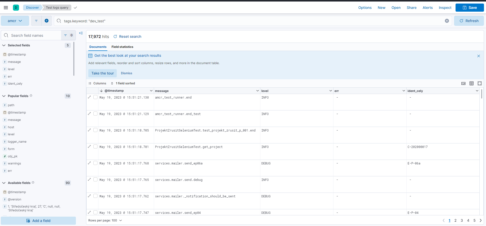
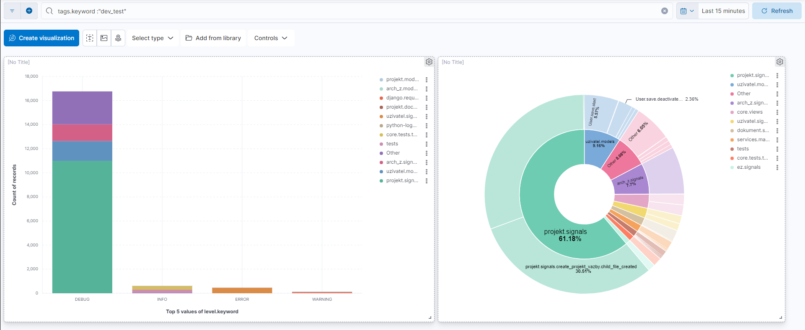

Automatické testy
=================

Ke spuštění testů slouží vývojový server (.24). Před spuštěním testů je nutné nasatit aktuální nebo požadovanou verzi aplikace WebAMČR.
To se provede pomocí skriptu ``./scripts/test_deploy.sh``. Skript se při spuštění také zeptá, zda má stáhnout aktuální verzi WebAMČR origin/dev.
Po nasazení verze je potřeba cca 5min počkat než se WebAMČR rozběhne
Testy je možné spustit následujícím příkazem 

::

./scripts/start_selenium_tests.sh

skript má následující parametry:
 * `-f`          provede neůspešné testy v tabulce 
 * `-a`          provede všechny testy (výchozí)
 * `-t cislo`    provede test zadaneho čísla
 * `-b`          spusti všechny testy na pozadí, výstup se uloží do /opt/selenium_test/test.log a run.log
 * `-h`          Zobrazí nápovedu
  
Výsledky testů se uloží do /opt/selenium_test/results.xlsx. 

V tabulce se ukládá:
 * `index` Pořadové číslo testu
 * `date` Datum a čas provedení testu
 * `test name` Jméno testu
 * `result` Výsledek testu (OK, Fail nebo Error)

V  adresáři ``/opt/selenium_test/`` se ukládají také screenshoty každého testu.

**Pozn.** Pokud uživatel přeruší probíhající test, je potřeba před spuštěním nového testu počkat několik minut, než se ukonči Selenium.

Vyhodnocení výsledků testu
--------------------------

K vyhodnocení běhu testu slouží aplikace Kibana. V ní je připraven
pohled ``Test logs query`` (zobrazuje logové zprávy z půběhu testu).

Dále jsou k dispozici dashboardy ``Test Errors`` (zobrazuje chyby a
varování) a ``Test Overview`` (statistika chybových zpráv testu).

Požadované vlastnosti testovacího scénáře
-----------------------------------------

Požadované vlastnosti testovacího scénáře jsou následující (vychází z
článku `How to Write Test Cases in Software Testing with
Examples <https://www.guru99.com/test-case.html>`__:

-  testovací scénář by měl být jednoduchý a měl by testovat max. jednu
   stránku či jednu sadu funkcí,
-  testovací scénář musí být napsán a vytvořen z pohledu uživatele, tj.
   musí přesně simulovat kroky, které by prováděl uživatel, pokud by
   chtěl dosáhnout daného výsledku,
-  testy by se neměly překrývat,
-  u každého testu musí být specifikována alespoň jedna metrika
   úspěšnosti průběhu.

Postup vytvoření kódu testu
---------------------------

Pro scénář je třeba připravit sadu vstupních dat a kontrolní výstup.

Struktura popisu scénáře
------------------------

Popis scénáře musí obsahovat následující:

-  ID scénáře,
-  stručný popis scénáře,
-  předpoklady pro průběh testu (pokud jsou),
-  uživatelské kroky, které scénář simuluje,
-  testovací data,
-  očekávané výsledky (tj. metriky, které oveřují úspěšný průběh testu).

Scénáře jsou seskupeny podle jednotlivých aplikací.

.. _1-core:

1 Core
------

.. _11-core-001:

1.1 CORE-001
~~~~~~~~~~~~

-  Testuje přihlášení uživatele.

Uživatelské kroky
^^^^^^^^^^^^^^^^^

1. Vyplnění formuláře na titulní stránce

Testovací data
^^^^^^^^^^^^^^

=========== ============================
Field       Value
=========== ============================
id_username e-mail testovacího uživatele
id_password heslo testovacího uživatele
=========== ============================

Očekávané výsledky
^^^^^^^^^^^^^^^^^^

1. Uživatel je přesměrován na stránku s titulkem AMČR Homepage

Stav testu
^^^^^^^^^^

Implementováno

.. _2-projekt:

2 Projekt
---------

.. _21-otevření-tabulky-projekty:

2.1 Otevření tabulky projekty
~~~~~~~~~~~~~~~~~~~~~~~~~~~~~

Testuje tabulku s projekty. Ověřuje, zda funguje řazení podle
jednotlivých sloupců a zobrazení/skrývání sloupců.

Využívá metodu ``_check_column_hiding``.

Předpoklady
^^^^^^^^^^^

-  Uživatel je přihlášen.

.. _uživatelské-kroky-1:

Uživatelské kroky
^^^^^^^^^^^^^^^^^

1. Uživatel klikne na menu Projekty -> Vybrat projekty
2. Uživatel kliká na záhlaví jednotlivých sloupců
3. Uživatel skyje a znovu zobrazí jednotlivé sloupce pomocí výsuvného
   menu

.. _testovací-data-1:

Testovací data
^^^^^^^^^^^^^^

*Žádná*

.. _očekávané-výsledky-1:

Očekávané výsledky
^^^^^^^^^^^^^^^^^^

1. Po kliknutí na název sloupce je do adresy stránky přidán řetězec
   ``sort=sloupec``
2. Po skytí sloupce zmizí název sloupce ze záhlaví
3. Po zobrazení sloupce je sloupec v záhlaví tabulky

.. _stav-testu-1:

Stav testu
^^^^^^^^^^

Implementován v
``projekt.tests.test_selenium.ProjektSeleniumTest.test_projekt_001``.

.. _22-zapsání-projektu-pozitivní-scénář-1:

2.2 Zapsání projektu (pozitivní scénář 1)
~~~~~~~~~~~~~~~~~~~~~~~~~~~~~~~~~~~~~~~~~

Test zapsání projektu na stránce ``/projekt/zapsat``. Test simuluje
zadání validních data měl by končit zapsáním projektu do databáze.

.. _předpoklady-1:

Předpoklady
^^^^^^^^^^^

-  Uživatel je přihlášen.
-  Jsou vložena kompletní data o katastrech, okresech a krajích.

.. _uživatelské-kroky-2:

Uživatelské kroky
^^^^^^^^^^^^^^^^^

1. Uživatel klikne na menu Projekty -> Zapsat
2. Uživatel vyplní data do formuláře a kliknutím na mapu vybere hlavní
   katastr
3. Uživatel klikne na tlačítko Uložit

.. _testovací-data-2:

Testovací data
^^^^^^^^^^^^^^

+-----------------------+---------------------------------------------+
| Field                 | Value                                       |
+=======================+=============================================+
| typ_projektu          | záchranný                                   |
+-----------------------+---------------------------------------------+
| id_podnet             | test                                        |
+-----------------------+---------------------------------------------+
| id_lokalizace         | test                                        |
+-----------------------+---------------------------------------------+
| id_parcelni_cislo     | test                                        |
+-----------------------+---------------------------------------------+
| id_planovane_zahajeni | dynamicky vložené datum (dnes + dva dny až  |
|                       | dnes + pět dní)                             |
+-----------------------+---------------------------------------------+
| id_oznamovatel        | test                                        |
+-----------------------+---------------------------------------------+
| id_odpovedna_osoba    | test                                        |
+-----------------------+---------------------------------------------+
| id_adresa             | test                                        |
+-----------------------+---------------------------------------------+
| id_telefon            | +420123456789                               |
+-----------------------+---------------------------------------------+
| id_email              | test@example.com                            |
+-----------------------+---------------------------------------------+

.. _očekávané-výsledky-2:

Očekávané výsledky
^^^^^^^^^^^^^^^^^^

-  Pole ``id_oznamovatel`` je povoleno.
-  Pole ``id_odpovedna_osoba`` je povoleno.
-  Pole ``id_adresa`` je povoleno.
-  Pole ``id_telefon`` je povoleno.
-  Pole ``id_email`` je povoleno.
-  Po kliknutí na tlačítko Uložit je v databázi o 1 projekt více

.. _stav-testu-2:

Stav testu
''''''''''

Implementován v
``projekt.tests.test_selenium.ProjektZapsatSeleniumTest.test_projekt_zapsat_p_001``.

.. _23-zapsání-projektu-negativní-scénář-1:

2.3 Zapsání projektu (negativní scénář 1)
~~~~~~~~~~~~~~~~~~~~~~~~~~~~~~~~~~~~~~~~~

Test zapsání projektu na stránce ``/projekt/zapsat``. Test simuluje
zadání nevalidních data měl by končit nezapsáním projektu do databáze.

.. _předpoklady-2:

Předpoklady
^^^^^^^^^^^

-  Uživatel je přihlášen.
-  Uživatel otevře stránku Zapsat projekt.

.. _uživatelské-kroky-3:

Uživatelské kroky
^^^^^^^^^^^^^^^^^

Uživatel otevře stránku Zapsat projekt.

.. _testovací-data-3:

Testovací data
^^^^^^^^^^^^^^

Pokud není uvedeno, jsou stejná jako u testu 2.2.

+-----------------------+---------------------------------------------+
| Field ID              | Value                                       |
+=======================+=============================================+
| id_planovane_zahajeni | (date range calculated: -9 days and -5 days |
|                       | from today)                                 |
+-----------------------+---------------------------------------------+

.. _očekávané-výsledky-3:

Očekávané výsledky
^^^^^^^^^^^^^^^^^^

-  Počet projektů se nezměnil.

.. _stav-testu-3:

Stav testu
^^^^^^^^^^

Implementován v
``projekt.tests.test_selenium.ProjektZapsatSeleniumTest.test_projetest_projekt_zapsat_n_001``.

.. _24-zapsání-projektu-negativní-scénář-2:

2.4 Zapsání projektu (negativní scénář 2)
~~~~~~~~~~~~~~~~~~~~~~~~~~~~~~~~~~~~~~~~~

Test zapsání projektu na stránce ``/projekt/zapsat``. Test simuluje
zadání nevalidních data měl by končit nezapsáním projektu do databáze.

.. _předpoklady-3:

Předpoklady
^^^^^^^^^^^

-  Uživatel je přihlášen.
-  Uživatel otevře stránku Zapsat projekt.

.. _uživatelské-kroky-4:

Uživatelské kroky
^^^^^^^^^^^^^^^^^

Uživatel otevře stránku Zapsat projekt.

.. _testovací-data-4:

Testovací data
^^^^^^^^^^^^^^

Pokud není uvedeno, jsou stejná jako u testu 2.2.

========== =====
Field ID   Value
========== =====
id_telefon XXX
========== =====

.. _očekávané-výsledky-4:

Očekávané výsledky
^^^^^^^^^^^^^^^^^^

-  Počet projektů se nezměnil.

.. _stav-testu-4:

Stav testu
^^^^^^^^^^

Implementován v
``projekt.tests.test_selenium.ProjektZapsatSeleniumTest.test_projekt_zapsat_n_002``.

.. _25-zapsání-projektu-negativní-scénář-3:

2.5 Zapsání projektu (negativní scénář 3)
~~~~~~~~~~~~~~~~~~~~~~~~~~~~~~~~~~~~~~~~~

Test zapsání projektu na stránce ``/projekt/zapsat``. Test simuluje
zadání nevalidních data měl by končit nezapsáním projektu do databáze.

.. _předpoklady-4:

Předpoklady
^^^^^^^^^^^

-  Uživatel je přihlášen.

.. _uživatelské-kroky-5:

Uživatelské kroky
^^^^^^^^^^^^^^^^^

Uživatel otevře stránku Zapsat projekt.

.. _testovací-data-5:

Testovací data
^^^^^^^^^^^^^^

Pokud není uvedeno, jsou stejná jako u 2.2.

+-----------------------+---------------------------------------------+
| Field ID              | Value                                       |
+=======================+=============================================+
| id_planovane_zahajeni | (date range calculated: 600 days and 620    |
|                       | days from today)                            |
+-----------------------+---------------------------------------------+

.. _očekávané-výsledky-5:

Očekávané výsledky
^^^^^^^^^^^^^^^^^^

-  Počet projektů se nezměnil.

.. _stav-testu-5:

Stav testu
^^^^^^^^^^

Implementován v
``projekt.tests.test_selenium.ProjektZapsatSeleniumTest.test_projekt_zapsat_n_003``.

.. _26-zahájení-výzkumu-pozitivní-scénář-1:

2.6 Zahájení výzkumu (pozitivní scénář 1)
~~~~~~~~~~~~~~~~~~~~~~~~~~~~~~~~~~~~~~~~~

.. _předpoklady-5:

Předpoklady
^^^^^^^^^^^

-  Uživatel je přihlášen.
-  Existuje projekt ve stavu A2.

.. _uživatelské-kroky-6:

Uživatelské kroky
^^^^^^^^^^^^^^^^^

Uživatel otevře projekt ve stavu A2.

.. _testovací-data-6:

Testovací data
^^^^^^^^^^^^^^

================= =====================================
Field ID          Value
================= =====================================
id_datum_zahajeni (date calculated: -5 days from today)
================= =====================================

.. _očekávané-výsledky-6:

Očekávané výsledky
^^^^^^^^^^^^^^^^^^

-  Projekt přesunut do stavu A3
-  Datum zahájení projektu odpovídá testovacím datům.

.. _stav-testu-6:

Stav testu
^^^^^^^^^^

Implementován v
``projekt.tests.test_selenium.ProjektZahajitVyzkumSeleniumTest.test_projekt_zahajit_vyzkum_p_001``.

.. _27-ukončení-výzkumu-pozitivní-scénář-1:

2.7 Ukončení výzkumu (pozitivní scénář 1)
~~~~~~~~~~~~~~~~~~~~~~~~~~~~~~~~~~~~~~~~~

.. _předpoklady-6:

Předpoklady
^^^^^^^^^^^

-  Uživatel je přihlášen.
-  Existuje projekt ve stavu A3.

.. _uživatelské-kroky-7:

Uživatelské kroky
^^^^^^^^^^^^^^^^^

Uživatel otevře projekt ve stavu A3.

.. _testovací-data-7:

Testovací data
^^^^^^^^^^^^^^

================= =====================================
Field ID          Value
================= =====================================
id_datum_ukonceni (date calculated: -1 days from today)
================= =====================================

.. _očekávané-výsledky-7:

Očekávané výsledky
^^^^^^^^^^^^^^^^^^

-  Projekt přesunut do stavu A4.
-  Datum zahájení projektu odpovídá testovacím datům.

.. _stav-testu-7:

Stav testu
^^^^^^^^^^

Implementován v
``projekt.tests.test_selenium.ProjektUkoncitVyzkumSeleniumTest.test_projekt_ukoncit_vyzkum_p_001``.

.. _28-ukončení-výzkumu-negativní-scénář-1:

2.8 Ukončení výzkumu (negativní scénář 1)
~~~~~~~~~~~~~~~~~~~~~~~~~~~~~~~~~~~~~~~~~

.. _předpoklady-7:

Předpoklady
^^^^^^^^^^^

-  Uživatel je přihlášen.
-  Existuje projekt ve stavu A3.

.. _uživatelské-kroky-8:

Uživatelské kroky
^^^^^^^^^^^^^^^^^

Uživatel otevře projekt ve stavu A3.

.. _testovací-data-8:

Testovací data
^^^^^^^^^^^^^^

================= =====================================
Field ID          Value
================= =====================================
id_datum_ukonceni (date calculated: 90 days from today)
================= =====================================

.. _očekávané-výsledky-8:

Očekávané výsledky
^^^^^^^^^^^^^^^^^^

-  Projekt zůstal ve stavu A3.
-  Zobrazena chyba ``Datum nesmí být dále než měsíc v budoucnosti``.

.. _stav-testu-8:

Stav testu
''''''''''

Implementován v
``projekt.tests.test_selenium.ProjektUkoncitVyzkumSeleniumTest.test_projekt_ukoncit_vyzkum_n_001``.

.. _29-uzavření-projektu-pozitivní-scénář-1:

2.9 Uzavření projektu (pozitivní scénář 1)
~~~~~~~~~~~~~~~~~~~~~~~~~~~~~~~~~~~~~~~~~~

.. _předpoklady-8:

Předpoklady
^^^^^^^^^^^

-  Uživatel je přihlášen.
-  Existuje projekt ve stavu A4, který má projektovou akci.

.. _uživatelské-kroky-9:

Uživatelské kroky
^^^^^^^^^^^^^^^^^

Uživatel otevře projekt ve stavu A4.

.. _testovací-data-9:

Testovací data
^^^^^^^^^^^^^^

Žádná.

.. _očekávané-výsledky-9:

Očekávané výsledky
^^^^^^^^^^^^^^^^^^

-  Projekt přestunut do stavu A5.

.. _stav-testu-9:

Stav testu
^^^^^^^^^^

Implementován v
``projekt.tests.test_selenium.ProjektUzavritSeleniumTest.test_projekt_uzavrit_p_001``.

.. _210-uzavření-projektu-negativní-scénář-1:

2.10 Uzavření projektu (negativní scénář 1)
~~~~~~~~~~~~~~~~~~~~~~~~~~~~~~~~~~~~~~~~~~~

.. _předpoklady-9:

Předpoklady
^^^^^^^^^^^

-  Uživatel je přihlášen.
-  Existuje projekt ve stavu A4, který nemá projektovou akci.

.. _uživatelské-kroky-10:

Uživatelské kroky
^^^^^^^^^^^^^^^^^

Uživatel otevře projekt ve stavu A4.

.. _testovací-data-10:

Testovací data
^^^^^^^^^^^^^^

Žádná.

.. _očekávané-výsledky-10:

Očekávané výsledky
^^^^^^^^^^^^^^^^^^

-  Projekt zůstal ve stavu A4.
-  Zobrazena chyba ``Projekt musí mít alespoň jednu projektovou akci``.

.. _stav-testu-10:

Stav testu
''''''''''

Implementován v
``projekt.tests.test_selenium.ProjektUzavritSeleniumTest.test_projekt_uzavrit_n_001``.

.. _211-archivace-projektu-pozitivní-scénář-1:

2.11 Archivace projektu (pozitivní scénář 1)
~~~~~~~~~~~~~~~~~~~~~~~~~~~~~~~~~~~~~~~~~~~~

.. _předpoklady-10:

Předpoklady
^^^^^^^^^^^

-  Uživatel je přihlášen.
-  Existuje projekt ve stavu A5, který má archivovanou projektovou akci.

.. _uživatelské-kroky-11:

Uživatelské kroky
^^^^^^^^^^^^^^^^^

Uživatel otevře projekt ve stavu A5.

.. _testovací-data-11:

Testovací data
^^^^^^^^^^^^^^

Žádná

.. _očekávané-výsledky-11:

Očekávané výsledky
^^^^^^^^^^^^^^^^^^

-  Projekt je přesunut do stavu A6.

.. _stav-testu-11:

Stav testu
^^^^^^^^^^

Implementován v
``projekt.tests.test_selenium.ProjektArchivovatSeleniumTest.test_projekt_archivovat_p_001``.

.. _212-archivace-projektu-negativní-scénář-1:

2.12 Archivace projektu (negativní scénář 1)
~~~~~~~~~~~~~~~~~~~~~~~~~~~~~~~~~~~~~~~~~~~~

.. _předpoklady-11:

Předpoklady
^^^^^^^^^^^

-  Uživatel je přihlášen.
-  Existuje projekt ve stavu A5, který má nearchivovanou projektovou
   akci.

.. _uživatelské-kroky-12:

Uživatelské kroky
^^^^^^^^^^^^^^^^^

Uživatel otevře projekt ve stavu A5.

.. _testovací-data-12:

Testovací data
^^^^^^^^^^^^^^

Stejná jako u ``test_projekt_zapsat_p_001``.

.. _očekávané-výsledky-12:

Očekávané výsledky
^^^^^^^^^^^^^^^^^^

-  Projekt zůstal ve stavu A5.
-  Zobrazena chyba ``Akce musí být archivovaná``.

.. _stav-testu-12:

Stav testu
^^^^^^^^^^

Implementován v
``projekt.tests.test_selenium.ProjektArchivovatSeleniumTest.test_projekt_uzavrit_n_001``.

.. _213-vrácení-stavu-u-archivovaného-projektu-pozitivní-scénář-1:

2.13 Vrácení stavu u archivovaného projektu (pozitivní scénář 1)
~~~~~~~~~~~~~~~~~~~~~~~~~~~~~~~~~~~~~~~~~~~~~~~~~~~~~~~~~~~~~~~~

.. _předpoklady-12:

Předpoklady
^^^^^^^^^^^

-  Uživatel je přihlášen.
-  Existuje projekt ve stavu A6.

.. _uživatelské-kroky-13:

Uživatelské kroky
^^^^^^^^^^^^^^^^^

Uživatel otevře projekt ve stavu A6.

.. _testovací-data-13:

Testovací data
^^^^^^^^^^^^^^

========= =====
Field ID  Value
========= =====
id_reason test
========= =====

.. _očekávané-výsledky-13:

Očekávané výsledky
^^^^^^^^^^^^^^^^^^

-  Projekt přesunut do stavu A5.

.. _stav-testu-13:

Stav testu
^^^^^^^^^^

Implementován v
``projekt.tests.test_selenium.ProjektVratitArchivovanySeleniumTest``.

.. _214-vrácení-stavu-u-uzavřeného-projektu-pozitivní-scénář-1:

2.14 Vrácení stavu u uzavřeného projektu (pozitivní scénář 1)
~~~~~~~~~~~~~~~~~~~~~~~~~~~~~~~~~~~~~~~~~~~~~~~~~~~~~~~~~~~~~

.. _předpoklady-13:

Předpoklady
^^^^^^^^^^^

-  Uživatel je přihlášen.
-  Existuje projekt ve stavu A5.

.. _uživatelské-kroky-14:

Uživatelské kroky
^^^^^^^^^^^^^^^^^

Uživatel otevře projekt ve stavu A5.

.. _testovací-data-14:

Testovací data
^^^^^^^^^^^^^^

========= =====
Field ID  Value
========= =====
id_reason test
========= =====

.. _očekávané-výsledky-14:

Očekávané výsledky
^^^^^^^^^^^^^^^^^^

-  Projekt přesunut do stavu A4.

.. _stav-testu-14:

Stav testu
^^^^^^^^^^

Implementován v
``projekt.tests.test_selenium.ProjektVratitUzavrenySeleniumTest``.

.. _215-vrácení-stavu-u-ukončeného-projektu-pozitivní-scénář-1:

2.15 Vrácení stavu u ukončeného projektu (pozitivní scénář 1)
~~~~~~~~~~~~~~~~~~~~~~~~~~~~~~~~~~~~~~~~~~~~~~~~~~~~~~~~~~~~~

.. _předpoklady-14:

Předpoklady
'''''''''''

-  Uživatel je přihlášen.
-  Existuje projekt ve stavu A4.

.. _uživatelské-kroky-15:

Uživatelské kroky
'''''''''''''''''

Uživatel otevře projekt ve stavu A4.

.. _testovací-data-15:

Testovací data
''''''''''''''

========= =====
Field ID  Value
========= =====
id_reason test
========= =====

.. _očekávané-výsledky-15:

Očekávané výsledky
''''''''''''''''''

-  Projekt přesunut do stavu A3.

.. _stav-testu-15:

Stav testu
''''''''''

Implementován v
``projekt.tests.test_selenium.ProjektVratitUkoncenySeleniumTest``.

.. _216-vrácení-stavu-u-zahájeného-projektu-pozitivní-scénář-1:

2.16 Vrácení stavu u zahájeného projektu (pozitivní scénář 1)
~~~~~~~~~~~~~~~~~~~~~~~~~~~~~~~~~~~~~~~~~~~~~~~~~~~~~~~~~~~~~

.. _předpoklady-15:

Předpoklady
^^^^^^^^^^^

-  Uživatel je přihlášen.
-  Existuje projekt ve stavu A3.

.. _uživatelské-kroky-16:

Uživatelské kroky
^^^^^^^^^^^^^^^^^

Uživatel otevře projekt ve stavu A3.

.. _testovací-data-16:

Testovací data
^^^^^^^^^^^^^^

========= =====
Field ID  Value
========= =====
id_reason test
========= =====

.. _očekávané-výsledky-16:

Očekávané výsledky
^^^^^^^^^^^^^^^^^^

-  Projekt přesunut do stavu A2.

.. _stav-testu-16:

Stav testu
^^^^^^^^^^

Implementován v
``projekt.tests.test_selenium.ProjektVratitZahajenySeleniumTest``.

.. _217-vrácení-stavu-u-přihlášeného-projektu-pozitivní-scénář-1:

2.17 Vrácení stavu u přihlášeného projektu (pozitivní scénář 1)
~~~~~~~~~~~~~~~~~~~~~~~~~~~~~~~~~~~~~~~~~~~~~~~~~~~~~~~~~~~~~~~

.. _předpoklady-16:

Předpoklady
^^^^^^^^^^^

-  Uživatel je přihlášen.
-  Existuje projekt ve stavu A2.

.. _uživatelské-kroky-17:

Uživatelské kroky
^^^^^^^^^^^^^^^^^

Uživatel otevře projekt ve stavu A2.

.. _testovací-data-17:

Testovací data
^^^^^^^^^^^^^^

========= =====
Field ID  Value
========= =====
id_reason test
========= =====

.. _očekávané-výsledky-17:

Očekávané výsledky
^^^^^^^^^^^^^^^^^^

-  Projekt přesunut do stavu A1.

.. _stav-testu-17:

Stav testu
^^^^^^^^^^

Implementován v
``projekt.tests.test_selenium.ProjektVratitPrihlasenySeleniumTest``.

.. _218-navržení-zrušení-projektu-pozitivní-scénář-1:

2.18 Navržení zrušení projektu (pozitivní scénář 1)
~~~~~~~~~~~~~~~~~~~~~~~~~~~~~~~~~~~~~~~~~~~~~~~~~~~

.. _předpoklady-17:

Předpoklady
^^^^^^^^^^^

-  Uživatel je přihlášen.
-  Existuje projekt.

.. _uživatelské-kroky-18:

Uživatelské kroky
^^^^^^^^^^^^^^^^^

Uživatel otevře projekt.

.. _testovací-data-18:

Testovací data
^^^^^^^^^^^^^^

======== ==========
Field ID Value
======== ==========
reason   item no. 2
======== ==========

.. _očekávané-výsledky-18:

Očekávané výsledky
^^^^^^^^^^^^^^^^^^

-  Projekt přesunut do stavu A7.

.. _stav-testu-18:

Stav testu
^^^^^^^^^^

Implementován v
``projekt.tests.test_selenium.ProjektNavrhnoutZrusitSeleniumTest.test_projekt_zrusit_p_001``.

.. _219-navržení-zrušení-projektu-pozitivní-scénář-2:

2.19 Navržení zrušení projektu (pozitivní scénář 2)
~~~~~~~~~~~~~~~~~~~~~~~~~~~~~~~~~~~~~~~~~~~~~~~~~~~

.. _předpoklady-18:

Předpoklady
^^^^^^^^^^^

-  Uživatel je přihlášen.
-  Existuje projekt.

.. _uživatelské-kroky-19:

Uživatelské kroky
^^^^^^^^^^^^^^^^^

Uživatel otevře projekt.

.. _testovací-data-19:

Testovací data
^^^^^^^^^^^^^^

============= ==========
Field ID      Value
============= ==========
reason        item no. 1
id_projekt_id test
============= ==========

.. _očekávané-výsledky-19:

Očekávané výsledky
^^^^^^^^^^^^^^^^^^

-  Projekt přesunut do stavu A7.

.. _stav-testu-19:

Stav testu
^^^^^^^^^^

Implementován v
``projekt.tests.test_selenium.ProjektNavrhnoutZrusitSeleniumTest.test_projekt_zrusit_p_002``.

.. _220-navržení-zrušení-projektu-negativní-scénář-1:

2.20 Navržení zrušení projektu (negativní scénář 1)
~~~~~~~~~~~~~~~~~~~~~~~~~~~~~~~~~~~~~~~~~~~~~~~~~~~

.. _předpoklady-19:

Předpoklady
^^^^^^^^^^^

-  Uživatel je přihlášen.
-  Existuje projekt s projektovými akcemi.

.. _uživatelské-kroky-20:

Uživatelské kroky
^^^^^^^^^^^^^^^^^

Uživatel otevře projekt s projektovými akcemi.

.. _testovací-data-20:

Testovací data
^^^^^^^^^^^^^^

======== ==========
Field ID Value
======== ==========
reason   item no. 2
======== ==========

.. _očekávané-výsledky-20:

Očekávané výsledky
^^^^^^^^^^^^^^^^^^

-  Projekt zůstal ve výchozím stavu.
-  Zobrazena chyba ``Projekt před zrušením nesmí mít projektové akce``.

.. _stav-testu-20:

Stav testu
^^^^^^^^^^

Implementován v
``projekt.tests.test_selenium.ProjektNavrhnoutZrusitSeleniumTest.test_projekt_zrusit_n_001``.

.. _221-zrušení-projektu-pozitivní-scénář-1:

2.21 Zrušení projektu (pozitivní scénář 1)
~~~~~~~~~~~~~~~~~~~~~~~~~~~~~~~~~~~~~~~~~~

.. _předpoklady-20:

Předpoklady
^^^^^^^^^^^

-  Uživatel je přihlášen.
-  Existuje projekt ve stavu A7.

.. _uživatelské-kroky-21:

Uživatelské kroky
^^^^^^^^^^^^^^^^^

Uživatel otevře projekt s projektovými akcemi.

.. _testovací-data-21:

Testovací data
^^^^^^^^^^^^^^

============== =====
Field ID       Value
============== =====
id_reason_text test
============== =====

.. _očekávané-výsledky-21:

Očekávané výsledky
^^^^^^^^^^^^^^^^^^

-  Projekt je přesunut do stavu A8.

.. _stav-testu-21:

Stav testu
^^^^^^^^^^

Implementován v
``projekt.tests.test_selenium.ProjektZrusitSeleniumTest.test_projekt_zrusit_p_001``.

Číslo a název scénáře
~~~~~~~~~~~~~~~~~~~~~

.. _předpoklady-21:

Předpoklady
^^^^^^^^^^^

.. _uživatelské-kroky-22:

Uživatelské kroky
^^^^^^^^^^^^^^^^^

.. _testovací-data-22:

Testovací data
^^^^^^^^^^^^^^

.. _očekávané-výsledky-22:

Očekávané výsledky
^^^^^^^^^^^^^^^^^^

.. _stav-testu-22:

Stav testu
^^^^^^^^^^
